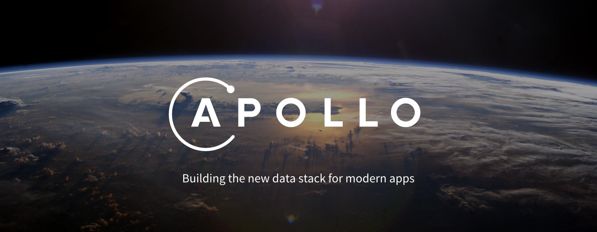

The data stack for modern apps, brought to you by [Meteor](https://www.meteor.com/). Reactively connect any backend data source to any client.

This is the main repository for discussion and coordination - the code will live elsewhere. Follow this repository for updates on the project!

- Read the [blog post about our goals for the project](https://medium.com/apollo-stack/apollo-8b7215bcab1c).
- Stay up to date by reading our [posts on Medium](https://medium.com/apollo-stack)
- [Join us on Slack!](http://apolloslack.meteorapp.com/)
