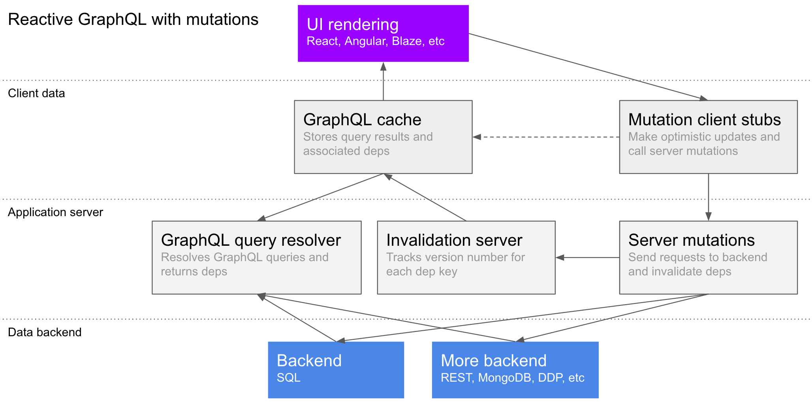
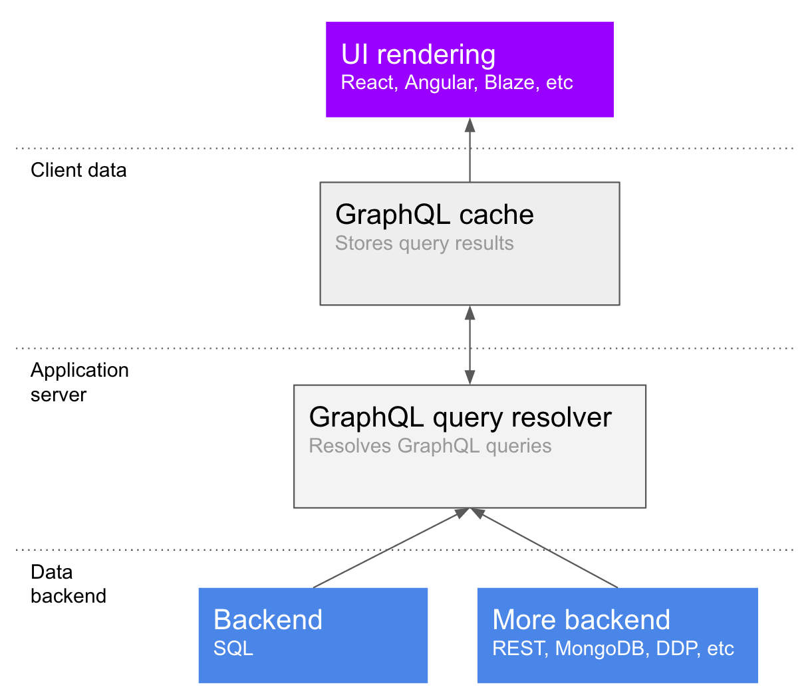
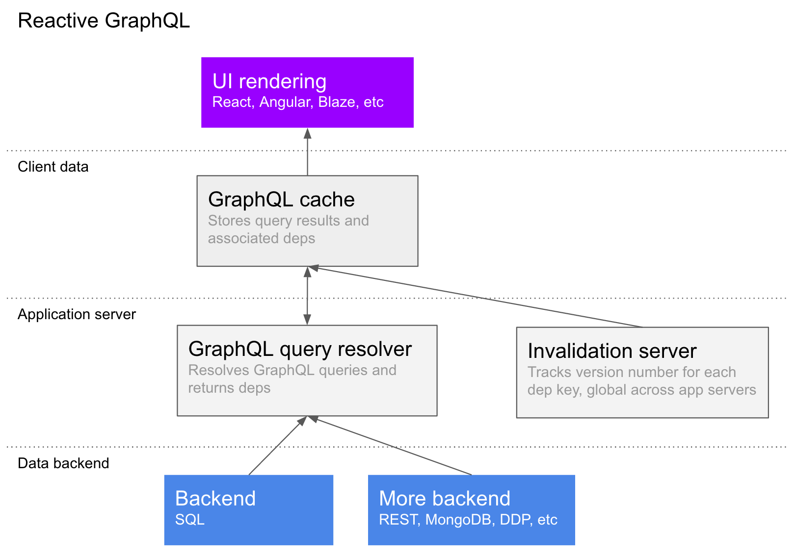
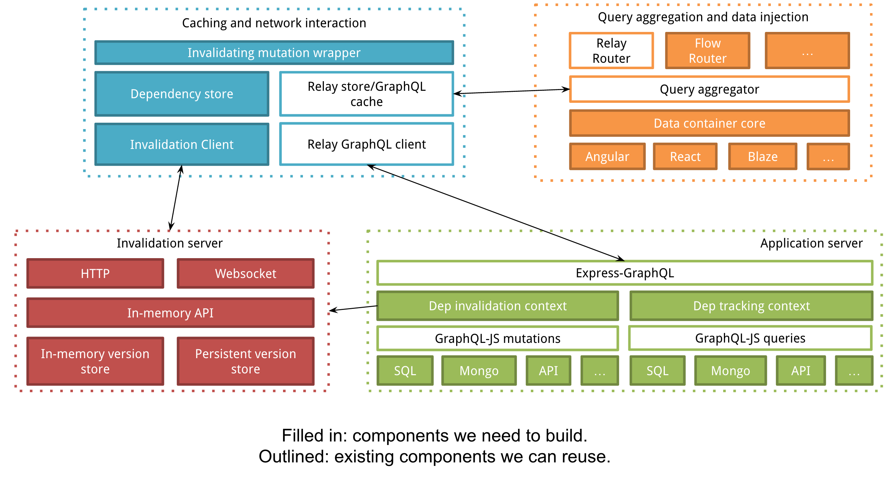

# High-level design

This is a high-level overview of the architecture of a reactive GraphQL data loading system, aimed at getting feedback from engineers who have been there and done that. We want to share what we’re working on to see if people find it interesting, and to validate our design against what others have seen in the field.

If you haven't yet, read our [announcement post](http://info.meteor.com/blog/reactive-graphql) which outlines all of the problems we are aiming to solve.

Here's a summary of the design in a diagram, which will be explained in more detail later:



## GraphQL

(You can [skip this part](#reactive-graphql) if you are already familiar with GraphQL)

GraphQL is a tree-shaped query language for querying a schema of node types. So, for example, if you have users, todo lists, and tasks, you might query them like this:

```
me {
  username,
  lists {
    id,
    name,
    tasks(complete: false) {
      id,
      content,
      completed
    }
  }
}
```

Each field in the query calls a resolver function on the server, which can access any data source or API. The return values are aggregated into a JSON response shaped exactly like the query, and you don’t get any fields you didn’t ask for. For the query above, you’ll get back data that looks like this:

```
{
  me: {
    username: "sashko",
    lists: [
      {
        id: 1,
        name: "My first todo list",
        tasks: [ ... and so on ],
      }
    ]
  }
}
```

> You can follow the [LearnGraphQL](https://learngraphql.com/) interactive course to learn GraphQL basics. You could complete it in few hours.

Note that there is no restriction on data sources - you could have your todo lists stored in one database, and your tasks in a different one. In fact, one of the main benefits of GraphQL is a total abstraction over where the data is coming from, so that frontend developers don’t have to worry about it, and backend developers are free to move around data or services as needed. Here’s what that looks like in terms of the components of the architecture:



Note that there is a GraphQL cache - what this does is decompose the results of the query into nodes. A smart cache can refetch just part of a query, or even a single field on a previously-fetched object, in the case where the data requirements change or something needs to be refreshed. So in our above example, the data in the cache might be stored like:

```
{ type: "me", username: "sashko", lists: [1] }
{ type: "list", id: 1, name: "My first todo list", tasks: [...] }
```

This is clearly very simplified, and you can read about how the Relay cache works on [Huey Petersen's website](http://hueypetersen.com/posts/2015/09/30/quick-look-at-the-relay-store/). The important thing to note is that the cache decomposes query results into a flat structure, and a smart cache will be able to generate a query to update just one list and its tasks, or just the list’s name, as necessary.

// May be we can link Learn GraphQL. It's great, specially for a person who dislike GraphQL.
// We've exprience in coverting them to lovers with LearnGraphQL :)
// Edit: I'm waiting to add a section on Reactive GraphQL.

## Reactive GraphQL

People are excited about GraphQL, and it solves a lot of the problems which many developers, including Meteor’s customers and users, have brought to light. But when you’re building an app, you need more than just a way to query the server and get a response. For example, some parts of your app will want the data to update reactively when a different user makes a change.

The client and server parts of the GraphQL system will need to collaborate to make this possible, but one of our goals is to make minimal changes to the current reference implementation of GraphQL so that developers can take advantage of current and future productivity tools for GraphQL.

// Just Great.

### Dependencies

The core concept of the system we envision is the idea of a dependency, or dep for short. A dep is a tuple of `key` and `version`, where `key` globally represents a particular unit of data (for example, a row in a database or the result of a query), and `version` globally represents how many times it has been changed.

The intended result is that if you are holding a piece of data, and you have a dep for it, you can ask the global dependency server whether it has changed by sending the key and version. The main benefit of this approach is that the application server doesn't need to be aware of which queries each client is currently tracking - the client can keep that knowledge for itself, reducing the burden on the server and giving the developer more options for controlling when new data is fetched.

### Returning dependencies to the client

Before, we gave an example of a GraphQL response for a simple query. If you make a reactive GraphQL query, you will get extra metadata about the dependencies involved in particular subtrees, like so:

```
{
  me: {
    username: "sashko",
    lists: [
      {
        id: 1,
        name: "My first todo list",
        tasks: [ ... and so on ],
        _deps: {
          _self: { key: '12341234', version: 3 },
          tasks: { key: '35232345', version: 4 }
        }
      }
    ],
    _deps: {
      _self: { key: '23245455', version: 1 },
      lists: { key: '89353566', version: 5 }
    }
  }
}
```

// I think following example is simple and complete.

```
{
  me: {
    username: "sashko",
    lists: [
      {
        id: 1,
        name: "My first todo list",
      }
    ],

    __deps: {
      _self: { key: '12341234', version: 3 },
      lists: { key: '35232345', version: 4 }
    }
  }
}
```

// Thinking about _self and lists. Is that because to avoid data re-fetching of lists when the username changes?
// If so, what are the types we want to do it?
// Is that something we can do it in the GraphQL Schema level.

This will tell the client which dependencies they should watch to figure out if the list object itself changed, or if the list of tasks needs to be updated.

Note that can’t put the `_deps` field on tasks itself, because JSON doesn’t allow it, so we have to put it on the parent instead. Also, the `_self` field is a shorthand to avoid listing all of the properties of the list object - it could have `name`, `description`, and so on, and it would be a waste of bandwidth to send all of those key names again.

### Automatically recording dependencies when reading data
In order to know when a GraphQL query needs to be re-run, we need to know what deps represent different parts of the query. These deps can be recorded manually for complex queries, but simple queries can have their deps identified automatically. For example, here’s a query used in a particular part of the GraphQL resolution tree:

```
todoLists.select('*').where('id', 1);
```

This might record the following dependency:

```
{ key: 'todoLists:1', version: 0 }
```

The dependency recording mechanism queries the dependency tracking server to figure out the current version.

### Manually recording dependencies

The automatic dependency recording mechanism won’t work if it isn’t possible to analyze the query to determine the dependencies. In these cases, the developer will need to manually record a dependency, using any string key they want.

For example, if you have a complex query to count the number of notifications a user has, you might want a custom invalidation key for that number:

```
// somewhere, a function that consistently generates a key
function notificationDepKeyForUser(userId) {
  return 'notificationCount:' + userId;
}

// inside the GraphQL resolver
numNotifications = getNotificationCountForUser(userId);
context.recordDependency(notificationDepKeyForUser(userId));
```

This will let you manually specify situations in which the number of notifications should be refreshed. Advanced users with particularly strict performance requirements, like a site-wide visitor count or a realtime high-score table, might also choose to use manually constructed dependencies for more control over their data flow.

//  Add a sentence like this: You could learn more about this when we discuss about Mutations at the end.

## Simple reactivity model

Based on the above primitives, here is a stateless strategy for GraphQL reactivity:

1. The client fetches the query from the GraphQL server, which includes a set of deps in the response.
2. The client periodically polls the invalidation server with the set of deps, and the server returns the list of deps which have a newer version available. Note that this can easily be converted to a stateful approach where the client subscribes to a list of depenencies over a websocket, for parts of the client which need lower latency - see the [section below](#reducing-latency).
3. The client re-fetches the subtrees of the query which depend on the invalidated deps.

There are ways to move more state to the server to optimize the latency of the system and reduce roundtrips, but those can be added later.



### Reducing latency

The rest of the document talks in terms of polling a dependency server for updates. This results in two roundtrips per update: one to get the invalidated keys, and another to actually get the new data. Here's how that could be reduced to 1 or 0 round trips:

1. The invalidation server could accept websocket connections, and let the client subscribe to the dependency keys it cares about - this would mean the invalidation is pushed immediately, and then there is one roundtrip to fetch the actual data.
2. The application server could subscribe to the invalidations, and do the GraphQL queries _on the server_, and then diff that against the current state of the client and send a patch. This would make the system work almost exactly like Meteor today, and could be a good option for applications with fewer users and a great need for low latency.

// I think it's better to go with Just the 1. We could optimize on top of that. It's not a good idea to maintain two different things.
// If that app is small, it might be okay to change the polling interval smaller. That'll do the trick.

Since both of those approaches don't change anything about the inherent design of the system and are relatively simple to implement, we'll leave them as optimizations for the future.

### Invalidating dependencies

We haven’t talked at all about how the invalidation server finds out that a dependency version has incremented, and that clients should reload that data. At the lowest level, your code posts to the invalidation server the list of keys that need to be invalidated whenever you make a write to the data store. The next section will talk about a nice high-level wrapper around that for application developers.

// Here, I'll be great we can submit the actual DB changes as well. I mean for simple queries. 
// Then we could do something with that. Specially in the client.
//
// But then again, I get the issue of race-conditions, when working with multiple servers.
// We clearly have no idea on which change actually applied to the DB. 
// So, it's wise to forget this, at least for now :)

## Mutations

So far, we have only talked about loading data, which is fine if your app is just a view or dashboard onto some data you don’t control. However, most apps also have controls for the users to manipulate their persistent data.

In GraphQL, the messages sent to the server requesting data writes are called mutations, so that’s what we’ll call them here as well.

### What is a mutation?

You can think of a mutation as a remote procedure call endpoint. At the end of the day, it’s a named function on the server that can be called from the client with some arguments.

In this dependency-based system, mutations need to do several things:

1. Write data to the backend database or API
2. Emit the appropriate invalidations to the invalidation server
3. Optionally, do an optimistic update on the client to show something nice while the server roundtrip is happening

We hope this system will put less burden on the developer to specify which data might have changed when they are calling a mutation, while leaving the door open for such an optimization when it is necessary.

The hardest question here is (2) - how does a mutation notify the invalidation server, and therefore the appropriate app clients, which data it has changed?


### Automatic dependency invalidation

Just like for data reading, in simple cases we should be able to emit invalidations from mutations automatically. For example, if you ran the following query:

```
todoLists.update('name', 'The new name for my todo list').where('id', 1);
```

We should invalidate the following dependency key:

```
'todoLists:1'
```

You can see that this matches up with the dependency we automatically recorded when reading that row, so the appropriate queries would rerun.

### Manual dependency invalidation

For more complex situations, you will have to emit invalidations manually. For example, in the above example about notifications, we will want to invalidate the notification count manually when we add a notification:

```
notifications.insert(...);
context.invalidateDependency(notificationDepKeyForUser(userId));
```

Hopefully, with time, we can make more and more invalidations automatic, but it’s always good to have an “escape hatch” for more complex situations where the developer needs all the control they can get.

// Add a section here: This is why we said, you need to add custom keys. 
// Then we can have some examples like this:

1. Stop reactivity. Just publish a depKey which is random. Do not invalidate that key.
2. Counter.  Sometimes you don't need to it to be neal realtime. So, we can throttle the invalidations and invalidate it for every few minutes.


You can see in the diagram how invalidations flow from the mutation to the relevant clients, which then refetch the data as needed.

// How about outside invalidations. Lets say after a diret DB write from another non Meteor app.  
// If we can connect to the invalidation server from outside that's awesome. (Again via a GraphQL mutation)

## Data drivers

To make this system easy to get started with, we’ll need some well-designed drivers for popular data sources. Connecting an arbitrary data source into the system will be trivial if you don’t need reactivity - you can just pick any data loading package from NPM or write some simple functions to fetch the data. To add reactivity, you can use manual dependency recording and invalidation.

However, we expect more friendly data drivers to be written by the community, in addition to the official ones maintained by Meteor, which may include one or more of SQL, MongoDB, and REST APIs.

A first-class developer friendly backend data driver will need to:

1. Read objects from the data source and automatically record dependencies for simple queries
2. Write objects to the data source and in most cases automatically emit invalidations
3. Have basic caching for better performance

While the ideal driver would emit exact deps and invalidations automatically for all queries, this is not likely to be practical for an arbitrary datastore. In practice, drivers will likely fall back to broader deps and invalidations, and tooling will help developers identify places where these invalidations can be optimized.  The developer can then rework their query or emit manual invalidations as needed.

// How about the design of the Invalidation Server. Here's my ideas:
 * It would be great if it's stateless, so if we need more load we can just scale it.
 * If not, we could shard it scale out. 
 * This is not a thing we need to do now.
 * But, we should plan for it.
 
// Are we going to write it in Node.js

I assume drivers need to do something in the invalidation later too. (Data fetching). So it's needed to do it in Node.js?

## Application performance monitoring and optimization

One thing we discovered about the stateful livequery approach to reactivity and subscriptions in the current Meteor system was that it can make things harder to debug and analyze. When you are debugging your app or trying to figure out a performance issue, you need to reproduce a situation on your server which causes a certain problem. When there is a lot of state there, lots of which depends on what the database happens to be doing at the time, which queries you have running, and the specific combination of clients looking at the data, it's difficult to isolate what is causing your problem.

The new system is designed to avoid this issue, and the implementation will be built from the ground up to support performance analysis both for development and production use. We envision two main paths that a developer would want to analyze:

1. **Data loading.** How a specific set of UI components on the page translates into a GraphQL query, and how that query performs when run against a set of backend data sources. This question is generic to any GraphQL-based system, but can be difficult to solve with one tool because it inherently spans the client-server divide.
2. **Mutations.** In a reactive system, a mutation will cause that client to refetch some data, and possibly some other clients. It is important to track which mutations are happening, what performance load those incur on the database, which dependencies that invalidates, and which refetches that causes in the other clients. This should give you the tools to optimize your UI structure, data loading patterns, reactivity, and mutations to reduce load on your server while maintaining a great experience for your app's users.

After you analyze the two paths above, there should be a clear path to optimization through careful manual invalidations and disabling reactivity that will let you change a minimum of app code to "twist the knobs" on performance.

// Oh Yeah! I'm seeing huge set of ideas. 
// Let's implement this. So, we can build a great APM and make money :P

## Implementation plan

Here's a diagram of all of the pieces we think will need to be built to have a complete system:



// What does FlowRouter has to do with this. Do we need to do any changes?

It's a lot of stuff, but a lot of it already exists thanks to the Relay project, and some of the things can be contributed by the community once the structure is clearer, for example some of the database drivers.

// Are we using Relay's connection API which is optimized for pagination. That's place where it adds the complexity to Relay and it's GraphQL part.
// With our design, I don't think we need it.

If you're interested in helping out with some parts of the project, I'd love to hear from you! Please file an issue here or email me at sashko@meteor.com.
