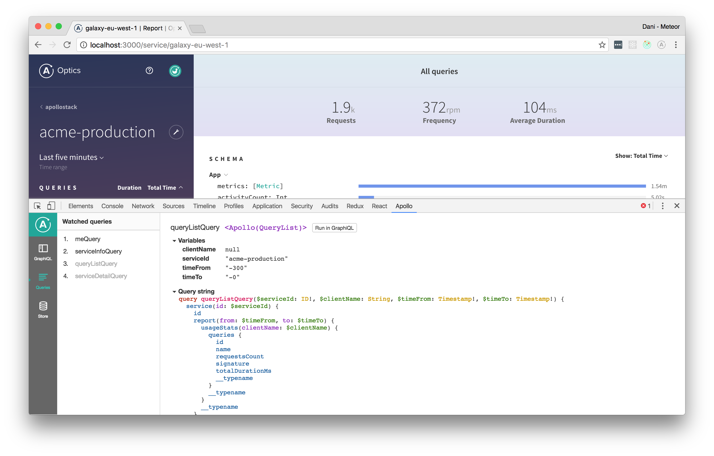

The [Apollo Client Developer Tools](https://chrome.google.com/webstore/detail/apollo-client-developer-t/jdkknkkbebbapilgoeccciglkfbmbnfm) Chrome extension provides a variety of useful features for developing web clients that use Apollo Client.

**The extension includes:**

 * **The GraphiQL IDE.** Send queries to your server through Apollo Client's network interface, or query the Apollo Client cache directly to see what data is loaded.
 * **Normalized cache inspector.** Visualize your GraphQL cache the way Apollo Client sees it, and search by field names or values.
 * **Watched query inspector.** View active queries and variables, and locate the UI components associated with them.

 > Find out more about contributing and debugging on the [Client DevTools GitHub page](https://github.com/apollographql/apollo-client-devtools).

## Installation and configuration

Install the extension via the [Chrome Web Store](https://chrome.google.com/webstore/detail/apollo-client-developer-t/jdkknkkbebbapilgoeccciglkfbmbnfm).

To allow the extension to interact with your instance of Apollo Client, set the `connectToDevTools` option to `true` in the `ApolloClient` constructor, like so:

```js
const client = new ApolloClient({
  // ...other options...
  connectToDevTools: true
});
```

When you visit a page with an instance of Apollo Client that has this option set to `true`, the Chrome DevTools window includes an **Apollo** tab in addition to the standard tabs of **Elements**, **Console**, and so on. The Apollo tab does _not_ appear if no such instance is found.

## Sending requests with GraphiQL


The version of GraphiQL included in the extension uses Apollo Client's existing connection to your GraphQL server, so there’s no configuration necessary. It automatically includes the same HTTP headers and other metadata as any other request sent by Apollo Client.

## Inspecting the Apollo Client cache


View the state of your client-side cache as a tree and inspect every object inside. Visualize the [mental model](https://blog.apollographql.com/the-concepts-of-graphql-bc68bd819be3) of the Apollo cache. Search for specific keys and values in the store and see the path to those keys highlighted.

## Inspecting active queries



View the queries being actively watched on any given page. See when they're loading, what variables they're using, and, if you’re using React, which React component they’re attached to. 
