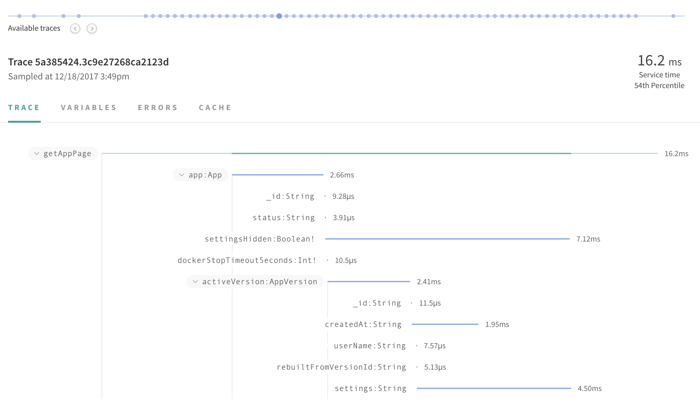

Getting started with Apollo and GraphQL is quite easy. There are hundreds of tutorials available, put together by members of the amazing Apollo and GraphQL communities. While getting started is quite easy, there are some very important factors that should be considered upfront, to help deliver a successful Apollo GraphQL implementation. The Apollo team has been working with and on production GraphQL based projects for quite some time now, and has run into just about every gotcha and pitfall you can imagine happening. Over the past couple of years we've honed our GraphQL skills based on hard won experience, and a continuous desire to keep pushing this wonderful technology forward.

This section outlines essential tips we consider to be a necessity for any successful Apollo GraphQL project. These tips have been battle tested in production by ourselves, as well as the Apollo community and our enterprise partners.

<h2 id="incremental-adoption">Incremental adoption</h2>

While it makes for an excellent longer-term goal, GraphQL doesn’t need to stand above the entire data tree in an organization in order to provide value. Expending large amounts of engineering effort to switch an entire stack should generally be avoided.

Unlike some technologies that are difficult to embrace without getting buy-in from all the teams in an organization, GraphQL can be utilized in smaller units (e.g. component by component, team by team) and incrementally integrated into the bigger picture. Teams can start building their GraphQL schema based around a single feature. They can initially focus on developing the ideal API for that specific feature based on how it's going to be consumed by a client. They can then turn their attention to calling the resources associated with that feature, and handling any necessary data transformations, in their developed GraphQL resolvers. Once this feature has been implemented in the back-end, team members can then focus on front-end integration with Apollo Client.

Thanks to GraphQL’s ability to fetch data from any data source, it makes sense to keep existing APIs as they are and use GraphQL to “wrap” the data.  This can be fully appreciated by organizations with existing collections of REST (or similar) APIs, which power their user experience, since they can lean heavily on their existing investments.  This allows small teams to immediately realize many benefits of GraphQL without waiting for deeper adoption, and allows existing versions of the application, which have already been deployed and rely on the existing API, to keep functioning uninterrupted.

<h2 id="schema">Schema scope and ownership</h2>

APIs change as the products that use them evolve, and their ideal structure is usually defined by the front-end applications that consume them.  While it’s certainly possible, and sometimes desirable, to have a single GraphQL schema which blankets an entire organization’s operational concerns, trying to manage a large schema presents challenges which are avoided by separating the schema into more manageable pieces that align with individual products.

Luckily, the GraphQL Schema Definition Language (SDL) focuses on the shape of the data and not the actual implementation. This allows product teams to be the ideal custodians of their own GraphQL schemas.

Having product teams own the GraphQL schema for their products allows the schema to act as an API contract within the team, and enhances intra-team communication by providing clearly defined expectations.  These teams can utilize schema-driven development to divide back-end and front-end work, mocking various parts of the API until full functionality is achieved, while remaining confident that they will arrive back at a unified solution.

Organizations looking to offer a single API endpoint can assemble the individual product schemas, managed by individual product teams, into a monolithic API. This can be achieved by “stitching” the various schemas together.

<h2 id="performance">Monitor GraphQL performance</h2>

An API implemented using GraphQL allows developers to query for the exact information they desire, and nothing more.  With proper visibility into how the API performs, developers can understand the implications adding or removing fields can have on the overall performance of their queries.

Apollo Engine is a GraphQL schema management and monitoring tool which provides insight into how a GraphQL API is behaving, and can proactively notify teams of degraded performance.

When using Apollo Server with Apollo Engine, queries and mutations are enhanced with field-level tracing data.  This helps power views in Apollo Engine that show how removing a field from a query might speed up a particular component,  or conversely, how adding a seemingly innocent field might actually do more harm than good!

In addition to empowering front-end developers to make quick, educated decisions during development, the detailed metrics in Apollo Engine allow those who are responsible for data performance to quickly identify where improvements can be made. Bottlenecks and rising error rates can be quickly identified and resolved.

This clarity facilitates pushing schema changes to production with the confidence of knowing that the API is performing as well as it was before, if not better!

<h2 id="javascript">Write the server in JavaScript</h2>

Facebook's reference implementation has been written in JavaScript since its original release, and fresh developments in the GraphQL ecosystem have frequently appeared first in JavaScript, or languages that transpile to JavaScript (e.g. TypeScript).

While existing back-end systems might already be implemented in other languages, a thin JavaScript-based GraphQL implementation can fit nicely in front of these systems. Due to the on-going active maintenance of JavaScript based GraphQL implementations, adopting an approach like this can help bring the latest GraphQL features to your existing infrastructure.

Building a GraphQL server in JavaScript also makes it easy to operate at "the edge", where JavaScript is the language of choice, to leverage powerful CDN solutions to deliver data to clients as efficiently as possible - including powerful caching and network optimizations.

Since many front-end developers are already using JavaScript to implement the interfaces that consume data from back-end APIs, building a GraphQL API in JavaScript enables those same developers to make meaningful contributions to the APIs they're utilizing.

While JavaScript GraphQL libraries do see the most active development and latest features, another strong advantage is the extra approachability and deployment options that come from using one of the most popular programming languages on the Internet.
