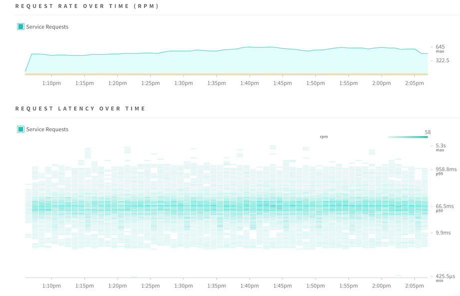

GraphQL-based APIs provide selective access to data which enables developers to avoid potentially expensive data operations that might occur with legacy databases, remote REST endpoints or otherwise slow operations.

As with any resource, performance monitoring is important.  GraphQL has some additional considerations over traditional REST-based APIs, 

<h2 id="field">Field-level monitoring</h2>

Apollo Server enables field-level timing metrics using the [Apollo Tracing format specification](https://github.com/apollographql/apollo-tracing).  This tracing utilizes [GraphQL extensions]() to automatically augment all GraphQL operations and discover exactly how each field is performing. We can visualize and inspect this data via Apollo Engine, our GraphQL gateway that provides analytics and schema management tools.

Field-level performance metrics are incredibly valuable for front-end developers.  As an example, consider a situation where a developer wants to introduce an additional field to a query which occurs on a website’s most popular page where current query execution takes about 400 milliseconds.  The additional (hypothetical) field is already exposed through the API, but the developer can see that the historical performance of this field on a different page shows it taking around 800 milliseconds.  Before slowing down the most popular page by nearly 50%, the developer can decide if the additional delay is worth it, or work to improve the field’s performance first.

In Apollo Engine, you can also look at field-level performance within the context of your schema to discern which fields are requested the most. This can be useful to pinpoint problem areas that you should work on optimizing or to determine whether or not you can deprecate a field safely.

<h2 id="operation">Operation-level monitoring</h2>

In addition to field-level monitoring, Apollo Engine allows you to inspect schema performance per operation. This view provides context around which fields are causing a slowdown or erroring. After comparing the request rates, error information, or service times, you can then move to a specific trace view to determine the impact of an error or field over time, across the resolution of a query.

<!---
TODO:

# Monitoring the endpoint itself

## ENGINE

## formatError

## logFunction?

* logFunction should be documented https://github.com/apollographql/apollo-server/blob/master/packages/apollo-server-core/src/runQuery.ts#L64
* https://github.com/apollographql/apollo-server/issues/688 is suggesting that we should _not_ document it? I don’t agree with that, but that’s the stated -jesse
-->
