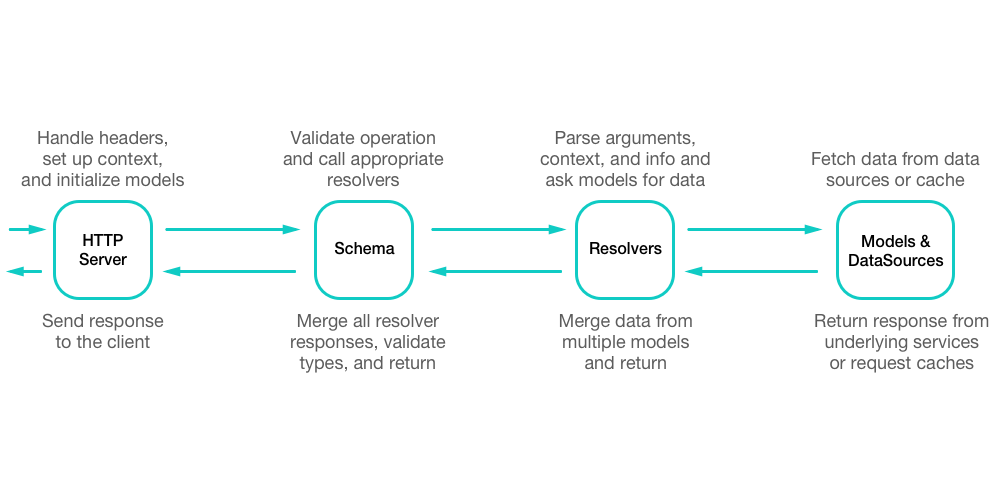

<!-- intro -->

This is _not_ a guide to testing JavaScript. There are plenty of great articles on that topic already. Instead, this article will cover how to _structure_ the code in your GraphQL server to make it easier to test, along with some specific tips for integration testing the schema.

## Structure of a GraphQL server

Before testing anything, it's important to know how the pieces of the code fit and work together. There are a few pieces of a GraphQL server that affect how it should be tested.



The **HTTP server** is the layer between the clients and the actual GraphQL execution logic. It receives a request, parses it for the operation information and headers, and passes that information to the GraphqL layer. The `apollo-server` library handles much of these concerns.

The **Schema** is what the operation passed from the HTTP server is validated against. This validation check just makes sure that the operation isn't asking for anything that isn't supported by the type definitions (usually written in the Schema Definition Language).

**Resolvers** are the functions that handle user input and route requests to data models.

**Data models** are the functions that contain the logic around fetching, error handling, and transformation of data. These models typically are attached to the context so all resolvers have access to them.

These are the major parts of a GraphQL server. Before moving into testing these parts, there are some core ideas that can help to make these parts more easily testable.

## Big ideas

**Consistency**

Design similar parts of the server to do similar things. Resolvers should all have defined roles in the process. For example, if resolvers are where data transformation happens, then resolvers should be responsible for transforming data everywhere. Models and DataSources should not. Likewise, if authorization concerns are handled at the model level, no resolvers should handle similar concerns. Keeping everything consistent like this, just makes writing new tests much easier, as most of the work can be copied from other tests.

**Dependency injection**

There are multiple ways to tests dependencies. One of the easiest methods is called dependency injection. Dependency injection is the process of passing any dependent libraries or tools to a function as arguments, rather than importing them on a higher scope and using them in the tests.

For example:

```js
const importedUtils = require('./utils');

const myFunction = ({ user }) => {
  // without dependency injection
  // uses the utils imported at the top of the file
  return importedUtils.getUserRoles(user);
};

const anotherFunction = ({ user, utils }) => {
  // with dependency injection.
  // The calling function passes the utils needed
  return utils.getUserRoles(user);
};
```

The next couple sections of this article will explain how to leverage these ideas when building a GraphQL server.

## Unit testing data models

- use dependency injection when constructing data models to mock out HTTP requests
- try not to reference any imports in the model functions

## Unit testing resolvers

- Access data models through the context
- Try not to reference any imports in resolvers

## Integration testing with the schema

- import your resolvers and typeDefs
- using graphql-tools, create an executableSchema instance
- run real-world queries against that executable schema
  - engine usage stats
