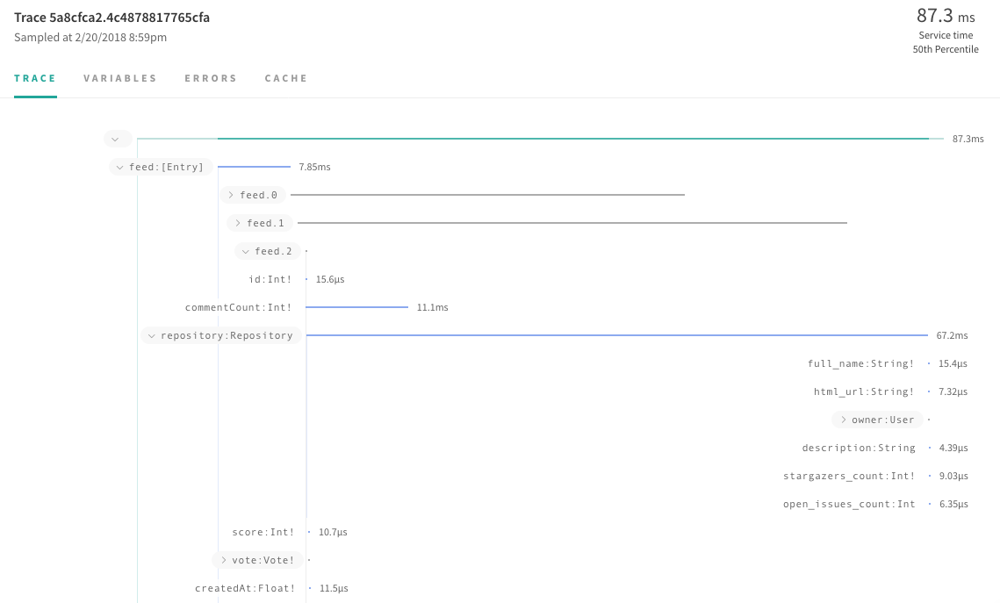
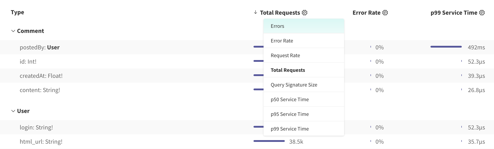
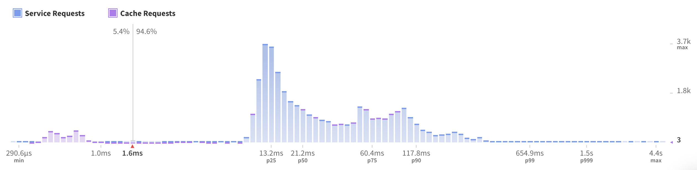

Apollo is a team and community that maintains a set of decoupled components and standards to help developers get the most out of GraphQL. GraphQL is the future of application development, and we're here to help everyone move towards that future.

The tools, products, and libraries in Apollo can be grouped into 3 categories:

1. [Client](#client-section): This is a set of tools to help you consume GraphQL data in your UI, on any platform including [React](/docs/react/), [Vue](https://github.com/akryum/vue-apollo), [Angular](/docs/angular), [iOS](/docs/ios/), and [Android](https://github.com/apollographql/apollo-android).
2. [Engine](#engine-section): This is GraphQL infrastructure you can run over your server to get features like performance tracing, caching, and error tracking specifically for GraphQL.
3. [Server](#server-section): These are tools you can use to add GraphQL incrementally to your backend, or start a new GraphQL backend from scratch.

<h2 id="getting-started">Getting started</h2>

Getting started with Apollo is easy! You can follow these tutorials for step by step instructions.

<h3 id="full-stack-graphql" title="Full stack tutorial"><a href="https://dev-blog.apollodata.com/full-stack-react-graphql-tutorial-582ac8d24e3b">Full Stack React and GraphQL Tutorial</a></h3>

Jonas Helfer and friends take you through [building a simple GraphQL server and React app](https://dev-blog.apollodata.com/full-stack-react-graphql-tutorial-582ac8d24e3b) with Apollo.

<h3 id="howtographql">How to GraphQL</h3>

Nikolas Burk from Graphcool and Maira Bello from VTEX have put together two tutorials to build a simple Hacker News clone using JavaScript. Check out the [rest of the site](https://www.howtographql.com/) for other non-JavaScript technologies!

1. [Client part with React](https://www.howtographql.com/react-apollo/0-introduction/)
2. [Server part with Node](https://www.howtographql.com/graphql-js/1-getting-started/)

<h3 id="chatty"><a href="https://medium.com/react-native-training/building-chatty-a-whatsapp-clone-with-react-native-and-apollo-part-1-setup-68a02f7e11">WhatsApp clone</a></h3>

Simon Tucker wrote a great tutorial on the React Native Training blog showing you how to build a [fully-featured chat app with realtime data](https://medium.com/react-native-training/building-chatty-a-whatsapp-clone-with-react-native-and-apollo-part-1-setup-68a02f7e11).

<h2 id="client-section">Client</h2>

[Apollo Client](/client/) is the most popular solution for binding GraphQL data to your UI, on every platform. [Learn more](/client) about its benefits and features.

<h3 id="client-libraries">GraphQL client libraries</h3>

The main parts of the project are the GraphQL client libraries for every frontend platform:

* Apollo Client JavaScript [Docs](/docs/react/) & [GitHub](https://github.com/apollographql/apollo-client)
* React and React Native [Docs](/docs/react/) & [GitHub](https://github.com/apollographql/react-apollo)
* Vue.js [Docs & GitHub](https://github.com/akryum/vue-apollo)
* Angular [Docs](/docs/angular/) & [GitHub](https://github.com/apollographql/apollo-angular)
* Ember [Docs & GitHub](https://github.com/bgentry/ember-apollo-client)
* Meteor [Docs](/docs/react/recipes/meteor/) & [GitHub](https://github.com/apollographql/meteor-integration)
* iOS for native Swift [Docs](/docs/ios) & [GitHub](https://github.com/apollographql/apollo-ios)
* Android for Java [Docs & GitHub](https://github.com/apollographql/apollo-android)

If you don't see your platform here, send a PR to add it, or work on a library of your own!

<h3 id="developer-tools">Developer tooling</h3>

In addition to libraries you put in your client, there are some great tools you can use to integrate with your development environment and editor:

* [GraphQL ESLint Plugin](https://github.com/apollographql/eslint-plugin-graphql): This is a plugin you can add to ESLint to validate your GraphQL queries and see errors show up right inside your editor. 
* [Apollo Codegen](https://github.com/apollographql/apollo-codegen): You can use this tool to generate static types for your queries, for TypeScript, Flow, Java, Scala, or Swift. 
* Apollo Client Devtools: This is a Chrome dev tools panel you can use to run GraphQL queries against your server, see what queries and mutations are active in your page, and inspect the current state of the store. [Chrome Web Store](https://chrome.google.com/webstore/detail/apollo-client-developer-t/jdkknkkbebbapilgoeccciglkfbmbnfm), [GitHub](https://github.com/apollographql/apollo-client-devtools)

<h2 id="engine-section">Engine</h2>

Apollo Engine is a GraphQL gateway and development tool for commercial teams building high performance applications. Engine sits between your client and GraphQL server, adding high performance and introspection tooling features to your application such as:

<h3 id="performance-tracing">Performance tracing</h3>
Your application is only a fast as your slowest queries: know your p95 values, and check out the waterfall trace view of your overall query down to each resolver field query response time. 

<h3 id="schema-analytics">Schema analytics</h3>
Customize analytics for your fields in your schema. 

<h3 id="error-tracking">Error tracking</h3>
Investigate GraphQL server errors in their full context by field, by path, and by operation.

<h3 id="response-caching">Response caching</h3>
Decrease response time of queries using caching - for large deployments, Engine supports memcache clusters, or you can use a local in-mem cache store. 

    
<h3 id="persisted-queries">Automatic persisted queries</h3>
The concept is simple: by sending a query ID or hash instead of an entire GraphQL query string, bandwidth utilization can be reduced, thus speeding up loading times for end-users. 

 Compatible servers include Apollo Server, GraphQL-Ruby, GraphQL-Java, Scala with Sangria, and Elixir with Absinthe.  

[Learn about Engine features](/engine/)
[Get started with Engine](https://engine.apollographql.com)
[Read the Engine docs](/docs/engine/)

<h2 id="server-section">Server</h2>

You need a GraphQL server to be able to access your data via GraphQL. While we have server libraries and tools for JavaScript, you can write a GraphQL server in any language.

[Read more about GraphQL servers.](/servers/)

<h3 id="server-libraries">Apollo server libraries</h3>

The Apollo server libraries for JavaScript are designed to make it simple to add GraphQL on top of your existing backends, or build a new server from scratch. They are built around [GraphQL.js](https://github.com/graphql/graphql-js), Facebook's reference GraphQL implementation for JavaScript.

* GraphQL Tools: This library helps you easily generate a GraphQL schema using the GraphQL schema language and resolvers. It also supports additional features like mocking, schema stitching, and more. [Docs](/docs/graphql-tools), [GitHub](https://github.com/apollographql/graphql-tools)
* Apollo Server: This is a library for attaching a GraphQL schema to a server endpoint, which supports all major Node.js server technologies including Express, Hapi, Koa, and more. [Docs](/docs/apollo-server/), [GitHub](https://github.com/apollographql/apollo-server)
* GraphQL Subscriptions: Add realtime data streaming capabilities to your GraphQL server. [Docs](/docs/graphql-subscriptions), [GitHub](https://github.com/apollographql/subscriptions-transport-ws)

<h2 id="specifications">Specifications</h2>

The GraphQL specification is the only thing you need to use all the Apollo tools. Thankfully, the core spec has extension points you can use to add functionality.

* Apollo Tracing: A spec for adding performance tracing data to your GraphQL response. [Docs, GitHub](https://github.com/apollographql/apollo-tracing)
* Apollo Cache Control: A spec for adding performance tracing data to your GraphQL response. [Docs, GitHub](https://github.com/apollographql/apollo-cache-control)
