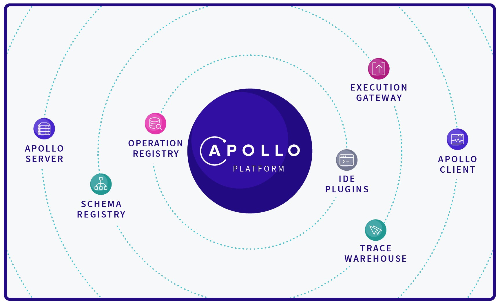

Welcome! 👋 We're excited you're here to learn about Apollo.

The Apollo GraphQL platform is an implementation of GraphQL that helps you manage data from the cloud to your UI. It's incrementally adoptable and can be layered over your existing services, including REST APIs and databases. Apollo includes two open-source libraries for the client and server, in addition to developer tooling that provides everything you need to run a graph API in production with confidence.

import {ButtonWrapper, ButtonLink} from 'gatsby-theme-apollo-docs';

<ButtonWrapper>
  <ButtonLink
    size="large"
    color="branded"
    to="/tutorial/introduction"
  >
    Try it out!
  </ButtonLink>
  <ButtonLink
    size="large"
    to="/intro/platform"
  >
    Learn more
  </ButtonLink>
</ButtonWrapper>

