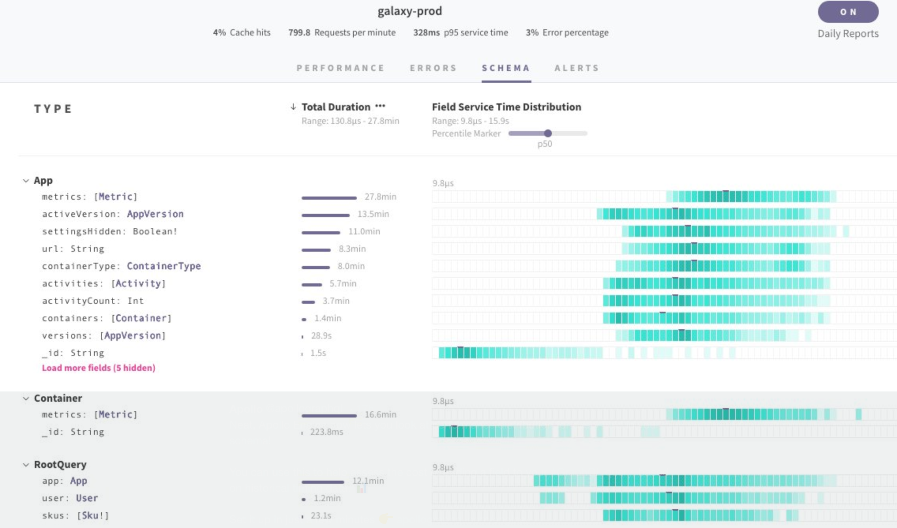

Managing data in modern applications can present a number of challenges. Developers have to aggregate data from multiple sources, distribute it upon multiple platforms, and plumb it into an app's UI. On top of that, front-end developers have to decide how to manage state on the client, all while executing complicated features such as caching and optimistic UI.

Adopting GraphQL in your organization will ease these pain points considerably. Read on to learn how GraphQL's declarative approach to data fetching will simplify data transformation and speed up your API. You'll also learn how the Apollo platform enables faster development cycles thanks to its advanced ecosystem of tooling and excellent developer experience.

## Developer experience

Implementing GraphQL in your organization via the Apollo platform can help you ship features faster due to its excellent developer experience. Our #1 goal is to simplify data management across the stack. Features that are normally difficult to execute, such as fullstack caching, data normalization, and optimistic UI suddenly become trivial thanks to Apollo Client, Apollo Server, and Apollo Engine. Let's learn how!

### Explore your API

GraphQL's strongly typed query language enables developers to take advantage of incredible tooling for exploring GraphQL APIs. Thanks to GraphQL's introspection system, developers can query a GraphQL schema for information about what queries and types it supports. Introspection unlocks some really cool features, such as automatic documentation, autocomplete, and more.

#### GraphQL Playground

[GraphQL Playground](https://github.com/prismagraphql/graphql-playground) by Prisma is an excellent IDE featuring automatically generated docs for your schema and query execution with autocomplete. At a glance, you can see all the data available in your GraphQL API without diving into the backend code or knowing what source it came from.


Apollo Server 2+ sets up GraphQL Playground out of the box, so you can start exploring your schema and executing queries immediately.

#### Apollo DevTools

Apollo DevTools is a Chrome extension that allows you to inspect your Apollo Client cache, track active queries, and view mutations. You also have access to GraphiQL within Apollo DevTools which is convenient for testing queries as you're working on front-end code with Apollo Client.


### Simplify front-end code

If you've worked with REST and a state management library like Redux, you're probably used to writing action creators, reducers, normalizing your data, and integrating middleware to make a single network request. With Apollo Client, you no longer have to worry about any of these concerns! Apollo Client sets up everything you need for a production-ready app so you can focus on writing queries instead of thousands of lines of state management code.

```js
import ApolloClient from 'apollo-boost';

const client = new ApolloClient({
  uri: 'https://dog-graphql-api.glitch.me/graphql'
});
```

Teams who have switched to Apollo Client have reported [deleting thousands of lines of state management code](https://blog.apollographql.com/reducing-our-redux-code-with-react-apollo-5091b9de9c2a) and lots of complexity from their application. Since Apollo Client supports managing both local and remote data, you can use the Apollo cache as a single source of truth for all global state in your application.

### Modern tooling

Developing your GraphQL API with the Apollo platform gives teams access to modern tooling that helps them uncover bugs quickly, gain visibility into their API, and develop challenging features such as caching with confidence.

[Apollo Engine](https://engine.apollographql.com/login) is the only tool in the GraphQL ecosystem that can provide monitoring and analytics for your API. Apollo Engine displays per resolver tracing metrics that can help you pinpoint bugs, as well as performance distribution for every field in your schema. You can also pipe this data to services you're probably already using like DataDog, and set up Slack alerts if these numbers pass a certain threshold.



## Declarative data fetching

One of the main advantages of adopting GraphQL is its declarative approach to data fetching. With GraphQL, there's no need to call multiple endpoints from the client or aggregate the data manually like you have to with traditional REST data fetching. Instead, you specify exactly the data you need and GraphQL gives you exactly what you asked for.

With REST, you would have to call all of these endpoints for each item in the list, filter down the data you need, and aggregate all of the remaining data into the shape your components consume.

```bash
GET /api/dogs/breeds
GET /api/dogs/images
GET /api/dogs/activities
```

Not only is this approach time-consuming, it's also prone to error and difficult to reuse logic across platforms. Compare this with GraphQL's declarative way to query data:

```graphql
const GET_DOGS = gql`
  query {
    dogs {
      id
      breed
      image {
        url
      }
      activities {
        name
      }
    }
  }
`;
```

Here, we're describing the shape of the object we want to receive from the server. GraphQL takes care of combining and filtering the data while returning exactly what we ask for.

How do we use this query in our app? Apollo Client builds off of GraphQL's declarative approach to data fetching. In a React app, all of the logic for retrieving your data, tracking loading and error states, and updating your UI is encapsulated in a single `Query` component. This encapsulation makes composing your data fetching components with your presentational components a breeze! Let’s see how to fetch GraphQL data with Apollo Client in a React app:

```jsx
const Feed = () => (
  <Query query={GET_DOGS}>
    {({ loading, error, data }) => {
      if (error) return <Error />;
      if (loading || !data) return <Fetching />;

      return <DogList dogs={data.dogs} />;
    }}
  </Query>
);
```

Apollo Client takes care of the request cycle from start to finish, including tracking loading and error states for you. There’s no middleware to set up or boilerplate to write before making your first request, nor do you need to worry about transforming and caching the response. All you have to do is describe the data your component needs and let Apollo Client do the heavy lifting. 💪

You’ll find that when you switch to Apollo Client, you’ll be able to delete a lot of unnecessary code related to data management. The exact amount will vary depending on your application, but some teams have reported up to thousands of lines. To learn more about how Apollo Client enables advanced features like optimistic UI, refetching, and pagination with less code, check out our [documentation for Apollo Client](https://www.apollographql.com/docs/react/).

## Improved performance

In many cases, layering a GraphQL API over your existing REST endpoints can improve your app's performance, especially on devices with slow network connections. While you should always measure to determine how integrating GraphQL will affect your application, it's generally accepted that GraphQL improves performance by helping avoid round trips to the server and reducing payload size.

### Smaller payloads

Since the response back from the server contains only the properties you specify in your query, GraphQL can significantly reduce payload size compared to a REST endpoint. Let's take a look at our dogs query from earlier in the article:

```graphql
const GET_DOGS = gql`
  query {
    dogs {
      id
      breed
      image {
        url
      }
      activities {
        name
      }
    }
  }
`;
```

The response back from the server will be a list of dog objects with `id`, `breed`, `image`, and `activities` properties. It doesn't matter if the underlying REST endpoints we call in our resolvers return back objects with 100 properties! All of those extraneous properties will be filtered out before the response is sent back to the client.

### Avoid round trips

Since each GraphQL request returns only one response, switching to GraphQL can help you avoid costly round trips from the client to your server. With REST, each resource represents a round trip, which can quickly add up. If you're fetching items in a list, you'll have to complete a round trip for every resource multiplied by the number of items, causing slow load times, especially on mobile devices.

```bash
GET /api/dogs/breeds
GET /api/dogs/images
GET /api/dogs/activities
```

With GraphQL, each query represents a single round trip from the client to server. If you'd like to reduce round trips even further, you can implement [query batching](https://www.apollographql.com/docs/react/advanced/network-layer#query-batching) to batch multiple queries into a single request.

### Ready for production

While the GraphQL specification was first made public by Facebook in 2015, GraphQL has been a key component of their mobile application deployment since 2012.

At Apollo, we found GraphQL to be an excellent solution to many of the problems we encountered with existing techniques, and now use it to power critical infrastructure. Over the years, we’ve worked with the open-source community along with customers and partners of all sizes to continually bring new innovations to the open-source Apollo offerings, and we're proud that those offerings are suitable for everything from startups to large-scale deployments.

In addition to our own experience, we have received extensive feedback, contributions and support from enterprise customers who are actively using Apollo GraphQL in production. A few of our most public and notable case-studies are:

- [**The New York Times**](https://open.nytimes.com/the-new-york-times-now-on-apollo-b9a78a5038c): Learn how The New York Times switched from Relay to Apollo & implemented features in their app such as SSR and persisted queries.
- [**Airbnb**](https://medium.com/airbnb-engineering/reconciling-graphql-and-thrift-at-airbnb-a97e8d290712): Airbnb is betting big on the Apollo platform to power the data layer for their microservices.
- [**Express**](https://dev-blog.apollodata.com/changing-the-architecture-of-express-com-23c950d43323): Easy-to-use pagination with Apollo helped improve the Express eCommerce team's key product pages.
- [**Major League Soccer**](https://dev-blog.apollodata.com/reducing-our-redux-code-with-react-apollo-5091b9de9c2a): MLS' switch from Redux to Apollo for state management enabled them to delete nearly all of their Redux code.
- [**Expo**](https://dev-blog.apollodata.com/using-graphql-apollo-at-expo-4c1f21f0f115): Developing their React Native app with Apollo allowed the Expo engineers to focus on improving their product instead of writing data fetching logic.
- [**KLM**](https://youtu.be/T2njjXHdKqw): Learn how the KLM team scaled their Angular app with GraphQL and Apollo.
