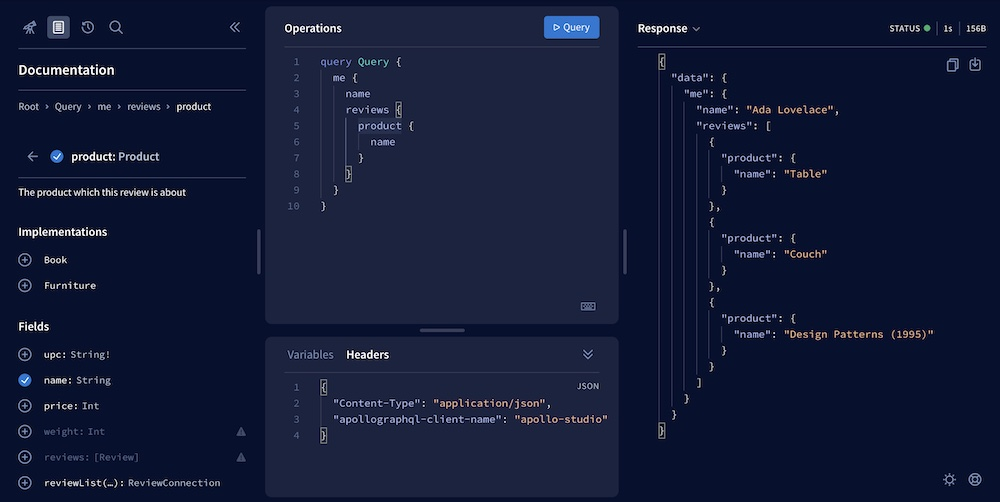

Managing data in modern applications is challenging. Most applications require:

* Distinct front-end clients for multiple platforms (web, iOS, etc.), each with different data requirements
* A backend that serves data to clients from multiple sources (Postgres, Redis, etc.)
* Complex state and cache management for both the frontend and the backend

By adopting GraphQL and Apollo, you can reduce these challenges considerably. GraphQL's declarative model helps you create a consistent, predictable API you can use across all of your clients. As you add, remove, and migrate back-end data stores, that API doesn't change from the client's perspective.

Even with many other advantages, **GraphQL's single greatest benefit is the developer experience it provides.** It's straightforward to add new types and fields to your API, and similarly straightforward for your clients to begin using those fields. This helps you design, develop, and deploy features quickly.

Combined with [the Apollo platform](./platform/), complex considerations like caching, data normalization, and optimistic UI rendering become straightforward as well.

## GraphQL provides declarative, efficient data fetching

GraphQL's declarative approach to data fetching provides significant performance and quality-of-life improvements over a REST API.

Consider a webpage that displays a list of adorable pets that are available for adoption at local animal shelters. 🐶

**Using REST**, the page might need to:

1. `GET` a list of shelters and their corresponding `pet_id`s from the `/api/shelters` endpoint
2. `GET` each individual pet's details (name, photo URL, etc.) with a separate request to `/api/pets/PET_ID`

This solution requires multiple dependent network requests, which can result in slower page loads and additional battery consumption on mobile devices. This logic is also difficult to reuse on other pages that display slightly different data.

**Using GraphQL**, the page can obtain _all_ of this data with a single query to a single endpoint. That query looks like this:

```graphql
query GetPetsByShelter {
  shelters {
    name
    pets {
      name
      photoURL
    }
  }
}
```

This query describes the shape of the data we want to receive from the GraphQL server. The server takes care of combining and filtering back-end data to return _exactly_ what we ask for. This keeps payload sizes small, especially compared to a REST endpoint that might return hundreds of unnecessary fields.

To execute a query like the one above, the page uses a GraphQL client such as [Apollo Client](https://www.apollographql.com/docs/react/), with code that resembles the following (in the case of a React app):

```jsx:title=mainpage.jsx
// Define the query
const GET_PETS_BY_SHELTER = gql`
  query GetPetsByShelter {
    shelters {
      name
      pets {
        name
        photoURL
      }
    }
  }
`;

function MainPage() {

  // Execute the query within the component that uses its result
  const { loading, error, data } = useQuery(GET_PETS_BY_SHELTER);

  if (error) return <Error />;
  if (loading || !data) return <Fetching />;

  // Populate the component using the query's result
  return <PetList shelters={data.shelters} />;
}
```

Apollo Client's `useQuery` hook takes care of the request lifecycle from start to finish, including tracking loading and error states for you. There’s no middleware to set up or boilerplate to write before making your first request. All you need to do is describe the data your component needs and let Apollo Client do the heavy lifting. 💪

## GraphQL enables powerful tooling

Thanks to GraphQL's [strong typing](https://graphql.org/learn/schema) and built-in support for  [introspection](https://graphql.org/learn/introspection/), developer tools for GraphQL are extremely powerful. These tools let you do things like:

* Explore the full structure of a schema, complete with docstrings
* Compose new operations with live validation and autocomplete
* Register your schema with a management service that tracks and checks changes

### What is Apollo Studio?

Apollo provides a cloud-hosted collection of tools that help you measure your graph's performance and grow it safely. These tools are together known as [**Apollo Studio**](https://www.apollographql.com/docs/studio/).

After registering your GraphQL schema, you can use the **Apollo Studio Explorer** to inspect all of its types and fields. You can also build and run queries against your running server:



### Apollo Client DevTools

The Apollo Client DevTools extension for [Chrome](https://chrome.google.com/webstore/detail/apollo-client-developer-t/jdkknkkbebbapilgoeccciglkfbmbnfm) and [Firefox](https://addons.mozilla.org/en-US/firefox/addon/apollo-developer-tools/) enables you to inspect your Apollo Client cache, track active queries, and view mutations. It also includes an embedded version of the Explorer, which helps you test queries while you're working on front-end code.


## GraphQL is production-ready

GraphQL's adoption has risen steadily since Facebook published the original [specification](https://spec.graphql.org/) in 2015. For more and more organizations, the benefits of GraphQL are taking it from a curious engineer's hack-week experiment to the heart of the application data layer.

GraphQL scales with the requirements of even the largest organizations, largely because of its [powerful tooling](#graphql-enables-powerful-tooling) and its compatibility with a [federated architecture](https://www.apollographql.com/docs/federation/).

In a federated architecture, a single GraphQL schema is split across multiple back-end services. Each team in an organization can then own exactly the services (and the corresponding parts of the schema) that they should.

### Organizations using GraphQL

Here are a few blog posts from organizations that have benefited from adopting GraphQL in their production environment:

* [PayPal](https://medium.com/paypal-engineering/scaling-graphql-at-paypal-b5b5ac098810)
* [Netflix](https://netflixtechblog.com/how-netflix-scales-its-api-with-graphql-federation-part-1-ae3557c187e2)
* [The New York Times](https://open.nytimes.com/the-new-york-times-now-on-apollo-b9a78a5038c)
* [Nerdwallet](https://www.nerdwallet.com/blog/engineering/getting-started-with-graphql-and-apollo-part-1/)

## GraphQL trade-offs

When deciding whether to adopt a technology, it's just as important to understand the technology's limitations as it is to understand its benefits.

Consider the following trade-offs when using GraphQL:

### Change management

GraphQL introduces a new conceptual model for representing and interacting with data. An organization that's comfortable with this model can design, implement, and ship features quickly. However, the process of _becoming_ comfortable with this model takes time.

* Front-end developers must come up to speed with a new API for fetching and manipulating data.
* Back-end developers must come up to speed with how to handle incoming requests from the frontend.
* Developers across the organization must collaborate on a single, product-driven GraphQL schema and appoint individuals as the official maintainers of that schema.

The Apollo [docs](https://www.apollographql.com/docs/), [blog](https://www.apollographql.com/blog/), and [forums](https://community.apollographql.com) are all here to help your organization adopt GraphQL and take full advantage of it.

### Potential for slow operations

Your [GraphQL schema](https://www.apollographql.com/docs/apollo-server/schema/schema/) defines which types and fields your clients can query. Your GraphQL server's [resolvers](https://www.apollographql.com/docs/apollo-server/data/resolvers/) define how those types and fields are populated from your data stores.

Depending on your schema and your resolver definitions, your server might inadvertently support GraphQL operations that execute very slowly, or even max out your server's resources.

Consequently, it's important to design your schema such that it supports the operations your clients need, _without_ supporting unnecessary operations that affect performance. It's also helpful to set up [trace reporting](https://www.apollographql.com/docs/studio/setup-analytics/) for your GraphQL server, enabling you to identify and improve slow operations.

[Learn about query-driven schema design](https://www.apollographql.com/docs/apollo-server/schema/schema/#query-driven-schema-design)

### Incompatibility with web browser caching

Although [Apollo Client](https://www.apollographql.com/docs/react/) provides powerful client-side [caching features](https://www.apollographql.com/docs/react/caching/cache-configuration/), those features often require some configuration to get the most out of them. The _automatic_ caching provided by your _web browser_ does not interact well with GraphQL.

Web browsers cache fetched data according to its URL. With GraphQL, you fetch all data from the _same_ URL (the URL of your GraphQL server). Consequently, you can't rely on the cached value for this URL.
