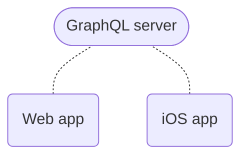
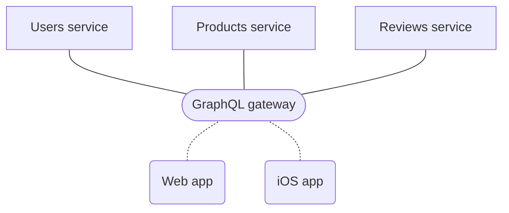

The Apollo platform helps you [build](#build-your-graph-with-apollo-server), [query](#query-your-graph-with-apollo-client), and [manage](#manage-your-graph-with-apollo-graph-manager) a **data graph**: a unified data layer that enables applications to interact with data from any combination of connected data stores and external APIs.

A data graph sits between application clients and back-end services, facilitating the flow of data between them:

An Apollo data graph uses **GraphQL** to define and enforce the structure of this data flow.

## Build your graph with Apollo Server

Your data graph needs a service that processes GraphQL operations from application clients. This service communicates with back-end data sources to fetch and modify data as needed. To build this service, you can use [**Apollo Server**](https://www.apollographql.com/docs/apollo-server/).

Apollo Server is an extensible, [open-source](https://github.com/apollographql/apollo-server) JavaScript GraphQL server. With it, you can define:

* A [**GraphQL schema**](https://www.apollographql.com/docs/apollo-server/schema/schema/) that specifies all of the types and fields available in your graph
* A collection of [**resolvers**](https://www.apollographql.com/docs/apollo-server/data/resolvers/) that specify how to populate each field of your schema with data from your back-end data sources

You can deploy Apollo Server to any hosted or serverless environment. It supports a variety of popular [Node.js middleware](https://www.apollographql.com/docs/apollo-server/integrations/middleware/).

And if you want your data graph to use a [federated architecture](#federate-your-graph-with-apollo-federation), Apollo Server includes extension libraries that enable it to act as every component of that architecture.

### Build incrementally

Your data graph doesn't immediately need to connect _all_ of your back-end data sources or handle _all_ of your client requests. The Apollo platform supports (and encourages) **incremental adoption**.

As you connect more data sources and expand your schema, Apollo Server can handle a larger and larger percentage of your client data requests. Clients can continue using an existing solution for requests that your data graph doesn't yet support.

## Query your graph with Apollo Client

After you deploy a first version of your data graph, application clients can begin querying it. To execute these queries, you can use [**Apollo Client**](https://www.apollographql.com/docs/react/).

Apollo Client is a customizable, [open-source](https://github.com/apollographql/apollo-client) JavaScript GraphQL client with powerful caching and state management features. It enables developers to define queries directly within the UI components that use them, and automatically update those components as query results arrive or change.

Apollo Client's cache locally replicates the parts of your data graph that your client cares about. This enables your client to query _itself_ for data if it's already present, dramatically improving performance by preventing unnecessary network requests.

### Supported platforms

Apollo Client includes official support for React, and there are community-maintained libraries for [other popular view layers](https://www.apollographql.com/docs/react/integrations/integrations/).

A Swift implementation of Apollo Client is officially supported for [iOS](https://www.apollographql.com/docs/ios/), and there is a community-maintained [Android library](https://www.apollographql.com/docs/android/).

## Manage your graph with Apollo Graph Manager

In addition to its open-source libraries, the Apollo platform provides a cloud-hosted collection of tools that help you measure your graph's performance and grow it safely. These tools are together known as [**Apollo Graph Manager**](https://www.apollographql.com/docs/graph-manager/).

<iframe width="560" height="315" src="https://www.youtube.com/embed/yZ3_Yvlmy78" frameborder="0" allow="accelerometer; autoplay; encrypted-media; gyroscope; picture-in-picture" allowfullscreen></iframe>

#### Graph Manager provides the following features to all Apollo users for free:

* A [GraphQL schema registry](https://www.apollographql.com/docs/graph-manager/schema-registry/) that tracks changes
and enables you to [create variants of your schema](https://www.apollographql.com/docs/graph-manager/schema-registry/#managing-environments-with-variants) for different environments
(such as staging and production)
* A schema explorer that makes it easy to inspect your schema's queries,
mutations, and other object definitions
* [Metrics reporting](https://www.apollographql.com/docs/graph-manager/setup-analytics/) for up to the last 24 hours
* Team collaboration via [organizations](https://www.apollographql.com/docs/graph-manager/accounts-organizations/)
* [Slack notifications](https://www.apollographql.com/docs/graph-manager/slack-integration/) for schema changes and daily metrics reports
* [Management of a federated data graph](https://www.apollographql.com/docs/graph-manager/managed-federation/overview/)

#### Additional features are available to organizations with a subscription to an [Apollo Team or Enterprise plan](https://www.apollographql.com/pricing/):

* Metrics reporting for arbitrary timeframes
* [Metrics segmentation by distinct clients and versions](https://www.apollographql.com/docs/graph-manager/client-awareness/)
* [Schema change validation](https://www.apollographql.com/docs/graph-manager/schema-validation/) to help ensure that schema updates don't break production clients
* [Operation safelisting](https://www.apollographql.com/docs/graph-manager/operation-registry/) to restrict certain clients to certain parts of your data graph
* [Resolver-level query tracing](https://www.apollographql.com/docs/graph-manager/performance/)
* [Integration with Datadog](https://www.apollographql.com/docs/graph-manager/datadog-integration/)

## Federate your graph with Apollo Federation

As your data graph grows, it can be useful to divide its functionality across multiple services that are responsible for distinct portions of the graph's schema. Doing so is known as adopting a **federated architecture**. Apollo has defined the specification for a particular federated architecture called [**Apollo Federation**](https://www.apollographql.com/docs/apollo-server/federation/introduction/).

An Apollo Federation architecture replaces a monolithic solution like this:

With something like this:

With Apollo Federation, a **gateway** receives GraphQL operations from clients and divides them up among whichever **implementing services** are needed to process them. This architecture helps each team in your organization own exactly the part of your data graph that they should.

Apollo Server includes extension libraries that enable it to act as either a gateway or an implementing service. And Apollo Graph Manager provides free [managed federation](https://www.apollographql.com/docs/graph-manager/managed-federation/overview/) features that help maximize your graph's uptime.
