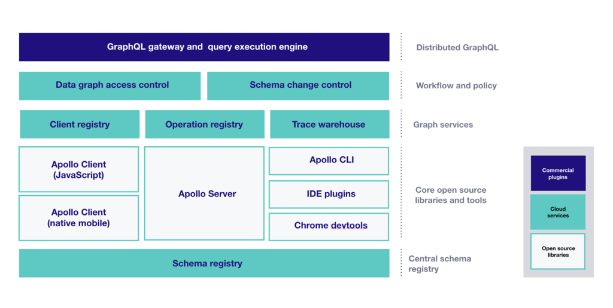

Apollo is an implementation of GraphQL designed for the needs of product
engineering teams building modern, data-driven applications. It
encourages an agile, incremental approach and takes special care to
avoid requiring any changes to existing APIs and services. Apollo puts
particular emphasis on tooling and workflows.

Apollo is best used as a new layer in your stack that sits between your
services and your applications. It's a combination of open source
components, commercial extensions, and cloud services. The major pieces
are:

## Core open source components

- **Apollo Server** is a JavaScript GraphQL server for defining a
  _schema_ and a set of _resolvers_ that implement each part of that
  schema. Typically Apollo Server is extensible: plugins can hook in to each stage of the
  request pipeline and server's own lifecycle, making it possible to
  implement custom behaviors in add-on packages. Apollo Server supports
  AWS Lambda and other serverless environments.

- **Apollo Client** is a sophisticated GraphQL client that
  manages data and state in an application. Among other benefits, it
  enables a declarative programming style that lets developers define
  queries as part of UI components; the client manages all the hairy
  details of binding query results to the UI, managing consistency,
  caching, and so on. Apollo Client also supports an
  exceptionally elegant approach to state management by _extending_ the
  GraphQL schema inside the client with additional structure. Apollo Client
  includes integrations for React, React Native, Vue, Angular, and
  other view layers.

- **iOS and Android** clients, originally contributed by the community,
  make it possible to query a GraphQL API from native iOS and
  Android applications.

- **Apollo CLI** is a simple command line client that provides
  access to Apollo cloud services.

## Cloud services

- **Schema registry** &mdash; a registry for GraphQL schemas that acts
  as a central source of truth for a schema, enriched with additional
  metadata like field-level usage statistics.

- **Client registry** &mdash; a registry to track each known consumer
  of a schema, which can include both pre-registered and ad-hoc clients.

- **Operation registry** &mdash; a registry of all the known operations
  against the schema, which similarly can include both pre-registered
  and ad-hoc operations.

- **Trace warehouse** &mdash; a data pipeline and storage layer that
  captures structured information about each GraphQL operation
  processed by an Apollo Server (or any other server that implements
  the Apollo trace API), including the specific set of fields accessed,
  the tree of resolver calls that were made with timing data for each,
  and important metadata such as client identity and which version
  of the schema was queried.

## Gateway

- **Apollo Gateway** &mdash; a configuration of Apollo Server and additional plugins
  that functions as a GraphQL gateway. The gateway composes separately deployed "micro-schemas" that reference each other into a single master schema, which looks to a client just like any regular GraphQL schema. To answer queries, the gateway builds a query plan, fetches data from each upstream GraphQL service, and assembles it all back together into a single result.

## Workflows

On top of these components, Apollo implements some useful workflows for
managing a GraphQL API. Each of these workflows makes use of several
different parts of the platform, working together. Some examples are:

### Schema change validation

Apollo includes a facility for checking the compatibility of a given
schema against a set of previously-observed operations. This uses the
trace warehouse, operation registry, and (typically) the client
registry. As an example, an operation that references a missing field or
an operation that doesn't pass a required argument to a field would
cause an incompatibility error. The compatibility check runs statically,
taking advantage of the schema's type definitions, so it doesn't require
a running server.

### Safelisting

Apollo provides an end-to-end mechanism for _safelisting_ known clients
and queries, a recommended best practice that limits production use of a
GraphQL API to specific pre-arranged operations. There are two parts
here. First, the Apollo CLI extracts all the queries from a client
codebase, computes the over-the-wire subset of the query (stripping out
the part that references the client's local schema), and stores it in
the operation registry. Separately, an Apollo Server plugin synchronizes
the list of pre-registered operations to the server, which then rejects
queries that aren't present in its local copy.
