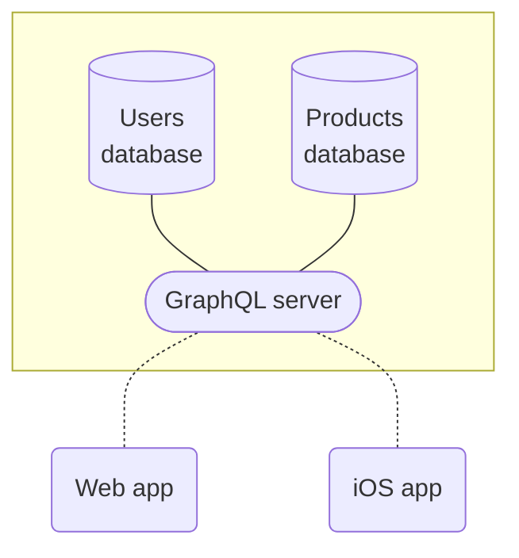
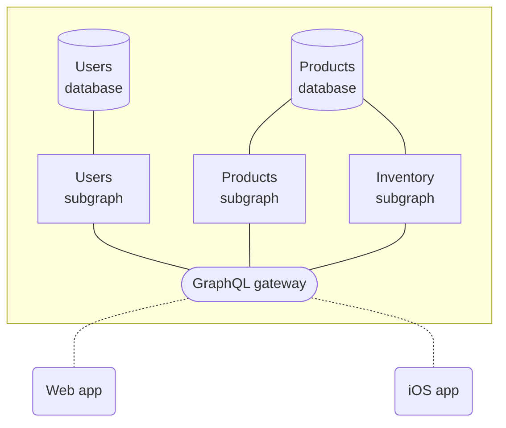

The Apollo platform helps you [build](#1-build-your-graph-with-apollo-server), [query](#2-query-your-graph-with-apollo-client), [manage](#3-manage-your-graph-with-apollo-studio), and [scale](#4-scale-your-graph-with-apollo-federation) a unified **graph**: a data layer that enables applications to interact with data from any combination of connected data stores and external APIs.

Your graph sits between application clients and back-end services, facilitating the flow of data between them:

An Apollo graph uses [GraphQL](./benefits/) to define and enforce the structure of this data flow.

## 1. Build your graph with Apollo Server

Your graph needs a service that processes GraphQL operations from application clients. This service communicates with back-end data sources to fetch and modify data as needed. To build this service, you can use [**Apollo Server**](https://www.apollographql.com/docs/apollo-server/).

Apollo Server is an extensible, [open-source](https://github.com/apollographql/apollo-server) JavaScript GraphQL server. With it, you can define:

* A [**GraphQL schema**](https://www.apollographql.com/docs/apollo-server/schema/schema/) that specifies all of the types and fields available in your graph
* A collection of [**resolvers**](https://www.apollographql.com/docs/apollo-server/data/resolvers/) that specify how to populate each field of your schema with data from your back-end data sources

You can deploy Apollo Server to any hosted or serverless environment. It supports a variety of popular [Node.js middleware](https://www.apollographql.com/docs/apollo-server/integrations/middleware/) and works seamlessly with TypeScript.

### Build incrementally

Your graph doesn't immediately need to connect _all_ of your back-end data sources or handle _all_ of your client requests. The Apollo Graph Platform supports (and encourages) **incremental adoption**.

As you connect more data sources and expand your schema, Apollo Server can handle a larger and larger percentage of your client data requests. Clients can continue using an existing solution for requests that your graph doesn't yet support.

### Make the jump to federation

As your graph begins to grow in size and complexity, you can use Apollo Server's extension libraries to [federate your graph](#4-scale-your-graph-with-apollo-federation).

In a federated architecture, your graph's API is implemented across multiple services instead of a monolithic server. Each service has its own GraphQL schema, and those schemas are merged by a **gateway** that intelligently executes operations across services.

## 2. Query your graph with Apollo Client

After you deploy a first version of your graph, application clients can begin querying it. To execute these queries, you can use [**Apollo Client**](https://www.apollographql.com/docs/react/).

Apollo Client is a customizable, [open-source](https://github.com/apollographql/apollo-client) JavaScript GraphQL client with powerful caching and state management features. It enables developers to define queries directly within the UI components that use them, and automatically update those components as query results arrive or change. It also works seamlessly with [TypeScript](https://www.apollographql.com/docs/react/development-testing/static-typing/).

Apollo Client's cache locally replicates the parts of your graph that your client cares about. This enables your client to query _itself_ for data if it's already present, dramatically improving performance by preventing unnecessary network requests.

### Supported Apollo Client platforms

Apollo Client includes official support for React, and there are community-maintained libraries for [other popular view layers](https://www.apollographql.com/docs/react/integrations/integrations/).

Apollo Client is also officially supported on mobile with a Swift client for [iOS](https://www.apollographql.com/docs/ios/) and a Java/Kotlin one for [Android](https://www.apollographql.com/docs/android/).

## 3. Manage your graph with Apollo Studio

In addition to its open-source libraries, the Apollo platform provides a cloud-hosted collection of tools that help you measure your graph's performance and grow it safely. These tools are together known as [**Apollo Studio**](https://www.apollographql.com/docs/studio/).

### The schema registry

The Apollo [schema registry](https://www.apollographql.com/docs/studio/schema-registry/) powers many development tools, including Apollo Studio. By publishing your graph's schema, you can use Studio to explore your schema's structure, track its change history, and lay the foundation for many other powerful features.

### Free Apollo Studio features

* [The Explorer](https://www.apollographql.com/docs/studio/explorer/), a powerful GraphQL IDE that helps your team build and run queries against your graph:

    

* [Metrics reporting](https://www.apollographql.com/docs/studio/setup-analytics/) for up to the last 24 hours:

    

* Team collaboration via [organizations](https://www.apollographql.com/docs/studio/org/organizations/)
* [Slack notifications](https://www.apollographql.com/docs/studio/slack-integration/) for schema changes and daily metrics reports
* [Management of a federated graph](https://www.apollographql.com/docs/federation/managed-federation/overview/)

### Paid Apollo Studio features

> For details, see the [pricing page](https://www.apollographql.com/pricing/).

* [Metrics reporting](https://www.apollographql.com/docs/studio/setup-analytics/) for arbitrary timeframes
* [Metrics segmentation by distinct clients and versions](https://www.apollographql.com/docs/studio/client-awareness/)
* [Schema checks](https://www.apollographql.com/docs/studio/schema-checks/)
* [Operation safelisting](https://www.apollographql.com/docs/studio/operation-registry/)
* [Resolver-level query tracing](https://www.apollographql.com/docs/studio/performance/)
* [Integration with Datadog](https://www.apollographql.com/docs/studio/datadog-integration/)
* Longer data retention

## 4. Scale your graph with Apollo Federation

As your graph grows, it can be useful to divide its functionality across multiple GraphQL services that own distinct portions of the graph's schema. Doing so is known as adopting a **federated architecture**. Apollo has defined the specification for a particular federated architecture called [**Apollo Federation**](https://www.apollographql.com/docs/apollo-server/federation/introduction/).

Let's look at how this differs from a non-federated architecture.

### Non-federated architecture

In a non-federated architecture, your monolithic GraphQL server is responsible for the entirety of your graph's schema. When a client request comes in, the server resolves it by fetching and/or modifying data across one or more data stores that it connects to directly:

### Apollo Federation architecture

With Apollo Federation, a **gateway** sits in front of one or more **subgraphs**:

The gateway is a GraphQL server, _and so is each subgraph_. Each subgraph defines its own schema and connects to whichever data stores it needs to populate that schema's fields. The gateway then aggregates these schemas and combines them into a _single_ schema (called the **supergraph schema**).

When a client request comes in, the gateway knows which requested fields are owned by which subgraph. It intelligently executes operations across whichever combination of subgraphs is needed to fully complete the operation.

Apollo Server includes extension libraries that enable it to act as either a gateway or a subgraph. And Apollo Studio provides free [managed federation](https://www.apollographql.com/docs/studio/managed-federation/overview/) features that help you maximize your graph's uptime.
