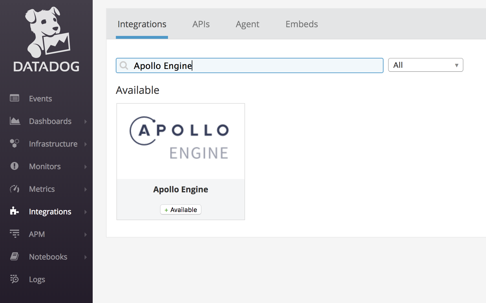
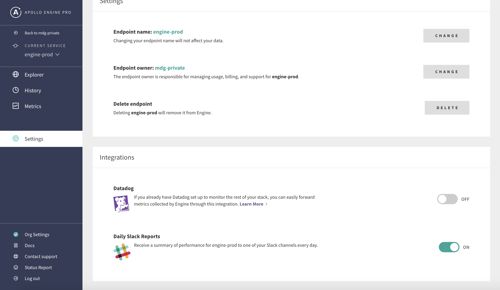
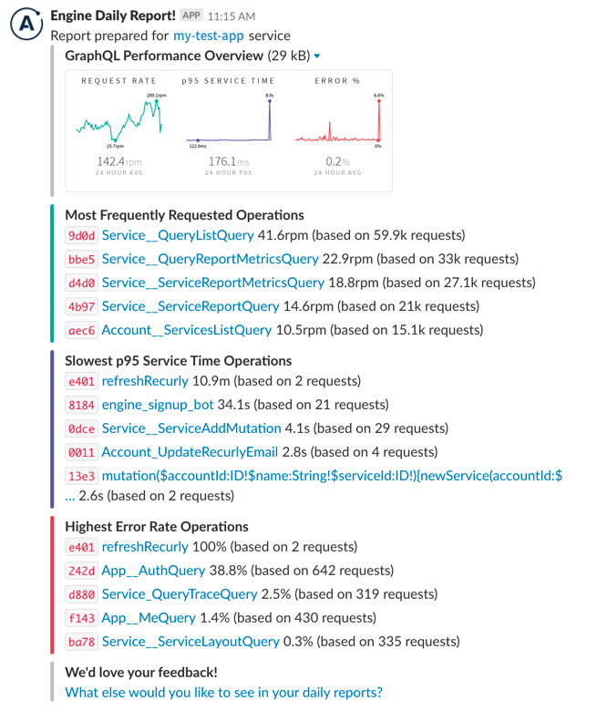

<h2 id="alerts">Setting up alerts</h2>

Engine alerts allow you to set thresholds on the performance data provided by
Engine and send notifications to Slack or PagerDuty when problems arise. They
are often useful for detecting anomalies, especially around releases or during
issues with an upstream provider. Alerts can be configured to monitor the
following metrics for your entire GraphQL service or individual operations:

- **Request rate** — requests per minute
- **Request duration** — p50/p95/p99 service time
- **Error rate** — errors per minute
- **Error percentage** — the number of requests with errors divided by total
  requests

These triggers you select are evaluated on a rolling five minute window. For
example, you configure an alert to trigger when an operation’s error rate
exceeds 5%. In production, if 6 out of 100 requests result in an error during
last five minute, then the alert will trigger with an error rate of 6%. Once
you have put out the fire and the five minute error rate falls back below 5%,
the alert will resolve. Here is an example of a Slack alert:

<h2 id="setup">How to set up alerts</h2>

Navigate to the _Alerts_ tab in the _Metrics_ area of your service.

  
Choose _Slack_ or _PagerDuty_, then follow the directions to create a Slack
Incoming Webhook or a PagerDuty integration key.

  
Two sample alerts are created automatically, but must be enabled to take effect:

* A performance alert which triggers after consistently slow operation response times across all operations.
* An error alert which triggers during a period of high error rates (more than 5%) across all operations.

These sample alerts can be enabled and disabled by toggling the checkbox in the _Enabled_ column.

  
For monitoring critical operations, like a sign-in mutation or
home page query, you can add an operation-specific alert and choose
from the same triggers.

  
Now that you have set up alerting, you can add [daily Slack
reports](../integrations/slack.html) or enable the [Datadog
integration](../integrations/datadog.html) to view the Engine data directly in your Datadog dashboard. If you
would like to suggest further features or integrations, please <a href="javascript:void(0);" onclick="Intercom('showNewMessage')">let us know</a>!

<h2 id="datadog">Datadog</h2>

Apollo Engine is designed to monitor the performance of your GraphQL infrastructure. If you already have Datadog set up to monitor the rest of your stack, you can easily forward metrics collected by Engine through this integration.

The Datadog metrics provided are:

- `apollo.engine.operations.count` --- the number of GraphQL operations that were executed. This includes queries, mutations, and operations that resulted in an error.
- `apollo.engine.operations.error_count` --- the number of GraphQL operations that resulted in an error. This includes GraphQL execution errors, and HTTP errors if Engine failed to connect to your server.
- `apollo.engine.operations.cache_hit_count` --- the number of GraphQL queries whose result was served from Apollo Engine's full query cache.
- A histogram of GraphQL operation response times, measured in milliseconds. Due to Engine's aggregation method (logarithmic binning), these values are accurate to +/- 5%:
  - `apollo.engine.operations.latency.min`
  - `apollo.engine.operations.latency.median`
  - `apollo.engine.operations.latency.95percentile`
  - `apollo.engine.operations.latency.99percentile`
  - `apollo.engine.operations.latency.max`
  - `apollo.engine.operations.latency.avg`

All of Engine's new Datadog metrics are tagged with the GraphQL operation name, as `operation:<query-name>`. Unique query signatures with the same operation name are merged, and queries without an operation name are ignored.
All of the metrics are also tagged with the Engine service ID, `service:<service-id>`, so multiple Apollo Engine services can send data to the same Datadog account.

Engine sends metrics to Datadog in 60 second intervals. Data is forwarded with a 60 second delay to allow for reports from Engine proxies to be collected, even in the case of temporary network failures.
Since Datadog metrics merge statistics from multiple instances of the proxy, per-host metrics are not available. Just like in Apollo Engine, each operation inside a query batch is counted individually.

<h3 id="setup">Setup</h3>

Getting set up with Engine's Datadog integration is as simple as providing a Datadog API key to Engine. There's no further configuration required! You will need to have an account with administrator access to Datadog to acquire that API key.

1.  Go to The [Datadog integrations page](https://app.datadoghq.com/account/settings) and search for "Apollo Engine".
2.  Click the "+Available" button and go the the _Configuration_ tab. Copy the API key from the "Configuration" tab, click "Install Integration" at the bottom, and go to the [service](https://engine.apollographql.com) you'd like to enable Datadog Metric Forwarding for.
3.  In the settings for the service, scroll to "Integrations", and toggle Datadog to ON. When prompted, paste in the API key.
4.  Go to your Datadog metric explorer and start to see the metrics flow in! Please allow up to five minutes for metrics to be visible.

Navigate to the Apollo Engine Integration in Datadog

Get the API Key from the Configuration tab before clicking "Install Integration":

Go to the Settings page of your service. At the bottom, you'll see a card called Integrations. Click the toggle for Datadog Integration.

<h3 id="metrics">Exploring metrics</h3>

Once you have Datadog forwarding set up, you should start seeing Apollo Engine metrics reported to your Datadog account within a few minutes. Navigate to the [Datadog metric explorer](http://app.datadoghq.com/metric/explorer?exp_metric=apollo.engine.operations.count&exp_group=service&exp_agg=avg&exp_row_type=metric) to see data from your GraphQL service flowing in.

Each of the metrics reported is [tagged](https://www.datadoghq.com/blog/the-power-of-tagged-metrics/) with the service ID (`service:<service-id>`) it is reporting for and the operation name (`operation:<query-name>`), both of which are normalized by Datadog naming requirements (letters are all lower-case and illegal symbols are converted to underscores). This tagging makes it easier to see data at whatever level of granularity you might want.

If you want to aggregate across all operations or zoom in to a particular operation, it's simply a tag-filtering. Similarly, if you want to compare metrics across staging and production services, it should be as simple as generating one graph per service.

**Example**: Suppose you want to see the 95th percentile averaged across all operations for a staging and a production service.

_In the metric explorer, select `apollo.engine.operations.latency.95percentile` and then choose service where it says “one graph per” and select the two services you'd like to compare. At Apollo, we monitor Engine with Engine on our production and staging environments, so this graph for us looks like the following_:

_To perform more advanced manipulation of metrics, open up the [Metrics notebook](https://app.datadoghq.com/notebook)._

<h3 id="monitoring">Monitoring</h3>

All of the metrics reported to Datadog can be alerted on directly through Apollo Engine via the Alerts feature, but Datadog can be a powerful partner in enabling more complex alerts.

**Example**: Suppose you have a query that is run against your GraphQL server with a much higher volume in the morning than in the afternoon. You want to enable monitoring on that query's latency and error rates, but if the query volume is very low, you have a higher tolerance for latency and one error will skew the error rate and make the monitor too noisy.

_You can use Datadog's [composite monitoring](https://docs.datadoghq.com/monitors/monitor_types/composite/) to enable more complex alerting. You need to start by creating a monitor for each condition you want to track and then combining them in a composite monitor, as explained in the [Datadog documentation](https://docs.datadoghq.com/monitors/monitor_types/composite/)._

<h2 id="slack">Slack</h2>

With Engine, you can get a birds-eye view of your GraphQL API delivered on a daily basis to the Slack channel of your choice. Here's what an Engine Slack report looks like:

In this docs page, we'll go over how to set up reports for a service in Engine, and how to use some of the data presented in the report.

<h3 id="setup">Setting up reports</h3>

First, go to the _Settings_ page of your service, then scroll down to the _Integrations_ section.  Next, enabled the toggle switch next to _Daily Slack Reports_.

After enabling _Daily Slack Reports_, you'll see a pop-up like below:

Now, let's follow the directions in the pop-up to set up a service.

1.  Visit the [Incoming Webhooks app](https://my.slack.com/services/new/incoming-webhook/) for your team.
2.  Select the channel you want Engine to post to.
3.  Click "Add Incoming Webhooks Integration".
4.  Copy the "Webhook URL" on the next screen.
5.  Paste it into the "Slack Webhook URL" field in the form in the Engine UI.
6.  Click "Update".

At this point, you should receive a confirmation message from Engine in the Slack channel you selected, that looks much like this:

After confirmation, the first report should appear up in the configured Slack channel within 24 hours, and additional reports should be delivered each day at 9am Pacific time.

> If you don't receive the confirmation or the report doesn't show up after 24 hours, please reach out to <a href="javascript:void(0);" onclick="Intercom('showNewMessage')">support</a> so we can help you get things set up!

<h3 id="usage">Using the report</h3>

We've constructed the report provided to give you an actionable summary of what's happened in your API in the last 24 hours. Here’s how you can use it to identify issues:

1.  **Request rate:** This shows you how many queries are hitting your server every minute, along with a list of the most popular operations. If you see a huge dip in this and it's usually a busy time for your app, it might mean that queries aren’t able to reach your server, or some client is down.
2.  **p95 service time:** This shows you how long queries are taking to execute. We selected p95 since it’s the best overall representation of how your users are experiencing your app. You can use this to identify that your API is overloaded and users are seeing long loading delays, or to find out which queries are taking the longest to run. This is usually directly connected to UI performance, so a 500ms query probably means some part of your UI is taking that long to display.
3.  **Error percentage:** This will show you how many of your GraphQL requests end up with an error result. Spikes in errors might be the result of some underlying backend malfunctioning. You can also see which of your operations are most error-prone.

<h3 id="click-operation">Getting operation details</h3>

Each operation that appears in the report is a link, so you can get right from the report in Slack to the relevant view in Engine to get more details about the issue. For example, you might want to look at the [trace view](../features/query-tracing.html) to debug a performance problem, or the [error page](../features/error-tracking.html) to get the message and reproduction info for a common error.