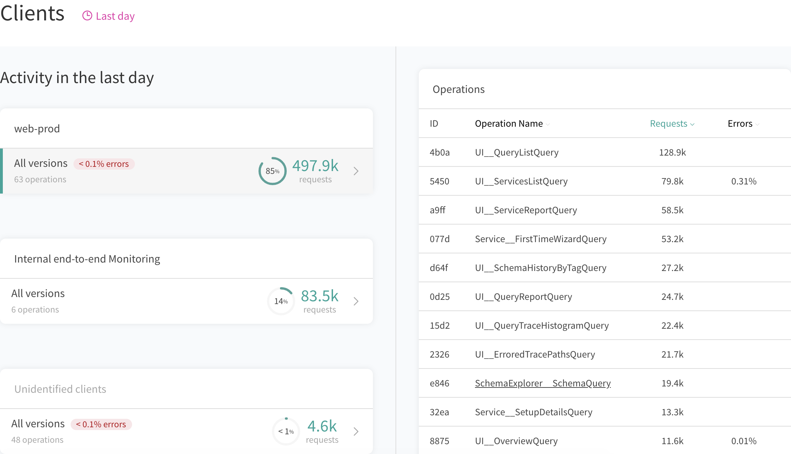

Using GraphQL, clients describe exactly the data they want through the fields they put in their requests. This gives us the ability to precisely connect which clients, and which queries from those clients, are using exactly which fields in our schema &mdash; an insight that's immensely valuable as GraphQL development scales within an organization.

Apollo provides a client identification and tracking system, which allows you to answer questions like _"which query is using this field?"_ and _"which versions of my iOS app are running this query?"_. It segments usage data by **client name and version** and allows for **field-level understanding** of how consumers are interacting with your graph in real-time.

Like any API, your graph will end up with many consumers with different frequencies, subselections, and permissions as it grows over time. Apollo allows all reported data to be tagged with client information so it can be filtered and analyzed across different sets of clients and stacks.

Here's an example of client identity reporting in Engine:



## Setup

Apollo Server 2.2.3+ will look for specific the request headers, `apollographql-client-name` and `apollographql-client-version`, by default. If present, Apollo Server will extract them and make sure the data for that request is reported to Apollo's systems with the correct client and version tag.

With Apollo Client 2.4.6+, simply passing the `name` and `version` options in your `ApolloClient` constructor will automatically add these headers to every request. Setting up client identity reporting is as simple as adding configuration to Apollo Client:

```js{8-9}
import { ApolloClient } from 'apollo-client';
import { HttpLink } from 'apollo-link-http';

const client = new ApolloClient({
  link: new HttpLink({
    uri: 'http://localhost:4000/graphql'
  }),
  name: 'insert your client name',
  version: 'insert your client version'
});
```

If you are not using Apollo Server and would like to gain client awareness,
please reach out to opensource [at] apollographql.com to work with us to add
support to your server language of choice.

## Use Cases

### Isolating Clients

Filtering queries by client enables isolation of issues that affect a portion
of all clients. In the opposite sense, if a client becomes problematic, such as
requesting expensive fields or using deprecated fields, the Apollo Platform
enables tracking down the faulty client to start solving the issue with the
owner. When changing, replacing, or deprecating a field in the API, the client
metadata enables quickly identifying the client-side changes that need to
occur to completely remove the field.


### Cutover

Similarly to deprecation, adding fields to your graph often means that clients will also change. These modifications can be done incrementally or discretely during a cutover period. The cutover period and time immediately following change the utilization of the graph drastically and can expose some unexpected behavior. Filtering by client version enables monitoring the health of a release in real-time. The following demonstrates a cutover from one backend to another.


## Advanced setup

### Client

The requester is responsible for setting HTTP headers on its requests in a way the server will understand. As noted in "setup", Apollo Client and Server will handle this automatically. For advanced cases, rather than setting the `name` and `version` on `ApolloClient`, `headers` can be set on the `HttpLink` directly.

```js{8-16}
import { ApolloClient } from "apollo-client";
import { HttpLink } from "apollo-link-http";
import { ApolloLink } from "apollo-link";

const client = new ApolloClient({
  link: new HttpLink({
    uri: 'http://localhost:4000/graphql',
    headers: {
      'client-name-for-advanced-use-cases': 'Web',
      'client-version-for-advanced-use-cases': '1'
    }
  })
});
```

### Server

The server is responsible for collecting and assigning the client information
to a request. To send client-tagged metrics to Apollo, pass a
`generateClientInfo` function into the `ApolloServer` constructor. The
following example checks the headers and provides a fallback:

```js{8-22}
const { ApolloServer } = require("apollo-server");

const server = new ApolloServer({
  typeDefs,
  resolvers,
  engine: {
    apiKey: 'YOUR API KEY HERE',
    generateClientInfo: ({ request }) => {
      // The default approach suggested in "Setup", which
      // uses headers provided by Apollo Client, should work
      // for most use cases, but advanced cases can use
      // their own logic for determining the client name
      // and version and return them from this function.
      const { clientName, clientVersion } = userSuppliedLogic(request);
      return {
        clientName,
        clientVersion
      };
    }
  }
});

server.listen().then(({ url }) => {
  console.log(`🚀  Server ready at ${url}`);
});
```
