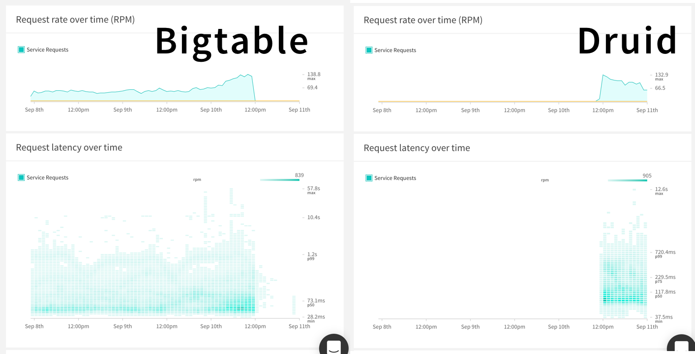

Client identity is central to the Apollo Platform, enabling you to track the
usage of you Graph across all consumers. The platform allows you to filter and
segment this usage by specific client names and versions. By filtering by
client information, you are able to connect query metrics and field usage with
the consumers of your graph. In addition to per consumer metrics, this granular
detail informs how your Graph can evolve and reacts to releases.

## Benefits

Often your graph is being used by multiple different consumers. Tracking client
information across your application provides the ability to filter metrics
based on client name and version. This gives you a breakdown of which queries
and fields are important to which clients. When a certain client begins to
experience issues, the Apollo Platform enables you to isolate and triage that
particular issue out of all the clients.

From the opposite point of view, if a certain client becomes problematic, such
as requesting expensive fields or using deprecated fields, you can start a
conversation with the owner of the client around solving the issue. When
changing or replacing a field in the api, understanding the client usage
enables quickly tracking down the client side changes that need to occur.


When clients change, there is often a cutover period, in which the utilization
of the Graph changes over time. Filtering by client means that you're able to
monitor the health of a release as it occurs.



## Setup

Client awareness is a full stack solution that threads client information from
the requester to the server, so we need to add some code to the server and client.

### Server

To provide metrics to the Apollo Platform, pass a `generateClientInfo` function
into the `ApolloServer` constructor. The following checks the GraphQL query
`extensions` for a `clientInfo` field and then provides a fallback.

```js line=8-23
const { ApolloServer } = require("apollo-server");

const server = new ApolloServer({
  typeDefs,
  resolvers,
  engine: {
    apiKey: "YOUR API KEY HERE",
    generateClientInfo: ({
      request
    }) => {
      const extensions = request.extensions;
      if (extensions && extensions.clientInfo) {
        return extensions.clientInfo;
      } else {
        return {
          clientName: "Unknown Client",
          clientVersion: "Unversioned",
        };
      }
    },
  }
});

server.listen().then(({ url }) => {
  console.log(`🚀  Server ready at ${url}`);
});
```

### Client Setup

In the client bundle, we need to add client information to the extensions
field. We do this by defining a custom `ApolloLink`:

```js 8-11
import { ApolloClient } from 'apollo-client';
import { HttpLink } from 'apollo-link-http';
import { ApolloLink } from 'apollo-link';

const client = new ApolloClient({
  link: ApolloLink.from([
    ApolloLink((operation, forward) => {
      operation.extensions.clientInfo = {
        clientName: 'Web',
        clientVersion: '1',
      };
      operation.setContext({
        http: {
          includeExtensions: true,
        },
      });
      return forward(operation);
    }),
    new HttpLink({
      uri: 'https://w5xlvm3vzz.lp.gql.zone/graphql',
      credentials: 'same-origin'
    })
  ]),
});
```
