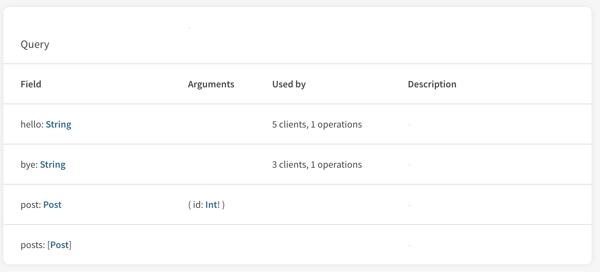

Client identity is central to the Apollo Platform and enables tracking how all
the consumers use the data graph. The Apollo Platform allows **segmenting usage
data by client name and version**. Filtering by client provides a
**field-level understanding** of how the consumers interact with the GraphQL API in
real-time. In addition to per-client metrics, understanding this granular
detail informs **how the GraphQL schema can evolve** and react to new **client
releases**.


Often a GraphQL API is used by multiple consumers with different frequencies,
subselections, and permissions. The Apollo Platform allows tagging all reported
metrics with client name and version, which enables filtering on a specific
client or set of clients across different stacks. This segmentation provides:

1. Queries and fields used by each clients
2. Client importance based on relative usage

## Setup

By default, Apollo Server >=2.2.3 looks at the request headers for `apollographql-client-name` and `apollographql-client-version`.
With Apollo Client >2.4.6, we set the `name` and `version` inside of the `ApolloClient` constructor:

```js line=8-9
import { ApolloClient } from 'apollo-client';
import { HttpLink } from 'apollo-link-http';

const client = new ApolloClient({
  link: new HttpLink({
    uri: 'http://localhost:4000/graphql',
  }),
  name: 'insert your client name',
  version: 'insert your client version',
});
```

If you are not using Apollo Server and would like to gain client awareness,
please reach out to opensource [at] apollographql.com to work with us to add
support to your server language of choice.

> NOTE: Apollo Engine Proxy [deprecated] does not provide any support for client identity.
## Use Cases

### Isolating Clients

Filtering queries by client enables isolation of issues that affect a portion
of all clients. In the opposite sense, if a client becomes problematic, such as
requesting expensive fields or using deprecated fields, the Apollo Platform
enables tracking down the faulty client to start solving the issue with the
owner. When changing, replacing, or deprecating a field in the API, the client
metadata enables quickly identifying the client-side changes that need to
occur to completely remove the field.



### Cutover

Similarly to deprecation, additions to a GraphQL API often mean that clients will change. These modifications can be done incrementally or discretely during a cutover period. The cutover period and time immediately following change the utilization of the GraphQL API drastically and can expose some unexpected behavior. Filtering by client version enables monitoring the health of a release in real-time. The following demonstrates a cutover from one backend to another.


## Advanced setup

The _Setup_ section above should cover most use cases with no additional configuration, but if more precise control is necessary (for example, when using a non-Apollo client or server), the following examples should be useful.

### Client

The client or consumer of the GraphQL API is responsible for including the
information in a way that the server understands. In this case, we add the
client name and version to the http headers:

```js line=8-16
import { ApolloClient } from "apollo-client";
import { HttpLink } from "apollo-link-http";
import { ApolloLink } from "apollo-link";

const client = new ApolloClient({
  link: new HttpLink({
    uri: "http://localhost:4000/graphql",
    // As noted in the "Setup" instructions above, Apollo
    // Server and Client handle this setup automatically.
    // For advanced cases, rather than setting the `name`
    // and `version` on `ApolloClient`, `headers`
    // can be specified on the `HttpLink` directly.
    headers: {
      "client-name-for-advanced-use-cases": "Web",
      "client-version-for-advanced-use-cases": "1"
    }
  })
});

```

### Server

The server is responsible for collecting and assigning the client information
to a request. To provide metrics to the Apollo Platform, pass a
`generateClientInfo` function into the `ApolloServer` constructor. The
following checks the headers and provides a fallback.

```js line=8-22
const { ApolloServer } = require("apollo-server");

const server = new ApolloServer({
  typeDefs,
  resolvers,
  engine: {
    apiKey: "YOUR API KEY HERE",
    generateClientInfo: ({ request }) => {
      // The default approach suggested in "Setup", which
      // uses headers provided by Apollo Client, should work
      // for most use cases, but advanced cases can use
      // their own logic for determining the client name
      // and version and return them from this function.
      const {
        clientName,
        clientVersion
      } = userSuppliedLogic(request);
      return {
        clientName,
        clientVersion
      };
    }
  }
});

server.listen().then(({ url }) => {
  console.log(`🚀  Server ready at ${url}`);
});
```

