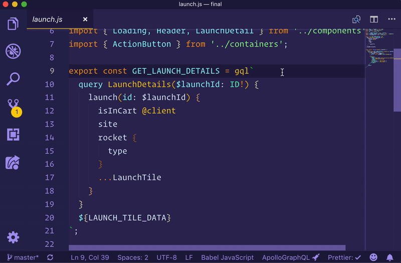
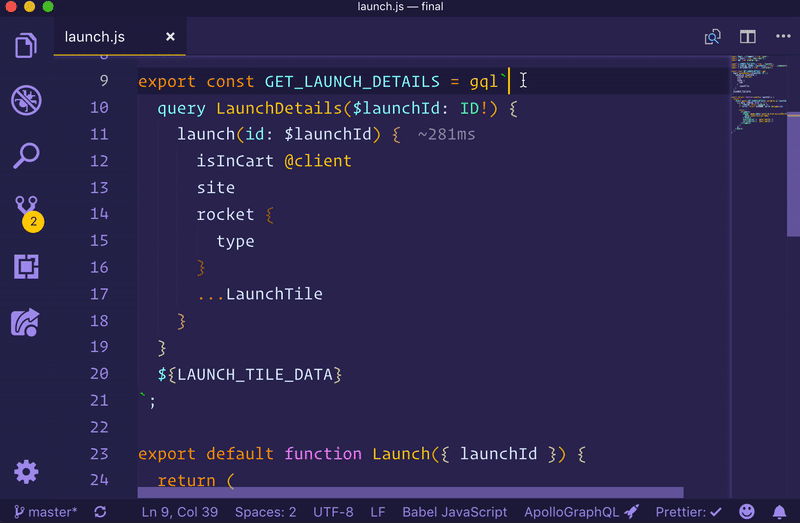
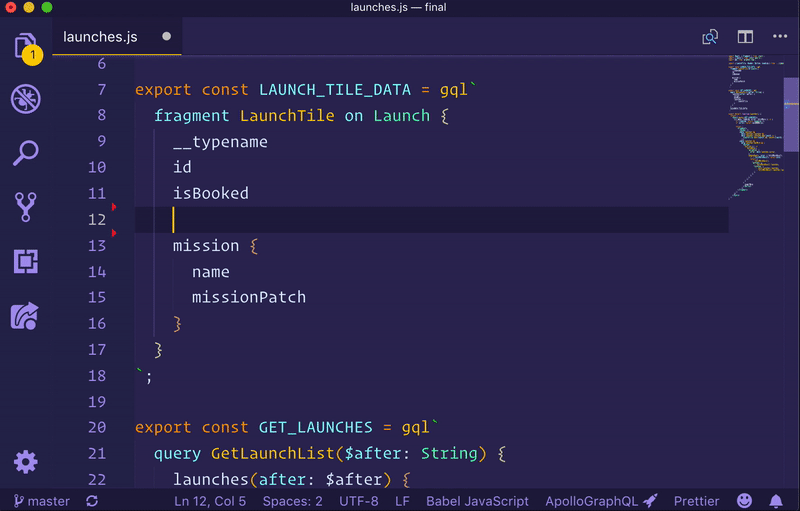
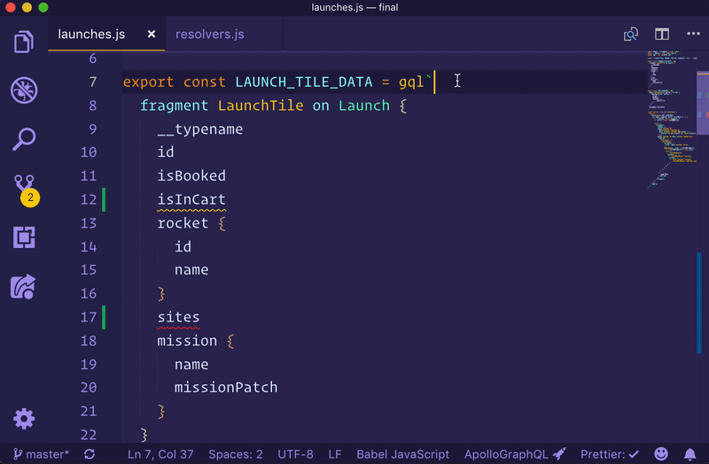
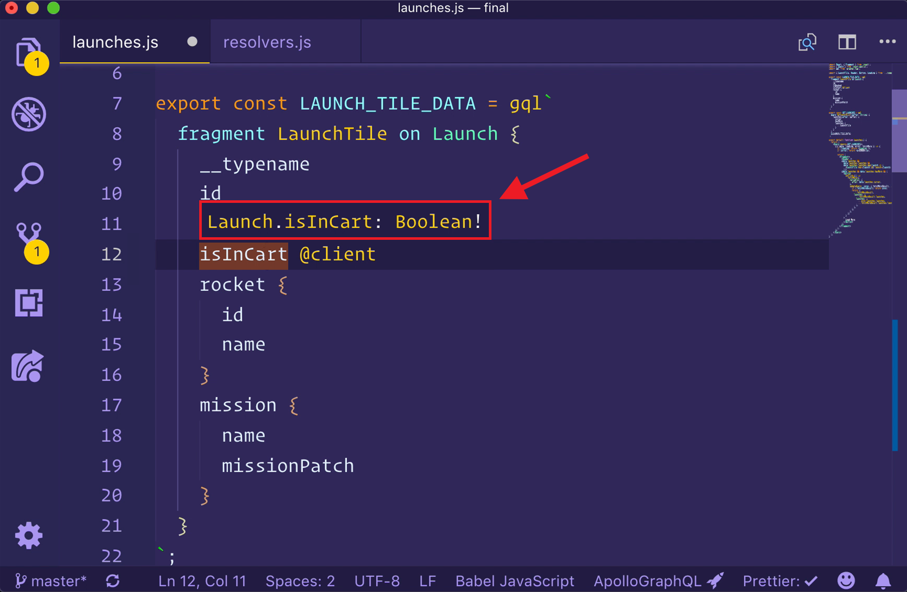
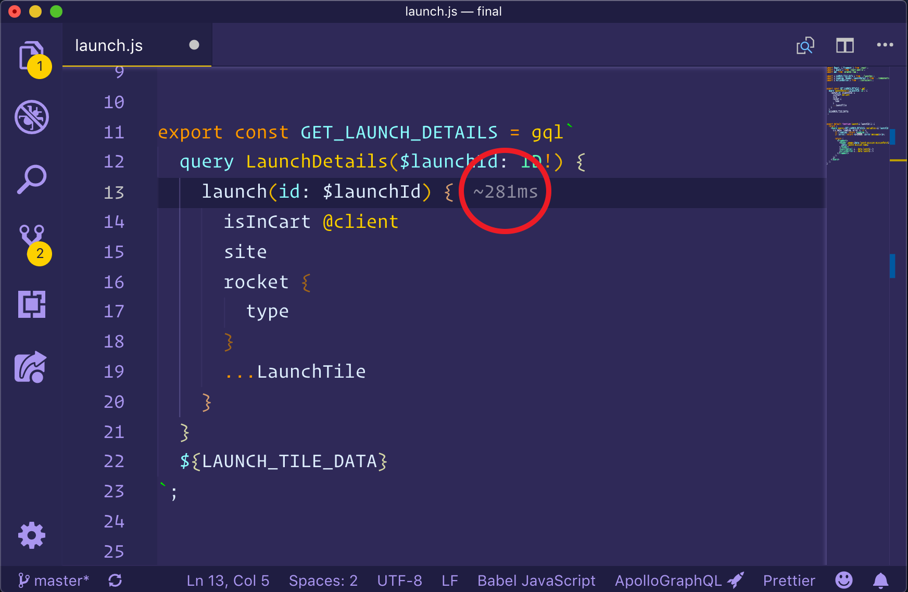

GraphQL has the potential to create incredible developer experiences, thanks to its strongly typed schema and query language. The Apollo platform brings these possibilities to life by enhancing your editor with rich metadata from your graph API. Currently only [Visual Studio Code](https://code.visualstudio.com/) (VS Code) is supported, but more are coming soon.



## Apollo VS Code

The [VS Code extension](https://marketplace.visualstudio.com/items?itemName=apollographql.vscode-apollo) for Apollo brings an all-in-one tooling experience for developing apps with Apollo.

- Add [syntax highlighting](#syntax-highlighting) for GraphQL files and gql templates inside JavaScript files
- Get instant feedback and [intelligent autocomplete](#intelligent-autocomplete) for fields, arguments, types, and variables as you write queries
- Manage client side schema alongside remote schema
- See [performance information](#performance-insights) inline with your query definitions
- Validate field and argument usage in operations
- [Navigate projects more easily](#navigating-projects) with jump-to and peek-at definitions
- Manage [client-only](#client-only-schemas) schemas
- [Switch schema tags](#schema-variant-switching) to work with schemas running on different environments

## Getting started

To get all of the benefits of the VS Code experience, it's best to link the schema that is being developed against **before** installing the extension. The best way to do that is by [publishing a schema](/platform/schema-registry/#registering-a-schema) to the Apollo schema registry. Once that is done, two steps are needed:

1. Create an `apollo.config.js` at the root of the project
2. Copy an API key from the Engine dashboard of the published service

### Setting up an Apollo config

In order for the VS Code plugin to know how to find the schema, it needs to be linked to either a published schema or a local one. To link a project to a published schema, edit the `apollo.config.js` file to look like this:

```js
module.exports = {
  client: {
    service: 'my-graphql-app'
  }
};
```

The `service` name here is the ID of the graph you've created in [Engine](https://engine.apollographql.com).

> **Note:** The ID of your graph can be found in its URL in Engine. We use the ID so you can change your graph's name freely without having to update this. This will be easier to manage in the future.

### Setting up an API key

To authenticate with Engine to pull down the schema, create a file next to the `apollo.config.js` called `.env`. This should be an untraced file (i.e. don't push it to GitHub). Go to the settings page of the published service and create a new API key.

To authenticate with Engine to pull down the schema, create a file next to the `apollo.config.js` called `.env`. This should be an untraced file (i.e. don't push it to GitHub). Go to the settings page of your graph in Engine to get the API key.

> **Note:** It is best practice to create a new API key for each member of the team and name the key so its easy to find and revoke if needed. This will be easier to manage in the future.

After the key is found, add the following line to the `.env` file:

```bash
ENGINE_API_KEY=<enter copied key here>
```

After this is done, VS Code can be reloaded and the Apollo integration will connect to Engine to provide autocomplete, validation, and more.

### Local schemas

Sometimes it may make sense to link the editor to a locally running version of a schema to try out new designs that are in active development. To do this, the `apollo.config.js` file can be linked to a local service definition:

```js
module.exports = {
  client: {
    service: {
      name: 'my-graphql-app',
      url: 'http://localhost:4000/graphql'
    }
  }
};
```

Linking to the local schema won't provide all features such as switching schema tags and performance metrics. See [the Apollo config docs][] for more details on configuration options.

### Client-only schemas

One of the best features of the VS Code extension is the automatic merging of remote schemas and local ones when using integrated state management with Apollo Client. This happens automatically whenever schema definitions are found within a client project. By default, the VS Code extension will look for all files under `./src` to find both the operations and schema definitions for building a complete schema for the application.

Client side schema definitions can be spread throughout the client app project and will be merged together to create one single schema. The default behavior can be controlled by adding specifictions to the `apollo.config.js`:

```js
module.exports = {
  client: {
    service: "my-graphql-app"
    includes: ["./src/**/*.js"],
    excludes: ["**/__tests__/**"]
  }
}
```

### Get the extension

Once you have a config set up and a schema published, [install the Apollo GraphQL extension](https://marketplace.visualstudio.com/items?itemName=apollographql.vscode-apollo), then try opening a file containing a GraphQL operation.

When a file open, clicking the status bar icon will open the output window and print stats about the project associated with that file. This is helpful when confirming the project is setup properly.



## Features

Apollo for VS Code brings many helpful features for working on a GraphQL project.

### Intelligent autocomplete

Once configured, editors have full knowledge of the schema clients are running operations against, including client-only schemas (for things like local state mutations). Because of this, editors have the ability to autocomplete fields and arguments as you type.



### Inline errors and warnings

Editors can use local or published schemas to validate operations before running them. **Syntax errors**, **invalid fields or arguments**, and even **deprecated fields** instantly appear as errors or warnings right in your editor, ensuring all developers are working with the most up-to-date production schemas.



### Inline field type information

Because of GraphQL's strongly-typed schema, editors not only know about which fields and arguments are valid, but also what types are expected. Hover over any type in a valid GraphQL operation to see what type that field returns and whether or not it can be null.



### Performance insights

GraphQL's flexibility can make it difficult to predict the cost of an operation. Without insight into how expensive an operation is, developers can accidentally write queries that place strain on their graph API's underlying backends. Thanks to the Apollo platform's integration with VS Code and our trace warehouse, teams can avoid these performance issues altogether by instantly seeing the cost of a query right in their editor.

To turn on tracing for your GraphQL server, please visit our [guide](/references/setup-analytics/).

The VS Code extension will show inline performance diagnostics when connected to a service with reported metrics in Engine. As operations are typed, any fields that take longer than 1ms to respond will be annoated to the right of the field inline! This gives team members a picture of how long the operation will take as more and more fields are added to operations or fragments.



### Syntax highlighting

Apollo's editor extension provides syntax highlighting for all things GraphQL, including schema definitions in `.graphql` files, complex queries in TypeScript, and even client-only schema extensions. Syntax highlighting for GraphQL works out-of-the-box for `.graphql`, `.gql`, `.js` and `.ts` file types.

### Navigating projects

Navigating large codebases can be difficult, but the Apollo GraphQL extension makes this easier. Right-clicking on any field in operations or schemas gives you the ability to jump to (or peek at) definitions, as well as find any other references to that field in your project.


### Schema variant switching

Apollo supports publishing multiple versions ([variants](/platform/schema-registry/#registering-schemas-to-a-variant)) of a schema. This is useful for developing on a future development schema and preparing your clients to conform to that schema. To switch between schema variants, open the Command Palette (`cmd + shift + p` on mac), search "Apollo" and choose the "Apollo: Select Schema Tag" option.

## Troubleshooting

The most common errors are configuration errors, like a missing `.env` file or incorrect service information in the `apollo.config.js` file. Please see [the Apollo config docs][] for more configuration guidance.

[the Apollo config docs]: /references/apollo-config/

Other errors may be caused from an old version of a published schema. To reload a schema, open the Command Palette (`cmd + shift + p` on mac), search "Apollo" and choose the "Apollo: Reload Schema" option.

Sometimes errors will show up as a notification at the bottom of your editor. Other, less critical, messages may be shown in the output pane of the editor. To open the output pane and get diagnostic information about the extension and the current service loaded (if working with a client project), just click the "Apollo GraphQL" icon in the status bar at the bottom.


If problems persist or the error messages are unhelpful, an [issue](https://github.com/apollographql/apollo-tooling/issues) can be opened on the `apollo-tooling` repository.
