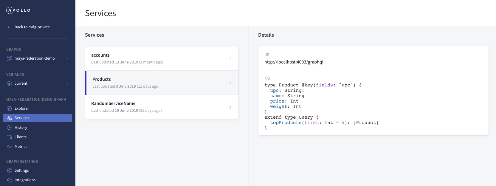

[//]: # (Description: Introductory content, discussing the overall model of the federation platform, why you would want to register partial schemas, and framing the concept of thinking about running federation as a coordination and collaboration problem to motivate the tools we've built)
[//]: # (Assignee: Chang)
[//]: # (Reviewer: Caydie, James)

The key difference between running GraphQL with a monolithic server instead of running multiple services orchestrated by a [gateway](https://www.apollographql.com/docs/apollo-server/federation/implementing/#running-a-gateway) is that your GraphQL schema is dynamically defined by composing an overall schema from the [partial schemas](<LINK_TO_GLOSSARY>) of GraphQL services that comply with the [federation spec](https://www.apollographql.com/docs/apollo-server/federation/federation-spec/). This empowers teams to own a portion of the graph, and move faster by allowing changes to be independently developed and deployed.  

The Apollo GraphQL platform provides tools to help ensure that this increase in autonomy doesn't come at a cost to stability. Since the GraphQL schema is the central hub of the data in your graph, it's important to [validate](<LINK_TO_SCHEMA_VALIDATION>) that any changes to a particular service's partial schema won't cause breakages in other parts of your graph, or affect existing [operations made by clients](LINK_TO_METRICS), so you can scale your data graph with confidence.

## Inspecting your Graph
> Using the `apollo service:list` command or the UI to understand your graph

To understand the implementing services that make up your graph, you can use both the Apollo command line interface as well as the Apollo Platform.

Use `apollo service:list` in the command line to see a snapshot of the services that make up your graph, including their endpoints and when they were last updated.

Here's what running `apollo service:list` will look like:

```
~$ apollo service:list
  ✔ Loading Apollo Project
  ✔ Fetching list of services for graph service-list-federation-demo

name       URL                            last updated
─────────  ─────────────────────────────  ────────────────────────
Accounts   http://localhost:4001/graphql  3 July 2019 (2 days ago)
Inventory  http://localhost:4004/graphql  3 July 2019 (2 days ago)
Products   http://localhost:4003/graphql  3 July 2019 (2 days ago)
Reviews    http://localhost:4002/graphql  3 July 2019 (2 days ago)

View full details at: https://engine.apollographql.com/graph/service-list-federation-demo/service-list
```

Navigate to the Services tab in the Apollo Platform to see an interactive list of information about the implementing services in your graph.

<div style="text-align:center">
    
</div>

[//]: # (Description: How to see the current services in your graph. This section might be expanded later to discuss showing history, composition results, etc. This section should include some screenshots)
[//]: # (Assignee: Maya)
[//]: # (Reviewer: Justin)

## Registering your graph
> Using the `apollo service:push` and `apollo service:check` command to track changes to your graph

[//]: # (Description: An overview of how and when to use `apollo service:push` and `apollo service:check` in your CI/CD workflow, linking out to the specifics of usage in the specific docs (#502 and #503). Ideally this section includes some screenshots of the workflows in practice.)
[//]: # (Assignee: James)
[//]: # (Reviewer: Adam Z)

## Running with managed federation
> Taking control of how service changes bubble up to the Apollo Gateway

[//]: # (Description: An overview of the concept of managed federation, linking out to the details on gateway defaults w/ an API key and the specfics on setting up the lifecycle options. Ideally this section has a diagram of managed federation lifecycle.)
[//]: # (Assignee: Adam Z)
[//]: # (Reviewer: Trevor)