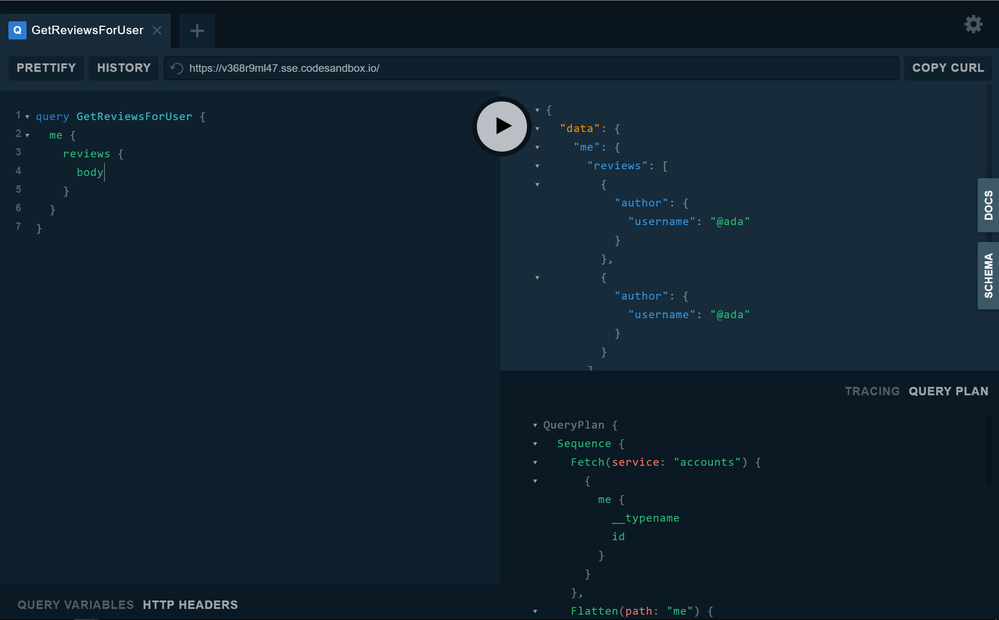

[//]: # (Description: Introductory content, discussing the overall model of the federation platform, why you would want to register partial schemas, and framing the concept of thinking about running federation as a coordination and collaboration problem to motivate the tools we've built)
[//]: # (Assignee: Chang)
[//]: # (Reviewer: Caydie, James)

Organizations expose their data as a single graph in order to have a complete view of all of their organizational data along with well-defined and reusable patterns for data access, observability, security, caching, and other API-level considerations. However, even though exposing all of this data in a unified way has [huge benefits](/intro/benefits/), it comes with additional coordination across multiple teams, all of whom own a portion of the data graph. As an organization, ideally individual teams are able to work independently on implementing services without needing to coordinate changes with other teams. By the same token, you want to ensure that changes from each team are safe for the entirety of the graph and don't violate any assumptions or cause conflicts with other service teams. This illustrates the need for a Graph Manager: a tool that will organize and track the state of your graph to enable collaboration across teams.

## The Apollo Graph Manager

The goal of the Apollo Graph Manager is to provide a suite of tools to help teams coordinate over their data graph, using schemas as the media for that communication. With federation, the Graph Manager provides control and observability over the distributed architecture that supports the graph, including support for [federated traces](https://www.apollographql.com/docs/apollo-server/federation/tracing), [validation](/platform/schema-validation/) of gateway changes, and support for [managed deployments](https://www.FIXME.com).

### At a glance

The Graph Manager maintains both the [current state](https://www.apollographql.com/docs/platform/schema-registry/#using-the-schema-registry) of your graph as well as the [history](https://www.apollographql.com/docs/platform/schema-registry/#viewing-schema-change-history) of changes to that graph. When running GraphQL as a monolithic service with a static schema, the state of a data graph is well-represented by two components: operations and the schema. The schema represents what data is available in the graph, and operations, whether [registered](https://www.apollographql.com/docs/platform/operation-registry/#3-register-operations-from-your-client-bundle) or [collected dynamically](https://www.apollographql.com/docs/apollo-server/features/metrics/), represent the usage of that data graph.


The concept of a Federated Graph adds a single but important piece into the model for running and coordinating over a Graph: **One graph is composed of multiple implementing services**. This means that the state of the graph includes the set of services that implement it as well as _their_ states.

The core concept of the Graph Manager in supporting federation is that each implementing service's partial schema should be tracked the same way as a monolithic data graph would be. Additionally, the state of the graph should be a reflection of the state of all of its implementing services.

## Registering implementing services

If you're running a distributed GraphQL infrastructure, where implementing services [compose](https://www.apollographql.com/docs/apollo-server/federation/federation-spec/#fetch-service-capabilities) to form a complete schema, there's functionality to register each service's partial schema and still get all of the benefits of the schema registry. Running `apollo service:push` on any implementing service also registers the overall schema of the graph and updates the graph's [managed configuration](#managed-federation).

To push a single implementing service to Apollo, run `apollo service:push` with the `--serviceName`, `--endpoint`, and `--serviceURL` tags. The CLI will know where to fetch your local partial schema based on the `--endpoint` flag, and the `--serviceURL` flag indicates where the implementing service can be reached by the gateway.

Make sure you have a `.env` file locally with your ENGINE_API_KEY defined! To get an API key, click [here](https://engine.apollographql.com). To create a new `.env` file, copy your API key into the following command from your terminal:
```
echo "ENGINE_API_KEY={{service:foo:asd9fjasdor8her}}">>.env
```

As an example, running service push on a “launches” implementing service might look like:

```
~$ apollo service:push --serviceName="launches" \
                      --serviceURL="http://accounts-graphql.svc.cluster.local:4001/" \
                      --endpoint="http://localhost:4001/"
  ✔ Loading Apollo Project
  ✔ Uploading service to Engine

The 'registry' service for the 'space-explorer@current' graph was updated

The gateway for the 'space-explorer@current' graph was updated with a new schema, composed from the updated 'launches' service

id      graph             variant
──────  ────────────────  ───────
az329e  space-explorer    current
```

Pushing an implementing service to Apollo will update the [Services tab](#inspecting-your-graph).

> NOTE: For production support, using `apollo service:push` should be an automated process that integrates with your continuous delivery pipeline. For more information, see integrating with CI/CD in the [managed federation section](#managed-federation).

### Handling composition failure

In general, an `apollo service:push` should only be run after an `apollo service:check` has passed, but even so, due to changes in _other_ services, it's possible that the `apollo service:push` command will encounter composition errors. When this happens, the implementing service will still be updated as long as its partial schema is spec-compliant, but **the graph will not be updated**. This means that a new schema will not be associated nor will the gateway's [managed configuration](#managed-federation) be updated.

An example output of this behavior looks like this:

```
~$ apollo service:push --serviceName="launches" \
                      --serviceURL="http://accounts-graphql.svc.cluster.local:4001/" \
                      --endpoint="http://localhost:4001/"
  ✔ Loading Apollo Project
  ✔ Loading Apollo Project
  ✔ Uploading service to Engine


The 'launches' service for the 'space-explorer@current' graph was updated

*THE SERVICE UPDATE RESULTED IN COMPOSITION ERRORS.*

Composition errors must be resolved before the graph's schema or corresponding gateway can be updated.
For more information, see https://www.apollographql.com/docs/apollo-server/federation/errors/


Error   [launches] Mutation.createLaunch -> requires the field `launch` to be marked as @external.

The gateway for the 'space-explorer@current' graph was NOT updated with a new schema
```

The reasoning behind this functionality is that the service registry should always be the source of truth for what is running in your infrastructure. Even if that means that composition is failing in your infrastructure, the service registry should reflect that. However, you still want your gateway to function as it has been before the service deployment. Additionally, this functionality can be used to make dependent changes, like smoothly migrating a field from one service to another or introducing a circular service dependency.

### How the service registry integrates with managed federation

Managed federation is the concept of allowing the gateway to update dynamically in response to service changes. In principle, it's important to separate the reliability of your graph from the reliability of your services. For that reason, we recommend running federation in production using a managed configuration, where the gateway picks up config changes not from introspection, but from a set of files owned by your graph describing its current state.

On `service:push`, the service registry writes configuration files to a cloud file system, stored securely and accessible by your API key. These configuration files detail which implementing services are part of the graph, metadata about the implementing services, including the `serviceURL` specified in the `push` command, and the partial schema of that implementing service. By default, when the Apollo gateway is instantiated with an API key rather than a `serviceList`, it will poll for that managed config to pick up changes and smoothly roll over to the new service configuration, draining in-flight requests while beginning to generate query plans for incoming requests against the new config.

Because configuration changes can affect the query planner, it's highly recommended to **only call `service:push` after all replicas of an implementing service have deployed**. For more information and details on managed federation, see [below](#managed-federation)!

### Using variants

The service registry supports registering services to graph variants by using the `--tag` flag. This will not only register your services to the graph variant, but will also register the resulting schema and managed configuration to the same variant. See the section on [managing environments](https://www.apollographql.com/docs/platform/schema-registry/#managing-environments) to learn more about use cases for variants. Also make sure to [tag metrics](https://www.apollographql.com/docs/platform/schema-registry/#associating-metrics-with-a-variant) with the same variant for usage validation in `service:check`.

### Removing a service from the registry

Removing an implementing service from the graph works similarly to registering a service. Instead of `service:push` call `service:delete`, and you can also specify the graph variant.
```
$ apollo service:delete --serviceName=launches --tag=staging
  ✔ Loading Apollo Project
  ✔ Removing service from Engine
```

## Inspecting your Graph
> Using the `apollo service:list` command or the UI to understand your graph

To understand the implementing services that make up your graph, you can use both the Apollo command line interface as well as the Apollo Platform.

Use `apollo service:list` in the command line to see a snapshot of the services that make up your graph, including their endpoints and when they were last updated.

Here's what running `apollo service:list` will look like:

```
~$ apollo service:list
  ✔ Loading Apollo Project
  ✔ Fetching list of services for graph service-list-federation-demo

name       URL                            last updated
─────────  ─────────────────────────────  ────────────────────────
Accounts   http://localhost:4001/graphql  3 July 2019 (2 days ago)
Inventory  http://localhost:4004/graphql  3 July 2019 (2 days ago)
Products   http://localhost:4003/graphql  3 July 2019 (2 days ago)
Reviews    http://localhost:4002/graphql  3 July 2019 (2 days ago)

View full details at: https://engine.apollographql.com/graph/service-list-federation-demo/service-list
```

Navigate to the Services tab in the Apollo Platform to see an interactive list of information about the implementing services in your graph.

<div style="text-align:center">
    
    </img>
</div>

## Validating changes to your graph
> Using the `apollo service:check` command to validate changes to your graph

Federation allows teams to work independently on implementing services without needing to coordinate over an unwieldy, all-encompassing schema. However, this increase in autonomy requires control to ensure that teams that operate on different services are respecting [defined dependencies](https://www.apollographql.com/docs/apollo-server/federation/federation-spec/) and not breaking the ability for the graph to compose. The Apollo GraphQL platform provides tools to help ensure that this increase in autonomy doesn't come at a cost to stability.

In particular, along with [validating overall schema changes against known operations](https://www.apollographql.com/docs/platform/schema-validation/), running `apollo service:check` for an implementing service will ensure that the overall graph still composes to a valid schema, and will output any violated dependencies if present.

### What happens

When running `service:check` on a federated service, Engine will run composition on the proposed partial schema with the current list of implementing services and their partial schemas, making sure that the composition is successful. That composed schema will then be diff'ed against the most recently registered schema and validate that those changes are safe. If composition fails, then validation ends and the results will be returned to the user. Note that running `service:check` will never update the graph.

### How to do it

With a federated graph, use the `apollo service:check` command to validate individual service changes by adding the `--serviceName` flag.

### Successful checks

```
$ npx apollo@2.15.1-alpha.1 service:check --serviceName=launches --endpoint=http://localhost:4001/api/graphql
  ✔ Loading Apollo Project
  ✔ Found 0 graph composition errors for service launches on graph space-explorer
  ✔ Validated composed schema against tag current on graph space-explorer
  ✔ Compared 2 schema changes against 56 operations over the last 548 days
  ✔ Found 0 breaking changes and 2 compatible changes

PASS    FIELD_ADDED  `Mutation.scheduleLaunch` was added

View full details at: https://engine.apollographql.com/service/space-explorer/check/5f209250-000e-45f4-9d5c-ff022225f542
```

### Failed checks
There are two types of failures that can occur during validation: failed usage checks and failed composition. Failed usage checks are failures due to breaking changes like removing a used field. Failed composition on the other hand are failures due to being unable to compose the graph. For example, a failed composition might be the result of missing a directive.

#### Failed composition
```
$ apollo service:check --serviceName=launches --endpoint=http://localhost:4001/api/graphql
  ✔ Loading Apollo Project
  ✖ Found 1 graph composition errors for service launches on graph space-explorer
    → Federated service composition was unsuccessful. Please see the reasons below.
    Validating composed schema against tag current on graph space-explorer
    Comparing schema changes
    Reporting result

Service   Field                                                                   Message
────────  ──────────────────────────────────────────────────────────────────────  ───────────────────────────────────────────────────────
launches  Mutation.scheduleLaunch                                                       requires the field `service` to be marked as @external.
```

#### Failed usage checks
```
$ apollo service:check --serviceName=launches --endpoint=http://localhost:4001/api/graphql
  ✔ Loading Apollo Project
  ✔ Found 0 graph composition errors for service registry on graph space-explorer
  ✔ Validated composed schema against tag current on graph space-explorer
  ✔ Compared 1 schema change against 55 operations over the last 548 days
  ✖ Found 1 breaking change and 0 compatible changes
    → breaking changes found

FAIL    FIELD_REMOVED  `Mutation.scheduleLaunch` was removed

View full details at: https://engine.apollographql.com/service/space-explorer/check/941c4fa2-c716-4df4-9fc5-130b88c8ebca
```

## Managed federation
> Taking control of how service changes bubble up to the Apollo Gateway

While running in development, it's sufficient to run the gateway with a static service list and use introspection to support the gateway's configuration. When running a gateway in production, however, it's important that the uptime of your gateway is not impacted by the uptime of the implementing services beneath it. If a gateway fails to introspect a service or if a service fails to compose with the graph, it's paramount that your gateway be resilient to that change and continue to serve traffic with its previous configuration.

For this use case, an Apollo gateway can be created to pick up its configuration from a set of managed files, securely stored during [service registration](#registering-implementing-services). To use the managed configuration provisioned by the Graph Manager, construct your Apollo gateway like so:

```
TODO: ACTUALLY DOCUMENT THE CORRECT INSTANTIATION
const { ApolloServer } = require('apollo-server');

const gatewayServer = new ApolloServer({
  gateway: true,
  engine: {
    schemaTag: "prod",
    apiKey: "service:foo:46234jrlvjkns9d",
  },
});

(async () => {
  gatewayServer.listen().then(({ url }) => {
    console.log(`🚀 Server ready at ${url}`);
  });
})();
```

### The model

### Controlling rollout

TODO: wtf are we doing with this section

To begin, ensure all component services are up and running, and the working directory has a `.env` file containing the appropriate `ENGINE_API_KEY` for your federated service. Then, upload each service to the gateway through `Apollo CLI`:

```bash
apollo service:push       \
  --serviceURL={{url}}    \
  --endpoint={{url}}      \
  --serviceName={{name}}  \
  --federated
```

> Each service needs a unique name, this is how you will identify the service for schema updates

The given `endpoint` will be queried for the new schema which, if compatible with the rest of the schema, will be uploaded to `Apollo Graph Manager`. At this point, any gateways serving this graph will begin to roll over to the new schema.

You can later modify hosted service definitions by rerunning the `apollo service:push` command with the service's name and the new URL.

> What's the difference between `serviceURL` and `endpoint` parameters? The `endpoint` parameter controls the endpoint where the schema will be fetched from at composition, whereas `serviceURL` controls what URL the gateway will query at runtime. This is especially helpful if you have disabled introspection queries in your production services.

// TODO: Document the integration with service:push, services under a graph, and gateway lifecycle management utilities

### Integrating with CI / CD

### Reliability

[//]: # (Description: This section should document how the gateway polls GCS for updates, why it's a reliable model, what the defaults are, and any recommendations)
[//]: # (Assignee: Jackson)
[//]: # (Reviewer: Adam)

When operating as a managed gateway, `Apollo Server` will poll the [Schema Registry][] for updates to the registered service list at 10 second intervals. When a service list update does occur, `Apollo Server` will create a new composed schema from the federated services, and begin to roll over to serving the new schema. Existing in-flight operations on the old schema will continue to be processed while serving the new schema. For this reason, it can be helpful to serve the new schemas from new endpoints, such that no downtime is incurred during rollover.

[Schema Registry]: /platform/schema-registry/

In the event a network failure prevents an `Apollo Server` gateway from contacting the Schema Registry, the gateway will continue to serve the last known schema while it attempts to reestablish a connection to the registry.

<!--
  Jackson: There is no way of falling back to local files/introspection currently, but I also don't think there should be, consider:
  The usage model of managed gateways is:
  1. Launch services
  2. Post their schema's to registry
  3. Update services with new schemas and URLs
  4. GOTO 2
  If a network failure occurs after several updates and the gateway falls back to a locally stored list, that list will almost certainly be outdated. On the other hand, if it falls back to the last known good configuration, it has a much higher chance of still being active.
-->

### Using variants to control rollout

With [managed federation](https://www.FIXME.com), you have the ability to control which version of your graph a fleet of Gateways are running with. For the majority of deployments, rolling over all of your Gateways to a new schema version is a good strategy, since changes should be checked to be backwards compatible using [Schema Validation](/platform/schema-validation/). However, changes at the gateway level may involve a variety of different updates, like changing how query plans are generated or transferring type ownership from one service to another. In the case that your infrastructure requires more advanced deployment strategies, we recommend using [graph variants](/platform/schema-registry/#registering-schemas-to-a-variant) to manage different fleets of Gateways running with different configurations.

For instance, in order to have a canary deployment, you might maintain two production graphs in the [Schema Registry][], one called `prod` and one called `prod-canary`. Your deployment of a change to some implementing service named "foo" might look something like this:

1. Check changes in "foo" against `prod` and `prod-canary`:
   ```
   apollo service:check --tag=prod --serviceName=foo && apollo service:check --tag=prod-canary --serviceName=foo
   ```
1. Deploy changes to "foo" into your production environment (_Note: This will not roll out changes to the gateway yet_)
1. Roll over the `prod-canary` graph, containing one gateway container, using
   ```
   apollo service:push --tag=prod-canary --serviceName=foo
   ```
   (_Note: If composition fails due to intermediate changes to the canary graph, new configuration will not be rolled out_)
1. Wait for health checks to pass against the canary, watch dashboards, etc.
1. After the canary is stable, roll out the changes to the rest of production using
  ```
  apollo service:push --tag=prod --serviceName=foo
  ```

Because you can [tag metrics with variants](/platform/schema-registry/#associating-metrics-with-a-variant) as well, you can use [Apollo Graph Manager](https://engine.apollographql.com) to verify a canary's performance before rolling out changes to the rest of the graph. You can also use a similar strategy with variants to support a variety of other advanced deployment workflows, like blue/green deployments.

# Running Federation in Production
> With a focus on reliability and robustness

There is a wealth of information around reliability in a distributed service-oriented architecture, and those best practices still certainly apply here. For instance, you should ensure that the resource needs of your services are well-understood, that services and the gateway only roll over to a new version after passing health checks, and you should strive to make all services stateful when possible. This document is meant for teams with the need for a federated GraphQL layer, to provide details of nuance in how federation works, how the gateway responds to changes, and best practices in operating federation in production. If you're running with federation in production, we'd love to [hear from you](mailto:federation@apollographql.com) and accept any [contribution](https://github.com/apollographql/apollo-server/blob/master/docs/source/federation/production.md) to this documentation.

## Best Practices

<!--
[//]: # (Description: This section should basically introduce that talking with people running gateways in production (and running it ourselves), we've collected some best practices to share)
[//]: # (Assignee: Adam)
[//]: # (Reviewer: Pierre, James)
-->

In operating federation in production ourselves and working with a variety of teams deploying federation in their environments, we have collected some best practices to maintain reliability and control over a federated GraphQL layer at scale. If you're running federation in your infrastructure, we'd love to [hear from you](mailto:federation@apollographql.com) to help share any best practices you and your team may have learned from operating federation at scale.

### Treat the gateway as infrastructure

The [Apollo Gateway](https://www.apollographql.com/docs/apollo-server/federation/implementing/#running-a-gateway) understands how to "speak" federation and orchestrate an incoming operation from a client into a set of operations to the underlying services that implement the graph. Because the gateway understands how to "speak" federation, it should contain **no business logic** and we recommend treating it as you would any infrastructure, such as a load balancer or a service discovery agent. There should be no need to re-deploy the gateway as services roll out underneath it. The gateway is designed to be able to smoothly roll over to updates in any services underneath it, and we recommend using the [managed federation](https://www.apollographql.com/docs/apollo-server/federation/production/#managed-federation) to control how changes in underlying services bubble up to the gateway. That said, like any infrastructure, you'll want to investigate the different [configuration options](https://www.apollographql.com/docs/apollo-server/api/apollo-gateway/) and choose the ones that make sense for your use case. Additionally, make sure to expose your gateway to sufficient load to understand its resource consumption and provision accordingly.

### Put graph-level functionality in the gateway

Because the gateway is the component of your GraphQL layer that sees and services every client operation, there are a number of things that make sense to happen at the gateway level. This includes functionality like [reporting metrics](https://www.apollographql.com/docs/apollo-server/features/metrics/), [whole response caching](https://www.apollographql.com/docs/apollo-server/features/caching/#saving-full-responses-to-a-cache), [operation safe-listing](/platform/operation-registry/), and [automatic persisted queries](https://www.apollographql.com/docs/apollo-server/features/apq/). Because all of this functionality happens at the operation-level, we recommend ensuring that the gateway is configured to support this functionality rather than exposing it piecemeal in each implementing service. Since the Apollo gateway is built atop Apollo Server, setting these features up should require nothing more than following the associated guides.

### Keep implementing services internal

The GraphQL services that implement your graph provide the functionality that the gateway needs in order to traffic requests. However, because a key principle of the data graph is to strive for [one graph](https://principledgraphql.com/integrity#1-one-graph), there is no need to allow clients to query the underlying services directly without going through the gateway. Additionally, by exposing implementing services to public traffic, it extends your security and reliablity surface area and makes your system more challenging to secure. While we recommend that the gateway keep its operation surface area locked down by relying on the [operation registry](/platform/operation-registry/), it's generally unwieldy to register operations to services, especially when the gateway may need to make dynamic operations to services using the [`_entities`](/platform/operation-registry/) field. Further, because of the power and flexibility of the `_entities` field, it may present a serious risk to expose it publicly. If, for some reason, you want to allow outside traffic to send operations to implementing services, we highly recommend keeping the `_entities` field restricted.

## Observability

Like any distributed architecture, you should make sure that your federated GraphQL layer has proper observability, monitoring, and automation to ensure reliability and performance of both your gateway and the federated services underneath it. Serving your GraphQL API from a distributed architecture has many benefits, like productivity, isolation, and being able to match the right services with the right runtimes. Operating a distributed system also has more complexity and points of failure than operating a monolith, and with that complexity comes a need to heighten observability into the state of your system and control over its coordination.

### Enabling Federated Metrics

[//]: # (Description: A brief, no-frills this is how you do it. Link back to the federated metrics doc)
[//]: # (Assignee: Adam)
[//]: # (Reviewer: Jesse)

TODO: Instructions on how federated metrics should be instrumented, without explaining the whole model

### Inspecting Query Plans

<!--
add links to advanced-features for
- [`@requires`](/federation/advanced-features/#computed-fields)`
-`[`@provides`](/federation/advanced-features/#using-denormalized-data)`
 -->

When the gateway receives a new query, it generates a query plan that defines the sequence of requests the gateway will send to the necessary downstream services. Inspecting a query plan can be a helpful tool in understanding the gateway and exploring how directives like `@requires` and `@provides` can help optimize query plans. To make it easy to access query plans, the `@apollo/gateway` package includes a build of GraphQL Playground that adds a query plan inspector.



