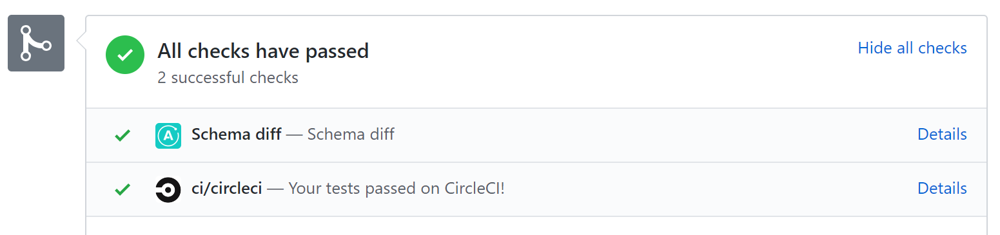
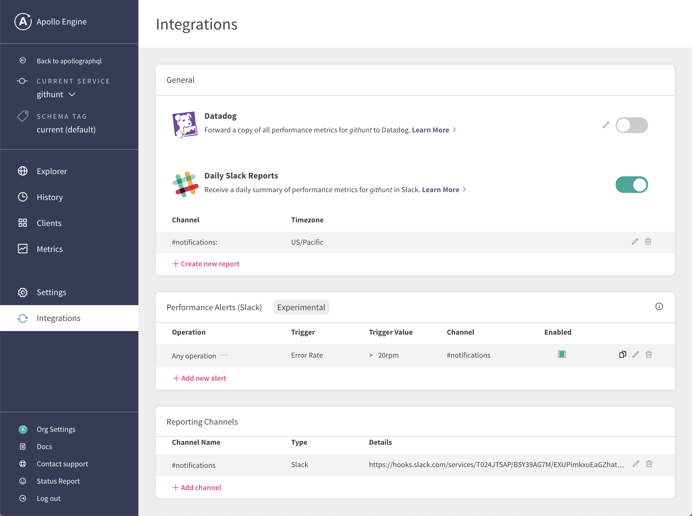
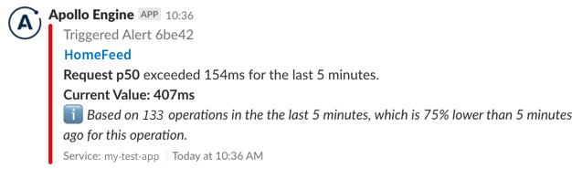
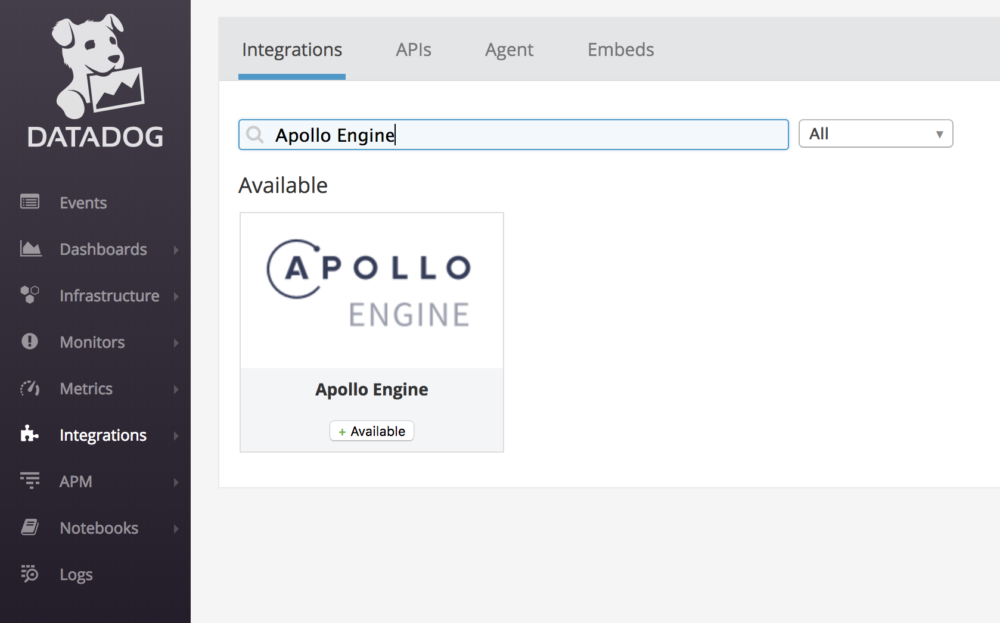
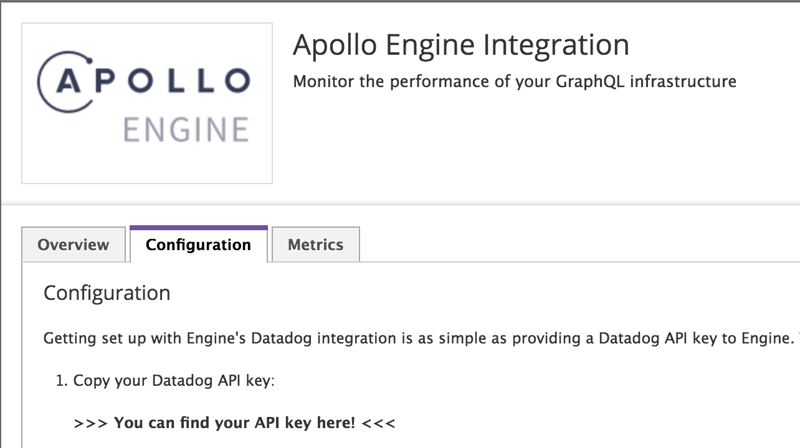
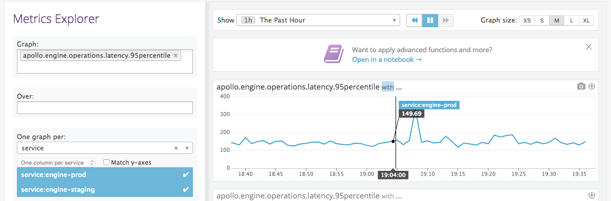

One of our fundamental beliefs is that our Apollo workflows should hook into and enhance the workflows you're already using. As such, we've built a number of integrations into third-party services that are common in the developer world:

1. [**GitHub**](#github) &mdash; Ensure the safe evolution of your graph by adding schema change validation directly to your continuous integration and GitHub checks.
1. [**Slack**](#slack) &mdash; Get a daily summary of key information from your server, including the overall request rate, error rate, and performance latency. Set up notifications for noteworthy events in your service, like increases in errors or particularly slow response times for important queries.
1. [**Datadog**](#datadog) &mdash; Forward the key metrics and performance data available from Engine to Datadog as well.

## GitHub

Building tools to help you safely collaborate on the evolution of your graph is one of our biggest focuses at Apollo. To make [schema change validation](/platform/schema-validation/) as easy to set up as possible, we've built an Apollo app for GitHub that provides status checks on pull requests when schema changes are proposed.



### Install the GitHub application

Go to [https://github.com/apps/apollo-engine](https://github.com/apps/apollo-engine) and click the `Configure` button to install the Apollo Engine integration on the GitHub profile or organization that you want to set up checks for.

### Run validation on each commit

Next, make sure your CI has a step to run the schema validation command. This is accomplished by adding the `apollo schema:check` command directly as a step in your CI. For CircleCI it could look something like this:

```yaml{13,29,33-36}
version: 2

jobs:
  build:
    docker:
      - image: circleci/node:8

    steps:
      - checkout

      - run: npm install
      # CircleCI needs global installs to be sudo
      - run: sudo npm install --global apollo

      # Start the GraphQL server.  If a different command is used to
      # start the server, use it in place of `npm start` here.
      - run:
          name: Starting server
          command: npm start
          background: true

      # make sure the server has enough time to start up before running
      # commands against it
      - run: sleep 5

      # This will authenticate using the `ENGINE_API_KEY` environment
      # variable. If the GraphQL server is available elsewhere than
      # http://localhost:4000/graphql, set it with `--endpoint=<URL>`.
      - run: apollo service:check

      # When running on the 'master' branch, publish the latest version
      # of the schema to Apollo Engine.
      - run: |
          if [ "${CIRCLE_BRANCH}" == "master" ]; then
            apollo service:push
          fi
```

> **Note:** Your `apollo service:check` command needs a source to from which to fetch your schema. This is most commonly provided as a URL to a running server (with introspection enabled), but can also be provided as a path to a file with your schema in it. See [Using the Schema Registry](/platform/schema-registry/#using-the-schema-registry) setup for other options.

The `apollo schema:check` command checks for differences in your schema between what's on your current branch and the last version you uploaded to Engine. If you've removed or changed any types or fields, it will validate that those changes won't break any of the queries that your clients have made recently. If your changes do break any queries, the check will fail.

Because you installed the Engine app on GitHub, the check you've added will show up as a line in your GitHub checks list. If there are changes in your schema you'll be able to review them by clicking the "Details" link. By enabling schema validation in your continuous integration workflow (eg. CircleCI, etc.), you're alerting developers of any potential problems directly in their pull requests, thereby giving them critical feedback where it's most useful.

## Slack

Our Apollo Slack integration brings your server's performance metrics and analytics data from Apollo Engine directly to your team's Slack workspace so you can be notified of potential issues proactively. The integration does two main things:

1. Send a [**daily snapshot**](#daily-reports) of the request rate, error rate, and performance latency of your graph.
1. Send [**notifications**](#notifications) that are triggered on thresholds like error percentage and performance latency.

### Configure the integration

The Apollo Slack integration is set up and configured through the Engine UI. If you do not yet have account, [**follow this guide**](https://www.apollographql.com/docs/apollo-server/features/metrics/#Apollo-Engine) to get started connecting your server to Engine.

If you already have an Engine account, [**log in**](https://engine.apollographql.com) and ––

1. Select the service you want to turn on Slack notifications for.
1. Visit the "Integrations" tab in the left nav.
1. You'll notice a "Reporting Channels" section at the bottom of this page. Click the "Add channel" button and follow the steps in the Engine UI to get a webhook from Slack.

Once you've configured your Slack channel you'll be able to turn on daily reports snapshotting and configure notifications in the "General" and "Performance Alerts" sections.



### Daily reports

Daily reports from Engine are sent out around 9am in whichever timezone you configure them to be in. You turn them on in the "Integrations" tab as shown above. The reports have a set format that gives a birds-eye view of what your GraphQL API delivered in the previous day:


#### Using the report

We've constructed the report provided to give you an actionable summary of what's happened in your API in the last 24 hours. Here’s how you can use it to identify issues:

1.  **Request rate:** This shows you how many queries are hitting your server every minute, along with a list of the most popular operations. If you see a huge dip in this and it's usually a busy time for your app, it might mean that queries aren’t able to reach your server, or some client is down.
2.  **p95 service time:** This shows you how long queries are taking to execute. We selected p95 since it’s the best overall representation of how your users are experiencing your app. You can use this to identify that your API is overloaded and users are seeing long loading delays, or to find out which queries are taking the longest to run. This is usually directly connected to UI performance, so a 500ms query probably means some part of your UI is taking that long to display.
3.  **Error percentage:** This will show you how many of your GraphQL requests end up with an error result. Spikes in errors might be the result of some underlying backend malfunctioning. You can also see which of your operations are most error-prone.

### Notifications

In Engine you can configure notifications that are triggered on the performance data of your graph, like error percentages and request latencies. This is particularly useful for detecting anomalies, especially around releases. Notifications can be configured to monitor the following metrics for either your entire GraphQL service or individual operations:

- **Request rate:**  requests per minute
- **Request duration:** p50/p95/p99 service time
- **Error rate:** errors per minute
- **Error percentage:** the number of requests with errors, divided by total
  requests

The triggers you set up are evaluated on a rolling five minute window. For example, you can configure a notification to trigger when an operation's error rate exceeds 5%. In production, if 6 out of 100 requests result in an error during the last five minutes, the alert will trigger with an error rate of 6%. Once the error rate falls back below 5% your notification will resolve. Here's an example of what the notification looks like:



## Datadog

The Apollo Datadog integration allows you to forward all the performance metrics and analytics data that's available to you in Engine to Datadog as well. This is particularly convenient for teams already relying on Datadog for their monitoring, and of the best perks is that Datadog has advanced filtering features that alerts can be set on, and teams can set those alerts based on their GraphQL metrics data from Engine through Datadog.

The Datadog metrics forwarded by Engine are:

- `apollo.engine.operations.count`: the number of GraphQL operations that were executed. This includes queries, mutations, and operations that resulted in an error.
- `apollo.engine.operations.error_count`: the number of GraphQL operations that resulted in an error. This includes GraphQL execution errors, and HTTP errors if Engine failed to connect to your server.
- `apollo.engine.operations.cache_hit_count`: the number of GraphQL queries whose result was served from Apollo Engine's full query cache.
- A histogram of GraphQL operation response times, measured in milliseconds. Due to Engine's aggregation method (logarithmic binning), these values are accurate to +/- 5%:
  - `apollo.engine.operations.latency.min`
  - `apollo.engine.operations.latency.median`
  - `apollo.engine.operations.latency.95percentile`
  - `apollo.engine.operations.latency.99percentile`
  - `apollo.engine.operations.latency.max`
  - `apollo.engine.operations.latency.avg`

All of Engine's new Datadog metrics are tagged with the GraphQL operation name, as `operation:<query-name>`. Unique query signatures with the same operation name are merged, and queries without an operation name are ignored.
All of the metrics are also tagged with the Engine graph ID, `service:<graph-id>`, so multiple graphs from Engine can send data to the same Datadog account.

Engine sends metrics to Datadog in 60 second intervals. Data is forwarded with a 60 second delay to allow for reports to be collected, even in the case of temporary network failures.

If you're reporting metrics to Engine through the Engine proxy, Datadog will merge you statistics across multiple instances of the proxy (per-host metrics are not available). Just like in the Engine UI, each operation inside a query batch is counted individually.

#### Setup

Getting set up with Engine's Datadog integration is as simple as providing a Datadog API key to Engine. There's no further configuration required! You will need to have an account with administrator access to Datadog to acquire that API key.

1.  Go to The [Datadog integrations page](https://app.datadoghq.com/account/settings) and search for "Apollo Engine".
2.  Click the "+Available" button and go the the _Configuration_ tab. Copy the API key from the "Configuration" tab, click "Install Integration" at the bottom, and go to the [service](https://engine.apollographql.com) you'd like to enable Datadog Metric Forwarding for.
3.  In the settings for the service, scroll to "Integrations", and toggle Datadog to ON. When prompted, paste in the API key.
4.  Go to your Datadog metric explorer and start to see the metrics flow in! Please allow up to five minutes for metrics to be visible.

Navigate to the Apollo Engine Integration in Datadog



Get the API Key from the Configuration tab before clicking "Install Integration":



Once you've turned on the integration in Datadog, visit the "Integrations" tab in your Engine account and turn on the toggle for Datadog.

#### Metrics exploration

Once you have Datadog forwarding set up, you will start seeing Engine metrics forwarded to your Datadog account within a few minutes. Navigate to the [Datadog metric explorer](http://app.datadoghq.com/metric/explorer?exp_metric=apollo.engine.operations.count&exp_group=service&exp_agg=avg&exp_row_type=metric) to see data from your GraphQL service flowing in.

Each of the metrics reported is [tagged](https://www.datadoghq.com/blog/the-power-of-tagged-metrics/) with the graph ID (`service:<graph-id>`) it is reporting for and the operation name (`operation:<query-name>`), both of which are normalized by Datadog naming requirements (letters are all lower-case and illegal symbols are converted to underscores). This tagging makes it easier to see data at whatever level of granularity you might want.

If you want to aggregate across all operations or zoom in to a particular operation, it's simply a tag-filtering. Similarly, if you want to compare metrics across staging and production environment, it should be as simple as generating one graph per environment.

**Example**: Suppose you want to see the 95th percentile averaged across all operations for a staging and a production service.

_In the metric explorer, select `apollo.engine.operations.latency.95percentile` and then choose service where it says “one graph per” and select the two services you'd like to compare. At Apollo, we monitor Engine with Engine on our production and staging environments, so this graph for us looks like the following_:



_To perform more advanced manipulation of metrics, open up the [Metrics notebook](https://app.datadoghq.com/notebook)._

#### Monitoring with Datadog

All of the metrics reported to Datadog can be notified on directly through Engine via the Notifications feature, but Datadog can be a powerful partner in enabling more complex alerts.

**Example**: Suppose you have a query that is run against your GraphQL server with a much higher volume in the morning than in the afternoon. You want to enable monitoring on that query's latency and error rates, but if the query volume is very low, you have a higher tolerance for latency and one error will skew the error rate and make the monitor too noisy.

_You can use Datadog's [composite monitoring](https://docs.datadoghq.com/monitors/monitor_types/composite/) to enable more complex alerting. You need to start by creating a monitor for each condition you want to track and then combining them in a composite monitor, as explained in the [Datadog documentation](https://docs.datadoghq.com/monitors/monitor_types/composite/)._
