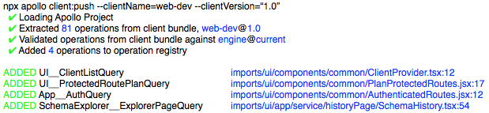
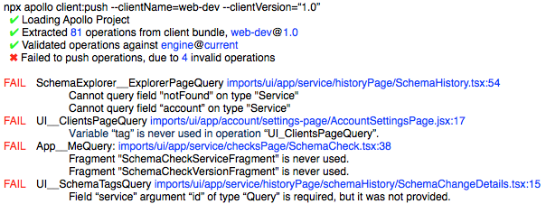
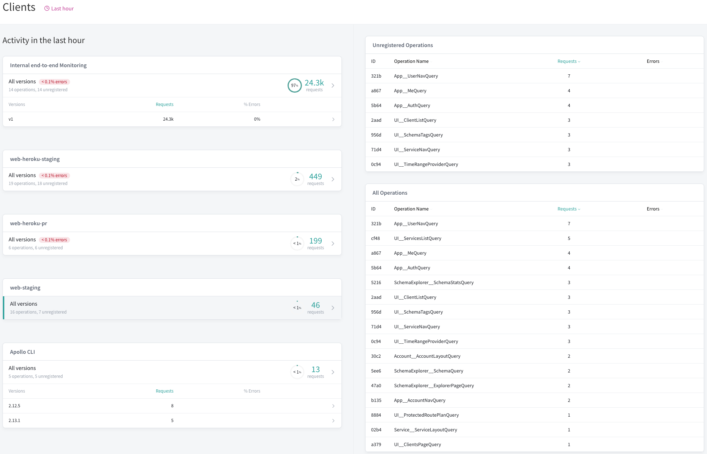
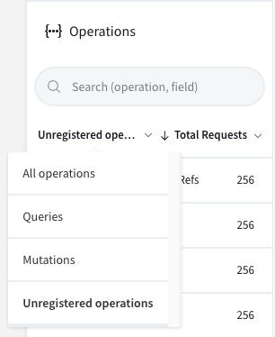

## Overview

> **Note:** Operation safelisting is an Apollo Platform feature that is only available to subscribers of the [_Apollo Team_ and _Enterprise_ plans](https://www.apollographql.com/plans/). Visit [this guide](https://www.apollographql.com/docs/intro/platform.html) to learn more about the Apollo Platform.

Any API requires security and confidence prior to going to production. During development, GraphQL offers front-end engineers the ability to explore all the data available to them and fetch exactly what they need for the components they're building. However, in production, it can be unnecessary and undesirable to provide this flexibility.

The Apollo Platform comes with an **operation registry** and **safelisting** mechanism built into it, which allows organizations to:

- Provide demand control for their production GraphQL APIs.
- Permit the exact operations necessary for their client applications.
- Eliminate the risk of unexpected, and possibly costly, operations being executed against their graph.

Operations defined within client applications can be extracted and uploaded to Apollo Engine using the Apollo CLI. Apollo Server then fetches a manifest of these operations from Apollo Engine and forbids the execution of any operations that were not in that manifest.

### Prerequisites

- [Apollo Server 2.2.x](https://www.apollographql.com/docs/apollo-server/) (or newer).
  - To get started with Apollo Server, visit [its documentation](https://www.apollographql.com/docs/apollo-server/).
- A client application which utilizes `gql` tagged template literals for its operations or, alternatively, stores operations in `.graphql` files.
- An Apollo Engine API key.
  - To obtain an API key, visit [Apollo Engine](https://engine.apollographql.com) and create a service. You will need and Engine account with a Team or Enterprise subscription to be able to upload to the operation registry.

### Limitations

- Subscriptions within Apollo Server should be disabled. For more information, see the instructions below.

Please [contact the Apollo sales team](https://www.apollographql.com/contact-sales/) if you require a solution to any of these limitations.

## Installation steps

Setting up operation registration and safelisting is a full-stack process, so you will need to have access to the client code containing the operations you want to register, and to the server within which you want to enforce the safelist.

- The **Apollo CLI** is used to search the client codebase for GraphQL operations and upload them to Apollo Engine.
- **Apollo Server** is then configured with a plugin which fetches the manifest from Apollo Engine and enforces safelisting using that manifest.

The following steps will walk through the steps necessary for both the client and server codebases.

1. [Install the Apollo CLI](#1-install-the-apollo-command-line-tool)
2. [Push your schema to the Apollo schema registry](#2-push-your-schema-to-the-apollo-schema-registry)
3. [Register operations from your client bundle](#3-register-operations-from-your-client-bundle)
4. [Disable subscription support on Apollo Server](#4-disable-subscription-support-on-apollo-server)
5. [Add the operation registry plugin to Apollo Server](#5-add-the-operation-registry-plugin-to-apollo-server)
6. [Start Apollo Server with Apollo Engine enabled](#6-start-apollo-server-with-apollo-engine-enabled)
7. [Verify](#7-verification)

### 1. Install the `apollo` command line tool

Install the `apollo` command line tool as a development dependency of your client application:

```
npm install apollo --save-dev
```

### 2. Push your schema to the Apollo schema registry

> **Note:** If this server's schema has already been registered using `apollo service:push`, you can skip this step. For additional options and details, see the [documentation for the schema registry](/platform/schema-registry/).

First, make sure Apollo Server is running and that introspection is enabled (it is often disabled in production).

Next, using the following command as a reference, replace the `<ENGINE_API_KEY>` with the Apollo Engine API key from the appropriate service and specify the correct server endpoint with the `--endpoint` flag:

```
npx apollo service:push               \
    --key <ENGINE_API_KEY>            \
    --endpoint https://server/graphql
```

When successful, this command should return output similar to the following:

```
✔ Loading Apollo config
✔ Fetching current schema
✔ Publishing <service> to Apollo Engine

id      schema        tag
------  ------------- -------
abc123  <service>     current
```

> If you encounter any errors, refer to the _**Troubleshooting**_ section below.

### 3. Register operations from your client bundle

Now we'll use `apollo client:push` to locate operations within the client codebase and upload a manifest of those operations to Apollo operation registry. Once Apollo Server has been configured to respect the operation registry, only operations which have been included in the manifest will be permitted.

The `apollo client:push` command:

- Supports multiple client bundles. Each bundle is identified by a `clientName` (e.g. `react-web`) and `clientVersion`.
- Supports JavaScript, TypeScript and `.graphql` files.
- Accepts a list of files as a glob (e.g. `src/**/*.ts`) to search for GraphQL operations.
- By default, includes the `__typename` fields which are added by Apollo Client at runtime.

To register operations, use the following command as a reference, taking care to replace the `<ENGINE_API_KEY>` with the appropriate Apollo Engine API key, specifying a unique name for this application with `<CLIENT_IDENTIFIER>`, and indicating the correct glob of files to search:

```
npx apollo client:push \
    --key <ENGINE_API_KEY> \
    --clientName <CLIENT_IDENTIFIER> \
    --clientVersion <CLIENT_VERSION> \
    --includes="src/**/*.{ts,js,graphql}"
```

> _Note:_ Operations that are stored in the registry are legal for _all_ clients. The client name and client version are collected as metadata to make debugging easier and provide more insights.

When succesfull, the output from this command should look similar to the following:

```
✔ Loading Apollo project
✔ Pushing client to Engine service <service>
```

Currently, once an operation is registered it will remain registered indefinitely. For production operation registration, it's recommended that operations be registered from a deployment pipeline step rather than manually.

If you encounter any errors, check the _**Troubleshooting**_ section below.

####3.1 Optionally, set the schema tag

To specify the schema tag to register operations on, pass an additional `--tag <TAG>` argument (`npx apollo client:push --tag <TAG>`).

### 4. Disable subscription support on Apollo Server

Subscription support is enabled by default in Apollo Server 2.x and provided by a separate server which does not utilize Apollo Server 2.x's primary request pipeline. Therefore, the operation registry plugin (and any plugin) is unable to be invoked during a request which comes into the subscription server and enforcement of operation safelisting is not possible. **For proper enforcement of operation safelisting, subscriptions should be disabled.**

> **Note:** In the future, the subscription support will have its request pipeline unified with that of the main request pipeline, thus enabling plugin support and permitting the the operation registry to work with subscriptions in the same way that it works with regular GraphQL requests.

To disable subscriptions support on Apollo Server 2.x, a `subscriptions: false` setting should be included on the instantiation of Apollo Server, as follows:

```js{5-6}
const server = new ApolloServer({
  // Existing configuration
  typeDefs,
  resolvers,
  // Ensure that subscriptions are disabled.
  subscriptions: false
  // ...
});
```

### 5. Add the operation registry plugin to Apollo Server

Enable demand control by adding the operation registry to Apollo Server. To enable the operation registry within Apollo Server, it's necessary to install and enable the `apollo-server-plugin-operation-registry` plugin and ensure Apollo Server is configured to communicate with Apollo Engine.

First, add the appropriate plugin to the Apollo Server's `package.json`:

```
npm install apollo-server-plugin-operation-registry
```

Next, the plugin must be enabled. This requires adding the appropriate module to the `plugins` parameter to the Apollo Server options:

```js{8-12}
const server = new ApolloServer({
  // Existing configuration
  typeDefs,
  resolvers,
  subscriptions: false,
  // ...
  // New configuration
  plugins: [
    require("apollo-server-plugin-operation-registry")({
      forbidUnregisteredOperations: true
    })
  ]
});
```

####5.1 Optionally, set the schema tag

Configure the `schemaTag` field to specify which tag to pull operation manifests from.

```js
const server = new ApolloServer({
  // Existing configuration
  plugins: [
    require("apollo-server-plugin-operation-registry")({
      schemaTag: "overrideTag" // highlight-line
    })
  ]
});
```

### 6. Start Apollo Server with Apollo Engine enabled

If the server was already configured to use Apollo Engine, no additional changes are necessary, but it's important to make sure that the server is configured to use the same service as the operations were registered with in step 3.

If the server was not previously configured with Apollo Engine, be sure to start the server with the `ENGINE_API_KEY` variable set to the appropriate API key. For example:

```
ENGINE_API_KEY=<ENGINE_API_KEY> npm start
```

Alternatively, the API key can be specified with the `engine` parameter on the Apollo Server constructor options:

```js
const server = new ApolloServer({
  // ...
  engine: "<ENGINE_API_KEY>" // highlight-line
  // ...
});
```

> **Note:** For security, it's recommended to pass the Engine API key as an environment variable so it will not be checked into version control (VCS).

### 7. Verification

With the operation registry enabled, _only_ operations which have been registered will be permitted.

To confirm that everything is configured properly, try executing an operation against the server which was **not** registered from the client bundle in step 3.

For example, using `curl` this could be done with a command similar to:

```
curl 'http://server/graphql/' \
    -H 'Content-Type: application/json' \
    --data-binary '{"query":"query { likes{title} }"}'
```

If the server is configured properly, it should return:

```
Execution forbidden
```

Finally, to confirm that the server will allow permitted operations, try running an operation from the client.

## Configuration

### Selective enforcement

In some cases, deployments may want to selectively enable the behavior of `forbidUnregisteredOperations` depending on environmental conditions (e.g. based on headers).

To selectively enable operation safelisting, the `forbidUnregisteredOperations` setting supports a [predicate function](<https://en.wikipedia.org/wiki/Predicate_(mathematical_logic)>) which receives the request context and can return `true` or `false` to indicate whether enforcement is enabled or disabled respectively.

> In the example below, the `context` is the shared request context which can be modified per-request by plugins or using the [`context`](https://www.apollographql.com/docs/apollo-server/api/apollo-server/#constructor-options-lt-ApolloServer-gt) function on the `ApolloServer` constructor. The `headers` are the HTTP headers of the request which are accessed in the same way as the [Fetch API `Headers` interface](https://developer.mozilla.org/en-US/docs/Web/API/Headers) (e.g. `get(...)`, `has(...)`, etc.).

For example, to enforce the operation registry safelisting while skipping enforcement for any request in which the `Let-me-pass` header was present with a value of `Pretty please?`, the following configuration could be used:

```js{12-27}
const server = new ApolloServer({
  // Existing configuration
  typeDefs,
  resolvers,
  subscriptions: false,
  engine: "<ENGINE_API_KEY>",
  plugins: [
    require("apollo-server-plugin-operation-registry")({
      // De-structure the object to get the HTTP `headers` and the GraphQL
      // request `context`.  Additional validation is possible, but this
      // function must be synchronous.  For more details, see the note below.
      forbidUnregisteredOperations({
        context, // Destructure the shared request `context`.
        request: {
          http: { headers } // Destructure the `headers` class.
        }
      }) {
        // If a magic header is in place, allow any unregistered operation.
        if (headers.get("Let-me-pass") === "Pretty please?") {
          return false;
        }

        // Enforce operation safelisting on all other users.
        return true;
      }
    })
  ]
});
```

> _Note:_ The `forbidUnregisteredOperations` callback must be synchronous. If it is necessary to make an `async` request (e.g. a database inquiry) to make a determination about access, such a lookup should occur within the [`context` function](https://www.apollographql.com/docs/apollo-server/api/apollo-server/#constructor-options-lt-ApolloServer-gt) on the `ApolloServer` constructor (or any life-cycle event which has access to `context`) and the result will be available on the `context` of `forbidUnregisteredOperations`.

## Testing the plugin

We recommend testing the behavior of the plugin, as well as your `forbidUnregisteredOperations` function, before actually forbidding operation execution in production. To do so, you can use the `dryRun` option, which will log information about the operation in lieu of actually forbidding anything.

```js
const server = new ApolloServer({
  typeDefs,
  resolvers,
  plugins: [
    require("apollo-server-plugin-operation-registry")({
      forbidUnregisteredOperations: true,
      dryRun: true // highlight-line
    });
  ],
});
```

## Troubleshooting

#### The server indicates `Access denied.` (or `AccessDenied`) when fetching the manifest

When the server cannot fetch the manifest, the message may indicate indicate that access is denied:

```xml
Could not fetch manifest
<?xml version='1.0' encoding='UTF-8'?>
<Error>
   <Code>AccessDenied</Code>
   <Message>Access denied.</Message>
   <Details>Anonymous caller does not have storage.objects.get access (...snipped...)</Details>
</Error>
```

This can occur if the schema hasn't been published since the operation registry plugin was enabled. You can publish the schema using the `apollo service:push` command. When receiving this message on a service which has already had its schema pushed, the `apollo client:push` command can be used. Check the above documentation for more information on how to use those commands.

#### Operations aren't being forbidden or operations which should be permitted are not allowed

The first step in debugging the operation registry behavior is to enable debugging. This can be done by enabling the `debug` setting on the plugin within the Apollo Server constructor options:

```js
const server = new ApolloServer({
  typeDefs,
  resolvers,
  plugins: [
    require("apollo-server-plugin-operation-registry")({
      // ... other, existing options ...
      debug: true, // highlight-line
    });
  ],
});
```

When the server is started with debugging enabled, additional information will be displayed at server startup which can be useful in determining the source of the problem. For example:

```
Checking for manifest changes at https://...
🚀 app running at http://localhost:4000/
Incoming manifest ADDs: ba4573fca2e1491fd54b9f3984...
Incoming manifest ADDs: 32a21510374c3c9ad25e064240...
Incoming manifest ADDs: c60ac6dfe19ba70dd9d6a29a27...
```

By clicking on the URL listed in the `Checking for manifest changes at` message, it will be possible to see the full contents of the manifest and see the list of permitted operations. This information is not publicly available and this URL should not be shared.

#### Schema registration

If a problem occurs during the `apollo service:push` command, make sure that the running Apollo Server can be accessed from the machine where the command is being executed.

Additionally, make sure that introspection is enabled on the server since introspection details are used to obtain and publish the schema.

## Migrating from `0.1-alpha.4` to `0.2.0-alpha.1`

### Summary of changes

The new release operation registry improves observability and robustness. These changes include: a [**stable operation manifest location**](#manifest-storage-location) based on a schema variant/tag rather than schema hash, registry [**metrics in the UI**](#metrics-and-usage-statistics), apollo [**client:push diagnostics**](#operation-registration-observability), and [**variant/tag awareness**](#varianttag-awareness).

These updates are designed to be transparent with a [smooth upgrade path](#upgrade-path). Since the operation manifest location has changed, all versions of `apollo client:push` double-write to the new and old storage locations, enabling seamless upgrade. Additionally the server's registry plugin can be upgraded immediately, because the plugin reads from the new location and uses the old location as a fallback, meaning the safelist will always be populated.

> Note: upgrading the apollo cli to `>2.13` requires some extra caution if a variant/tag is defined in the `apollo.config.js` in order to [ensure the proper variant/tag during `apollo client:push`](#target-variantstags-other-than-currentdefault-no-varianttag). The changes are completely backwards compatible when using the Apollo platform without variants/tags.

### Upgrade path

While this upgrade does not require additional work, we recommend running
the new plugin with `dryRun` and `debug` enabled before enforcing the safelist. To report metrics and use the new storage location, upgrade:

- `apollo-server` or `apollo-server-<variant>` to `>2.6.3`
- `apollo-server-plugin-operation-registry` to `0.2.0-alpha.1`.

In one line, run:

`npm install apollo-server apollo-server-plugin-operation-registry`

If operations have not been registered since June 6th, 2019, the plugin will
fallback on the old location. With `debug` enabled, the plugin will log which
manifest is used and the operations added.

#### Target variants/tags other than `current`(default, no variant/tag)

Operations are now registered against a variant/tag and retrieved from the
manifest specific to a variant/tag. This does not change the default behavior
of the Apollo platform, which universally uses the variant/tag `current` when
unspecified. Variants/tags represent different environments, such as
`staging`, `test` or `prod`, so they do not share data. This means that
operations must be re-registered when using or transitioning to a new
variant/tag.

When a variant/tag is set in `apollo client:push`, the operation
will be validated against the latest schema published under that variant/tag
and placed in that variant/tag's manifest. To register operations under a
specific variant/tag, follow these steps:

- **client**: Upgrade the `apollo` CLI package to 2.13.0 (by default the variant/tag will be set to the value in the [apollo config](https://www.apollographql.com/docs/references/apollo-config/#option-1-use-the-apollo-schema-registry))
- **server**: Ensure that a schema has been published to the specified graph variant/tag.
  This can be done by running `apollo service:push --tag <TAG>`
- **client**: Ensure that operations have been registered to the specified graph variant/tag.
  This can be done by running `apollo client:push --tag <TAG>` or modifying the service in the `apollo.config.js`
- **server**: Set the `schemaTag` field of `apollo-server-plugin-operation-registry` to the targeted graph variant/tag

```js
const server = new ApolloServer({
  plugins: [
    require("apollo-server-plugin-operation-registry")({
      schemaTag: "prod", // highlight-line

      // suggested before enforcing the safelist
      debug: true,
      dryRun: true
    })
  ]
});
```

> We know it can be challenging to communicate with all consumers of your
> data > graph to publish their operations to a new variant/tag. Reach out to
> the Apollo team > if you want to move to a variant/tag-based registry, and
> we'll be happy to migrate > all operations registered to the current
> variant/tag to the variant/tag of your choosing to > make that process
> easier.

### Change details

#### Manifest storage location

In the previous version of the operation registry, the operation manifest was
secured by the schema hash, which provided the shared secret between the
Apollo cloud and apollo-server. The side-effect of this model was coupling
operation registration and schema uploads, since a manifest needed to be
created for each schema publish with a new hash. Concretely the GCS url was:

`/(hash of service id)/(schema hash)/manifest.json`

The new model removes this coupling by using the Apollo api key as the shared
secret. In order to enable independent secret rotation, the api key is used
to reference a storage secret that then references the manifests

`/(service id)/storage-secret/(hash of api key).json` <br>
`/(service id)/(storage secret)/(tag)/manifest.v2.json`

These changes should be transparent, since the new version of the operation
registry plugin, `0.2.0-alpha.1`, will attempt to use the new scheme and then
fallback on the old.All apollo cli versions write to the new and old manifest
locations without additional configuration.

Be aware that the the variant/tag specific manifest will
only be created after a `client:push`, so the plugin may fallback on the old
manifest, which contains the operations for `current`, when `schemaTag` is
specified in the operation registry plugin.

#### Operation registration observability

To improve the client side registration, `apollo client:push` now includes
the file name and location for operations added and connects the error
message with the operation that fails.

##### Success

A successful registration will show the operations that are newly registered:



> Note: If all operations have already been registered, then `apollo client:push` will explain that all operations are registered and not print any specific details

##### Validation errors

A failed registration will include the validation failure next to the operation:



#### Metrics and usage statistics

The new registry plugin will report usage metrics to Apollo, which are
displayed in the client details in the clients tab and operation filter in
the metric tab

##### Clients page

The clients page will show the unregistered operation reported by client



##### Metrics page

The filter on the metrics page will provide the option to show unregistered operations only



#### Variant/tag awareness

Operations are now registered against a variant/tag and retrieved from the
manifest specific to a variant/tag. When a variant/tag is set, the operation
will be validated against the latest schema published under that variant/tag
and placed in that variant/tag's manifest. This variant/tag specific manifest
can be consumed by the operation registry plugin by setting the `schemaTag`
option.

Since the operation registry double-writes operations and has a fallback
mechanism for transparent upgrades on `current`, be sure to follow
[these steps](#target-variantstags-other-than-currentdefault-no-varianttag)
and run the operation registry plugin with `debug` enabled.
