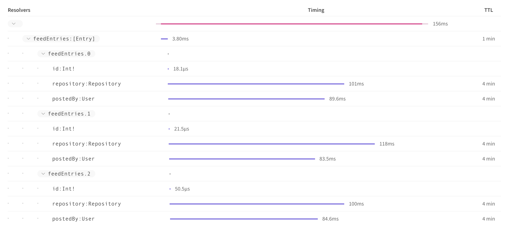
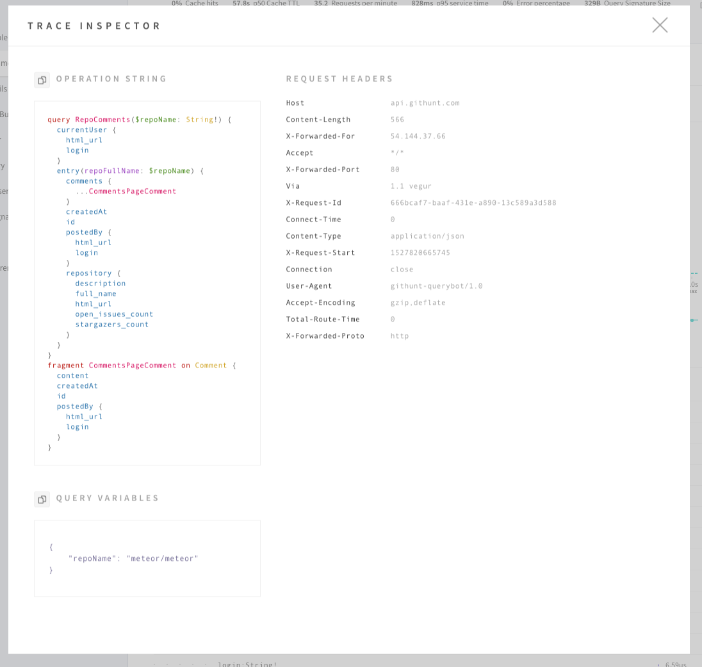
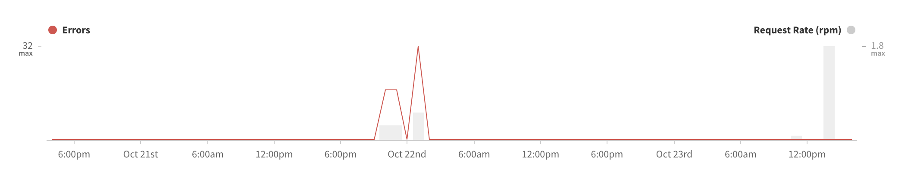

Apollo includes a performance monitoring system which, through a single line of configuration, brings insights about the queries being executed against your graph, the fields being used in your graph, the clients making requests against your graph, how long your requests are taking, and more.

From that information it is possible to track down slow or frequently erroring resolvers, clients using deprecated fields, queries from native apps that need to be supported indefinitely, resolvers that are executing in series instead of in parallel, for example.

#### How it works

With [one line of configuration](/references/setup-analytics/), Apollo Server will start recording traces of every request it receives and sending summaries of that performance data to Engine. Engine aggregates and summarizes those traces to provide segmented, filterable insights about your graph's usage.

## Traces

With the metrics reporting set up, you'll be able to see traces of your operations in [Engine](https://engine.apollographql.com). Execution of a GraphQL request happens layer by layer, and each field in the query calls a function in your server called a resolver. The [_trace_ view in Engine](https://blog.apollographql.com/the-new-trace-view-in-apollo-engine-566b25bdfdb0) allows you to look at a detailed breakdown of the execution for individual operations, with timing shown for every resolver.



### Critical path

When a trace is opened, some resolvers are collapsed and others are expanded. This is Engine automatically expanding resolvers on the "critical path" of the query. The critical path is the set of fields and resolvers that makes the longest sequence in the query. If you are trying to speed up your query's execution, this is the set of fields you should be looking at first.

### Trace inspector

Every trace stored in Engine records the request's resolver timings, variables, and HTTP headers. This is particularly useful when debugging and the detailed information about the trace can be found by opening up the _trace inspector_:



### A note on GraphQL subscriptions

Engine does not currently track statistics or traces for subscriptions. The proxy does, however, support the transparent pass-through of subscription requests and responses.

## Operation signatures

Engine groups operations that select the same fields together, treating different queries distinctly even if they share the same name. Not every query string can be taken as-is for grouping though, because some queries inline their variables. For these cases, Engine has a _signature_ algorithm to normalize inline variables so that queries of the same shape can still be grouped together.

### Signature algorithm

The current signature algorithm performs the following transformations when generating a signature. (Future improvements to Engine will allow users to customize the signature algorithm.)

- Input argument values are mapped according to the following rules:
  - `Variable`, `BooleanValue`, and `EnumValue` preserved
  - `IntValue` and `FloatValue` replaced by `0`
  - `StringValue` replaced by `""`
  - `ListValue` replaced by `[]`
  - `ObjectValue` replaced by `{}`
- [Ignored tokens](http://facebook.github.io/graphql/draft/#sec-Source-Text.Ignored-Tokens) are removed, including redundant `WhiteSpace`. Single spaces are only preserved when required for parsing the request.
- Only the `OperationDefinition` corresponding to the requested operation and reachable `FragmentDefinition`s are included.
  The operation appears first. Fragment definitions appear in order of first reachability when traversing spread-first, depth-second.
- `Alias`es are removed.
- In `SelectionSet`, fields appear before fragment spreads, fragment spreads appear before inline fragments.
- Otherwise, elements are sorted by name alphanumerically, including `Argument` and `Directive`.
- Otherwise, elements are kept in order. For example in `{north:neigh(dir:NORTH) east:neigh(dir:EAST)}`, `EAST` should always appear after `NORTH`.

For example:

```graphql
query Foo {
  user(id : "hello") {
    ... Baz
    timezone
    aliased: name
  }
}
fragment Baz on User {
  dob
}
```

becomes

```graphql
query Foo{user(id:""){name timezone...Baz}}fragment Baz on User{dob}
```

See the reference implementation of [query signatures](https://github.com/apollographql/apollo-tooling/blob/7e1f62a8635466e653d52064745bf8c66bb7dd10/packages/apollo-graphql/src/operationId.ts#L60) for more information.

### Signatures and sensitive data

The signature algorithm is primarily designed to make it possible to treat operations that differ only in trivial ways as the same operation. It also happens that removing the content of string literals appears to achieve greater data privacy within Engine, but this is not the primary goal. In fact, Engine also sends the full raw query along with traces (though it does not currently expose them in the user interface), so relying on the signature to ensure sensitive data never hits Engine's servers is inappropriate.

Future versions of Engine are likely to change this default algorithm to leave string literals alone, though it will still be easy to configure your server to remove string literals like in the current implementation. We also intend to stop sending the full raw query in future versions of Engine, so that the signature algorithm really can be used to avoid sending sensitive data in queries to Engine.

But where possible, we strongly advise that you keep sensitive data in GraphQL variables instead of in literal arguments in the query body, as you can more easily control which variables should be stripped out of the Engine reporting pathway for privacy purposes. See [data privacy](https://www.apollographql.com/docs/references/apollo-engine#data-privacy) for further detail on how this works.

## Error tracking

Metrics reporting to Engine comes with built-in error tracking for basic GraphQL errors. Engine will be able to classify errors by **error type**, **class**, and **message**.



The errors tab in Engine's metrics layer automatically shows errors aggregated across your service, and this can be filtered to errors for a specific operation using the filter panel. Each operation can have multiple requests that return errors and will list these. Each error listed that has one trace can have multiple errors under each resolver. Clicking into the trace for a request with errors will take you to details of that error instance.
