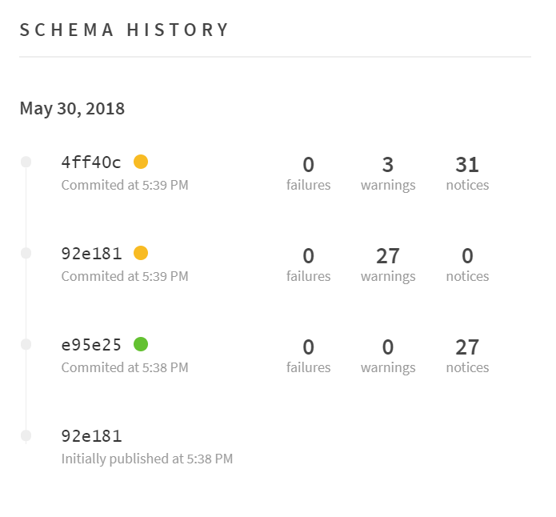

GraphQL makes evolving an API much easier than it used to be with REST. As the demands of a client change, types, fields, and arguments can be added and removed without breaking the previous consumers of the API. In order to do this safely, it is critical to know how current clients are using the schema.

As your schema grows and evolves to meet the needs of your product, it is helpful to see a history of changes for a team. This allows everyone to know when new features were introduced, when old fields were removed, and even link back to the commit that caused the change. Apollo Engine provides all the tooling needed to track this history in a simple way. Every time your schema is updated, you can simply run the [`apollo schema:publish`](#publish-schema) command (demonstrated in the previous section) again to keep an up to date history of your schema.



<h2 id="setup">Publishing schemas</h2>

To begin using schema history, make sure a schema is published to Apollo Engine using the [`apollo` command line interface (CLI)](https://npm.im/apollo). This is best accomplished from automatic steps within a continuous integration workflow and an example CircleCI configuration is available below.

Each time a schema is published, it becomes the basis for comparison for validating future schemas and avoiding breaking changes. Therefore, a schema should be re-published to Apollo Engine each time a new schema is deployed.

The `apollo` command helps facilitate the publishing and updating of schema within Apollo Engine. To configure it, follow the steps below! If you've already published your schema to Engine, you can skip to the _Version History_ section.

<h3 id="install-apollo-cli">Install Apollo CLI</h3>

To install the [`apollo`](https://npm.im/apollo) CLI, ensure that `node` and `npm` are installed, then run:

```bash
npm install --global apollo
```

> Note: This guide will utilize the global installation method, but the `apollo` command can also be installed in a project's `devDependencies` and used via [`npm-scripts`](https://docs.npmjs.com/misc/scripts) or [`npx`](https://npm.im/npx).

<h3 id="publish-schema">Publish schema</h3>

Once the `apollo` command is installed, the `apollo schema:publish` command is used to publish a schema to Apollo Engine.

To publish a schema, start the GraphQL server and run the following command, substituting the appropriate GraphQL endpoint URL and an API key:

> An API key can be obtained from a service's _Settings_ menu within the [Apollo Engine dashboard](https://engine.apollographql.com/).

```bash
apollo schema:publish --key="<API_KEY>" --endpoint="https://example.com/graphql"
```

> For accuracy, it's best to retrieve the schema from a running GraphQL server (with introspection enabled), though the `--endpoint` can also reference a local file. See [schema sources](#schema-sources) for more information.

<h2 id="cli-commands">CLI usage</h2>

- [`apollo help [COMMAND]`](#cli-help)
- [`apollo schema:check`](#cli-schema-check)
- [`apollo schema:publish`](#cli-schema-publish)

<h3 id="cli-help">`apollo help [COMMAND]`</h3>

Display help for the Apollo CLI:

```
USAGE
  $ apollo help [COMMAND]

ARGUMENTS
  COMMAND  command to show help for

OPTIONS
  --all  see all commands in CLI
```

<h3 id="cli-schema-check">`apollo schema:check`</h3>

Check a schema against the version registered in Apollo Engine.

```
USAGE
  $ apollo schema:check

OPTIONS
  -h, --help               Show command help
  --endpoint=endpoint      [default: http://localhost:4000/graphql] The URL of the server to fetch the schema from
  --header=header          Additional headers to send to server for introspectionQuery
  --json                   Output result as JSON
  --key=key                The API key for the Apollo Engine service
```

<h3 id="cli-schema-publish">`apollo schema:publish`</h3>

Publish a schema to Apollo Engine

```
USAGE
  $ apollo schema:publish

OPTIONS
  -h, --help               Show command help
  -e, --endpoint=endpoint  [default: http://localhost:4000/graphql] The URL of the server to fetch the schema from
  --header=header          Additional headers to send to server for introspectionQuery
  --json                   Output successful publish result as JSON
  --key=key                The API key for the Apollo Engine service
```

<h3 id="schema-sources">Schema sources</h3>

The source of a schema is specified by using the `--endpoint` flag to the `apollo schema:*` commands. Typically, this should be set to the URL of a running GraphQL server (e.g. `--endpoint=https://localhost:4000/graphql`).

Using a GraphQL server that is currently running is recommended since it can be quickly tested against during development and, since it's running against the most recent code, avoids the possibility that a statically output schema file is outdated:

For cases where running the GraphQL server _isn't_ possible, the `--endpoint` may also refer to a local file, either:

1.  A `.json` file with the introspection query result. (e.g. `--endpoint=schema.json`)
2.  A file with the schema in the GraphQL schema definition language (SDL). (e.g. `--endpoint=schema.graphql`)

