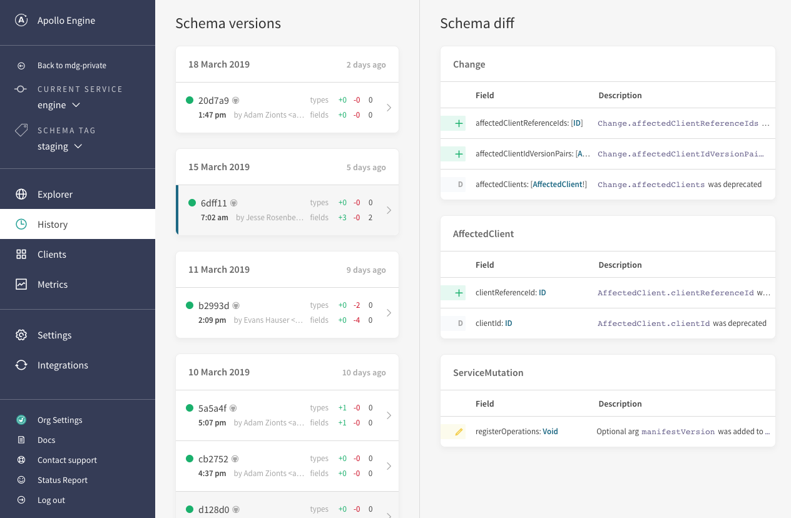

As GraphQL scales in an organization, teams often find that growing and evolving their schema over time becomes difficult to manage. Product teams want to move fast with GraphQL, but they also want reassurance that their code changes won't break existing clients. At scale, you might have hundreds of clients querying against a single schema. How can we ensure that adding or removing a field, type, or argument won't break existing clients and cause an incident?

The [Apollo platform](/docs/intro/platform.html) includes a free schema registration service to help teams of all sizes easily evolve their API over time. Just like it's important to track source code in a version control system, it's a [best practice](https://principledgraphql.com/integrity#3-track-the-schema-in-a-registry) to track the definition of your graph in a schema registry. Once a team registers its schema with Apollo, developers have visibility into when a change was made, who made the change, and the type of change. The registry also supports tracking multiple versions of the graph (for example, staging vs. production).

<h2 id="setup">Using the Schema Registry</h2>

To get started using Apollo's schema registration service, you'll need to configure your repository to be an Apollo project by:

1. Installing the Apollo CLI
1. Creating a `.env` file in the root of your project with an `ENGINE_API_KEY`
1. Creating an `apollo.config.js` file at the root of your project and adding the right configuration

### Install the Apollo CLI

To install the [`apollo` CLI](https://npm.im/apollo), ensure that `node` and `npm` are both installed, then run:

```bash
npm install --global apollo
```

> **Note:** This guide will utilize the global installation method, but the `apollo` command can also be installed in a project's `devDependencies` and used via [`npm-scripts`](https://docs.npmjs.com/misc/scripts) or [`npx`](https://npm.im/npx).

### Get your Engine API key

To get an API key, you will need to [log in to Engine](https://engine.apollographql.com) and create a new service by clicking the "Add Service" button. Once you have your API key, add it to your `.env` file like so:

```
ENGINE_API_KEY=service:foobar:d1rzyrmanmrZXxTTQLxghX
```

The Apollo CLI uses your Engine API key to authenticate with the registry when it uploads your schema.

> **Note:** Make sure your `.env` file is in the root of your project so the Apollo CLI knows where to find it. You can also export `ENGINE_API_KEY` as an environment variable.

### Create an `apollo.config.js` file

The commands executed through the Apollo CLI will be looking for your Apollo config to inform their behavior. Visit the [Apollo config docs](/docs/references/apollo-config.html#service-config) for full details on how to set up your `apollo.config.js` file in your application.

To set up schema registration, you'll need to configure a source that the CLI can fetch your schema from like so:

```js
module.exports = {
  service: {
    endpoint: {
      url: "http://localhost:4000"
    }
    // OR
    localSchemaFile: './path/to/schema.graphql'
  }
};
```

### CLI commands

Once you have the Apollo CLI installed, your Engine API key set up, and your Apollo config created, you will be ready to start connecting to the schema registry. The main commands to interface with the registry are:

- `apollo service:push`: upload a new schema to the registry
- `apollo service:download`: download a schema from the registry
- `apollo service:check`: compare the local schema against running traffic and validate if proposed changes will break any live queries

Type `apollo service --help` for full details on the commands available in the CLI.

<h2 id="push">Uploading a schema</h2>

You publish a schema to the registry by running `apollo service:push` from within your repository. The CLI will know where to fetch your local schema from based on the configuration you gave in your `apollo.config.js` file. Each time a new version of your schema is published, it is logged in your schema history and it becomes the basis of comparison for `apollo service:check`.

Here's what running `apollo service:push` will look like:

```
~/Development/apollo/example$ apollo service:push
  ✔ Loading Apollo Project
  ✔ Uploading service to Engine

id      schema        tag
──────  ────────────  ───────
190330  example-4218  current
```

### Hooking into CI

To get the full value out of Apollo's platform, the schema registry should be an accurate representation of what's running live on your services. To achieve this, you should add the `apollo service:push` command to your continuous delivery pipeline so that your schema is pushed to the registry on every deploy. This is how you will maintain accurate schema change tracking, schema change validation, schema documentation, etc.

Here is a sample configuration for pushing a schema using CircleCI:

```yaml line=13,29-31
version: 2

jobs:
  build:
    docker:
      - image: circleci/node:8

    steps:
      - checkout

      - run: npm install
      # CircleCI needs global installs to be sudo
      - run: sudo npm install --global apollo

      # Start the GraphQL server.  If a different command is used to
      # start the server, use it in place of `npm start` here.
      - run:
          name: Starting server
          command: npm start
          background: true

      # make sure the server has enough time to start up before running
      # commands against it
      - run: sleep 5

      # When running on the 'master' branch, push the latest version
      # of the schema to Apollo Engine.
      - run: |
          if [ "${CIRCLE_BRANCH}" == "master" ]; then
            apollo service:push --tag=master
          fi
```

<h2 id="history">Viewing schema change history</h2>

Changes made to your schema over time can be tracked in Apollo's UI in Engine by browsing to the History page in your service.

Once you have uploaded your schema, you can view it through [in Apollo Engine](https://engine.apollographql.com) by browsing to the History page in your Service. The published schema will appear in your history log along with a list of changes comparing it to the previously published versions of your schema. You can view the full contents of the most recently published version of your schema in the Explorer page.



<h2 id="schema-tags">Managing environments</h2>

Product cycles move fast, and it's common for a schemas to be slightly different across environments as changes make their way through your system. To accommodate for this, the schema registry allows each schema to be registered under a "schema tag". Tags are mostly commonly used to represent environments.

There are two parts to setting up schema tags:

1. Configuring each `service:push` to send along a tag with each schema publish.
1. Configuring metrics sent from your server to send along a tag with each trace.

### Register a schema to a tag

To register your schema to a specific tag, simply add the `--tag=<TAG>` flag to your push command:

```bash
apollo service:push --tag=beta
```

> **Note:** Untagged publishes to the registry will be associated with the default tag, `current`.

### Send tagged metrics

Tagging both schemas publishes and metrics sent enables a single service to be tracked across production, staging, and any other environments running a schema.

Configure the metrics sent to [Engine](https://engine.apollographql.com) from your server to send a tag with each trace in one of two ways:

1. Starting up the service with an environment variable called `ENGINE_SCHEMA_TAG`. This will link metrics sent to Engine with the value of that environment variable. This is the best way to associate metrics so that the schema tag isn't hardcoded into the server.
1. Alternatively, add the `schemaTag` option to your Apollo Server configuration (only works for Apollo Server 2.2+):

```js line=5
const server = new ApolloServer({
  ...
  engine: {
    apiKey: "<ENGINE_API_KEY>",
    schemaTag: "beta"
  }
});
```

<h2 id="benefits">Tools that use the schema registry</h2>

An up-to-date schema in Apollo's schema registry enables a number of workflow benefits through integrations with other tools. A registered schema combined with:

- The [Apollo VS Code extension](https://marketplace.visualstudio.com/items?itemName=apollographql.vscode-apollo) provides built-in linting on queries by validating against the schema in your registry, and annotates fields on your queries with performance indicators collected in Apollo's trace warehouse.
- [Schema validation](./schema-validation.html) creates a diff between your local schema and the last schema uploaded to the registry, and validates this diff against live traffic seen on your endpoint to make sure you never accidentally deploy a breaking schema change to production.
- The [Schema History](#history) keeps track of all the changes made to your schema over time.
- The [Schema Explorer](https://engine.apollographql.com) links the fields in your schema to clients and queries that are using them.
