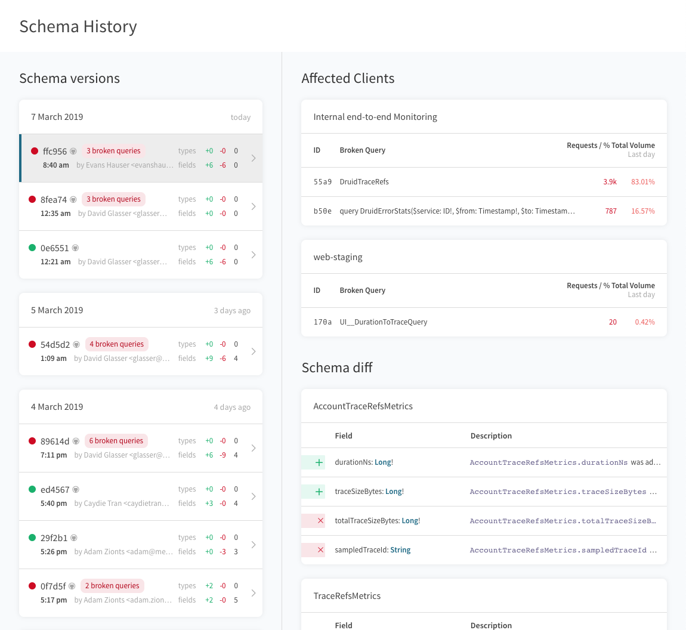

import ProjectConfigPanel from 'gatsby-theme-apollo-docs/mdx/project-config-panel.mdx';

Apollo includes a schema registry that serves as a [central hub](https://principledgraphql.com/integrity#3-track-the-schema-in-a-registry) for tracking your GraphQL schema. Adopting a shared schema registry for your project has many benefits:

- Unlike introspection, which provides a snapshot of a particular server's current schema, the registry serves as a global source of truth for the schema. In small projects this frees you from always needing a running server to access the schema. At scale, it avoids issues related to running multiple servers that may not always be in sync (eg, rolling updates).
- Much like a source control system, Apollo's schema registry tracks a full history of a schema and how it changed over time. This is valuable for understanding and collaborating on a GraphQL API, especially as your team grows.
- Having a registry allows you to disable introspection in production – a recommended best practice for good security.
- Tools like the [Apollo VS Code extension](https://marketplace.visualstudio.com/items?itemName=apollographql.vscode-apollo) can automatically fetch your schema from the registry and provide intellisense like field descriptions and deprecations directly in your editor.
- Apollo's registry lets you track related _variants_ of a schema, like staging or alpha versions. It's helpful to have these schema definitions handy without having to juggle running servers that implement them.

## Using the Schema Registry

To get started using the schema registry, you'll need to make sure your repository is configured to be an Apollo project.

<ProjectConfigPanel />

#### CLI commands

Once you have that set up, you'll be ready to start connecting to the schema regsitry using the CLI:

- `apollo service:push`&mdash; push a new schema to the registry.
- `apollo service:check`&mdash; calculate a local schema diff and compare the changes against live traffic to validate if the changes are _safe_ or if they will _break_ live running queries.

## Registering a schema

New versions of your schema are registered to Apollo by running the `apollo service:push` command from within your repository.

The CLI will know where to fetch your local schema from based on your `apollo.config.js` configuration. Every time you push a new version of your schema it will be logged to your graph's schema history.

Here's what running `apollo service:push` will look like:

```
~$ apollo service:push
  ✔ Loading Apollo Project
  ✔ Uploading service to Engine

id      schema        tag
──────  ────────────  ───────
190330  example-4218  current
```

### Hooking into CI

To get the full value out of Apollo, your graph's schema history should be as accurately represented in the registry as possible. We _highly recommend_ hooking `apollo service:push` into your repository's continuous delivery pipeline so your schema is updated in the registry on every deploy. This will ensure that you always get intellisense for your live-running schema in your VS Code extension, for example.

Here is a sample continuous delivery configuration for pushing a schema to Apollo using CircleCI:

```yaml{13,29-31}
version: 2

jobs:
  build:
    docker:
      - image: circleci/node:8

    steps:
      - checkout

      - run: npm install
      # CircleCI needs global installs to be sudo
      - run: sudo npm install --global apollo

      # Start the GraphQL server.  If a different command is used to
      # start the server, use it in place of `npm start` here.
      - run:
          name: Starting server
          command: npm start
          background: true

      # make sure the server has enough time to start up before running
      # commands against it
      - run: sleep 5

      # When running on the 'master' branch, push the latest version
      # of the schema to Apollo Engine.
      - run: |
          if [ "${CIRCLE_BRANCH}" == "master" ]; then
            apollo service:push --tag=master
          fi
```

## Viewing schema change history

Changes made to your graph's schema over time can be viewed in [Engine](https://engine.apollographql.com) by browsing to the History page for your graph. Each time you push a new version of your schema, it will appear in your graph's history along with a list of the changes introduced in that version.



## Managing environments

Product cycles move fast and it's common for schemas to be slightly different across environments as changes make their way through your system. To support this, schemas pushed to the registry can be associated with specific _variants_ of your graph (also referred to _tags_).

Apollo supports tracking multiple _variants_ for every graph. A variant is just like a regular data graph. It has its own history of schemas, its own metadata store of metrics, and its own operation registry. Variants can be used to track ideas like staging environments, canaries, and deploys of experimental features destined for the production graph.

To get fully set up associating data sent to Apollo with _variant_ information, you'll need to [configure your CLI commands](#registering-schemas-to-a-variant) to send data with a `--tag` flag and [configure your Apollo Server](#associating-metrics-with-a-variant) with a `schemaTag` option.

### Registering schemas to a variant

To register your schema to a specific _variant_, simply add the `--tag=<VARIANT>` flag to your push command:

```bash
apollo service:push --tag=beta
```

> **Note:** All schema pushes without a specified tag are registered under the default graph variant, `current`.

### Associating metrics with a variant

There are a few ways to associate metrics reported to [Engine](https://engine.apollographql.com) with a specific variant:

1. The best way to associate metrics with a variant of your graph is to start your server with an environment variable named `ENGINE_SCHEMA_TAG` that contains the name of your variant. This will link metrics sent to Engine with the value of that environment variable.
1. Alternatively, add the `schemaTag` option to your Apollo Server configuration (works for Apollo Server 2.2+):

```js
const server = new ApolloServer({
  ...
  engine: {
    apiKey: "<ENGINE_API_KEY>",
    schemaTag: "beta" // highlight-line
  }
});
```

> **Note:** It's important that metrics are associated with the same tag as `service:push` if you want to track isolated data across different variants like production and staging.

## Tools that use the schema registry

Keeping your schema up-to-date in Apollo's registry will ensure that you get the best experience from Apollo's tools that connect to the registry:

- The [Apollo VS Code extension](https://marketplace.visualstudio.com/items?itemName=apollographql.vscode-apollo) provides built-in linting on queries by validating against the schema in your registry. It also annotates fields with their descriptions and with performance indicators collected in Apollo's trace warehouse.
- The [schema validation](/platform/schema-validation/) workflow protects your team from accidentally making breaking schema changes. It creates a diff between your local schema and the last schema pushed to the registry, and validates this diff against live traffic seen on your endpoint to warn you about problematic changes.
- Your schema's full history and current usage can be seen in [Apollo Engine](https://engine.apollographql.com). The History page tracks changes made over time, and the Explorer page shows which clients and which queries are using each field in your schema.
