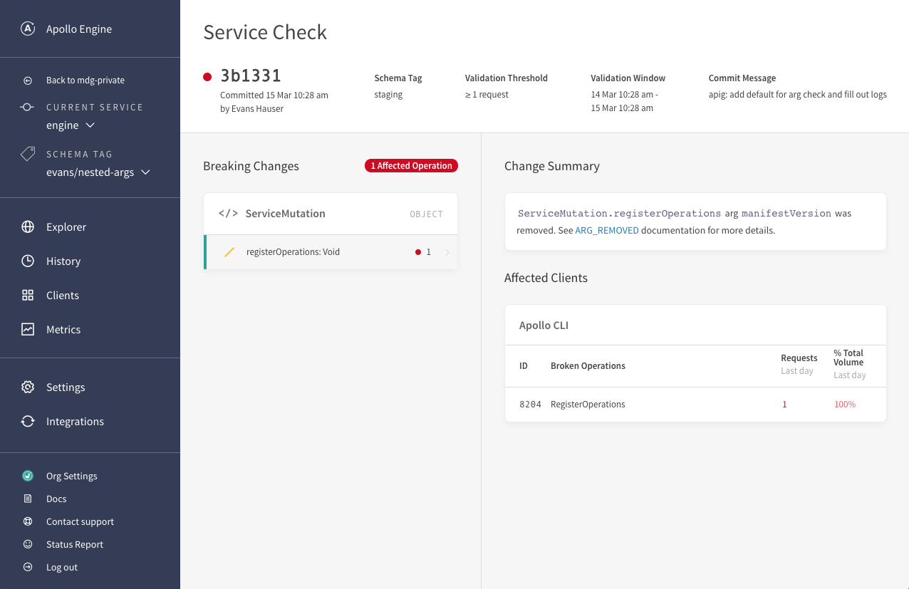
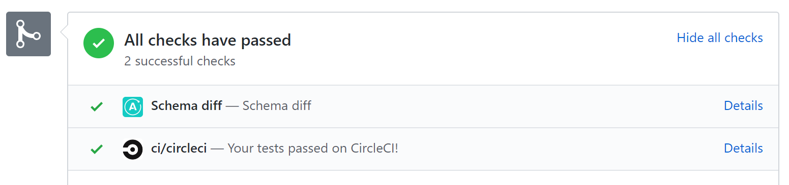
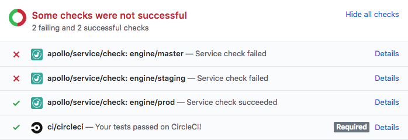

As GraphQL scales within an organization, it becomes harder to evolve the schema while guaranteeing that no query or client will ever break from a change. Some organizations take the approach of just _never_ making schema changes that might be breaking; however, managing an only-ever-growing schema is unnecessarily difficult for most teams. It can actually be very safe to evolve the schema through field removals and return type changes if you have the right tools to guarantee that no such change will ever break an active query.

As such, schema change validation is one of the cornerstones of the [Apollo Platform](/docs/intro/platform.html) and we've built a set of tools to make the workflow possible.

> **Note:** Schema validation is an Apollo Platform feature available on the [_Team_ and _Enterprise_ plans](https://www.apollographql.com/plans/). To get started with the Apollo Platform, begin with [the documentation](https://www.apollographql.com/docs/). If you already have an Engine account, upgrade to a Team plan [here](https://engine.apollographql.com/trypro).

<h2 id="schema-validation">How it works</h2>

The schema validation mechanism utilizes both Apollo's schema registry and Apollo's trace warehouse. The **schema registry** is used to identify a "schema diff" with changes between schema versions. The **trace warehouse** is used to identify which clients and which operations are using which fields in the schema in real time. We compare each change in the schema diff against the live usage data to determine if that change will be a "breaking change" for any clients.

Here's how it works:

1. You run `apollo service:check` locally or in CI. The proposed schema is sent to Engine's schema registry.
1. Engine creates a diff between the local schema and the most recently published schema in the registry.
1. Engine fetches a list of all operations sent to your service in the last day (time window is [configurable](#cli-advanced)).
1. Engine walks through the schema diff change-by-change and compares against the operation list to see if the changes will affect the behavior of any operations.
1. Engine will return the schema diff and indicate any breaking changes found.
1. The CLI will print the output of this check with a link to _view more details in the Engine UI_.

<h3 id="algorithm">Breaking change detection</h3>

Engine's cloud service uses an algorithm to detect breaking changes in a schema diff. It follows the following rules to determine which potentially breaking change types should actually _fail_ the `apollo service:check` command and return a non-0 exit code.

#### Removals

<ul>
  <li id="FIELD_REMOVED">
    <code>FIELD_REMOVED</code> A field referenced by at least one operation was removed
  </li>
  <li id="TYPE_REMOVED">
    <code>TYPE_REMOVED</code> A referenced type(scalar, object) was removed
  </li>
  <li id="ARG_REMOVED">
    <code>ARG_REMOVED</code> A referenced argument was removed
  </li>
  <li id="TYPE_REMOVED_FROM_UNION">
    <code>TYPE_REMOVED_FROM_UNION</code> A type in a union used by at least one operation was removed
  </li>
  <li id="INPUT_FIELD_REMOVED">
    <code>INPUT_FIELD_REMOVED</code> A field in an input type used by at least one operation was removed
  </li>
  <li id="VALUE_REMOVED_FROM_ENUM">
    <code>VALUE_REMOVED_FROM_ENUM</code> A value in an enum used by at least one operation was removed
  </li>
  <li id="TYPE_REMOVED_FROM_INTERFACE">
    <code>TYPE_REMOVED_FROM_INTERFACE</code> An object used by at least one operation was removed from an interface
  </li>
</ul>

#### Required arguments

<ul>
  <li id="REQUIRED_ARG_ADDED">
    <code>REQUIRED_ARG_ADDED</code> Non-nullable argument added to field used by at least one operation
  </li>
  <li id="NON_NULL_INPUT_FIELD_ADDED">
    <code>NON_NULL_INPUT_FIELD_ADDED</code> Non-null field added to an input object used by at least one operation
  </li>
</ul>

#### In-place updates

<ul>
  <li id="FIELD_CHANGED_TYPE">
    <code>FIELD_CHANGED_TYPE</code> Field used by at least one operation changed return type
  </li>
  <li id="INPUT_FIELD_CHANGED_TYPE">
    <code>INPUT_FIELD_CHANGED_TYPE</code> Field in input object referenced in field argument used by at least one operation changed type
  </li>
  <li id="TYPE_CHANGED_KIND">
    <code>TYPE_CHANGED_KIND</code> Type used by at least one operation changed, ex: scalar to object or enum to union
  </li>
  <li id="ARG_CHANGED_TYPE">
    <code>ARG_CHANGED_TYPE</code> Argument used by at least one operation changed a type
  </li>
</ul>

#### Type extensions

<ul>
  <li id="TYPE_ADDED_TO_UNION">
    <code>TYPE_ADDED_TO_UNION</code> New type added to a union used by at least one operation
  </li>
  <li id="TYPE_ADDED_TO_INTERFACE">
    <code>TYPE_ADDED_TO_INTERFACE</code> New interface added to an object used by at least one operation
  </li>
</ul>

#### Optional arguments

<ul>
  <li id="ARG_DEFAULT_VALUE_CHANGE">
    <code>ARG_DEFAULT_VALUE_CHANGE</code> Default value added or changed for argument on a field that is used by at least one operation
  </li>
</ul>

> **Note:** This is not an exhaustive list of all possible schema change types, just _breaking_ change types. Visit the [`graphql` package's repository](https://github.com/graphql/graphql-js/blob/9e404659a15d59c5ce12aae433dd2a636ea9eb82/src/utilities/findBreakingChanges.js#L39) for more details on schema changes types.

A failed `apollo schema:check` command will exit with a non-0 exit code and fail CI checks on purpose! There are actually many cases where it is safe to make a potentially breaking change, as long as the change is made intentionally.

Since breaking changes are detected using live traffic, your service will need active metrics for the change algorithm to detect failures. If there are no metrics associated with your service, _all_ changes will be assigned the `NOTICE` severity as opposed to the `FAILURE` severity.

### Validation output

Running a schema validation check is as simple as running `apollo service:check` on the command line from within a service repository that has been configured to be an Apollo project.

> **Note:** [Skip ahead](#setup) to the setup section for details on how to configure your project for schema change validation.

Running the `apollo service:check` command will output the diff of all schema changes found and highlight changes determined to be breaking as `FAILURE`. Here's an example:

```console
~example$ apollo schema:check
  ✔ Loading Apollo Project
  ✔ Checking service for changes


Change   Code           Description
───────  ─────────────  ──────────────────────────────────
FAILURE  FIELD_REMOVED  `User.name` was removed
NOTICE   FIELD_ADDED    `User.friends` was added


View full details at: https://engine.apollographql.com/service/example-1234/checks?<DETAILS>
```

If there are any changes to the schema, `FAILURE` or `NOTICE`, a URL to Engine will be generated with details showing which clients and operations are affected by the changes specifically:



The Service Check page in Engine will have full details on the changes in the diff and which clients are affected by the changes, if any.

> **Note:** If you [set up your checks on GitHub](#github), the "Details" link in your checks will take you to this special URL as well.

<h2 id="setup">Set up schema validation</h2>

You will need to be actively sending traces to the Apollo trace warehouse and registering schemas to the Apollo schema registry to properly use schema validation. Follow these guides to set those up:

1. [Set up trace reporting to Apollo Engine](/docs/platform/setup-analytics.html) (either through Apollo Server 2+ or the Engine proxy).
1. [Set up schema registration in your continuous delivery pipeline](/docs/platform/schema-registry.html).

For the `apollo schema:check` command to be configured properly, you will also need:

1. [A `.env` file with an `ENGINE_API_KEY`](/docs/platform/schema-registry.html#Get-your-Engine-API-key).
1. [An `apollo.config.js` file with a `service` configured](/docs/platform/schema-registry.html#Create-an-apollo-config-js-file).

If you have set up schema registration, your project may already have its `.env` file and `apollo.config.js` file configured. Once you've got these set up, running your schema check is as simple as running:

```console
apollo service:check
```

The command can be placed in any continuous integration pipeline. To surface results, `apollo` emits an exit code and [integrates with GitHub statuses](#github). The check command validates against traffic from the past day by default, but this time window can be [configured](#cli-advanced) to be a longer range.

> **Note:** The Apollo CLI will be looking in your Apollo config for a location from which to fetch your local schema and using your ENGINE_API_KEY to authenticate its requests with the Engine service.

<h3 id="service-check-on-ci">Run validation on each commit</h3>

We highly recommended that you add validation to your continuous integration workflow (e.g. Jenkins, CircleCI, etc.). In doing so, you can detect potential problems automatically and display the results of checks directly on pull requests.

Here's a example of how to add a schema validation check to CircleCI:

```yaml line=29
version: 2

jobs:
  build:
    docker:
      - image: circleci/node:8

    steps:
      - checkout

      - run: npm install

      # Start the GraphQL server.  If a different command is used to
      # start the server, use it in place of `npm start` here.
      - run:
          name: Starting server
          command: npm start
          background: true

      # make sure the server has enough time to start up before running
      # commands against it
      - run: sleep 5

      # This will authenticate using the `ENGINE_API_KEY` environment
      # variable. Configure your endpoint's location in your Apollo config.
      - run: npx apollo service:check
```

> **Note:** With a GitHub status check, to allow continuous integration to complete without failing early, ignore the exit code of the `apollo service:check` command. The exit code can be ignored by appending `|| echo 'validation failed'` to the command call.

<h3 id="github">GitHub integration</h3>



Like most tools, schema validation is best used when it is integrated directly into the rest of your workflow. If you're using GitHub, you can install the Apollo Engine GitHub app. This will enable Apollo's systems to send a webhook back to your project on each `apollo schema:check`, providing built-in pass/fail status checks on your pull requests.

Go to [https://github.com/apps/apollo-engine](https://github.com/apps/apollo-engine) and click the `Configure` button to install the Apollo Engine integration on the appropriate GitHub profile or organization.

<h3 id="multiple-environments">Multiple environments</h3>

Product cycles move fast, and it’s common for a schemas to be slightly different across environments as changes make their way through your system. To accommodate for this, schemas can be registered under specific "schema tags
, and checks can be performed against specific "schema tags".

schema registry allows each schema to be registered under a “schema tag”. Tags are mostly commonly used to represent environments, but can also be used to represent things like branches and future schemas. Passing the `--tag` flag to `apollo service:check` specifies which schema to compare against, such as `prod` or `staging`. It's common to run checks against multiple different schema tags during continuous integration to ensure that all important deployments are accounted for. Checking multiple tags will result in check statuses similar to:

<div style="text-align:center">

</div>

<h2 id="cli-advanced">Adjusting validation parameters</h2>

Depending on the requirements of your application, you may want to configure the timeframe to validate operations against. You can do so by providing a `validationPeriod` flag to the CLI. The timeframe will always end at "now", and go back in time by the amount specified.

```bash
apollo service:check --validationPeriod=P2W
```

> Valid durations are represented in [ISO 8601](https://en.wikipedia.org/wiki/ISO_8601#Durations). It can also be provided as a number in seconds, i.e. 86400 for a single day.

Two other parameters for customizing the results of `service:check` are threshold values. For example, you may wish to drop support for an old version of an app in order to remove some deprecated fields. Using these parameters, you can decide what amount of breakage is acceptable before shipping any breaking changes.

- `queryCountThreshold` - This flag will only validate the schema against operations that have been executed at least the specified number of times within the provided duration.
- `queryCountThresholdPercentage` - Similar to `queryCountThreshold`, but expressed as a percentage of all operation volume.
  > Note: these flags are compatible with each other. In the case that both are provided, an operation must meet or exceed both thresholds.

If you have requests for other filtering or threshold mechanisms, we'd love to hear them! Please feel free to submit a [feature request](https://github.com/apollographql/apollo-tooling/issues/new?template=feature-request.md) or PR to the [apollo-tooling](https://github.com/apollographql/apollo-tooling/) repo.

```bash
apollo service:check \
# Validate the schema against operations that have run in the last 5 days
--validationPeriod=P5D \
# Only validate against operations that have run at least 5 times during the 5 day duration
--queryCountThreshold=5 \
# Only validate against operations that account for at least 3% of total operation volume
--queryCountThresholdPercentage=3
```

<h2 id="compatible-changes">Compatible Changes</h2>

The following changes are compatible with existing clients by default, since they will not affect the behavior of clients.

#### Optional arguments

Optional arguments include changes that add any input that can be nullable.
Existing operations will not include the new value. The behavior of the clients will
stay the same provided the result of the operation remains the same with a <code>null</code> input.

  <ul>
    <li id="OPTIONAL_ARG_ADDED"><code>OPTIONAL_ARG_ADDED</code> Nullable argument added to a field</li>
    <li id="NULLABLE_FIELD_ADDED_TO_INPUT_OBJECT"><code>NULLABLE_FIELD_ADDED_TO_INPUT_OBJECT</code> Nullable field added to an input object</li>
  </ul>

#### Additions

Additions are changes that will not affect client behavior, since clients
will not access the new schema elements.

  <ul>
    <li id="FIELD_ADDED"><code>FIELD_ADDED</code> Field added to a type</li>
    <li id="TYPE_ADDED"><code>TYPE_ADDED</code> Type added to the schema</li>
    <li id="VALUE_ADDED_TO_ENUM"><code>VALUE_ADDED_TO_ENUM</code> Value added to an enum. If clients contain a switch case on the enum and do not include the `default`, this change could cause unexpected behavior</li>
  </ul>

#### Deprecations

Deprecations will not affect the behavior of the clients directly, since
they are a signal to developer to avoid the schema element rather than a
behavior change.

  <ul>
    <li id="FIELD_DEPRECATED"><code>FIELD_DEPRECATED</code> Field deprecated</li>
    <li id="FIELD_DEPRECATION_REMOVED"><code>FIELD_DEPRECATION_REMOVED</code> Field no longer deprecated</li>
    <li id="FIELD_DEPRECATED_REASON_CHANGE"><code>FIELD_DEPRECATED_REASON_CHANGE</code> Reason for deprecation changed</li>
    <li id="ENUM_DEPRECATED"><code>ENUM_DEPRECATED</code> Enum deprecated</li>
    <li id="ENUM_DEPRECATION_REMOVED"><code>ENUM_DEPRECATION_REMOVED</code> Enum no longer deprecated</li>
    <li id="ENUM_DEPRECATED_REASON_CHANGE"><code>ENUM_DEPRECATED_REASON_CHANGE</code> Reason for enum deprecation changed</li>
  </ul>
