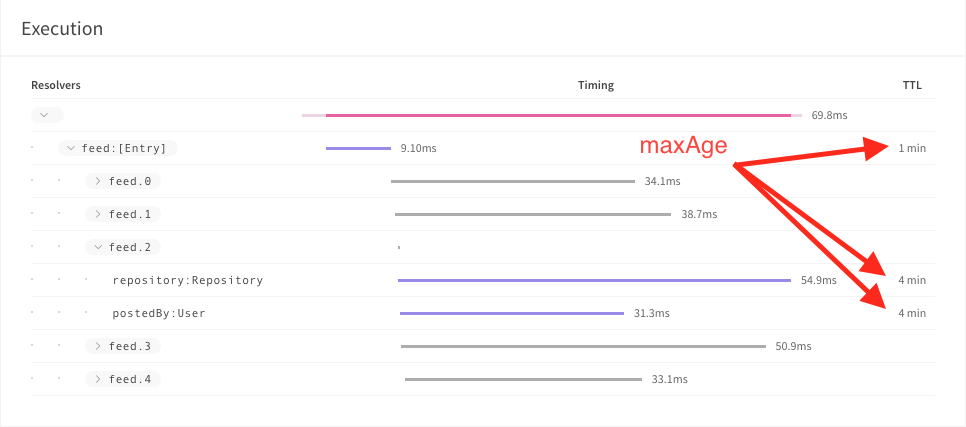
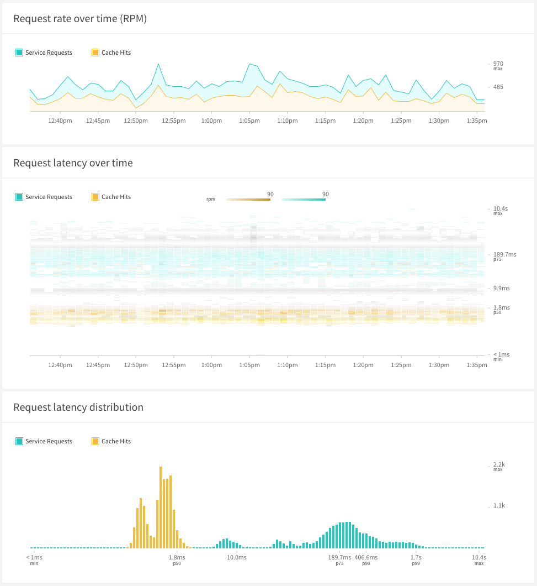

> DEPRECATED: The engine proxy is not maintained, and to integrate with the Apollo platform's metrics, we recommend using Apollo Server's native reporting functionality. To integrate a non-Node server, take a look at our guide [here](/references/setup-analytics/#other-servers).

## Background

The Apollo Engine proxy is a small process that can be run in front of your GraphQL server. Its primary functions are:

1. Sending **performance metrics** data from your server, which extends its responses with [`apollo-tracing`](https://github.com/apollographql/apollo-tracing) information, to the Engine cloud service.
1. Proving a **full query caching** layer, which is controlled using the [`cacheControl`](https://github.com/apollographql/apollo-cache-control) directive and configured to be either in-memory or shared through Memcache.
1. Automatically **persisting queries** through a caching layer that can map query IDs to full query strings, allowing clients to send just query IDs over the wire.

The proxy has been **deprecated since Apollo Server 2** was released. Apollo Server 2+ has [metrics reporting](https://www.apollographql.com/docs/apollo-server/features/metrics), [data source caching](https://www.apollographql.com/docs/apollo-server/features/data-sources), [persisted queries](https://www.apollographql.com/docs/apollo-server/features/apq), and [full query caching](https://github.com/apollographql/apollo-server/blob/release-2.5.0/docs/source/features/caching.md) (starting at Apollo Server 2.5) as built-in features, and using it allows you to forego running the proxy. The newest features in Apollo Engine are not supported in the Engine proxy and we recommend that all Node users use Apollo Server 2+ instead of running the proxy.

That said, the proxy is still a good option for getting set up with Engine in a few **specific** circumstances:

1. You are not using Apollo Server, your server has an [`apollo-tracing`](https://github.com/apollographql/apollo-tracing) plugin, and you want to get **performance metrics** insights.
1. You are not using Apollo Server and you want to use Apollo's **automatic persisted queries**.

## Setup

To get started with using Engine through the Engine proxy, you will need to:

1. [Install a package in your GraphQL server that adds `extension` data (in the Apollo Tracing format) to each request's response.](#instrument-your-server)
1. [Get your Engine API key.](#get-your-api-key)
1. [Configure and deploy the Engine proxy to run in front of your server using either Docker or npm.](#run-the-proxy)

### Instrument your server

To get the performance metrics value out of Engine, you'll need to install a package in your server that adds the `apollo-tracing` GraphQL extension. If you want to set up response caching, you'll also need to install a package that adds the `apollo-cache-control` extension.

> **Note:** If you're installing the Engine proxy _just_ to set up automatic persisited queries, you can skip ahead to the [next section](#get-your-api-key).

The `apollo-tracing` and `apollo-cache-control` extensions are open specifications that can be implemented by any GraphQL server, and the following is a list of implementations:

1. **Node** with [Apollo Server](https://www.apollographql.com/docs/apollo-server/) natively supports tracing and cache control. See [Node setup instructions](#run-the-proxy) for a more streamlined Node setup option.
1. **Ruby** with [GraphQL-Ruby](http://graphql-ruby.org/) supports tracing with the [apollo-tracing-ruby](https://github.com/uniiverse/apollo-tracing-ruby) gem.
1. **Java** with [GraphQL-Java](https://github.com/graphql-java/graphql-java) natively supports tracing. [Read the docs about using Apollo tracing.](https://www.graphql-java.com/documentation/master/instrumentation/)
1. **Scala** with [Sangria](https://github.com/sangria-graphql/sangria) supports tracing with [sangria-slowlog](https://github.com/sangria-graphql/sangria-slowlog#apollo-tracing-extension) project.
1. **Elixir** with [Absinthe](https://github.com/absinthe-graphql/absinthe) supports tracing with the [apollo-tracing-elixir](https://github.com/sikanhe/apollo-tracing-elixir) package.

You can test that you’ve correctly enabled Apollo Tracing by running any query against your API using GraphiQL.

The `tracing` field should now be returned as part of the response's `extensions` like below. Don’t worry, this data won’t make it back to your clients once you've set up the Engine proxy, because the proxy will filter it out.

```js{3-5}
{
  "data": { ... },
  "extensions": {
    "tracing": { ... }
  }
}
```

### Get your API key

[Log into Apollo Engine](http://engine.apollographql.com/?_ga=2.233930590.1351805406.1542648368-1704540304.1492481658) and create a graph to get an API key. We’ll be using your new key in the next step.

### Run the proxy

The proxy is a small process written in Go that you host and run inside your infrastructure. It's designed to allow all of your requests and responses to pass through normally while it collects trace data, caches results, and identifies persisted queries. It's designed to handle large volumes of traffic comfortably without overloading. It does not rely on accessing the Engine cloud service to run or perform caching functions, but if it cannot talk to the Engine cloud service it will not be able to report metrics.

Apollo distributes the Engine proxy in two forms: as an **npm package** and as a **Docker container**. You can use any one of the following options for running the proxy, depending what works best for you and your team:

1. [Run the proxy with Apollo Server](#option-1-running-the-proxy-with-apollo-server)
1. [Run a standalone proxy using Node](#option-2-running-a-standalone-proxy-using-node)
1. [Run a standalone proxy using Docker](#option-3-running-a-standalone-proxy-with-docker)
1. [Run the proxy through a Platform as a Service (eg. Heroku)](#option-4-running-the-proxy-through-a-platform-as-a-service-eg-heroku)
1. [Run the proxy in a serverless environment (eg. Lambda)](#option-5-running-the-proxy-in-a-serverless-environment-eg-lambda)

#### Option 1: Running the proxy with Apollo Server

The two cases where you should be running the Engine proxy with Apollo Server are:

1. You are using Apollo Server 1 and want the Apollo platform features that Engine brings.
1. You are using Apollo Server >2 & <2.5+ and want full query caching using the Engine proxy.

> **Note:** If you're using Apollo Server but neither of these conditions apply to you, you should be using the built-in features of Apollo Server 2+ instead of the Engine proxy.

This section assumes you're running your GraphQL server with the `express` web server package for Node, but if you're using a different framework the steps will be similar.

First, install the `apollo-engine` package from npm:

```bash
npm install --save apollo-engine
```

Then import the `ApolloEngine` constructor and create a new Engine instance. You'll need to replace `app.listen()` with `engine.listen()` like below:

```js
// Import ApolloEngine
const { ApolloEngine } = require('apollo-engine');
const { ApolloServer } = require('apollo-server-express');
const express = require('express');

// Initialize Apollo Server
const server = new ApolloServer({
  typeDefs,
  resolvers,

  // Make sure that tracing and cacheControl are both enabled
  tracing: true,
  cacheControl: true,

  // By setting this to "false", we avoid using Apollo Server 2's
  // integrated metric reporting and fall-back to using the Apollo
  // Engine Proxy (running separately) for metric collection.
  engine: false
});

// Initialize your Express app like usual
const app = express();

// All of your GraphQL middleware goes here
server.applyMiddleware({ app });

// Initialize engine with your API key. Alternatively,
// set the ENGINE_API_KEY environment variable when you
// run your program.
const engine = new ApolloEngine({
  apiKey: 'API_KEY_HERE'
});

// Call engine.listen(...) instead of app.listen(port) as you usually would
engine.listen({
  port: 4000,
  expressApp: app
});
```

Engine is now wrapping your endpoint and processing your GraphQL requests and responses like normal. If you call your endpoint again, your requests will be routed through the Engine proxy to your server and back. If everything is working, you will no longer see `tracing` data in your responses because your Engine proxy is filtering and processing that information for you.

#### Option 2: Running a standalone proxy using Node

Even if your GraphQL server is not implemented with Node, you may find it easier to run a tiny Node program in your hosting environment than to run a Docker container. If so, this proxy deployment option is for you.

The `apollo-engine` npm package contains an `ApolloEngineLauncher` API, which simply runs the Engine proxy with a given configuration.

First, install the `apollo-engine` package from npm:

```bash
npm install --save apollo-engine
```

Then write a small Node program that uses it, like so:

```js
const { ApolloEngineLauncher } = require('apollo-engine');

// Define the Engine configuration.
const launcher = new ApolloEngineLauncher({
  // Note: you can also provide this in the ENGINE_API_KEY environment variable.
  apiKey: 'API_KEY_HERE',
  origins: [
    {
      http: {
        // The URL that the proxy should use to connect to your GraphQL server.
        url: 'http://localhost:4000/api/graphql'
      }
    }
  ],
  // Tell the proxy which ports to listen to and which paths should
  // be treated as GraphQL instead of transparently proxied as raw HTTP.
  frontends: [
    {
      port: 3000, // default if left out: process.env.PORT
      endpoints: ['/api/graphql'] // default if left out: /['/graphql]
    }
  ]
});

// Start the Proxy; crash on errors.
launcher.start().catch(err => {
  throw err;
});
```
> **Note:** Every deployment has its unique needs and we provide a variety of configuration options to fulfill them. For more configuration options, please see the [proxy config docs](/references/proxy-config/).

> **Note:** The argument to `new ApolloEngineLauncher()` is generally the same as the argument Node GraphQL users pass to `new ApolloEngine()`. The main differences are that you need to specify the origin's HTTP URL yourself with `new ApolloEngineLauncher()`, and the frontend `port` and `endpoints` are specified inside the constructor instead of as options to `listen()`.

If you run this program with Node, the proxy will start up and start accepting connections at http://localhost:3000. It will forward all requests to your server, which you told it is running on http://localhost:4000.

If you open up GraphiQL on http://localhost:3000, you'll notice that the `tracing` extension data is no longer in the result of your query. This is because Engine is consuming it! You can verify that everything is working correctly by checking the Engine UI for your new service and confirming that you see data in the Metrics section.

#### Option 3: Running a standalone proxy with Docker

The Engine proxy is also distributed as a Docker image that you can deploy and manage separate from your server. It does not matter where you choose to deploy and manage your proxy, though it's more efficient if your proxy is located on the same machine or network as your GraphQL server.

The Docker container distribution of Engine proxy is configured using a JSON `engine-config.json` configuration file, like so:

```js
{
  "apiKey": "API_KEY_HERE",
  "origins": [{
    "http": {
      "url": "http://localhost:4000/api/graphql"
    }
  }],
  "frontends": [{
    "port": 3000,
    "endpoints": ["/api/graphql"]
  }]
}
```

> **Note:** Every deployment has its unique needs, and we provide a variety of configuration options to fulfill them. For example, if your origin GraphQL server is running in a virtual-hosted environment (e.g. Heroku, AWS), you may need to override the `Host` header sent to HTTP origins. For more details and instruction on configuration options, please see the [proxy config docs](/references/proxy-config/).

As it is JSON file, all object keys must be quoted, and trailing commas and comments are not allowed. Any reference in our docs to options passed to `new ApolloEngine()` otherwise translates directly into the engine config file. Like with `ApolloEngineLauncher`, you need to specify your GraphQL server's origin http URL (or other origin type like Lambda) inside the config file, and you need to specify the frontend port and GraphQL paths inside the config file rather than separately (if you're not using the default values of `process.env.PORT` and `['/graphql']`).

Next, make sure you have a working [Docker installation](https://docs.docker.com/engine/installation/) and type the following lines in your shell:

```
$ ENGINE_PORT=3000
$ docker run --env "ENGINE_CONFIG=$(cat engine-config.json)" -p "${ENGINE_PORT}:${ENGINE_PORT}" gcr.io/mdg-public/engine:1.1
```

> **Note:** We use [semver](https://semver.org/) to name Engine Proxy release versions, and we release version 1.2.3 under the tags `1.2.3`, `1.2`, and `1`. If you want to pin to a precise version, use the `1.2.3` tag. If you'd like to take patch upgrades but not minor upgrades, use the `1.2` tag. If you'd like to take minor upgrades, use the `1` tag.

This will run the Engine Proxy via Docker, routing port 3000 inside the container to port 3000 outside the container. (You can also pass `--net=host` instead of the `-p 3000:3000` to just allow the Proxy direct access to your host's network.)

The Proxy should start up and accept connections at http://localhost:3000 and forward all requests to your server at http://localhost:4000. Load GraphiQL through Engine at http://localhost:3000/graphiql (or wherever you have configured your app to serve GraphiQL) and run any query. You should no longer see the `tracing` data in the result since Engine is now consuming it! Checking the Engine UI for your service, you should see data from the request you sent via GraphiQL come through in the metrics tab.

You can find the complete documentation for Engine configuration options on the [full API docs](/references/proxy-config/) page, and some commonly-used fields worth knowing about are described in the [`new ApolloEngineLauncher()` docs](/references/proxy-config/#top-level-options).

#### Option 4: Running the proxy through a Platform as a Service (eg. Heroku)

It may be most convenient for you to run and host the Engine proxy outside your app's deployment altogether. If that is the case, automatically running the proxy on a Platform as a Service like Heroku might be the easiest option for you.

We have an example repository with a guide for [running the Engine proxy on Heroku](https://github.com/apollographql/engine-heroku-example) that you can follow along in. Like running a [standalone proxy with Docker](#option-3-running-a-standalone-proxy-with-docker), you'll need to configure your proxy with an `engine-config.json` file like so:

```json
{
  "apiKey": "<ENGINE_API_KEY>",
  "origins": [
    {
      "http": {
        "url": "http://yourappname.herokuapp.com/graphql",
        "overrideRequestHeaders": {
          "Host": "yourappname.herokuapp.com"
        }
      }
    }
  ],
  "frontends": [
    {
      "host": "0.0.0.0",
      "port": "3000",
      "graphqlPaths": ["/graphql"]
    }
  ]
}
```

> **Note:** For Virtual Hosted environments where the `PORT` is dynamically set in an environment variable named `$PORT`, you can leave out the `port` option. If your environment uses a different environment variable, you can name it with the `portFromEnv` option instead. For more details and instruction on configuration options, please see the [proxy config docs](/references/proxy-config/).

It does not matter where you choose to deploy and manage your Engine proxy. We've built this guide for Heroku because they have an easy deployment mechanism for Docker containers, but we run our own Engine proxy on Amazon's [EC2 Container Service](https://aws.amazon.com/ecs/).

#### Option 5: Running the proxy in a serverless environment (eg. Lambda)

Last but not least, you may be wondering how to use Engine if you run your application in a serverless environment like Lamdba. If so, this is the guide for you!

> **Note:** The best option for using Engine if you're running in a serverless environment is to use Apollo Server 2+ and its built-in reporting mechanism. Running the Engine proxy in serverless environments is tricky because the **proxy is stateful** and needs to be run separately from your cloud function.

To use Engine when running in serverless environments, we will need to configure and deploy the Engine proxy as a standalone docker container that is **separate** from your cloud function. The Engine proxy is stateful (it collects and aggregates your metrics across requests), and as such it should not be deployed with your cloud function, but separately.

The only available option for running the Engine proxy with cloud functions is to run the proxy in a standalone docker container. To do that, you can follow one of our guides here:

1. [Run a standalone proxy using Node](#option-2-running-a-standalone-proxy-using-node)
1. [Run a standalone proxy using Docker](#option-3-running-a-standalone-proxy-with-docker)
1. [Run the proxy through a Platform as a Service (eg. Heroku)](#option-4-running-the-proxy-through-a-platform-as-a-service-eg-heroku)

The proxy needs to be run separately from your function because it's responsible for capturing, aggregating, and sending to Engine the trace data from each Lamdba instance GraphQL response.

The main difference between setting up the proxy to work with cloud functions versus setting it up with a persistent server is in how you configure it. You'll want an `engine-config.json` that looks something like this:

```json
{
  "apiKey": "<ENGINE_API_KEY>",
  "origins": [
    {
      "lambda": {
          "functionArn":"arn:aws:lambda:xxxxxxxxxxx:xxxxxxxxxxxx:function:xxxxxxxxxxxxxxxxxxx",
          "awsAccessKeyId":"xxxxxxxxxxxxxxxxxxxx",
          "awsSecretAccessKey":"xxxxxxxxxxxxxxxxxxxxxxxxxxxxxxxxxxxxxxxx"
      }
    }
  ],
  "frontends": [
    {
      "host": "0.0.0.0",
      "port": 3001,
      "endpoints": ["/graphql"]
    }
  ]
}
```

> **Note:** This example is for AWS Lambda specifically, for which we have a special `origins` type. Other cloud functions are supported with the standard HTTP invocation, and for non-AWS cloud functions see [the standalone docs](#option-3-running-a-standalone-proxy-with-docker) for instructions on settup up the Engine proxy as a standalone API gateway to your cloud function. For full configuration details see [proxy config](/references/proxy-config/).

The Engine proxy will invoke the Lambda function as if it was called from Amazon's [API Gateway](https://docs.aws.amazon.com/apigateway/latest/developerguide/api-gateway-set-up-simple-proxy.html#api-gateway-simple-proxy-for-lambda-input-format), and the function should return a value suitable for [API Gateway](https://docs.aws.amazon.com/apigateway/latest/developerguide/api-gateway-set-up-simple-proxy.html#api-gateway-simple-proxy-for-lambda-output-format).

If you've got a proxy running and successfully configured to talk to your cloud functions, then sending a request to it will invoke your function and return the response back to you. If everything is working, you should be able to visit the Metrics tab in the Engine UI and see data from the requests you're sending in the interface!

## Feature configuration

The following proxy features require specific setup steps to get working.

1. [Automatically **persisting** your queries](#automatic-persisted-queries-apq)
1. [**Caching** full query responses](#caching)
1. [Integrating with your **CDN**](#cdn-integration)
1. [Using the Engine proxy with **query batching**](#query-batching)

### Automatic Persisted Queries (APQ)

Automatically persisting your queries is a performance technique in which you send a query hash to your server instead of the entire GraphQL query string. Your server keeps track of the map between these hashes and their full query strings and does the lookup on its end, saving you the bandwidth of sending the full query string over the wire.

An added benefit of using APQs with GraphQL is that it's an easy mechanism to transform your GraphQL POST requests into GET requests, allowing you to easily leverage any CDN infrastructure you may already have in place.

> **Note:** Apollo Server 2 reduces the setup necessary to use automatic persisted queries, and these instructions are only necessary when using the Apollo Engine Proxy. To find out more visit the [Apollo Server](https://www.apollographql.com/docs/apollo-server/features/apq/) docs.

The query registry that maps query hashes to query strings is stored in a user-configurable cache and read by the Engine proxy. This can either be an in-memory store (configured by default to be 50MB) within each Engine proxy instance, or an external, configurable [memcached](https://memcached.org/) store.

To use automatic persisted queries with the Engine proxy:

- Use Engine proxy `v1.0.1` or newer.
- If your GraphQL server is hosted on a different origin domain from where it will be accessed, setup the appropriate [CORS headers](https://en.wikipedia.org/wiki/Cross-origin_resource_sharing) using the `overrideGraphqlResponseHeaders` object on the proxy's `frontend` configuration:

```javascript
frontends: [{
  overrideGraphqlResponseHeaders: {
    'Access-Control-Allow-Origin': '*',
  },
}],
```
  
* Configure your client to use APQs. If you're using Apollo Client, you can easily use [`apollo-link-persisted-queries`](https://github.com/apollographql/apollo-link-persisted-queries#automatic-persisted-queries) to set this up.
<!-- * Verify APQ is working properly using the [verification procedure] (// TODO(dman): get link to new article). -->
<!-- * Read [how it works] (// TODO(dman): get link to new article) for additional details. -->

If everything is set up correctly, you should see your client sending hashes insteady of query strings over the network, but receiving data as if it had sent a normal query.

### Caching

To bring caching to GraphQL we've developed [Apollo Cache Control](https://github.com/apollographql/apollo-cache-control), an open standard that allows servers to specify exactly which parts of a response can be cached and how long they can be cached for.

We've built a mechanism into the Engine proxy that allows it to read these "cache hints" that servers send along with their responses. It uses these hints to determine if the response can be cached, wether or not it should be cached for everyone or a specific user, and how long it can be cached for.

The Engine proxy computes a cache privacy level and expiration date by combining the data from all of the fields returned by the server for a particular request. It errs on the safe side, so shorter `maxAge` results override longer and `PRIVATE` scope overrides `PUBLIC`. A missing `maxAge` on a field will default to `0`, meaning that all fields in the result must have a `maxAge > 0` for the response to be cached at all.

The Engine proxy reads Apollo Cache Control extensions, caching whole query responses based on the computed cacheability of each new query. The Engine UI will visualize how each query was impacted by the cache policy set on it.

There are just a few steps to enable response caching in Engine proxy, and one of them is optional!

1. [Extend your server's responses with `cacheControl` extensions.](#1-add-cachecontrol-extensions-to-your-sevrer)
1. [Annotate your schema and/or resolvers with cache control hints.](#2-add-cache-hints-to-your-responses)
1. [_Optional:_ Configure cache options in your Engine Proxy configuration.](#3-optional-configure-cache-options)

#### 1. Add `cacheControl` extensions to your sevrer

If you're using Apollo Server for your Node GraphQL server, the only server code change required is to add `cacheControl: true` to the options passed to your Apollo Server configuration.

```js
// Apollo Server 2:
const server = new ApolloServer({
  typeDefs,
  resolvers,
  cacheControl: true // highlight-line
});

// Apollo Server 1.2 and onwards:
app.use(
  '/graphql',
  bodyParser.json(),
  graphqlExpress({
    schema,
    context: {},
    cacheControl: true // highlight-line
  })
);
```

We're working with the community to add support for Apollo Cache Control to non-Node GraphQL server libraries. Contact us at suppot@apollogrqphql.com if you're interested in joining the community to work on support for `express-graphql` or non-Node GraphQL servers.

#### 2. Add cache hints to your responses

Next we'll add some cache hints to our GarphQL responses. There are two ways to do this -- either dynamically in your resolvers or statically on your schema types and fields. Each `cacheControl` hint has two parameters:

- The `maxAge` parameter defines the number of seconds that Engine Proxy should serve the cached response.
- The `scope` parameter declares that a unique response should be cached for every user (`PRIVATE`) or a single response should be cached for all users (`PUBLIC`/default).

**Interpreting `maxAge` for a query (how long the query can be cached for):**

To determine the expiration time of a particular query, the Engine proxy looks at all of the `maxAge` hints returned by the server, which have been set on a per-field basis, and picks the shortest.

For example, the following trace indicates a 4 minute (`maxAge = 240`) for one field and 1 min (`maxAge = 60`) for another. This means that the Engine proxy will use "1 minute" as the overall expiration time for the whole result. You can use the Trace view in the Engine UI to understand your cache hit rates and the overall `maxAge` for your queries:



> **Note:** If your query calls a type with a field referencing list of type objects, such as `[Post]` referencing `Author` in the `author` field, Engine will consider the `maxAge` of the `Author` type as well.

**Setting cache scope for a query (public vs. private):**

Apollo Engine supports caching of personalized responses using the `scope: PRIVATE` cache hint. Private caching requires that Engine identify unique users, using the methods defined in the `sessionAuth` configuration section.

Engine supports extracting users' identity from an HTTP header (specified in `header`), or an HTTP cookie (specified in `cookie`).

For security, Engine can be configured to verify the extracted identity before serving a cached response. This allows your service to verify the session is still valid and avoid replay attacks.
This verification is performed by HTTP request, to the URL specified in `tokenAuthUrl`.

The token auth URL will receive an HTTP POST containing: `{"token": "AUTHENTICATION-TOKEN"}`.
It should return an HTTP `200` response if the token is still considered valid.
It may optionally return a JSON body:

- `{"ttl": 300}` to indicate the session token check can be cached for 300 seconds.
- `{"id": "alice"}` to indicate an internal user ID that should be used for identification. By returning a persistent identifier such as a database key, Engine's cache can follow a user across sessions and devices.
- `{"ttl": 600, "id": "bob"}` to combine both.

Authentication checks with `ttl>0` will be cached in a `store` named in `sessionAuth`, or in the default 50MB in-memory store.

**Setting static cache hints in your schema:**

Cache hints can be added to your schema using directives on your types and fields. When executing your query, these hints will be added to the response and interpreted by Engine to compute a cache policy for the response.

Engine sets cache TTL as the lowest `maxAge` in the query path.

```graphql
type Post @cacheControl(maxAge: 240) {
  id: Int!
  title: String
  author: Author
  votes: Int @cacheControl(maxAge: 500)
  readByCurrentUser: Boolean! @cacheControl(scope: PRIVATE)
}

type Author @cacheControl(maxAge: 60) {
  id: Int
  firstName: String
  lastName: String
  posts: [Post]
}
```

You should receive cache control data in the `extensions` field of your response:

```json
"cacheControl": {
  "version": 1,
  "hints": [
    {
      "path": [
        "post"
      ],
      "maxAge": 240
    },
    {
      "path": [
        "post",
        "votes"
      ],
      "maxAge": 30
    },
    {
      "path": [
        "post",
        "readByCurrentUser"
      ],
      "scope": "PRIVATE"
    }
  ]
}
```

For the above schema, there are a few ways to generate different TTLs depending on your query. Take the following examples:

_Example 1_

```graphql
query getPostsForAuthor {
  Author {
    posts
  }
}
```

`getPostsForAuthor` will have `maxAge` of 60 seconds, even though the `Post` object has `maxAge` of 240 seconds.

_Example 2_

```graphql
query getTitleForPost {
  Post {
    title
  }
}
```

`getTitleForPost` will have `maxAge` of 240 seconds (inherited from Post), even though the `title` field has no `maxAge` specified.

_Example 3_

```graphql
query getVotesForPost {
  Post {
    votes
  }
}
```

`getVotesForPost` will have `maxAge` of 240 seconds, even though the `votes` field has a higher `maxAge`.

**Setting dynamic cache hints in your resolvers:**

If you'd like to add cache hints dynamically, you can use a programmatic API from within your resolvers.

```js
const resolvers = {
  Query: {
    post: (_, { id }, _, { cacheControl }) => {
      cacheControl.setCacheHint({ maxAge: 60 });
      return find(posts, { id });
    }
  }
}
```

**Setting a default `maxAge` for your whole schema:**

The power of cache hints comes from being able to set them precisely to different values on different types and fields based on your understanding of your implementation's semantics. But when getting started, you might just want to apply the same `maxAge` to most of your resolvers. You can specify a default max age when you set up `cacheControl` in your server. This max age will be applied to all resolvers which don't explicitly set `maxAge` via schema hints (including schema hints on the type that they return) or the programmatic API. You can override this for a particular resolver or type by setting `@cacheControl(maxAge: 0)`.

Just like when you set `@cacheControl(maxAge: 5)` explicitly on a field or a type, data is considered to be public by default and the cache will be shared among all users of your site, so when using this option, be sure that you're really OK with creating a shared cache for all of your GraphQL queries. You can still override a specific type or resolver to use the private cache by setting `@cacheControl(scope: PRIVATE)`.

For example, for Express:

```javascript
app.use(
  '/graphql',
  bodyParser.json(),
  graphqlExpress({
    schema,
    context: {},
    tracing: true,
    cacheControl: {
      defaultMaxAge: 5
    }
  })
);
```

Setting `defaultMaxAge` requires `apollo-server-*` 1.3.4 or newer.

#### 3. Optional: Configure cache options

As long as you're using a version of the Engine proxy that's greater than `1.0`, you won't have to configure anything to use public response caching. The proxy comes with a default 50MB in-memory cache. To enable private response caching or to configure details of how caching works, there are a few fields in the Engine configuration (ie, argument to `new ApolloServer`) that are relevant.

Here is an example of changing the Engine config for caching `scope: PUBLIC` responses to use memcached instead of an in-memory cache.
Since no `privateFullQueryStore` is provided, `scope: PRIVATE` responses will not be cached.

```js
const engine = new ApolloEngine({
  stores: [
    {
      memcache: {
        url: ['localhost:4567']
      }
    }
  ]
  // ...
});
```

Below is an example of an Engine config for caching `scope: PUBLIC` and `scope: PRIVATE` responses, using the default (empty-string-named 50MB in-memory cache) for public responses and authorization tokens, and memcached for private responses.
By using a private response cache, we guarantee that a response affecting multiple users is never evicted for a response affecting only a single user.

```js
const engine = new ApolloEngine({
  stores: [
    {
      name: 'privateResponseMemcache',
      memcache: {
        url: ['localhost:4567']
      }
    }
  ],
  sessionAuth: {
    header: 'Authorization',
    tokenAuthUrl: 'https://auth.mycompany.com/engine-auth-check'
  },
  queryCache: {
    privateFullQueryStore: 'privateResponseMemcache'
    // By not mentioning publicFullQueryStore, we keep it enabled with
    // the default empty-string-named in-memory store.
  }
  // ...
});
```

**stores**

Stores is an array of places for Engine to store data such as: query responses, authentication checks, or persisted queries.

Every store must have a unique `name`. The empty string is a valid name; there is a default in-memory 50MB cache with the empty string for its name which is used for any caching feature if you don't specify a store name. You can specify the name of `"disabled"` to any caching feature to turn off that feature.

Engine supports two types of stores:

- `inMemory` stores provide a bounded LRU cache embedded within the Engine Proxy.
  Since there's no external servers to configure, in-memory stores are the easiest to get started with.
  Since there's no network overhead, in-memory stores are the fastest option.
  However, if you're running multiple copies of Engine Proxy, their in-memory stores won't be shared --- a cache hit on one server may be a cache miss on another server.
  In memory caches are wiped whenever Engine Proxy restarts.

  The only configuration required for in memory stores is `cacheSize` --- an upper limit specified in bytes. It defaults to 50MB.

- `memcache` stores use external [Memcached](https://memcached.org/) server(s) for persistence.
  This provides a shared location for multiple copies of Engine Proxy to achieve the same cache hit rate.
  This location is also not wiped across Engine Proxy restarts.

  Memcache store configuration requires an array of addresses called `url`, for the memcached servers. (This name is misleading: the values are `host:port` without any URL scheme like `http://`.) All addresses must contain both host and port, even if using the default memcached port. The AWS Elasticache discovery protocol is not currently supported.
  `keyPrefix` may also be specified, to allow multiple environments to share a memcached server (i.e. dev/staging/production).

We suggest developers start with an in-memory store, then upgrade to Memcached if the added deployment complexity is worth it for production.
This will give you much more control over memory usage and enable sharing the cache across multiple Engine proxy instances.

**sessionAuth**

This is useful when you want to do per-session response caching with Engine. To be able to cache results for a particular user, Engine needs to know how to identify a logged-in user. In this example, we've configured it to look for an `Authorization` header, so private data will be stored with a key that's specific to the value of that header.

You can specify that the session ID is defined by either a header or a cookie. Optionally, you can specify a REST endpoint which the Engine Proxy can use to determine whether a given token is valid.

**queryCache**

This maps the types of result caching Engine performs to the stores you've defined in the `stores` field.
In this case, we're sending public and private cached data to unique stores, so that responses affecting multiple users will never be evicted for responses affecting a single user.

If you leave `queryCache.publicFullQueryStore` blank, it will use the default 50MB in-memory cache. Set it to `"disabled"` to turn off the cache.

If you configure `sessionAuth` but leave `queryCache.privateFullQueryStore` blank, it will use the default 50MB in-memory cache. Set it to `"disabled"` to turn off the cache.

#### Visualizing caching

One of the best parts about using caching via the Engine proxy is that you can easily see how it's working once you set it up. The Metrics views in the Engine UI show you exactly which responses are cached and which are not, so you can understand how caching is helping you make your server more performant. Here's what the Engine metrics charts look like when you have everything set up correctly:



#### How HTTP headers affect caching

The main way that your GraphQL server specifies cache behavior is through the `cacheControl` GraphQL extension, which is rendered in the body of a GraphQL response. However, Engine also understands and sets several caching-related HTTP headers.

**HTTP headers interpreted by Engine**

Engine will never decide to cache responses in its response cache unless you tell it to with the `cacheControl` GraphQL extension. However, Engine does observe some HTTP headers and can use them to restrict caching further than what the extension says. These headers include:

- `Cache-Control` **response** header: If the `Cache-Control` response header contains `no-store`, `no-cache`, or `private`, Engine will not cache the response. If the `Cache-Control` response header contains `max-age` or `s-maxage` directives, then Engine will not cache any data for longer than the specified amount of time. (That is, data will be cached for the minimum of the header-provided `max-age` and the extension-provided `maxAge`.) `s-maxage` takes precedence over `max-age`.
- `Cache-Control` **request** header: If the `Cache-Control` request header contains `no-cache`, Engine will not look in the cache for responses. If the `Cache-Control` request header contains `no-store`, Engine will not cache the response.
- `Expires` response header: If the `Expires` response header is present, then Engine will not cache any data past the given date. The `Cache-Control` directives `s-maxage` and `max-age` take precedence over `Expires`.
- `Vary` response header: If the `Vary` response header is present, then Engine will not return this response to any request whose headers named in the `Vary` header don't match the request that created this response. (For example, if a request had a `Accept-Language: de` header and the response had a `Vary: Accept-Language` header, then that response won't be returned from the cache to any response that does not also have a `Accept-Language: de` header.) Additionally, Engine uses a heuristic to store requests that have different values for headers that it suspects may show up in the response `Vary` header under different cache keys; currently that heuristic is that it assumes that any header that has ever shown up in a `Vary` header in a GraphQL response may be relevant.

**HTTP headers set by Engine**

When returning a GraphQL response which is eligible for the full-query cache (ie, all of the data has a non-zero `maxAge` set in the `cacheControl` GraphQL extension), Engine sets the `Cache-Control` header with a `max-age` directive equal to the minimum `maxAge` of all data in the response. If any of the data in the response has a `scope: PRIVATE` hint, the `Cache-Control` header will include the `private` directive; otherwise it will include the `public` directive. This header completely replaces any `Cache-Control` and `Expires` headers provided by your GraphQL server.

### CDN integration

Many high-traffic web services use content delivery networks (CDNs) such as [Cloudflare](https://www.cloudflare.com/), [Akamai](https://www.akamai.com/) or [Fastly](https://www.fastly.com/) to cache their content as close to their clients as possible.

> Apollo Server 2 supports CDN integration out of the box and doesn't require the Engine Proxy. To learn how, read through the [guide on CDN integration](https://www.apollographql.com/docs/apollo-server/features/apq#cdn). For other server implementations, the Engine Proxy makes it straightforward to use CDNs with GraphQL queries whose responses can be cached while still passing more dynamic queries through to your GraphQL server.

To use the Engine proxy behind a CDN, you need to be able to tell the CDN which GraphQL responses it's allowed to cache and you need to make sure that your GraphQL requests arrive in a format that CDNs cache. Engine Proxy supports this by combining its [caching](#caching) and [automatic persisted queries](#automatic-persisted-queries-apq) featues. This section explains the basic steps for setting up these features to work with CDNs; for more details on how to configure these features, see their respective sections.

#### 1. Set up caching using Apollo Cache Contol

You'll need to follow the guide in the [caching](#caching) section to set up your server to extend its requests with cache hint extensions.

Once you have your server sending responses with cache hints in the `response.extensions` your Engine proxy will start serving the HTTP `Cache-Control` header on the _fully cacheable_ responses (any response containing only data with non-zero `maxAge` annotations). The header will refer to the minimum `maxAge` value across the whole response, and it will be `public` unless some of the data is tagged `scope: PRIVATE`. You should be able to observe this header in your browser's dev tools. The Engine proxy will also cache the responses in its own default public in-memory cache.

#### 2. Set up automatic persisted queries

At this point, GraphQL requetss are still POST requests. Most CDNs will only cache GET requests, and GET requests generally work best if the URL is of a bounded size. To work with this, enable Apollo Engine Proxy's Automatic Persisted Queries (APQ) support. This allows clients to send short hashes instead of full queries, and you can configure it to use GET requests for those queries.

To do this, follow the steps in the [guide above](#automatic-persisted-queries-apq). After completing the steps in that section of the guide, you should be able to observe queries being sent as `GET` requests with the appropriate `Cache-Control` response headers using your browser's developer tools.

#### 3. Set up your CDN

How precisely this works relies upon which CDN you chose. Configure your CDN to send requests to your Engine proxy-powered GraphQL app. For some CDNs, you may need to specially configure your CDN to honor origin Cache-Control headers. For example, here is [Akamai's documentation on that setting](https://learn.akamai.com/en-us/webhelp/ion/oca/GUID-57C31126-F745-4FFB-AA92-6A5AAC36A8DA.html). If all is well, your cacheable queries should now be cached by your CDN! Note that requests served directly by your CDN will not show up in your Engine dashboard.

### Query batching

Query batching allows your client to batch multiple queries into one request. This means that if you render several view components within a short time interval, for example a navbar, sidebar, and content, and each of those do their own GraphQL query, the queries can be sent together in a single roundtrip.

A batch of queries can be sent by simply sending a JSON-encoded array of queries in the request:

```js
[
 { "query": "{
  feed(limit: 2, type: NEW) {
    postedBy {
      login
    }
    repository {
      name
      owner {
        login
      }
    }
  }
}" },
 { "query": "query CurrentUserForLayout {
  currentUser {
    __typename
    avatar_url
    login
  }
}" }
]
```

Batched requests to servers that don’t support batching fail without explicit code to handle batching, however the Engine proxy has batched request handling built-in.

If a batch of queries is sent, the batches are fractured by the Engine proxy and individual queries are sent to origins in parallel. Engine will wait for all the responses to complete and send a single response back to the client. The response will be an array of GraphQL results:

```js
[
  {
    data: {
      feed: [
        {
          postedBy: {
            login: 'AleksandraKaminska'
          },
          repository: {
            name: 'GitHubApp',
            owner: {
              login: 'AleksandraKaminska'
            }
          }
        },
        {
          postedBy: {
            login: 'ashokhein'
          },
          repository: {
            name: 'memeryde',
            owner: {
              login: 'ashokhein'
            }
          }
        }
      ]
    }
  },
  {
    data: {
      currentUser: {
        __typename: 'User',
        avatar_url: 'https://avatars2.githubusercontent.com/u/11861843?v=4',
        login: 'johannakate'
      }
    }
  }
];
```

If your origin supports batching and you'd like to pass entire batches through instead of having the Engine proxy break them up, set `supportsBatch: true` within the origins section of the configuration:

```js
const engine = new ApolloEngine({
  apiKey: 'ENGINE_API_KEY',
  origins: [
    {
      supportsBatch: true
    }
  ]
});
```

#### Batching in Apollo Client with Engine

Apollo Client has built-in support for batching queries in your client application. To learn how to use query batching with Apollo Client, visit the in-depth guide on our package [`apollo-link-batch-http`](https://www.apollographql.com/docs/link/links/batch-http/).

If you have questions, we're always available at support@apollographql.com.

## Proxy configuration

View our [full proxy configuration doc](/references/proxy-config/) for information on every available configuration option for the Engine proxy.

## Release notes

View our [proxy release notes doc](/references/engine-proxy-release-notes/) for documentation on each proxy version that's been released and a changelog of what that version contained.

## Troubleshooting

#### Check that your server is supported

Check that your server is one of the supported GraphQL servers listed [here](https://github.com/apollographql/apollo-tracing#supported-graphql-servers).

If it is, please make sure you're running the [currently tested version](https://github.com/apollographql/apollo-engine-js/blob/master/package.json) of Apollo Server and your Node HTTP server package (Express, Connect, Hapi, Koa, etc), and the latest released versions of the Engine and Apollo packages.

You can enter the following into the commandline to see the latest package version, or look in `package.json`.

```
$ npm view apollo-engine version
```

#### Set debug logging levels for the Proxy

Support may request that you set the Engine Proxy logging level to DEBUG or higher. These logs will be part of your GraphQL server logs (if Proxy is deployed with the `ApolloEngine` Node API) or in the Proxy process logs (if Proxy is deployed standalone).

```js
const engine = new ApolloEngine({
  logging: {
    level: 'DEBUG' // Engine Proxy logging level. DEBUG, INFO, WARN or ERROR
  }
});
```

#### Ensure you enabled Apollo Tracing

Test that you enabled Apollo Tracing by checking if your GraphQL server returns trace extensions in GraphQL responses when not executed through Engine. If it does, it's is a sign that Apollo Tracing is properly configured.

### Troubleshooting FAQs

#### I'm getting an error saying “The query failed!”, how do I fix it?

This may mean you need to upgrade an NPM package. Check that your package versions are all up-to-date. This also may mean a variety of other things. When this error is paired with a 503 error, the query did not receive an expected response.

#### Why isn't data showing up in my dashboard?

We recommend double-checking that the Engine API key for the correct service is specified in the `ApolloEngine` constructor.

#### How do I check that the Engine Proxy is up and running?

There is a health check URL at `[engine-frontend-url]/.well-known/apollo/engine-health`, which returns an HTTP status of 200 if the server is running.

#### What is shown on the Engine Proxy logs?

Each time the Engine proxy starts, you should see the following two lines in the logs indicating the Engine proxy is healthy:

```console
INFO[0000] Started HTTP server.                          address="[::]:50485"
INFO[0000] Engine proxy started.                         version=2018.02-93-ge050c6b93
```

These lines say what port Engine is listening on and the internal version number for the Proxy. If you don't want to see them, set the log level to 'WARN'

```js
const engine = new ApolloEngine({
  logging: {
    level: 'WARN'
  }
});
```

### Submit a support ticket

Please include the following when submitting an issue to our support team:

- Platform of GraphQL server
- Are you using `new ApolloEngine`, `new ApolloEngineLauncher`, or the Docker container?
- Engine configuration: arguments to `new ApolloEngine` or `new ApolloEngineLauncher`, or the JSON configuration file for the Docker container
- Platform of GraphQL server
- The query submitted and the full response

Submit your issue to support at apollographql.com or you can join us in [Apollo's Spectrum community](https://spectru.chat/apollo).
