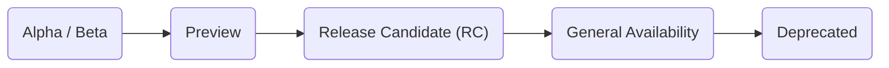

## Open source release stages

Apollo open source project releases proceed through the following stages:

### Alpha / Beta

An alpha or beta release is in volatile, active development. The release might not be feature-complete, and breaking API changes are possible between individual versions.

These stages help Apollo gather feedback and issues from community members and customers who are enthusiastic early adopters.

### Preview

A preview release is in active development, but breaking changes are unlikely between versions. A preview release should not introduce any _unintentional_ regressions from the previous GA release, but bugs might be present in new functionality. 

You're encouraged to test out preview releases in your local development environment to familiarize yourself with upcoming features before they reach general availability.

### Release candidate (RC)

A release candidate (RC) release is considered potentially viable for general availability. Minor bugs might still be present, and documentation for the release might be incomplete.

You're encouraged to test out RC releases in a staging environment to help Apollo identify any remaining issues.

### General availability (GA)

A generally available release has been deemed ready for use in a production environment. Its documentation is considered sufficient for widespread adoption.

### Deprecated

A deprecated release (or individual feature) is no longer officially supported by Apollo. It might continue to work, but Apollo does not guarantee that it will _continue_ to work.

You should avoid relying on deprecated releases or features whenever possible.

## Platform release stages

Apollo platform releases (e.g., features of Apollo Studio) proceed through the following stages:

Note that some releases might _skip_ cetain stages. For example, a release might start with a public preview and then move directly to general availability.

### Opt-in preview

A feature in opt-in preview is _not_ enabled for Apollo users by default. Depending on the feature, users enable it either from the Apollo Studio UI or by contacting Apollo.

Opt-in previews might be announced via email, in the Apollo Studio UI, and/or on certain pages of the Apollo docs. They help Apollo gather feedback and issues from customers who are enthusiastic early adopters.

### Public preview

A feature in public preview is enabled for Apollo users by default. However, it might still contain bugs or undergo iteration on visual design.

This stage helps Apollo gather additional bug reports and feedback in preparation for general availability.

### Experimental

An experimental feature is deemed ready for use in a production environment. However, Apollo has not yet determined whether it will continue to develop the feature beyond its current functionality.

This stage helps Apollo prioritize work by determining a feature's usefulness and rate of adoption.

### General availability (GA)

A generally available release has been deemed ready for use in a production environment. Its documentation is considered sufficient for widespread adoption.

### Deprecated

A deprecated feature is no longer officially supported by Apollo. It might continue to work, but Apollo does not guarantee that it will _continue_ to work.

You should avoid relying on deprecated features whenever possible.
