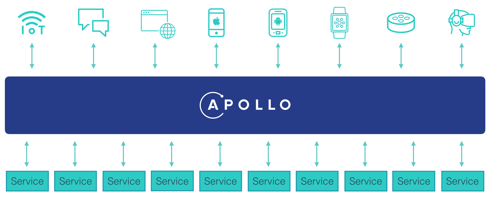
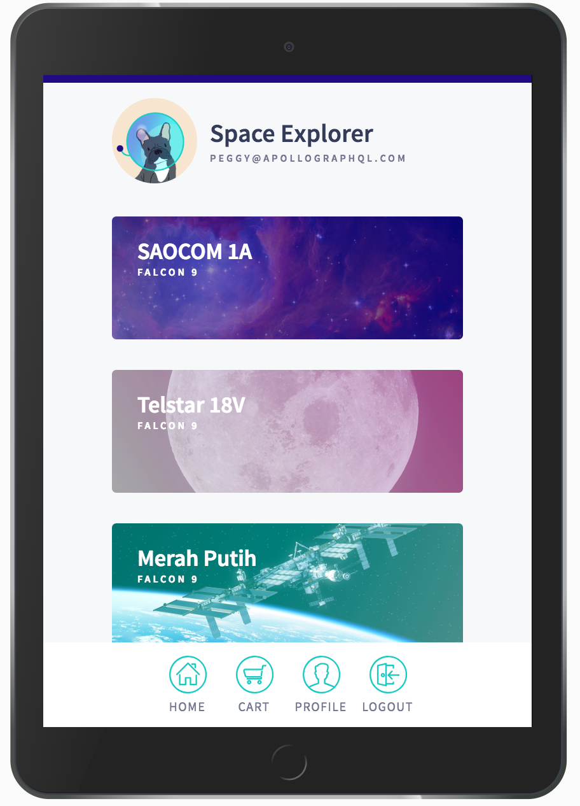

Welcome! We're excited that you've decided to learn Apollo. This fullstack tutorial will guide you through building your first app with the Apollo platform in about an hour. Throughout the tutorial, you'll learn how to build a graph API and connect it to a React frontend.

We want you to feel confident that you have the knowledge you need to build a production-ready app with Apollo, so we're forgoing hello world in favor of a real world example complete with authentication, pagination, testing, and more. Ready? Let's dive right in!

## What is Apollo?

Apollo is a complete platform for implementing a graph over your data. It includes two runtime libraries, **Apollo Server** and **Apollo Client**, for building and querying your graph's API. It also features developer tooling that integrates with your existing workflow and gives you full visibility into the performance and security of your graph.

Why do you need a graph? Today, one of the most difficult parts of building an app is figuring out your data layer. Often, there's many data sources you need to fetch from and many clients you need to support. When you layer a graph in between your services and your UI, you can remove a lot of complexity from your data fetching logic and ship features faster.

<div style="text-align:center">
  
</div>

**[GraphQL](https://www.graphql.org/)** is the specification that we'll be using to communicate between our graph API and client. The spec itself is language-agnostic and unopinionated, so we're choosing to implement GraphQL with the Apollo platform.

## What we'll build

In this tutorial, we'll build an interactive app for reserving your spot on an upcoming Space-X launch. You can think of it as an Airbnb for space travel! All of the data is real, thanks to the [SpaceX-API](https://github.com/r-spacex/SpaceX-API).

Here's what the finished app will look like:

<div style="text-align:center">
  
</div>

The app has five screens: a login screen, a list of launches, a launch detail, a profile page, and a cart. The graph API powering our space app connects to a REST API and a SQLite database. Don't worry if you're unfamiliar with those technologies, you don't need to know how to build a REST API or SQLite database from scratch in order to complete the tutorial.

We want this to model a real world Apollo app as much as possible, so we're covering essential topics like authentication, pagination, state management, testing, and deployment.

## Prerequisites

The tutorial assumes that you're comfortable with JavaScript/ES6, you've fetched data from an API before, and you have basic familiarity with React. If you need to brush up on your React skills, we recommend going through the [official tutorial](https://reactjs.org/tutorial/tutorial.html). Building your frontend with React is not a requirement for using Apollo, although it is the most popular way developers integrate with Apollo Client. Even if you use another view layer like Angular or Vue, you will still be able to pick up on the concepts covered in the client section and apply them to your view layer of choice.

### System requirements

Before we begin, make sure you have:

- [Node.js](https://nodejs.org/) v8.x or greater
- [npm](https://www.npmjs.com/) v6.x or greater
- [git](https://git-scm.com/) v2.14.1 or greater

While it's not a requirement, we recommend using [VSCode](https://code.visualstudio.com/) as your editor so you can take advantage of all the awesome features the Apollo VSCode extension enables. We're hoping to support other editors in the future.

## Set up your development environment

Now the fun begins! First, you'll need to install our developer tools:

- [Apollo Engine (required)](https://engine.apollographql.com) : Our cloud service where you'll register and manage your graph API.
- [Apollo DevTools for Chrome (suggested)](https://chrome.google.com/webstore/detail/apollo-client-developer-t/jdkknkkbebbapilgoeccciglkfbmbnfm) : Our Chrome extension giving you full visibility into your client.
- [Apollo VSCode (suggested)](https://marketplace.visualstudio.com/items?itemName=apollographql.vscode-apollo): Our editor integration that offers intelligent autocomplete, metrics, and more.

Next, in your terminal, clone [this repository](https://github.com/apollographql/fullstack-tutorial):

```bash
git clone https://github.com/apollographql/fullstack-tutorial/
```

There are two folders: one for the starting point (`start`) and one for the final version (`final`). Within each directory are two folders: one for the server and one for the client. We will be working in the server folder first. If you're comfortable with building a graph API already and you want to skip to the client portion, navigate to the [last half of the tutorial](/tutorial/client/).

<!--
TODO: Add in this section after Apollo VSCode works for server development
### Configure Apollo VSCode -->

### Where can I get help?

We know that learning a new technology can sometimes be overwhelming, and it's totally normal to get stuck! If that happens, we recommend joining the [Apollo Spectrum](https://spectrum.chat/apollo) community and posting in the relevant channel (either #apollo-server or #apollo-client) for some quick answers.

If something in the tutorial seems confusing or contains an error, we'd love your feedback! Just click the Edit on GitHub link on the right side of the page to open a new pull request or open an issue on the repository.
