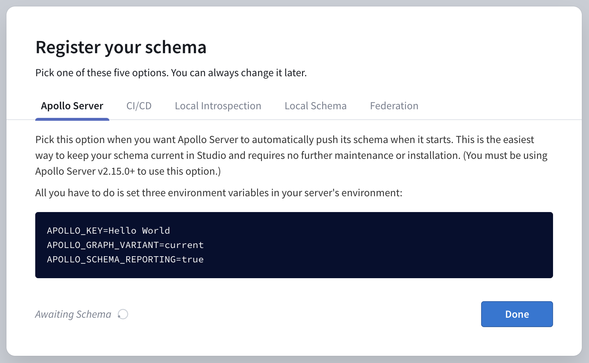
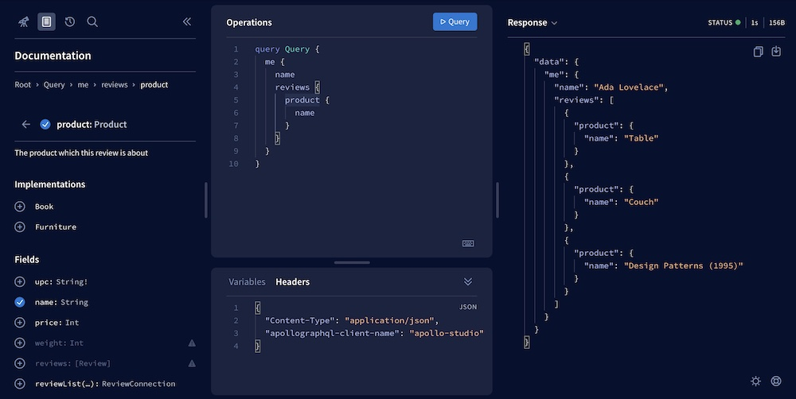
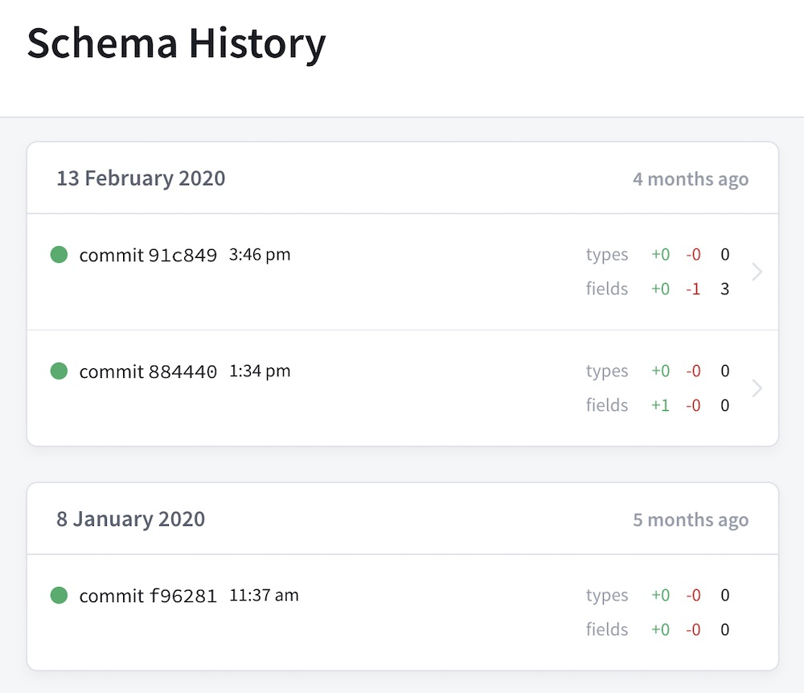
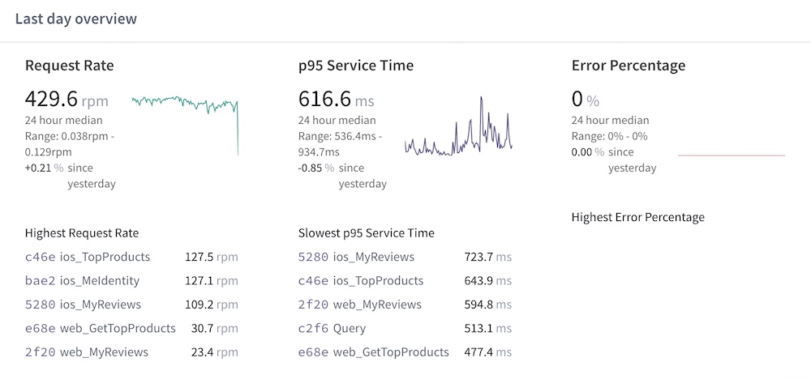

> Time to accomplish: 10 Minutes

Great work! We have a running GraphQL server that interacts with data from multiple sources. Now before we jump over to the client side, let's turn on some powerful tooling.

**Apollo Studio** is a cloud platform that helps you with every phase of GraphQL development, from prototyping to deploying to monitoring.

Studio's core features are free for everyone. All of the features in this tutorial are free features.

## Create an Apollo account

> Skip this if you already created an account to use the Apollo Studio Explorer.

Visit [studio.apollographql.com](https://studio.apollographql.com) and click **Create an account**. You can sign up either with your GitHub account or by setting a username and password.

After signing up, you're redirected to your Apollo Studio homepage.

## Create your first graph

In Apollo Studio, each **graph** is a distinct data graph with a corresponding GraphQL schema. For your first graph, we'll use the schema of the server you just finished building.

1. From your [Studio homepage](https://studio.apollographql.com), click **New Graph** in the upper right.
2. Provide a name for your graph and set the **Graph type** to **Deployed**.
    > Earlier, we [created a private _development_ graph](./schema/#with-apollo-studio-recommended) with Studio. This time we're creating a _deployed_ graph, which is shared with other members of our organization.
3. Click **Next**. A dialog appears instructing to you register your schema. We'll do that in the next step.

## Connect your server

Apollo Server can communicate directly with Apollo Studio to register its schema and push useful performance metrics. This communication requires a **graph API key**. Let's obtain one for our graph.

From your [Studio homepage](https://studio.apollographql.com), click your newly created graph. This displays the same dialog that appeared after you created it:

</img>

Your graph API key is the value that appears just after `APOLLO_KEY=` in the first code block (it starts with `service:`). Copy it.

You provide your API key to Apollo Server by setting it as the value of the `APOLLO_KEY` environment variable. Conveniently, our example app already uses the `dotenv` package to read environment variables from a `.env` file.

Create a `.env` file in `start/server` by making a copy of `start/server/.env.example`. Then paste your API key into it like so, and add `APOLLO_SCHEMA_REPORTING=true` as well:

```none:title=.env
APOLLO_KEY=PASTE_YOUR_KEY_HERE
APOLLO_SCHEMA_REPORTING=true
```

> **Graph API keys are secret credentials.** Never share them outside your organization or commit them to version control. Delete and replace API keys that might be compromised.


Start up your server using `npm start`, then return to your Studio homepage. After a few seconds, clicking on your graph will now open its full details.

## Try out free Studio features

Connecting your server to Apollo Studio activates a variety of powerful features: 

### The Explorer

As shown [earlier in the tutorial](./schema/#explore-your-schema) the Apollo Studio Explorer provides a comprehensive view into your schema, including all documentation strings you include in it. Use it to build queries and execute them on your server.

</img>

### Schema history

Open the **History** tab to view a full revision history of the schema versions your server pushes over time:

</img>

This history helps you identify exactly when a particular type or field was added or removed, which is crucial when diagnosing an issue.

### Operation metrics

Apollo Server pushes metrics data to Studio for each GraphQL operation it executes. This data includes a breakdown of the timing and error information for each field that's resolved as part of the operation.

> Apollo Server does **not** push GraphQL operation results to Studio. For more information, see [Data privacy and compliance](https://www.apollographql.com/docs/studio/data-privacy/).

Open the **Operations** tab to view performance data based on the last 24 hours of your server's operation traces:

</img>

> Organizations with a paid Studio plan can view metrics for the last 90 days or more, depending on the plan.  For more information on paid Studio features, see the [Studio documentation](https://www.apollographql.com/docs/studio/).

<hr/>

Now that our server is connected to Studio, let's start building a client to execute some queries!
