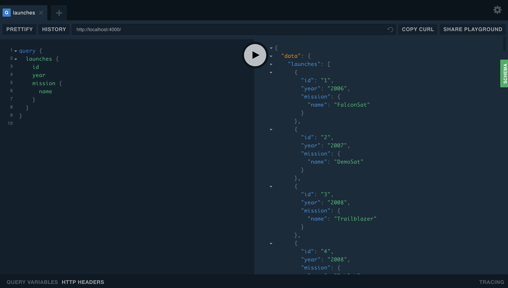
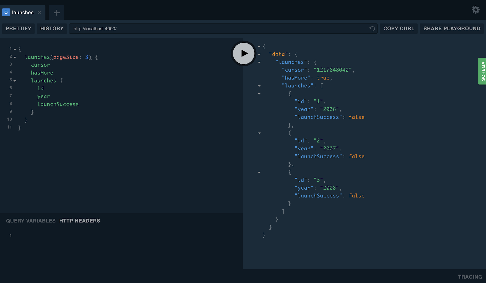

It's time to finally leverage all the data sources logic in our graph's resolvers. Resolvers provide the instructions for turning a graph operation into data. They are functions that fetch or modify data from underlying data sources for fields in a schema type. There are a few things to note about resolver functions.

1. A resolver function must bear the same name as the field it operates on.
2. A resolver function must return the type of data that was specified in the schema field.

<h2 id="data-sources">Call your data sources in resolvers</h2>

In the previous section of this tutorial, two data source classes were created and passed as options to the `ApolloServer` constructor. We'll access those data sources in our resolvers soon! First, let's know more about a resolver function signature.

Resolver functions accepts four arguments:

```js
fieldName(parent, args, context, info) {
 // implementation
}
```

* **parent**: This is an object that contains the result returned from the resolver on the parent field.
* **args**: This is an object that contains the field arguments specified in a query.
* **context**: This is an object shared by all resolvers in a particular query, and is used to contain per-request state, including authentication information, dataloader instances, and anything else that should be taken into account when resolving the query.
* **info**: This argument has information about the execution state of the query. Mostly used in advanced cases.

Go ahead and create a `resolvers.js` file in the `src` directory. Let's start with the `Query` resolver functions.

Copy the code below and paste it in the file.

_src/resolvers.js_

```js
module.exports = {
  Query: {
    launches: async (_, __, { dataSources }) =>
      dataSources.launchAPI.getAllLaunches(),
    launch: (_, { id }, { dataSources }) =>
      dataSources.launchAPI.getLaunchById({ launchId: id }),
    me: async (_, __, { dataSources }) =>
      dataSources.userAPI.findOrCreateUser(),
  },
};
```

The code above shows the resolver functions for the `Query` type fields: `launches`, `launch`, and `me`.

Note that the `{ dataSources }` appear as the third argument in any resolver function because Apollo Server puts the `dataSources` object on the context for every request.

The `launches` resolver invokes the `getAllLaunches` function from the launch data source class and returns its data.

The `launch` resolver takes in an `id` as the second argument which represents a `launchId`. Then, a request is made to fetch a launch by calling the `getLaunchById` method of the launch data source class.

The `me` resolver simply checks if a user exists or not via the `findOrCreateUser()` from the user data source class. If the user doesn't exist, then a new user is created, stored and returned.

The resolver functions look simple and concise because the logic is embedded in the launch and user data sources. Both classes abstracted the code away.

Now, let's move on to the `Mutation` resolver functions.

Copy the code below and paste it just after the `Query` resolver functions in the file.

_src/resolvers.js_

```js
...
Mutation: {
  bookTrip: async (_, { launchId }, { dataSources }) => {
    const result = await dataSources.userAPI.bookTrip({ launchId });
    if (!result)
      return {
        success: false,
        message: 'failed to book trip',
      };

    const launch = await dataSources.launchAPI.getLaunchById({ launchId });
    return {
      success: true,
      message: 'trip booked',
      launch,
    };
  },
  cancelTrip: async (_, { launchId }, { dataSources }) => {
    const result = dataSources.userAPI.cancelTrip({ launchId });

    if (!result)
      return {
        success: false,
        message: 'failed to cancel trip',
      };

    const launch = await dataSources.launchAPI.getLaunchById({ launchId });
    return {
      success: true,
      message: 'trip cancelled',
      launch,
    };
  },
  login: async (_, { email }, { dataSources }) => {
    const user = await dataSources.userAPI.findOrCreateUser({ email });
    if (user) return new Buffer(email).toString('base64');
    return false;
  },
},
```

As shown in the code above, there are three resolver functions, `bookTrip`, `cancelTrip`, and `login`.

The `bookTrip` function takes in a `launchId`, and makes a request to book a trip for that particular launch. If a trip is booked successfully, then the function retrieves the booked launch and returns an object containing a success status and message back to the client.

The `cancelTrip` function takes in a `launchId`, and makes a request via the `cancelTrip` method of the user data source to cancel a trip. If a trip is canceled successfully, then the function retrieves the launch that has been canceled and returns an object indicating a success status back to the client.

For both functions, if the request fails, then an object containing a failed success status and message is returned to the client.

The `login` function takes in an email, checks the user table in the database via the `findOrCreateUser` method to verify if the user exists or not. If the user exists or a new user is created, return a `base64` encoding of the user's email.

The `base64` encoding of the user's detail is for obscuring the data. The result is a form of unique string token which we use for authentication.

Now, we need to add a resolver function to take care of the booked status on a launch. Copy the code below and paste it just after the `Mutation` resolver functions.

_src/resolvers.js_

```js
...
Launch: {
  isBooked: async (launch, _, { dataSources }) =>
    dataSources.userAPI.isBookedOnLaunch({ launchId: launch.id }),
}
```

The `isBooked` function makes a request to the `isBookedOnLaunch` method of the `UserAPI` datasource class with the id of a launch. This request confirms whether the launch has been booked by the logged-in user.

Now, let's implement the `Mission` resolver function.

Copy the code below and paste it just after the `Launch` resolver function.

_src/resolvers.js_

```js
...
Mission: {
  missionPatch: (mission, { size }) => {
    return size === 'SMALL'
      ? mission.missionPatchSmall
      : mission.missionPatchLarge;
  }
},
```

The `missionPatch` function checks wether a certain patch size, either `SMALL` OR `LARGE` was passed as an argument. Based on the argument value, the appropriate mission patch is then returned as part of the Launch to the client.

Now, let's implement the `User` resolver functions.

Copy the code below and paste it just after the `Mission` resolver function.

_src/resolvers.js_

```js
...
User: {
  trips: async (_, __, { dataSources }) => {
    // get ids of launches by user
    const launchIds = await dataSources.userAPI.getLaunchIdsByUser();

    if (!launchIds.length) return [];

    // look up those launches by their ids
    return (
      dataSources.launchAPI.getLaunchesByIds({
        launchIds,
      }) || []
    );
  },
},
```

When trips for a particular user are requested for, what data is returned?

The `trips` resolver function works like the steps outlined below:

1. It fetches the ids of all the launches a user has ever booked a trip for via the user data source's `getLaunchIdsByUser()` method. Check the code for the `getLaunchIdsByUser` method in the `UserAPI` class to refresh your memory on how the fetch happens.
2. If there are no launch ids, an empty array is returned. This means the user has not embarked on any trip.
3. If there's an array of launch ids, fetch all the launches via their ids.

<h2 id="write-query">Write a query in the playground</h2>

Apollo Server sets up GraphQL Playground so that you can start running queries and exploring schemas quickly. Go ahead and open the graph service URL in a browser, `http://localhost:4000/`.

Start by copying the query below and pasting it in the left side of the playground. After pasting, hit the Play button at the center to get a response.

```js
query {
  launches {
    id
    year
    mission {
      name
    }
  }
}
```

A response like this should be returned at the right side of the playground.



<h2 id="pagination">Pagination</h2>

The `launches` query returned a large data set of launches. This data set contains too much data to be fetched all at once.

Pagination is a solution to the challenge of fetching all the data at once. It's a technique that ensures that the server only sends data in small chunks per time. There are two major ways of fetching paginated data: offset-based (otherwise known as numbered pages), and cursor-based pagination.

Cursor-based pagination is the more efficient way of fetching paginated data because it eliminates the possibility of skipping items and displaying the same item more than once. In cursor-based pagination, a constant pointer is used to keep track of where in the data set the next items should be fetched from. This pointer is called a **cursor**.

We'll use a cursor-based pagination for our graph API. This approach requires two parameters:

* The number of items to fetch at once.
* The cursor.

Open up the `src/schema.js` file and update the `Query` type. Go ahead and add a new type called `LaunchConnection` to the schema as shown below:

_src/schema.js_

```js
type Query {
  launches(
    """
    The number of results to show. Must be >= 1. Default = 20
    """
    pageSize: Int
    """
    If you add a cursor here, it will only return results _after_ this cursor
    """
    after: String
  ): LaunchConnection!
  launch(id: ID!): Launch
  me: User
}

"""
Simple wrapper around our list of launches that contains a cursor to the
last item in the list. Pass this cursor to the launches query to fetch results
after these.
"""
type LaunchConnection {
  cursor: String!
  hasMore: Boolean!
  launches: [Launch]!
}
...
```

The `launches` field takes in two parameters, `pageSize` and `after`. `pageSize` refers to the number of items to show at once while `after` refers to the cursor that keeps track of where the next set of data should be fetched from. We created a `LaunchConnection` type that returns a result that shows the list of launches with a `cursor` field and a `hasMore` field to indicate if there's more data to be fetched.

Copy the pagination helper code below and paste it in the `src/utils.js` file.

_src/utils.js_

```js
module.exports.paginateResults = ({
  after: cursor,
  pageSize = 20,
  results,
  // can pass in a function to calculate an item's cursor
  getCursor = () => null,
}) => {
  if (pageSize < 1) return [];
  if (!cursor) return results.slice(0, pageSize);

  const cursorIndex = results.findIndex(item => {
    // if an item has a `cursor` on it, use that, otherwise try to generate one
    let itemCursor = item.cursor ? item.cursor : getCursor(item);
     // if there's still not a cursor, return false by default
    return itemCursor ? cursor === itemCursor : false;
  });

  return cursorIndex >= 0
    ? cursorIndex === results.length - 1 // don't let us overflow
      ? []
      : results.slice(
          cursorIndex + 1,
          Math.min(results.length, cursorIndex + 1 + pageSize),
        )
    : results.slice(0, pageSize);
   results.slice(cursorIndex >= 0 ? cursorIndex + 1 : 0, cursorIndex >= 0);
};
```

The code above is a helper function for paginating data from the server.Now, let's update the necessary resolver functions to accomodate pagination.

First, copy the code below and add it to the top of the `src/resolvers.js` file.

```js
const { paginateResults } = require('./utils');
```

We required the `paginateResults` function from the `src/utils.js` file. Now, update the `launches` resolver function in the `src/resolvers.js` file with the code below:

_src/resolvers.js_

```js
...
Query: {
  launches: async (_, { pageSize = 20, after }, { dataSources }) => {
    const allLaunches = await dataSources.launchAPI.getAllLaunches();
    const launches = paginateResults({
      after,
      pageSize,
      results: allLaunches,
    });

    return {
      launches,
      cursor: launches.length ? launches[launches.length - 1].cursor : null,
      // if the cursor of the end of the paginated results is the same as the
      // last item in _all_ results, then there are no more results after this
      hasMore: launches.length
        ? launches[launches.length - 1].cursor !==
          allLaunches[allLaunches.length - 1].cursor
        : false,
    };
  },
...
```

Let's test the cursor-based pagination we just implemented. Go ahead and run your GraphQL server, write a `launches` query in GraphQL Playground with a `pageSize` value of 3 passed as an argument and hit the Play button.

The response should look like the paginated data shown below:



<h2 id="authentication">Authenticate users</h2>

Authentication is a common part of every application. There are several ways to [handle authentication and authorization in your graph API](https://www.apollographql.com/docs/guides/access-control.html).

In this tutorial, we use a login token in an HTTP authorization header and put user info on the `context`.

Update the `context` section of the `ApolloServer` constructor in `src/index.js` to have the code shown below:

_src/index.js_

```js
...
// Set up Apollo Server
const server = new ApolloServer({
  ...
  context: async ({ req }) => {
    // simple auth check on every request
    const auth = (req.headers && req.headers.authorization) || '';

    const email = new Buffer(auth, 'base64').toString('ascii');

    // if the email isn't formatted validly, return null for user
    if (!isEmail.validate(email)) return { user: null };
     // find a user by their email
    const users = await store.users.findOrCreate({ where: { email } });

    const user = users && users[0] ? users[0] : null;

    return { user: { ...user.dataValues } };
  },
});
```

In the `ApolloServer` constructor, we have a `context` function that takes in a request object. The context is usually generated again with every new request, so we can track the content of request headers on every request. The context function returns what we know as the `context` object. The `context` object is one that gets passed to every single resolver at every level, so we can access it anywhere in our schema code. We can store things like database connections, and user information in the `context` object.

In the code above, the context function extracts the value of the `authorization` header and stores it in an `auth` variable. It then verifies the value, which is a short token. The expected value is a valid email address. If the expected email address is valid, a request is made to check the database whether a user with that email address exists in the `users` table. If the user does not exist, a new user is created and a context object containing the logged-in user is returned to the resolvers.

If the user exists, a context object containing the logged-in user is returned to the resolver functions.

How do we create the token passed to the `authorization` headers? Check out the Query `login` resolver function again.

_src/resolvers.js_

```js
...
Mutation: {
  ...
  login: async (_, { email }, { dataSources }) => {
    const user = await dataSources.userAPI.findOrCreateUser({ email });
    if (user) return new Buffer(email).toString('base64');
    return false;
},
...
```

The `login` function receives an email address and checks the user table in the database if there's a user with that email address. If a user exists, the `login` function returns an an array containing the user object, else a new user is created.

Once a user object is present, the email is then converted to a base64 encoded string using the [Buffer](https://nodejs.org/api/buffer.html) class. The result is a short string token, that can now be sent to the server via an `authorization` header.

<h2 id="testing">Test your graph</h2>