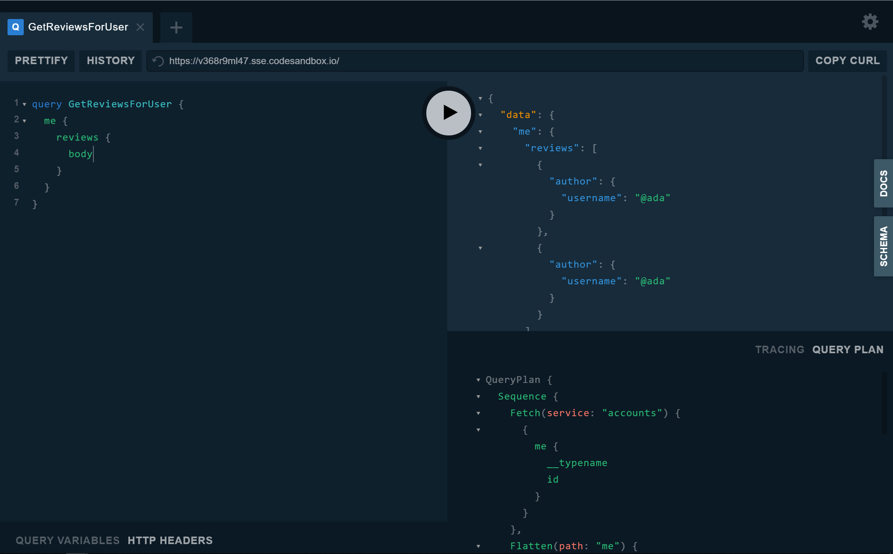
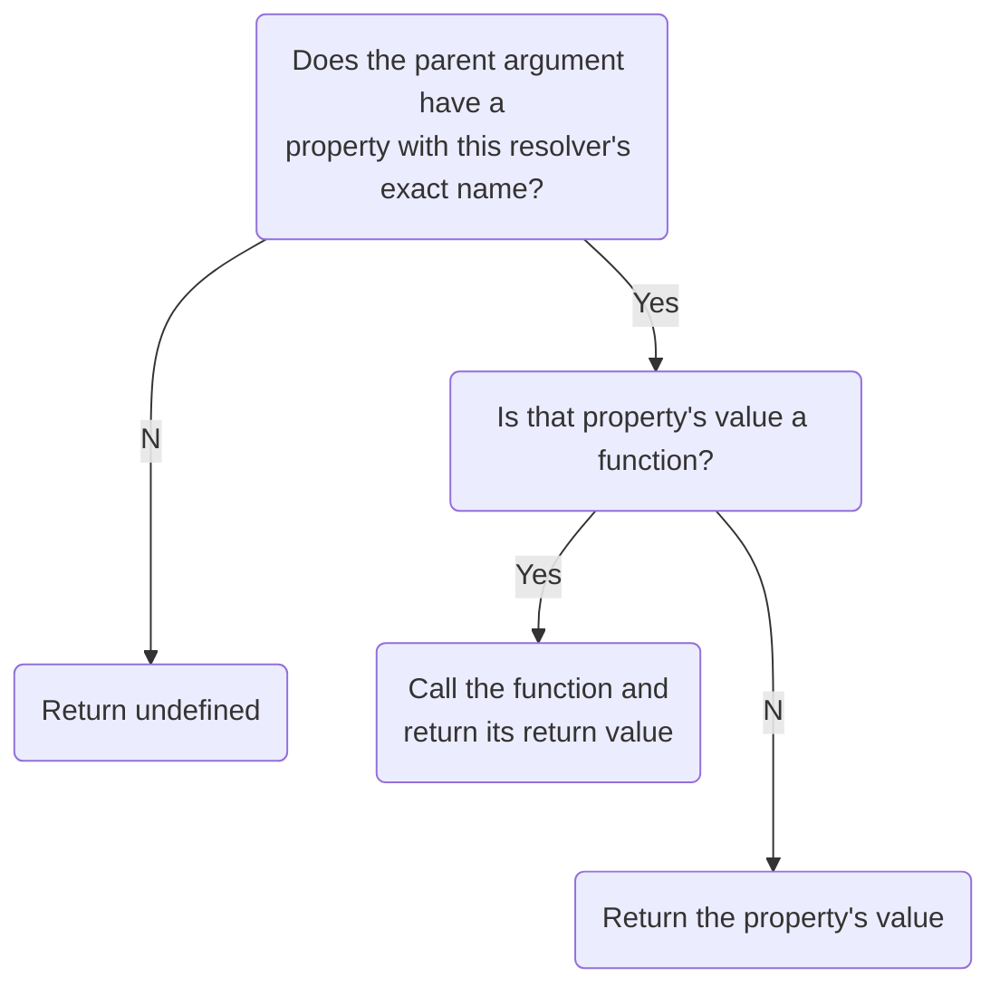

> Time to accomplish: 15 minutes

We've designed our schema and configured our data sources, but our server doesn't know how to _use_ its data sources to populate schema fields. To solve this, we'll define a collection of resolvers.

**A resolver is a function that's responsible for populating the data for a single field in your schema.** Whenever a client queries for a particular field, the resolver for that field fetches the requested data from the appropriate data source.

A resolver function returns one of the following:

* Data of the type required by the resolver's corresponding schema field (string, integer, object, etc.)
* A promise that fulfills with data of the required type

## The resolver function signature

Before we start writing resolvers, let's cover what a resolver function's signature looks like. Resolver functions can optionally accept four positional arguments:

```js
fieldName: (parent, args, context, info) => data;
```

- `parent`: This is the return value of the resolver for this field's parent (the resolver for a parent field always executes _before_ the resolvers for that field's children).
- `args`: This object contains all [GraphQL arguments](https://graphql.org/graphql-js/passing-arguments/) provided for this field.
- `context`: This object is shared across all resolvers that execute for a particular operation. Use this to share per-operation state, such as authentication information and access to data sources.
- `info`: This contains information about the execution state of the operation (used only in advanced cases).

Of these four arguments, our app will mostly use `context`. It enables our resolvers to share instances of our `LaunchAPI` and `UserAPI` data sources. To see how that works, let's get started creating some resolvers.

## Define top-level resolvers

As mentioned above, the resolver for a parent field always executes before the resolvers for that field's children. Therefore, let's start by defining resolvers for some top-level fields: the fields of the `Query` type.

As `src/schema.js` shows, our schema's `Query` type defines three fields: `launches`, `launch`, and `me`. To define resolvers for these fields, open `src/resolvers.js` and paste the code below:

```js:title=src/resolvers.js
module.exports = {
  Query: {
    launches: (_, __, { dataSources }) =>
      dataSources.launchAPI.getAllLaunches(),
    launch: (_, { id }, { dataSources }) =>
      dataSources.launchAPI.getLaunchById({ launchId: id }),
    me: (_, __, { dataSources }) => dataSources.userAPI.findOrCreateUser()
  }
};
```

As this code shows, we define our resolvers in a **map**, where the map's keys correspond to our schema's types (`Query`) and fields (`launches`, `launch`, `me`).

Regarding the function arguments above:

* All three resolver functions assign their first [positional argument](#the-resolver-function-signature) (`parent`) to the variable `_` as a convention to indicate that they don't use its value.

* The `launches` and `me` functions assign their _second_ positional argument (`args`) to `__` for the same reason. 

    * (The `launch` function _does_ use the `args` argument, however, because our schema's `launch` field takes an `id` argument.)

* All three resolver functions _do_ use the third positional argument (`context`). Specifically, they destructure it to access the [`dataSources` we defined](./data-source).

* None of the resolver functions includes the fourth positional argument (`info`), because they don't use it and there's no other need to include it.

As you can see, these resolver functions are short! That's possible because most of the logic they rely on is part of the `LaunchAPI` and `UserAPI` data sources. By keeping resolvers thin as a best practice, you can safely refactor your backing logic while reducing the likelihood of breaking your API.

## Add resolvers to Apollo Server

Now that we have some resolvers, let's add them to our server. Add the highlighted lines to `src/index.js`:

```js:title=src/index.js
const { ApolloServer } = require('apollo-server');
const typeDefs = require('./schema');
const { createStore } = require('./utils');
const resolvers = require('./resolvers'); // highlight-line

const LaunchAPI = require('./datasources/launch');
const UserAPI = require('./datasources/user');

const store = createStore();

const server = new ApolloServer({
  typeDefs,
  resolvers, // highlight-line
  dataSources: () => ({
    launchAPI: new LaunchAPI(),
    userAPI: new UserAPI({ store })
  })
});

server.listen().then(({ url }) => {
  console.log(`🚀 Server ready at ${url}`);
});
```

By providing your resolver map to Apollo Server like so, it knows how to call resolver functions as needed to fulfill incoming queries. 

## Run test queries

Apollo Server includes an IDE called **GraphQL Playground** that allows you to explore your schema and run test queries on it:

</img>

Go ahead and start your server by running `npm start` and visit `http://localhost:4000/` in your browser to open GraphQL Playground.

Let's run a test query on our server! Paste the query below into the left text area of  GraphQL Playground:

```graphql
# We'll cover more about the structure of a query later in the tutorial.
query GetLaunches {
  launches {
    id
    mission {
      name
    }
  }
}
```

Then, click the circular play button in the middle of the page to execute it. Our server's response appears on the right. See how the structure of the response object matches the structure of the query? This correspondence is a fundamental feature of GraphQL.

Now let's try a test query that takes a **GraphQL argument**. Paste the following query and run it:

```graphql
query GetLaunchById {
  launch(id: 60) {
    id
    rocket {
      id
      type
    }
  }
}
```

This query returns the details of the `Launch` object with the `id` `60`.

Instead of hard-coding the argument like the query above, GraphQL Playground lets you set variables in the bottom-left corner. Here's that same query using a variable instead of `60`:

```graphql
query GetLaunchById($id: ID!) {
  launch(id: $id) {
    id
    rocket {
      id
      type
    }
  }
}
```

Now, paste the following into the Query Variables text area of GraphQL Playground:

```json:title=QUERY_VARIABLES
{
  "id": 60
}
```

Feel free to experiment more with running queries and setting variables before moving on.


## Define other resolvers

You might have noticed that the [test queries](#run-test-queries) we ran above included several fields that we haven't even written resolvers for. But somehow those queries still ran successfully! That's because Apollo Server defines a **default resolver** for any field you don't define a custom resolver for.

A default resolver function uses the following logic:



For most (but not all) fields of our schema, a default resolver does exactly what we want it to. Let's define a custom resolver for a schema field that needs one, `Mission.missionPatch`.

This field has the following definition:

```graphql
# YOU DON'T NEED TO COPY THIS CODE.
type Mission {
  # Other field definitions...
  missionPatch(size: PatchSize): String
}
```

The resolver for `Mission.missionPatch` should return a different value depending on whether a query specifies `LARGE` or `SMALL` for the `size` argument.

Add the following to your resolver map in `src/resolvers.js`, below the `Query` property:

```js:title=src/resolvers.js
Mission: {
  // The default size is 'LARGE' if not provided
  missionPatch: (mission, { size } = { size: 'LARGE' }) => {
    return size === 'SMALL'
      ? mission.missionPatchSmall
      : mission.missionPatchLarge;
  },
},
```

This resolver obtains a large or small patch from `mission`, which is the object returned by the default resolver for the _parent_ field in our schema, `Launch.mission`.

Now that we know how to add resolvers for types besides `Query`, let's add some resolvers for fields of the `Launch` and `User` types. Add the following to your resolver map, below `Mission`:

```js:title=src/resolvers.js
Launch: {
  isBooked: async (launch, _, { dataSources }) =>
    dataSources.userAPI.isBookedOnLaunch({ launchId: launch.id }),
},
User: {
  trips: async (_, __, { dataSources }) => {
    // get ids of launches by user
    const launchIds = await dataSources.userAPI.getLaunchIdsByUser();

    if (!launchIds.length) return [];

    // look up those launches by their ids
    return (
      dataSources.launchAPI.getLaunchesByIds({
        launchIds,
      }) || []
    );
  },
},
```

You might be wondering how our server knows the identity of the current user when calling functions like `getLaunchIDsByUser`. It doesn't yet! We'll fix that in the next chapter.

## Paginate results

Currently, `Query.launches` returns a long list of `Launch` objects. This is often more information than a client needs at once, and fetching that much data can be slow. We can improve this field's performance by implementing **pagination**.

Pagination ensures that our server sends data in small chunks. We recommend **cursor-based pagination** for numbered pages, because it eliminates the possibility of skipping an item or displaying the same item more than once. In cursor-based pagination, a constant pointer (or cursor) is used to keep track of where to start in the data set when fetching the next set of results.

Let's set up cursor-based pagination. In `src/schema.js`, update `Query.launches` to match the following, and also add a new type called `LaunchConnection` like so:

```graphql:title=src/schema.js
type Query {
  launches( # replace the current launches query with this one.
    """
    The number of results to show. Must be >= 1. Default = 20
    """
    pageSize: Int
    """
    If you add a cursor here, it will only return results _after_ this cursor
    """
    after: String
  ): LaunchConnection!
  launch(id: ID!): Launch
  me: User
}

"""
Simple wrapper around our list of launches that contains a cursor to the
last item in the list. Pass this cursor to the launches query to fetch results
after these.
"""
type LaunchConnection { # add this below the Query type as an additional type.
  cursor: String!
  hasMore: Boolean!
  launches: [Launch]!
}
```

Now, `Query.launches` takes in two parameters (`pageSize` and `after`) and returns a `LaunchConnection` object. The `LaunchConnection` includes:

* A list of `launches` (the actual data a query is requesting)
* A `cursor` that indicates the current position in the data set
* A `hasMore` boolean that indicates whether the data set contains any more items beyond those included in `launches`

Open `src/utils.js` and check out the `paginateResults` function. This is a helper function for paginating data from the server.

Now, let's update the necessary resolver functions to accommodate pagination. Import `paginateResults` and replace the `launches` resolver function in `src/resolvers.js` with the code below:

```js{1,5-26}:title=src/resolvers.js
const { paginateResults } = require('./utils');

module.exports = {
  Query: {
    launches: async (_, { pageSize = 20, after }, { dataSources }) => {
      const allLaunches = await dataSources.launchAPI.getAllLaunches();
      // we want these in reverse chronological order
      allLaunches.reverse();

      const launches = paginateResults({
        after,
        pageSize,
        results: allLaunches
      });

      return {
        launches,
        cursor: launches.length ? launches[launches.length - 1].cursor : null,
        // if the cursor of the end of the paginated results is the same as the
        // last item in _all_ results, then there are no more results after this
        hasMore: launches.length
          ? launches[launches.length - 1].cursor !==
            allLaunches[allLaunches.length - 1].cursor
          : false
      };
    },
    launch: (_, { id }, { dataSources }) =>
      dataSources.launchAPI.getLaunchById({ launchId: id }),
     me: async (_, __, { dataSources }) =>
      dataSources.userAPI.findOrCreateUser(),
  }
};
```

Let's test the cursor-based pagination we just implemented. Restart your server with `npm start` and run this query in GraphQL Playground:

```graphql
query GetLaunches {
  launches(pageSize: 3) {
    launches {
      id
      mission {
        name
      }
    }
  }
}
```

Thanks to our pagination implementation, the server should only return three launches instead of the full list.
