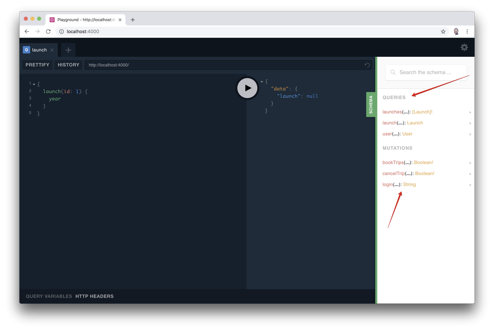

<h2 id="setup">Set up Apollo Server</h2>

Apollo Server is a library that helps you build a production-ready graph API over your data. It can connect to any data source, including REST APIs and databases, and it seamlessly integrates with Apollo developer tooling.

We need to install two packages when setting up Apollo Server:

```bash
npm install apollo-server graphql --save
```

* [apollo-server](https://npm.im/apollo-server): This is the Apollo Server library.
* [graphql](https://npm.im/graphql): This package is the JavaScript reference implementation for GraphQL. It's needed for Apollo Server to function as intended.

Create an `src` directory and add an `index.js` file.

Now, import `ApolloServer` and `gql` from the `apollo-server` library.

_src/index.js_

```js
const { ApolloServer, gql } = require('apollo-server');
```

In the code above, we imported the `ApolloServer` class and `gql` tag from the `apollo-server` package.

* **ApolloServer**: The `ApolloServer` class instantiates and starts a new GraphQL server.
* **gql**: The `gql` tag is a JavaScript template literal tag that enables syntax highlighting for our schema.

<h2 id="write-schema">Write your graph's schema</h2>

Every GraphQL server runs a schema at its core. A schema defines types and their relationships. The specifications of the types of queries that can be run against a GraphQL server are defined in a schema. Let's design the schema for our app.

GraphQL schemas are at their best when they are designed around the needs of client applications. In fact, this concept is called **Schema First Development**, an approach for building applications with GraphQL that involves the frontend and backend teams agreeing on a schema first, which serves as a contract between the UI and the backend before any API development commences.

In our app, we need to provide the following features:

* Fetch all upcoming rocket launches.
* Fetch a specific launch.
* A user should be able to login to be authorized to book and cancel launch trips.
* A user should be able to book launch trips.
* A user should be able to cancel launch trips.

We'll use these features to derive the form of queries and mutations our schema needs.

* **First feature:** An example of a query for fetching all upcoming rocket launches would look like:

```js
{
  launches {
    id
    year
    passengers
  }
}
```

* **Second feature:** An example of a query for a specific launch would look like:

```js
{
  launch(id: 2) {
    id
    year
  }
}
```

An id is passed to the launch query and the details of the 2nd launch is returned. It could be the first or third or any number specified in the query.

From the **third feature**, we start to deal with users. A query for a signed in user comes to mind here and that would look like:

```js
{
  user {
    id
    email
  }
}
```

Still focusing on the **third feature**, a user needing to log in seems more than just a query. In most cases, data changes occur such as a new user profile been created because the user doesn't exist. In this case, we're dealing with a `mutation`, which is a special type of query that modifies data.

```js
mutation {
  login(email: "johndoe@gmail.com") {
    id
  }
}
```

The **fourth feature** signifies creation of new data. An example of a mutation for booking a trip would look like:

```js
mutation bookTrip {
  bookTrip(launchId: 3) {
    id
  }
}
```

The **fifth feature** signifies destruction of data. An example of a mutation for cancelling a trip would look like:

```js
mutation cancelTrip {
  cancelTrip(launchId: 3) {
    id
  }
}
```

Let's make some schema types now based on these queries and mutations, starting with the `Query` and `Mutation` types which are the entry points into a schema.

```js
type Query {
  launches: [Launch]!
  launch(id: ID!): Launch
  me: User
}
```

`Launch` is a _GraphQL Object Type_ that has some fields. Once your query requires more than one data attribute to be returned, group them into an object type like the type below:

```js
type Launch {
  id: ID!
  year: String!
  mission: Mission!
  rocket: Rocket!
  launchSuccess: Boolean
}
```

In the `Launch` type, we have fields with scalar types and object types. GraphQL has built-in scalar types, `Int`, `String`, `Boolean`, `ID` which represents the leaves of an operation while object types are user-defined GraphQL types. The object types here are `Mission`, `Rocket`, and `User`. We need to define the fields for these object types.

```js
type Mission  {
  name: String!
  missionPatch: String
}
```

This represents a mission that requires a `name` and `missionPatch` details.

```js
type Rocket {
  id: ID!
  name: String!
  type: String!
}
```

This represents a rocket for a launch. An `ID`, `name`, and `type` fields are needed to identify a rocket.

```js
type User {
  id: ID!
  email: String!
  trips: [Launch]!
}
```

The `id` and `email` are fields for identifying a user. The `trips` field is necessary for providing easy access to the number of trips a user has booked.

Let's now deal with the `Mutation` type.

The `Mutation` type defines the entry points into Apollo server for modifying server data. For the `Mutation` type, based on our sample mutation queries, we can safely conclude that it should look like:

```js
type Mutation {
  bookTrip(launchId: ID!): Boolean!
  cancelTrip(launchId: ID!): Boolean!
  login(email: String): String
}
```

All the fields in the `Mutation` type returns a scalar type. The `bookTrip` field for booking a trip, `cancelTrip` field for cancelling a trip and the `login` field for authenticating a user.

Now, put everything together in a `src/schema.js` file.

_src/schema.js_

```js
const { gql } = require('apollo-server');

const typeDefs = gql`
  type Query {
    launches: [Launch]!
    launch(id: ID!): Launch
    me: User
  }
  type Mutation {
    bookTrip(launchId: ID!): Boolean!
    cancelTrip(launchId: ID!): Boolean!
    login(email: String): String
  }
  type Launch {
    id: ID!
    year: String!
    mission: Mission!
    rocket: Rocket!
    launchSuccess: Boolean
  }
  type Rocket {
    id: ID!
    name: String!
    type: String!
  }
  type User {
    id: ID!
    email: String!
    trips: [Launch]!
  }
  type Mission {
    name: String!
    missionPatch: String
  }
`;

module.exports = typeDefs;
```

<h2 id="apollo-server-run">Run your server</h2>

Now that we have scoped out our app's schema, let's run the server. Copy the code below and paste in the `index.js` file.

_src/index.js_

```js
...
const typeDefs = require('./schema');

const server = new ApolloServer({ typeDefs });

server.listen().then(({ url }) => {
  console.log(`🚀 Server ready at ${url}`);
});

```

The schema `typeDefs` is passed to the `ApolloServer` constructor, then `ApolloServer`'s `listen()` method is invoked to run the server.

On your terminal, run:

```bash
npm start
```

The `start` script in the `package.json` file should look like:

```js
...
"scripts": {
  "start": "nodemon src/index.js"
},
...
```

Apollo Server will now be available on port 4000. By default, it supports [GraphQL Playground](https://www.apollographql.com/docs/apollo-server/features/graphql-playground.html). The Playground is an interactive, in-browser GraphQL IDE for testing your queries. Apollo Server automatically serves the GraphQL Playground GUI to web browsers in development. When `NODE_ENV` is set to production, GraphQL Playground is disabled as a production best-practice.

The GraphQL Playground provides the ability to introspect your schemas. Check out the right hand side of the playground and click on the `schema` button.

Introspection is a technique used to provide detailed information about a GraphQL API's schema. If we didn't design the GraphQL type system, introspection allows us to query GraphQL for the schema type via the `__schema` field that's accessible on a query's root type. In GraphQL Playground, just run:

```bash
{
  __schema {
    types {
      name
    }
  }
}
```
and all the types will be returned. The types prefixed with a double underscore are part of the introspection system.

<div style="text-align:center">

<br></br>
</div>

The schema types are shown like you have below:

<div style="text-align:center">

<br></br>
</div>

You can quickly have access to the documentation of a GraphQL API via the `schema` button.

<div style="text-align:center">

<br></br>
</div>

That's all for running Apollo Server for now. Let's move on to the next part of our tutorial.
