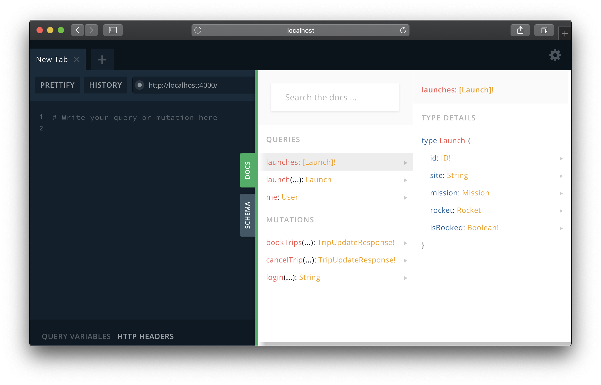

<h2 id="setup">Set up Apollo Server</h2>

Apollo Server is a GraphQL Server implementation that provides all the features you need to take your GraphQL API from prototype to production.

We need to install two packages when setting up Apollo Server:

```bash
npm install apollo-server graphql --save
```

* [apollo-server](https://npm.im/apollo-server): This is the Apollo Server library.
* [graphql](https://npm.im/graphql): This package is the JavaScript reference implementation for GraphQL. It's needed for Apollo Server to function as intended.

Apollo Server has various variants to accomodate easy integration with existing applications. Some of them are `apollo-server-express`, `apollo-server-hapi`, `apollo-server-koa`, etc.

```bash
npm install apollo-server-express graphql --save
```

To quickly set up a GraphQL server using Apollo Server, a schema type definition and corresponding resolver is needed. The schema type definition represents your GraphQL schema, while the resolver is a function that implements the schema.

Check out a simple Apollo Server example below:

```js
const { ApolloServer, gql } = require('apollo-server');

const typeDefs = gql`
  type Query {
    name: String
  }
`;

// Resolvers define the technique for fetching the types in the schema.
const resolvers = {
  Query: {
    name: () => 'graphql',
  },
};

// In the most basic sense, the ApolloServer can be started
// by passing type definitions (typeDefs) and the resolvers
// responsible for fetching the data for those types.
const server = new ApolloServer({
  typeDefs,
  resolvers,
});
```

In the code above, we imported the `ApolloServer` class and `gql` tag from the `apollo-server` package.

* **ApolloServer**: The `ApolloServer` class instantiates and starts a new GraphQL server.
* **gql**: The `gql` tag is a JavaScript template literal tag that enables syntax highlighting for our schema.

<h2 id="write-schema">Write your graph's schema</h2>

Every GraphQL server runs a schema at its core. A schema defines types and their relationships. The specifications of the types of queries that can be run against a GraphQL server are defined in a schema. Let's design the schema for our app.

GraphQL schemas are at their best when they are designed around the needs of client applications. In fact, this concept is called **Schema First Development**, an approach for building applications with GraphQL that involves the frontend and backend teams agreeing on a schema first, which serves as a contract between the UI and the backend before any API development commences.

In our app, we need to provide the following features:

* Fetch all upcoming rocket launches.
* Fetch a specific launch.
* Fetch upcoming trips.
* Users should be able to login to be authorized to book and cancel launch trips.
* Users should be able to book launch trips.
* Users should be able to cancel launch trips.

These features influenced the derived types for our Schema as shown below:

_src/schema.js_

```js
const { gql } = require('apollo-server');

const typeDefs = gql`
  type Query {
    launches(pageSize: Int, cursor: String): [Launch]!
    launch(id: ID!): Launch
    user(id: ID!): User
  }

  type Mutation {
    bookTrips(userId: ID!, tripId: [ID!]): Boolean!
    cancelTrip(userId: ID!, tripId: ID!): Boolean!
    login(email: String): String
  }

  type Launch {
    id: ID!
    cursor: String
    year: String!
    date: String!
    mission: Mission!
    rocket: Rocket!
    launchSuccess: Boolean
  }

  type Rocket {
    id: ID!
    name: String!
    type: String!
  }

  type User {
    id: ID!
    email: String!
    avatar: String
    trips: [Launch]
  }

  type Mission {
    name: String!
    missionPatch: String
  }
`;

module.exports = typeDefs;
```

<h2 id="apollo-server-run">Run your server</h2>

Now that we have scoped out our app's schema, let's run the server. Before running the server, make sure you have the following installed:

* **Node.js and npm**: At least [Node.js v8.0 and npm v5](https://nodejs.org/en/download).
* **nodemon**: Ensure that you have [nodemon](https://www.npmjs.com/package/nodemon) installed globally.

After that, create a directory and run `npm init --y` to create a `package.json` file. Within this directory, go ahead and create an `index.js` file. Now, add the code below to the file.

_index.js_

```js
const { ApolloServer, gql } = require('apollo-server');

const typeDefs = gql`
  type Query {
    launches(pageSize: Int, cursor: String): [Launch]!
    launch(id: ID!): Launch
    user(id: ID!): User
  }

  type Mutation {
    bookTrips(userId: ID!, tripId: [ID!]): Boolean!
    cancelTrip(userId: ID!, tripId: ID!): Boolean!
    login(email: String): String
  }

  type Launch {
    id: ID!
    cursor: String
    year: String!
    date: String!
    mission: Mission!
    rocket: Rocket!
    launchSuccess: Boolean
  }

  type Rocket {
    id: ID!
    name: String!
    type: String!
  }

  type User {
    id: ID!
    email: String!
    avatar: String
    trips: [Launch]
  }

  type Mission {
    name: String!
    missionPatch: String
  }
`;

const server = new ApolloServer({ typeDefs });

server.listen().then(({ url }) => {
  console.log(`🚀 Server ready at ${url}`);
});

```

**Line 182 - 186** indicates the portion of the code that runs the GraphQL server. The `typeDefs` is passed to the `ApolloServer` constructor, then `ApolloServer`'s `listen()` method is invoked to run the server.

On your terminal, run:

```bash
nodemon index.js
```

Apollo Server will now be available on port 4000. By default, it supports [GraphQL Playground](https://www.apollographql.com/docs/apollo-server/features/graphql-playground.html). The Playground is an interactive, in-browser GraphQL IDE for testing your queries. Apollo Server automatically serves the GraphQL Playground GUI to web browsers in development. When `NODE_ENV` is set to production, GraphQL Playground is disabled as a production best-practice.

**Note:** By default, Apollo Server runs on port 4000. See the [API reference](https://www.apollographql.com/docs/apollo-server/v2/api/apollo-server.html) for additional listen options, including how to configure the port.

<div style="text-align:center">

<br></br>
</div>

Run a simple query like the one above. It will return null because the queries are not connected to any resolvers just yet.

The GraphQL Playground provides the ability to introspect your schemas. Check out the right hand side of the playground and click on the `schema` button.

<div style="text-align:center">

<br></br>
</div>

The schema types are shown like you have below:

<div style="text-align:center">

<br></br>
</div>

You can quickly have access to the documentation of a GraphQL API via the `schema` button.

<div style="text-align:center">

<br></br>
</div>

That's all for running Apollo Server for now. Let's move on to the next part of our tutorial.
