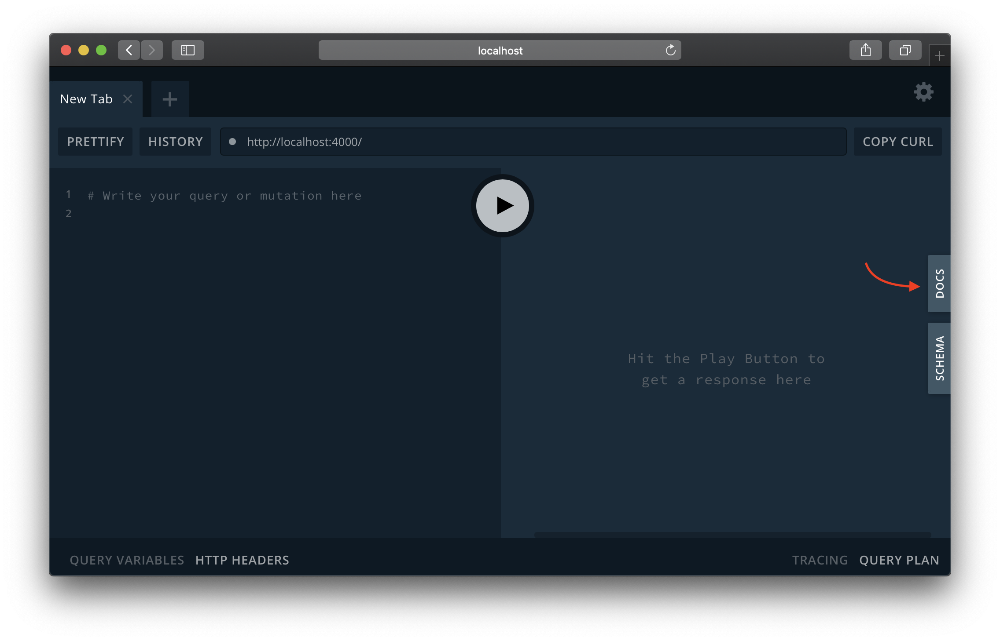

Every data graph uses a **schema** to define the types of data it includes. For example, the schema for an online bookstore might define the following types:

```graphql
type Book {
  title: String
  author: Author
}

type Author {
  name: String
  books: [Book]
}
```

In the steps below, we'll set up a GraphQL server that will enforce our schema's structure, and then we'll define the schema itself.

## Set up Apollo Server

A schema is only useful if our data graph conforms to the schema's structure. Enforcing a schema's structure is one of the core features of **Apollo Server**, a production-ready, open-source library that helps you implement your data graph's API.

From the `start/server` directory, let's install Apollo Server (along with our project's other dependencies):

```bash
cd start/server && npm install
```

The two packages you need to get started with Apollo Server are `apollo-server` and `graphql`, both of which are installed with the above command.

Now, let's navigate to `src/index.js` so we can create our server. Paste the code below into the file:

```js:title=src/index.js
const { ApolloServer } = require('apollo-server');
const typeDefs = require('./schema');

const server = new ApolloServer({ typeDefs });
```

This code imports the `ApolloServer` class from `apollo-server`, along with our (currently undefined) schema from `src/schema.js`. It then creates a new instance of `ApolloServer` and passes it the imported schema via the `typeDefs` property.

Now that Apollo Server is prepared to receive our schema, let's define it.

## Define your schema's types

Your GraphQL schema defines what types of data a client can read and write to your data graph. Schemas are strongly typed, which unlocks powerful developer tooling.

Your schema's structure should support the actions that your clients will take. Our example app needs to be able to:

* Fetch a list of all upcoming rocket launches
* Fetch a specific launch by its ID
* Log in the user
* Book a launch for a logged-in user
* Cancel a previously booked launch for a logged-in user

Let's design our schema to make these actions straightforward.

In `src/schema.js`, import `gql` from `apollo-server` and create a variable called `typeDefs` for your schema:

```js:title=src/schema.js
const { gql } = require('apollo-server');

const typeDefs = gql`
  # Your schema will go here
`;

module.exports = typeDefs;
```

The schema will go inside the `gql` function (between the backticks). The language we'll use to write the schema is GraphQL's schema definition language (SDL).

> Because the schema sits directly between your application clients and your underlying data services, front-end and back-end teams should collaborate on its structure. When you develop your own data graph, practice **schema-first development** and agree on a schema _before_ you begin implementing your API.

### Object types

Most of the definitions in a GraphQL schema are **object types**. Each object type you define should represent an object that an application client might need to interact with.

For example, our example app needs to be able to fetch a list of upcoming rocket launches, so we should define a `Launch` type to support that behavior.

Paste the following inside the backticks of the `typeDefs` declaration in `src/schema.js`:

```graphql:title=src/schema.js
type Launch {
  id: ID!
  site: String
  mission: Mission
  rocket: Rocket
  isBooked: Boolean!
}
```

The `Launch` object type has a collection of **fields**, and each field has a type of its own. A field's type can be either an object type or a **scalar type**. A scalar type is a primitive (like `ID`, `String`, `Boolean`, or `Int`) that resolves to a single value. In addition to GraphQL's built-in scalar types, you can define [custom scalar types](https://www.apollographql.com/docs/apollo-server/schema/scalars-enums/).

> An exclamation point (`!`) after a declared field's type means "this field's value can never be null."

In the `Launch` definition above, `Mission` and `Rocket` refer to _other_ object types. Let's add definitions for those, along with the `User` type (again, all inside the backticks):

```graphql:title=src/schema.js
type Rocket {
  id: ID!
  name: String
  type: String
}

type User {
  id: ID!
  email: String!
  trips: [Launch]!
}

type Mission {
  name: String
  missionPatch(size: PatchSize): String
}

enum PatchSize {
  SMALL
  LARGE
}
```

> If a declared field's type is in `[Square Brackets]`, it's an **array** of the specified type. If an array has an exclamation point after it, the array cannot be null, but it _can_ be empty.

Notice above that the `missionPatch` field of the `Mission` type takes an **argument** named `size`, which is of the **enum type** `PatchSize`. When you query for a field that takes an argument, the field's value can vary depending on the provided argument's value. In this case, the value you provide for `size` will determine which size of the mission's associated patch is returned (the `SMALL` size or the `LARGE` size).

### The `Query` type

We've defined the objects that exist in our data graph, but clients don't yet have a way to _fetch_ those objects. To resolve that, our schema needs to define  **queries** that clients can execute against the data graph.

You define your data graph's supported queries as fields of a special type called the `Query` type. Paste the following into your schema definition:

```graphql:title=src/schema.js
type Query {
  launches: [Launch]!
  launch(id: ID!): Launch
  me: User
}
```

This `Query` type defines three available queries for clients to execute: `launches`, `launch`, and `me`.

* The `launches` query will return an array of all upcoming `Launch`es.
* The `launch` query will return a single `Launch` that corresponds to the `id` argument provided to the query.
* The `me` query will return details for the `User` that's currently logged in.

### The `Mutation` type

Queries enable clients to fetch data, but not to _modify_ data. To enable clients to modify data, our schema needs to define some **mutations**.

The `Mutation` type is a special type that's similar in structure to the `Query` type. Paste the following into your schema definition:

```graphql:title=src/schema.js
type Mutation {
  bookTrips(launchIds: [ID]!): TripUpdateResponse!
  cancelTrip(launchId: ID!): TripUpdateResponse!
  login(email: String): String # login token
}
```

This `Mutation` type defines three available mutations for clients to execute: `bookTrips`, `cancelTrip`, and `login`.

* The `bookTrips` mutation enables a logged-in user to book a trip on one or more `Launch`es (specified by an array of launch IDs).
* The `cancelTrip` mutation enables a logged-in user to cancel a trip that they previously booked.
* The `login` mutation enables a user to log in by providing their email address.

The `bookTrips` and `cancelTrip` mutations return the same object type: a `TripUpdateResponse`. A mutation's return type is entirely up to you, but we recommend defining special object types specifically for mutation responses.

Add the definition for `TripUpdateResponse` to your schema:

```graphql:title=src/schema.js
type TripUpdateResponse {
  success: Boolean!
  message: String
  launches: [Launch]
}
```

This response type contains a `success` status, a corresponding `message`, and an array of any `Launch`es that were modified by the mutation. It's good practice for a mutation to return whatever objects it modifies so the requesting client can update its cache and UI without needing to make a followup query.

Our example app's schema is now complete!

## Run your server

Return to `src/index.js` and add a call to `server.listen()`, like so:

```js:title=src/index.js
const { ApolloServer } = require('apollo-server');
const typeDefs = require('./schema');

const server = new ApolloServer({ typeDefs });

server.listen().then(({ url }) => {
  console.log(`🚀 Server ready at ${url}`);
});
```

After saving, run `npm start` to start your server! 🎉 Apollo Server will now be available on port 4000.

### Explore your schema

With your server running, visit `localhost:4000` in your browser to open [GraphQL Playground](https://www.apollographql.com/docs/apollo-server/features/graphql-playground/), an IDE that enables you to **introspect** your schema and test out queries. Introspection is a helpful feature of a GraphQL server that enables you to obtain its schema.

> Note that introspection should be **disabled** for a production GraphQL server. Apollo Server disables introspection automatically if the `NODE_ENV` environment variable is set to `production`.

To introspect your server's schema, click the **Schema** button on the right side of GraphQL Playground:



Your schema's queries, mutations, and object type definitions appear:


Our server now knows which GraphQL types and operations it supports, but it doesn't know where to obtain the data to respond to those operations. Next, we'll connect our server to two data sources.
