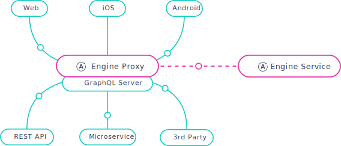

[Apollo Engine](https://www.apollographql.com/engine/) is a GraphQL gateway that helps you take GraphQL services into production with confidence.

Engine sits between your clients and your GraphQL server, delivering essential capabilities like query caching, error tracking, automatic persisted queries, execution tracing, and schema analytics. Engine's data is then aggregated and sent out-of-band to the Engine Service. Currently, Engine works with any spec-compliant GraphQL server, including [Apollo Server](https://www.apollographql.com/docs/apollo-server/), GraphQL-Ruby, Sangria, and Absinthe. You can visualize your stack with Engine in this diagram:

  

<h2 id="features">Features</h2>

Engine is designed to be your one-stop-shop for GraphQL-specific infrastructure. It provides the following features today:

<h3 id="analytics">Analytics</h3>

1. [Performance tracing](/docs/engine/performance.html)
1. [Schema analytics](/docs/engine/schema-analytics.html)
1. [Error tracking](/docs/engine/error-tracking.html)

<h3 id="performance">Perfomance</h3>

1. [Response caching](/docs/engine/caching.html)
1. [Automatic persisted queries](/docs/engine/auto-persisted-queries.html)
1. [CDN integration](/docs/engine/cdn.html)
1. [Query batching](/docs/engine/query-batching.html)

<h3 id="reporting">Reporting</h3>

1. [Proactive Alerts](/docs/engine/alerts.html)
1. [Daily Slack reports](/docs/engine/reports.html)
1. [Datadog Integration](/docs/engine/datadog.html)

<h2 id="get-started">Get started</h2>

* [Get started with Engine](https://engine.apollographql.com)
* [Read the Engine docs](/docs/engine/)