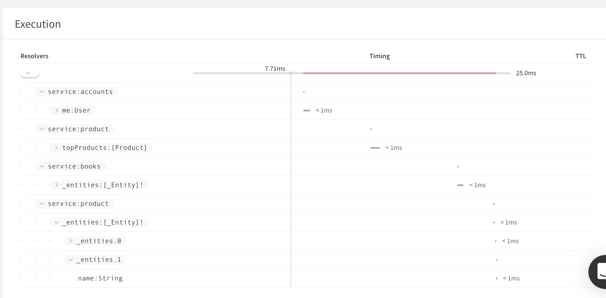

The following sections describe advanced features of managed federation with Apollo Graph Manager.

## Removing a service from the registry

Removing an federated service from the graph works similarly to registering a service. To delete a service, call `apollo service:delete`. You can also specify the graph variant you want to remove.

```bash
apollo service:delete --serviceName=launches --tag=staging
```

> WARNING! This action cannot be reversed. Also, once deleted, service names cannot be reused within the same graph.

### Inspecting your graph

To view the federated services that make up your graph, you can use both the Apollo CLI as well as the Apollo platform.

Run `apollo service:list` in the command line to see a snapshot of the services that make up your graph, including their endpoints and when they were last updated.

Here's an example of what running `apollo service:list` will look like:

```
$ apollo service:list
  ✔ Loading Apollo Project
  ✔ Fetching list of services for graph service-list-federation-demo

name       URL                            last updated
─────────  ─────────────────────────────  ────────────────────────
Accounts   http://localhost:4001/graphql  3 July 2019 (2 days ago)
Inventory  http://localhost:4004/graphql  3 July 2019 (2 days ago)
Products   http://localhost:4003/graphql  3 July 2019 (2 days ago)
Reviews    http://localhost:4002/graphql  3 July 2019 (2 days ago)

View full details at: https://engine.apollographql.com/graph/service-list-federation-demo/service-list
```

You can see additional details about the services registered to the graph, such as each service's capabilities, in the [Apollo Dashboard](https://engine.apollographql.com/).

## What you'll learn

Based on our experience helping companies scale GraphQL across their organizations, there are several steps teams need to take to successfully run a federated graph in production. We recommend running through these steps after you've already [implemented a federated graph](https://www.apollographql.com/docs/apollo-server/federation/implementing/):

1. [Register all federated services](#register-implementing-services) with the Apollo Graph Manager.
2. [Configure Apollo Server](#connecting-apollo-server-to-graph-manager) as a gateway to connect to the graph manager.
3. [Turn on metrics](#metrics-and-observability) for your federated graph.
4. [Validate changes](#validating-changes-to-the-graph) to the graph against production traffic.
5. [Integrate your federated graph](#integrating-with-your-deployment-pipeline) into your deployment pipeline.


## Managed configuration

With **managed configuration**, your GraphQL gateway updates dynamically in response to schema changes in your implementing services. You make these service changes with the `apollo service:push` CLI command, which pushes your service configuration files to Graph Manager and stores them securely (as shown in [Registering federated services](#register-implementing-services)).

These configuration files define:

* Which implementing services are part of your federated graph
* The partial schema defined by each implementing service
* Metadata about each implementing service, including the `serviceURL` specified in the CLI command

When you initialize your Apollo gateway with a Graph Manager `apiKey` instead of a `serviceList`, the gateway polls Graph Manager regularly to detect and incorporate any changes to your managed configuration. When it detects a change, it continues resolving incoming requests with its existing configuration while it begins to generate query plans for the new configuration. When this process completes, the gateway begins executing new incoming requests against the new configuration.

### Pushing configuration updates safely

Whenever possible, you should update your service configuration in a way that is backward compatible to avoid downtime. To help ensure this, **call `apollo service:push` for an implementing service only after all replicas of that service are deployed**. This ensures that resolvers are in place for all operations that are executable against your graph, and operations can't access fields that do not yet exist.

In the rare case where a configuration change is not backward compatible with your gateway's query planner, you should update your service registry _before_ you deploy your implementing services.

Additionally, you should perform configuration updates that affect query planning separately from (and prior to) other changes. This helps avoid a scenario where the query planner generates queries that fail validation in downstream services or violate your resolvers.

Examples of this include:

1. Modifying `@key`, `@requires`, or `@provides` directives
2. Removing a type implementation from an interface

In general, always exercise caution when pushing configuration changes that affect your gateway's query planner, and consider how those changes will affect your other implementing services.

#### Example scenario

Let's say we define a `Channel` interface in one service, and we define types that _implement_ `Channel` in two other services:

```graphql
# Channel service
interface Channel @key(fields: "id") {
  id: ID!
}

# Web service
type WebChannel implements Channel @key(fields: "id") {
  id: ID!
  webHook: String!
}

# Email service
type EmailChannel implements Channel @key(fields: "id") {
  id: ID!
  emailAddress: String!
}
```

To safely remove the `EmailChannel` type from your schema:

1. Perform a `service:push` of the `email` service that removes the `EmailChannel` type from its schema.
2. Deploy a new version of the service that removes the `EmailChannel` type.

The first step causes the query planner to stop sending fragments `...on EmailChannel`, which would fail validation if sent to a service that isn't aware of the type.

If you want to keep the `EmailChannel` type but remove its assocation with the `Channel` interface, follow the same steps, but only remove `implements Channel` from your `EmailChannel` definition in the first step.


If the goal is not to remove the type
altogether, but to only remove it from the interface, you can follow a similar
procedure, but instead of removing the `EmailChannel` type altogether, only
removing the `implements Channel` addendum to the type definition. This is
because the query planner expands queries to interfaces or unions into fragments
on their implementing types. For example, a query such as
```graphql
query FindChannel($id: ID!) {
  channel(id: $id) {
    id
  }
}
```

will generate two queries, one to each service, like so:

```graphql
# To Email service

query {
  _entities(...) {
    ...on EmailChannel {
      id
    }
  }
}

# To Web Service
query {
  _entities(...) {
    ...on WebChannel {
      id
    }
  }
}
```

Currently, the Apollo gateway expands all interfaces into implementing types,
though a follow-up to the query-planning logic may make this only occur for
interfaces that serve as entities (i.e. have a `@key`).

### Modifying query-planning logic

Treat migrations of your query-planning logic similarly to how you treat database migrations. Carefully consider the effects on downstream services as the query planner changes, and plan for "double reading" as appropriate.

Consider the following example of a `Products` service and a `Reviews` service:

```graphql
# Products Service

type Product @key(fields: "upc") {
  upc: ID!
  nameLowerCase: String!
}

# Review Service

extend type Product @key(fields: "upc") {
  upc: ID! @external
  reviews: [Review]! @requires(fields: "nameLowercase")
  nameLowercase: String! @external
}
```

Let's say we want to deprecate the `nameLowercase` field and replace it with the `name` field, like so:

```graphql
# Products Service

type Product @key(fields: "upc") {
  upc: ID!
  nameLowerCase: String! @deprecated
  name: String!
}

# Reviews Service

extend type Product @key(fields: "upc") {
  upc: ID! @external
  nameLowercase: String! @external
  name: String! @external
  reviews: [Review]! @requires(fields: "name")
}
```

To perform this migration in-place:

1. Modify the `Products` service to add the new field. (As usual, first deploy all replicas, then use `apollo service:push` to push the new partial schema.)
2. Deploy a new version of the `Reviews` service with a resolver that accepts _either_ `nameLowercase` or `name` in the source object.
3. Modify the Reviews service's schema in the registry so that it `@requires(fields: "name")`.
4. Deploy a new version of the `Reviews` service with a resolver that _only_ accepts the `name` in its source object.

Alternatively, you can perform this operation with an atomic migration at the service level, by modifying the service's URL:

1. Modify the `Products` service to add the `name` field (as usual, first deploy all replicas, then use `apollo service:push` to push the new partial schema).
2. Deploy a new set of `Reviews` replicas to a new URL that reads from `name`.
3. Register the `Reviews` service with the new URL and the partial schema changes above.

With this atomic strategy, the query planner resolves all outstanding requests to the old service that relied on `nameLowercase` with the old query-planning configuration, which `@requires` the `nameLowercase` field. All _new_ requests are made to the new service (due to the change of URL) using the new query-planning configuration, which `@requires` the `name` field.

## Metrics and observability

Like any distributed architecture, you should make sure that your federated graph has proper observability, monitoring, and automation to ensure reliability and performance of both your gateway and the federated services underneath it. Serving your GraphQL API from a distributed architecture has many benefits, like productivity, isolation, and being able to match the right services with the right runtimes. Operating a distributed system also has more complexity and points of failure than operating a monolith, and with that complexity comes a need to heighten observability into the state of your system and control over its coordination.

Apollo Server has support for reporting federated [tracing](/performance/) information from the gateway. In order to support the gateway with detailed timing and error information, federated services expose their own tracing information per-fetch in their extensions, which are consumed by the gateway and merged together in order to be emitted to the Apollo metrics ingress. To enable this functionality, make sure the `ENGINE_API_KEY` is set in the environment for your gateway server and ensure that all federated services and the gateway are running `apollo-server` version `2.7.0` or greater. Also, ensure that federated services do not have the `ENGINE_API_KEY` environment variable set.

Traces will be reported in the shape of the query plan, with each unique fetch to a federated service reporting timing and error data.

<div style="text-align:center">
  
</div>

Operation-level statistics will still be collected over the operations sent by the client, and those operations will be validated as part of the `service:check` validation workflow.

## Validating changes to the graph

Federation allows teams to work independently on federated services without needing to coordinate over an all-encompassing schema. However, this increase in autonomy requires control to ensure that teams that operate on different services are respecting [defined dependencies](https://www.apollographql.com/docs/apollo-server/federation/federation-spec/) and not breaking the ability for the graph to compose. The Apollo platform provides tools to help ensure that this increase in autonomy doesn't come at a cost to stability.

In particular, along with [validating overall schema changes against known operations](/schema-validation/), running `apollo service:check` for a federated service will ensure that the overall graph still composes to a valid schema, and will output any violated dependencies if present.

With a federated graph, use the `apollo service:check` command to validate individual service changes by adding the `--serviceName` flag.

When running `apollo service:check` on a federated service, Apollo Graph Manager will run composition on the proposed capabilities with the current list of federated services and their capabilities, making sure that the composition is successful. That composed schema will then be diff'ed against the most recently registered schema and validate that those changes are safe. If composition fails, then validation ends and the results will be returned to the user. Note that running `apollo service:check` will never update the graph.

There are two types of failures that can occur during validation: failed usage checks and failed composition. Failed usage checks are failures due to breaking changes, like removing a field that an active client is querying. Failed composition, on the other hand, is a failure due to inability to compose the graph, like missing an `@key` for an extended type.

### Handling composition failure

In general, an `apollo service:push` should only be run after an `apollo service:check` has passed, but even so, due to changes in _other_ services, it's possible that the `apollo service:push` command will encounter composition errors. When this happens, the federated service will still be updated as long as its capabilities are spec-compliant, but **the graph will not be updated**. This means that a new schema will not be associated nor will the gateway's [managed configuration](#managed-configuration) be updated.

An example output of this behavior looks like this:

```
~$ apollo service:push --serviceName="launches" \
                      --serviceURL="http://launches-graphql.svc.cluster.local:4001/" \
                      --endpoint="http://localhost:4001/"
  ✔ Loading Apollo Project
  ✔ Loading Apollo Project
  ✔ Uploading service to Engine


The 'launches' service for the 'space-explorer@current' graph was updated

*THE SERVICE UPDATE RESULTED IN COMPOSITION ERRORS.*

Composition errors must be resolved before the graph's schema or corresponding gateway can be updated.
For more information, see https://www.apollographql.com/docs/apollo-server/federation/errors/


Error   [launches] Mutation.createLaunch -> requires the field `launch` to be marked as @external.

The gateway for the 'space-explorer@current' graph was NOT updated with a new schema
```

The reasoning behind this functionality is that the service registry should always be the source of truth for what is running in your infrastructure. Even if that means that composition is failing in your infrastructure, the service registry should reflect that. However, you still want your gateway to function as it has been before the service deployment. Additionally, this functionality can be used to make dependent changes, like smoothly migrating a field from one service to another or introducing a circular service dependency.

## Integrating with your deployment pipeline

You might wonder how to guarantee that the changes you're making to your service are safe changes for the graph as a whole. When rolling out changes to a federated service, we recommend the following workflow:

1. Run validation on every commit through CI using `apollo service:check`.
2. Merge in a backward-compatible PR that has passed schema validation.
3. Deploy changes to the federated service in your infrastructure.
4. Wait until all replicas finish deploying.
5. Call `apollo service:push` to update the federated service.

```
~$ apollo service:push --serviceName="launches" \
                      --serviceURL="http://launches-graphql.svc.cluster.local:4001/" \
                      --endpoint="http://localhost:4001/"
  ✔ Loading Apollo Project
  ✔ Uploading service to Engine

The 'registry' service for the 'space-explorer@current' graph was updated

The gateway for the 'space-explorer@current' graph was updated with a new schema, composed from the updated 'launches' service

id      graph             variant
──────  ────────────────  ───────
az329e  space-explorer    current
```

> What's the difference between `serviceURL` and `endpoint` parameters? The `endpoint` parameter controls the endpoint where the schema will be fetched from at composition, whereas `serviceURL` controls what URL the gateway will query at runtime. This is especially useful because federated services **should not be publicly accessible**, so the `endpoint` might point to a locally running server or a file, whereas the `serviceURL` should be a URL accessible to the gateway.

It's important to make sure that any possible end-user effect from the changes to the graph have been identified, and it's similarly important to strive for backward-compatible changes to limit those effects. The reason for waiting for the service to completely roll over before registering it is that if some services are still exposing the previous configuration, they might elicit failures for operations the gateway has planned with the new configuration.

### Diving into service:push

Every time that `apollo service:push` is called for a federated service, it not only registers the federated service to the graph, but it also updates the managed configuration files that the gateway has access to. Because the graph is dynamically changing, it's possible for composition errors to occur for a `service:push` even after a `service:check` has succeeded if other federated services changed in the interim. For this reason, updating a federated service will re-trigger composition in the cloud, ensuring that the federated services still compose to form a complete graph before provisioning the managed configuration. The workflow behind the scenes can be summed up as follows:

1. The partial schema is uploaded to a secure location and indexed.
2. The federated service is updated in the registry to point to the partial schema.
3. All federated services are composed in the cloud to produce a new complete schema.
4. If composition fails, the command exits and emits errors.
5. If composition succeeds, the top-level managed configuration file is updated in-place to point to the updated set of federated services.

On the other side of the equation sits the gateway. The gateway is constantly listening for changes to the top-level managed configuration file. The location of the managed configuration file is guarded by using a hash of the API key, provisioned ahead of time so as not to affect reliability. The life-cycle of dynamic configuration updates is as follows:

1. The gateway listens for updates to its managed configuration.
2. On update, the gateway downloads configuration for each federated service in parallel.
3. The gateway performs composition over the managed configuration to update query planning.
4. The gateway continues to resolve in-flight requests with the previous configuration while using the updated configuration for all new requests.

### Reliability and security

The managed configuration for the Apollo gateway is exposed through [Google Cloud Storage](https://cloud.google.com/storage). For all API keys, the Apollo Graph Manager provisions a public file accessible via the hash of the API key. In the event that managed configuration is inaccessible due to an outage in Google's Cloud Storage service, the gateway will continue to serve the last-known configuration. In the event that Apollo Graph Manager API is down, changes to managed configuration will be stalled but the last-published configuration files will still be accessible via GCS.

### Using variants to control rollout

With [managed configuration](#managed-configuration), you have the ability to control which version of your graph a fleet of gateways are running with. For the majority of deployments, rolling over all of your gateways to a new schema version is a good strategy, since changes should be checked to be backward compatible using [schema validation](/schema-validation/). However, changes at the gateway level may involve a variety of different updates, like transferring type ownership from one service to another. In the case that your infrastructure requires more advanced deployment strategies, we recommend using [graph variants](/schema-registry/#registering-a-schema-to-a-variant) to manage different fleets of gateways running with different configurations.

For instance, in order to have a canary deployment, you might maintain two production graphs in the graph manager, one called `prod` and one called `prod-canary`. Your deployment of a change to some federated service named "launches" might look something like this:

1. Check changes in "launches" against `prod` and `prod-canary`:
   ```
   apollo service:check --tag=prod --serviceName=launches
   apollo service:check --tag=prod-canary --serviceName=launches
   ```
1. Deploy changes to "launches" into your production environment. (_Note: This will not roll out changes to the gateway yet_)
1. Roll over the `prod-canary` graph, containing one gateway container, using `apollo service:push --tag=prod-canary --serviceName=launches`. (_Note: If composition fails due to intermediate changes to the canary graph, new configuration will not be rolled out_)
1. Wait for health checks to pass against the canary, watch dashboards, etc.
1. After the canary is stable, roll out the changes to the rest of production using `apollo service:push --tag=prod --serviceName=launches`.

Because you can [tag metrics with variants](/schema-registry/#associating-metrics-with-a-variant) as well, you can use [Apollo Graph Manager](https://engine.apollographql.com) to verify a canary's performance before rolling out changes to the rest of the graph. You can also use a similar strategy with variants to support a variety of other advanced deployment workflows, like blue/green deployments.
