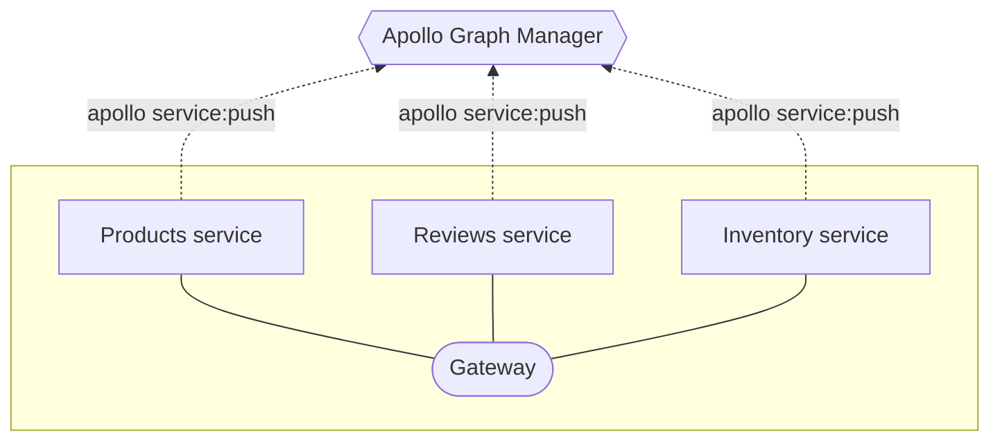

import ProjectConfigPanel from 'gatsby-theme-apollo-docs/shared/project-config-panel.mdx';

Apollo Graph Manager provides **managed federation** features for data graphs that use [Apollo Federation](https://www.apollographql.com/docs/apollo-server/federation/introduction/).

Graph Manager's federation-aware tooling helps your organization safely validate, coordinate, deploy, and monitor changes to your graph's gateway and implementing services.

## 1. Register your implementing services

To enable managed federation, each of your data graph's [implementing services](https://www.apollographql.com/docs/apollo-server/federation/implementing-services/) must register its schema with Graph Manager:



To get set up with schema registration, do the following for each of your implementing services:

1. Complete the following prerequisites:

  <ProjectConfigPanel />

2. In the service's `apollo.config.js` file, add `name` and `url` fields to the `service` object:

    ```json{3-4}:title=apollo.config.js
    module.exports = {
      service: {
        name: "Products"
        url: "http://products-graphql.svc.cluster.local:4001/"
        endpoint: {
          url: "http://localhost:4000"
        }
      }
    };
    ```

    * The `name` field uniquely identifies the service within your data graph. Its value appears throughout the Graph Manager UI.
    * The `url` field points to your service's GraphQL endpoint. To secure your data graph, this should be a URL that can be reached by your [gateway](https://www.apollographql.com/docs/apollo-server/federation/gateway/), but _cannot_ be reached via the public internet.

3. From your project's root directory, run `apollo service:push`. The CLI obtains all necessary configuration from your project's `.env` and `apollo.config.js` files, then pushes your schema to Graph Manager.

## 2. Configure continuous delivery

With managed federation, Graph Manager (_not_ your gateway) is responsible for combining your individual schemas into a single federated schema. Consequently, **each service in your data graph must re-register its schema every time the schema changes.** Otherwise, Graph Manager can't push schema updates to your gateway.

The best way to accomplish this is to add the `apollo service:push` call to your continuous delivery pipeline. Every time you push a schema change to production, this call should automatically accompany that push.

## 3. Modify the gateway

Because your gateway isn't responsible for creating your federated schema anymore, you need to modify its initialization.

> This section assumes you are using Apollo Server with the `@apollo/gateway` library as your gateway.

### Remove the `serviceList` argument

A bare-bones initialization of an `ApolloGateway` object looks like this:

```js
const gateway = new ApolloGateway({
  serviceList: [
    { name: 'accounts', url: 'http://localhost:4001' },
    // Additional services defined here
  ],
});
```

The `serviceList` argument specifies the name and URL for each of your implementing services. With managed federation, Graph Manager pushes this information to your gateway instead.

**Remove the `serviceList` argument from your `ApolloGateway` constructor entirely.**

### Register the gateway with Graph Manager

Similar to [registering your implementing services](#1-register-your-implementing-services), you need to register your gateway with Graph Manager.

Settings page and set the `ENGINE_API_KEY` environment variable to that key.

> If you're already setting the `engine` property of [the `ApolloServer` constructor options](https://www.apollographql.com/docs/apollo-server/api/apollo-server/) and have included the API key in those settings, you can skip setting the `ENGINE_API_KEY` value in the environment.

Then, construct the gateway and `ApolloServer` like so:

```js
const { ApolloServer } = require('apollo-server');
const { ApolloGateway } = require('@apollo/gateway');

// Managed configuration will be picked up using the API key
const gateway = new ApolloGateway();

// Pass the gateway to Apollo Server
const server = new ApolloServer({ gateway, subscriptions: false });

// Note: Apollo gateway does not currently support subscriptions,
// but it's on the roadmap for Apollo Server 3.x:
// https://github.com/apollographql/apollo-server/issues/2360

server.listen().then(({ url }) => {
  console.log(`🚀 Server ready at ${url}`);
});
```

> The managed configuration will default to using the `'current'` variant.  When running Apollo Gateway in an environment where outbound traffic to the internet is restricted, consult the [directions for configuring a proxy](https://www.apollographql.com/docs/apollo-server/proxy-configuration/) within Apollo Server.
