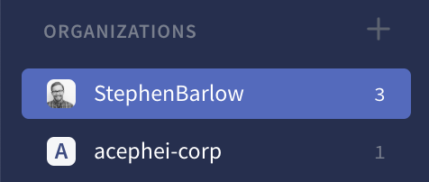
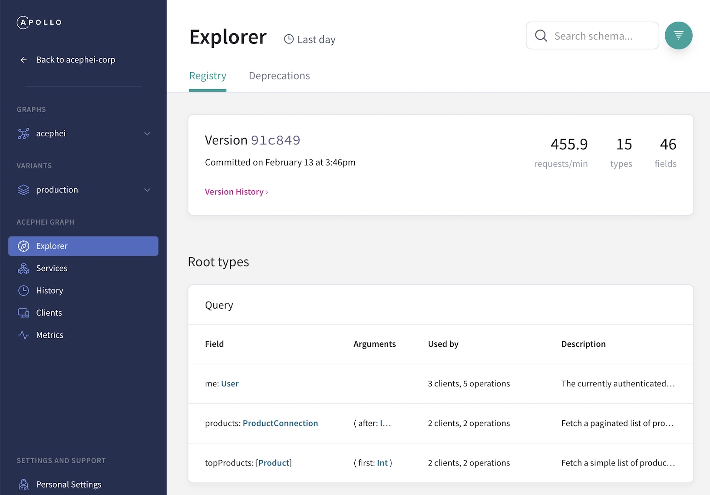

import ObtainPersonalApiKey from '../shared/obtain-personal-api-key.mdx';

import ProjectConfigPanel from 'gatsby-theme-apollo-docs/shared/project-config-panel.mdx';

Hello! This article gets you up and running with Apollo Graph Manager. None of this setup requires a paid plan.

You can use Graph Manager with any GraphQL server. Certain features (e.g., [trace reporting](setup-analytics/)) are currently best supported by [Apollo Server](https://www.apollographql.com/docs/apollo-server/).

> If you're using [Apollo Federation](https://www.apollographql.com/docs/apollo-server/federation/introduction/), get started with [Setting up managed federation](managed-federation/setup/) instead of this article.

## Step 1: Create your account

1. Go to [engine.apollographql.com](https://engine.apollographql.com/) and click **Create an account**. 

    _You can sign up with either your GitHub identity or a username and password._

2. Complete the signup flow, which includes:

    * Creating an **organization** that you can invite your teammates to

    * [Selecting a plan](https://www.apollographql.com/pricing/) for your organization (the Free plan is always free, and the Team plan provides a free trial of advanced features)

## Step 2: Create your first graph

In Graph Manager, each **graph** corresponds to the entirety of a GraphQL schema. Your first graph will correspond to your GraphQL server's schema.

1. Visit [engine.apollographql.com](https://engine.apollographql.com/) again. Now that you're logged in, this opens the **Graph Manager UI**.

    The list of organizations you belong to appears in the left column:

    </img>

2. Select the organization that you want to add your graph to. Then, click **New Graph** in the upper right.

3. Specify a name for your graph and click **Next**. Graph Manager displays a list of instructions, which are also described in the [next section](#step-3-configure-your-project).

## Step 3: Configure your project

1. [Install the Apollo CLI](https://www.apollographql.com/docs/devtools/cli/#download-and-install) if you haven't yet.

2. Add a `.env` file to your project's root directory if there isn't one yet. **Do not add this file to version control.** It contains secrets that differ both per user and per environment.

3. Add the `.env` file to your project's `.gitignore` file.

4. Obtain a personal API key from Graph Manager and set it as the value of `APOLLO_KEY` (previously `ENGINE_API_KEY`) in your `.env` file:

    <ObtainPersonalApiKey />
    
    ```python:title=.env
    # Don't worry, the author invalidated this API key before sharing it 😉
    APOLLO_KEY=user:gh.StephenBarlow:Rc6D_7mLxY74okHRCL2HMg
    ```

4. Add an `apollo.config.js` file to your project's root directory if there isn't one yet. Unlike `.env`, you _do_ add this file to version control.

5. Add your newly created graph's name to `apollo.config.js` in the `service.name` field, like so:

    ```js{3}:title=apollo.config.js
    module.exports = {
      service: {
        name: "acephei"
      }
    }
    ```

## Step 4: Register your schema

The **schema registry** sits at the heart of Graph Manager. It allows you to inspect your graph's schema and track changes to it over time:

</img>

You register your schema with the `apollo service:push` command. **You need to provide your schema to this command**, in one of the following ways:

### Provide your schema via introspection

The Apollo CLI can obtain your schema from your locally running GraphQL server via an **introspection query**. This is a special query supported by most GraphQL servers that returns the server's full schema.

To provide your schema via introspection, first run your GraphQL server locally. Then, execute the `apollo service:push` command from your project's root directory and provide your GraphQL server's `localhost` URL, like so:

```
apollo service:push --endpoint=http://localhost:4000/
```

### Provide your schema via a local file

If your schema is defined in a `.gql` or `.graphql` file, you can provide that file to Graph Manager.

To do so, run the `apollo service:push` command from your project's root directory and provide a path to the schema file, like so:

```
apollo service:push --localSchemaFile=./schema.gql
```

The `--localSchemaFile` option also supports a comma-separated list of paths if your schema is defined across multiple files.

## Step 5: Connect to Slack

Graph Manager can connect to your Slack workspace to send you daily metrics reports, along with notifications whenever changes are made to your registered schema.

[Set up Slack notifications](https://www.apollographql.com/docs/graph-manager/slack-integration/#setup)

## Step 6: Set up trace reporting

Graph Manager can ingest operation **traces** from your GraphQL server to provide performance metrics for your data graph.

To begin pushing these traces to Graph Manager, read [Pushing trace data to Graph Manager](setup-analytics/).

## Step 7: Set up continuous delivery

Your schema is now registered with Graph Manager, and your server is pushing operation traces!

However, to get the most out of Graph Manager, you need to _re_-register your server's schema every time it changes. The easiest way to do this is to make schema registration part of every deployment in your application's [continuous delivery flow](schema-registry/#registering-with-continuous-delivery).

## Step 8: Explore

The best way to familiarize yourself with Graph Manager's capabilities is to explore it! Visit [engine.apollographql.com](https://engine.apollographql.com/) and check out the various views and what they provide.

You can also learn more about the features provided with Team and Enterprise plans, including:

* [Schema validation](schema-validation)
* [Segmenting metrics by client types and versions](client-awareness)
* [Integration with Datadog](datadog-integration)

If you'd like to have a conversation about Graph Manager and how it can help your organization, [please contact us](https://www.apollographql.com/contact-sales).
