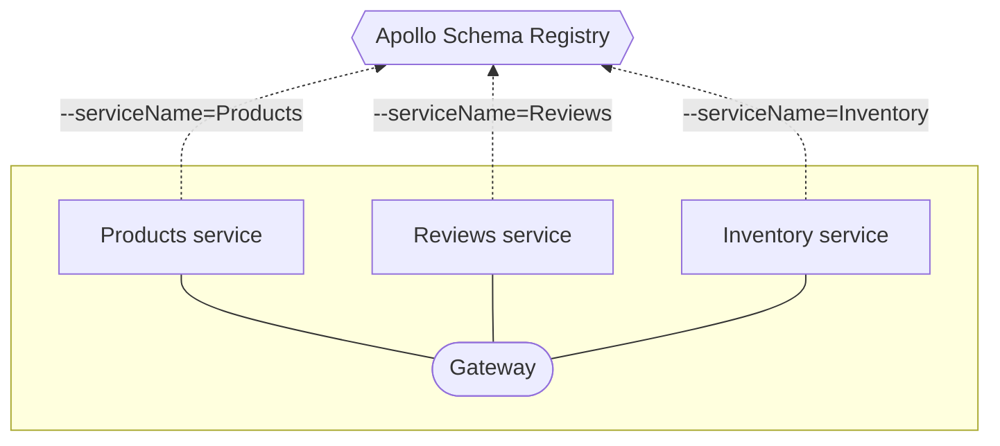

import ObtainPersonalApiKey from '../shared/obtain-personal-api-key.mdx';

import ObtainGraphApiKey from '../shared/obtain-graph-api-key.mdx';

import ProjectConfigPanel from 'gatsby-theme-apollo-docs/shared/project-config-panel.mdx';

import {
  ExpansionPanel,
} from 'gatsby-theme-apollo-docs/src/components/expansion-panel';

Hello! This article gets you up and running with Apollo Studio. None of this setup requires a paid plan.

You can use Studio with any GraphQL server. Certain features (such as [metrics reporting](setup-analytics/)) are currently best supported by [Apollo Server](https://www.apollographql.com/docs/apollo-server/).

## 1. Create your account

1. Go to [studio.apollographql.com](https://studio.apollographql.com/) and click **Create an account**. 

    _You can sign up with either your GitHub identity or a username and password._

2. Complete the signup flow, which includes:

    * Creating an [organization](./org/organizations/) that you can invite teammates to

    * [Selecting a plan](https://www.apollographql.com/pricing/) for your organization (the Free plan is always free, and the Team plan provides a free trial of paid features)

## 2. Create your first graph

In Studio, each **graph** corresponds to a data graph and its associated GraphQL schema. Your first graph will use your GraphQL server's schema.

1. Visit [studio.apollographql.com](https://studio.apollographql.com/) again. Now that you have an account, this opens Studio.

    The list of organizations you belong to appears in the left column:

    </img>

2. Select the organization that you want to add your graph to. Then, click **New Graph** in the upper right.

3. Specify a name for your graph and click **Next**.

    * A graph's name must be globally unique across all of Studio. We recommend using a consistent prefix across all of your organization's graphs.

4. Studio displays instructions for registering your schema, which is also described in the next step.

## 3. Register your schema

The **Apollo schema registry** powers nearly every feature of Apollo Studio, along with helpful developer tools like our VS Code extension.

To register your server's schema, first obtain a **graph API key** for your graph:

  <ObtainGraphApiKey />

Once you have your API key, select the registration method that corresponds  to your graph's architecture:

<ExpansionPanel title="Apollo Server WITHOUT Apollo Federation">

Apollo Server supports a feature called **schema reporting** that enables it to register its schema automatically on startup.

1. Set your graph API key as the value of the `APOLLO_KEY` environment variable in your server's environment.

    If you're using the [`dotenv`](https://www.npmjs.com/package/dotenv) library, you can add the API key to the `.env` file in your project's root directory, like so:

    ```none:title=.env
    APOLLO_KEY=YOUR_KEY_HERE
    ```

2. Set the `engine.reportSchema` option to `true` in your `ApolloServer` constructor, like so:

    ```js
    const server = new ApolloServer({
      // ...other options...
      engine {
        reportSchema: true
      }
    });
    ```

Now whenever your server starts up, it automatically registers its schema with the Apollo schema registry _and_ begins pushing metrics to Apollo Studio!

> We would love for other GraphQL servers to support schema reporting too! If you're interested in implementing support, [the protocol is documented here.](./schema-reporting-protocol/)

</ExpansionPanel>

<ExpansionPanel title="Another GraphQL server WITHOUT Apollo Federation">

1. <a href="https://www.apollographql.com/docs/devtools/cli/" target="_blank">Install the Apollo CLI</a> if you haven't yet.

2. Decide how you'll provide your server's schema to the Apollo CLI. The CLI can either:

    * Use a `.gql` or `.graphql` file saved on your local machine, or
    * Perform an introspection query on your running server to fetch the schema

2. Run the `apollo service:push` command, providing the following options (documented below):

    ```bash
    apollo service:push \
      --localSchemaFile=./schema.gql \ # (or --endpoint)
      --key=service:docs-example-graph:NYKgCqwfCyYPIm84WVXCdw
      --graph=docs-example-graph \
      --variant=local-development \
    ```

| Name | Description  |
|---|---|
| `--endpoint` | <p>The URL of the running service to perform an introspection query on.</p><p>**Provide this only if the CLI should obtain your schema via introspection.**</p> |
| `--localSchemaFile` | <p>The path of the schema file to register.</p><p>**Provide this only if the CLI should obtain your schema via a local file.**</p> |
| `--key` | <p>The graph API key that the CLI should use to authenticate with the schema registry.</p><p>By default, the CLI uses the value of the `APOLLO_KEY` environment variable.</p> |
| `--graph` | The name of your graph in Apollo Studio (e.g., `docs-example-graph`) |
| `--variant` | <p>The [variant of your graph](./schema/registry/#managing-environments-with-variants) to register the schema with.</p><p>The default value is `current`.</p> |

</ExpansionPanel>

<ExpansionPanel title="Any GraphQL server WITH Apollo Federation">

[Learn more about managed federation](./managed-federation/overview/)

In a federated architecture, each of your graph's [implementing services](https://www.apollographql.com/docs/apollo-server/federation/implementing-services/) uses the Apollo CLI to register its schema as a separate service **of the same graph**:



First, <a href="https://www.apollographql.com/docs/devtools/cli/" target="_blank">install the Apollo CLI</a> if you haven't yet.

Then, **do the following for each of your implementing services**:

1. Obtain the following values, which are required for the `apollo service:push` command:

    * The URL that your federated gateway will use to communicate with the service (e.g., `http://products-graphql.svc.cluster.local:4001/`).
    * The name that uniquely identifies the service within your graph (e.g., `products`).
    * The service's schema. The Apollo CLI can either:
        * Use a `.gql` or `.graphql` file saved on your local machine, or
        * Perform an introspection query on the running service to fetch the schema

2. Run the `apollo service:push` command, providing the following options (documented below):

    ```bash
    apollo service:push \
      --localSchemaFile=./schema.gql \ # (or --endpoint)
      --key=service:docs-example-graph:NYKgCqwfCyYPIm84WVXCdw
      --graph=docs-example-graph \
      --variant=local-development \
      --serviceName=products \
      --serviceURL=http://products-graphql.svc.cluster.local:4001/
    ```

| Name | Description  |
|---|---|
| `--endpoint` | <p>The URL of the running service to perform an introspection query on.</p><p>**Provide this only if the CLI should obtain your schema via introspection.**</p> |
| `--localSchemaFile` | <p>The path of the schema file to register.</p><p>**Provide this only if the CLI should obtain your schema via a local file.**</p> |
| `--key` | <p>The graph API key that the CLI should use to authenticate with the schema registry.</p><p>By default, the CLI uses the value of the `APOLLO_KEY` environment variable.</p> |
| `--graph` | The name of your graph in Apollo Studio (e.g., `docs-example-graph`) |
| `--variant` | <p>The [variant of your graph](./schema/registry/#managing-environments-with-variants) to register the schema with.</p><p>The default value is `current`.</p> |
| `--serviceName` | The service's unique name in your federated graph (e.g., `products`). |
| `--serviceURL` | The URL that your federated gateway will use to communicate with the service. |

As you register your service schemas, the schema registry attempts to **compose** their latest versions into a single **federated schema**. Whenever composition succeeds, your gateway can fetch the latest federated schema from the registry.

</ExpansionPanel>

After you register your schema, select your graph in [Apollo Studio](https://studio.apollographql.com/) and open its Fields tab. You'll see a list of all of your schema's types and fields.

## 4. Explore your schema

Now that your schema's registered, you're ready to try out one of Studio's most powerful features: the **explorer**. The explorer provides visibility into your entire schema and helps you build and run queries against it.

From [Apollo Studio](https://studio.apollographql.com/), select your graph and open the Explorer tab.


## 5. Connect to Slack

Studio can connect to your Slack workspace to send a notification whenever your registered schema is updated. If you [configure metrics reporting](#6-configure-metrics-reporting), Studio can also send you a daily metrics report.

[Set up Slack notifications](./slack-integration/#setup)

## 6. Configure metrics reporting

Your GraphQL server can push operation metrics to Apollo Studio, enabling you to visualize and improve performance.

To set up metrics reporting, read [Pushing metrics to Apollo Studio](./setup-analytics/).

## 7. Set up continuous delivery

Your schema is now registered with Studio, and your server is pushing operation metrics!

However, to get the most out of Studio, you need to _re_-register your server's schema every time it changes. The easiest way to do this is to make schema registration part of every deployment in your application's continuous delivery flow.

**If you set up schema reporting** in [Step 3](#3-register-your-schema) (the first schema registration option), Apollo Server automatically registers your schema every time it starts up, and no additional setup is required.

**If you registered your schema with the Apollo CLI**, see [Registering with continuous delivery](./schema/manual-registration/#registering-with-continuous-delivery) for an example.

## Next steps

The best way to fully familiarize yourself with Studio is to use it! Visit [studio.apollographql.com](https://studio.apollographql.com/) and check out the all the various views and what they provide.

The docs also have plenty of information on the features available with Team and Enterprise plans, such as:

* [Schema validation](schema-validation)
* [Segmenting metrics by client types and versions](client-awareness)
* [Integration with Datadog](datadog-integration)

If you'd like to have a conversation about Apollo Studio and how it can help your organization, [please contact us](https://www.apollographql.com/contact-sales).
