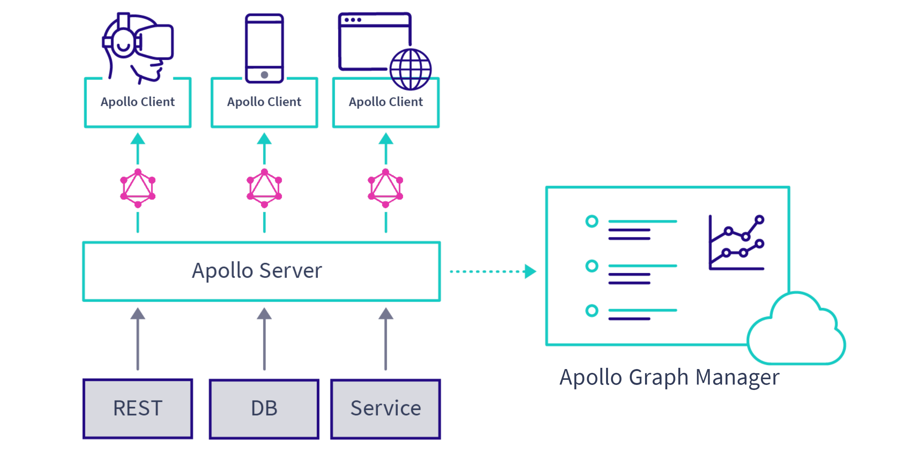

import CalloutCard from "../components/callout-card";
import VideoFrame from "../components/video-frame";

**Apollo Studio** (formerly Graph Manager) is a cloud service that helps you manage, validate, and secure your organization's data graph.

<CalloutCard style={{ maxWidth: 560 }} />

## Feature summary

**Apollo Studio provides the following features to all Apollo users for free:**

* A [GraphQL schema registry](/schema-registry/) that tracks changes
and enables you to [create variants of your schema](/schema-registry/#managing-environments-with-variants) for different environments
(such as staging and production)
* A schema explorer that makes it easy to inspect your schema's queries,
mutations, and other object definitions
* [Metrics reporting](https://www.apollographql.com/docs/graph-manager/setup-analytics/) for up to the last 24 hours
* Team collaboration via [organizations](/accounts-organizations/)
* [Slack notifications](/slack-integration/) for schema changes and daily metrics reports
* [Management of a federated data graph](/managed-federation/overview/)

**Additional features are available to organizations with a subscription to an Apollo Team or Enterprise plan:**

* Metrics reporting for arbitrary timeframes
* [Metrics segmentation by distinct clients and versions](/client-awareness/)
* [Schema change validation](/schema-validation/)
* [Operation safelisting](/operation-registry/)
* [Resolver-level query tracing](/performance/)
* [Integration with Datadog](/datadog-integration/)
* Longer data retention

[Learn more about pricing and billing](https://www.apollographql.com/plans/)

## Managing graphs

A **graph** in Apollo Studio represents the entirety of a connected data graph. Every graph has its own associated GraphQL schema.

### Creating a graph

To create a graph in Studio, first select the Studio organization that the graph will belong to. Then click **New Graph** in the upper right and proceed through the creation flow.

Note that every graph in Studio has a globally unique **graph name**. We recommend that you prefix your graph names with the name of your company or organization to avoid naming collisions.

### Viewing graph information

After selecting an organization in Studio, click on a particular graph
to view its data and settings. All of a Studio organization's members can access the data and settings for every graph that belongs to that organization.

### Transferring graph ownership

You can transfer a graph to a different Studio organization you belong to
by visiting the graph's Settings page and changing the **graph owner**.

### Deleting a graph

> **Deleting a graph cannot be undone!**

You can delete a graph from Studio by visiting its Settings page and clicking
**Delete**.

### Distinguishing between application environments

Every graph in Studio should correspond to a single application. However, a single application might run in multiple _environments_ (such as test, staging, and production).

To distinguish between graph activity for different application environments, you can define [**variants**](/schema-registry/#managing-environments-with-variants) for a graph. Each variant has its own schema that can (but doesn't have to) differ from the default variant.

When your server sends metrics to Studio, it can associate an operation with a particular variant. Variants appear as separate items in your organization's graph list, allowing you to view analytics for each application environment in isolation.

## Ingesting and fetching data

Studio ingests and stores performance metrics data sent from your GraphQL server. Use one of the following methods to send data to Studio:

- Use [Apollo Server](https://www.apollographql.com/docs/apollo-server/) as your application's GraphQL server and [include a Studio API key](https://www.apollographql.com/docs/tutorial/production/#get-a-studio-api-key) in your server configuration.

- If you aren't using Apollo Server, you can send trace metrics to the [Studio reporting endpoint](https://www.apollographql.com/docs/references/setup-analytics/#graph-manager-reporting-endpoint) (again,
  providing an API key with every request).

### API keys

Any system that communicates with Studio (whether to send metrics or fetch them) must use an **API key** to do so. You can add and remove API keys from your graph from its Settings page.

You should use a different API key for each system that communicates with Studio. Doing so provides you with more granular control over how data is sent to Studio.
