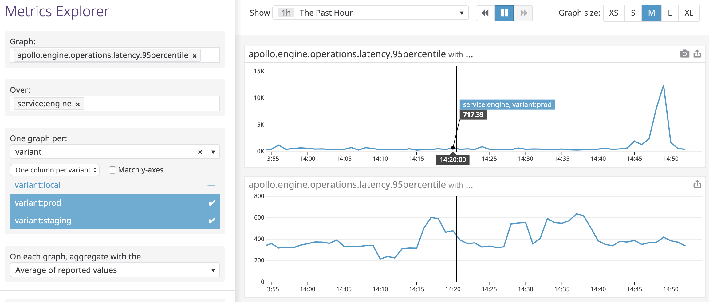

One of our fundamental beliefs is that our Apollo workflows should hook into and enhance the workflows you're already using. As such, we've built a number of integrations into third-party services that are common in the developer world:

1. [**GitHub**](#github) &mdash; Ensure the safe evolution of your graph by adding schema change validation directly to your continuous integration and GitHub checks.
1. [**Slack**](#slack) &mdash; Get a daily summary of key information from your server, including the overall request rate, error rate, and performance latency. Set up notifications for noteworthy events in your service, like increases in errors or particularly slow response times for important queries.
1. [**Datadog**](#datadog) &mdash; Forward the key metrics and performance data available from Graph Manager to Datadog as well.

## GitHub

Building tools to help you safely collaborate on the evolution of your graph is one of our biggest focuses at Apollo. To make [schema change validation](/schema-validation/) as easy to set up as possible, we've built an Apollo app for GitHub that provides status checks on pull requests when schema changes are proposed.


### Install the GitHub application

Go to [https://github.com/apps/apollo-engine](https://github.com/apps/apollo-engine) and click the `Configure` button to install the Apollo Graph Manager integration on the GitHub profile or organization that you want to set up checks for.

### Run validation on each commit

Next, make sure your CI has a step to run the schema validation command. This is accomplished by adding the `apollo schema:check` command directly as a step in your CI. For CircleCI it could look something like this:

```yaml{13,29,33-36}
version: 2

jobs:
  build:
    docker:
      - image: circleci/node:8

    steps:
      - checkout

      - run: npm install
      # CircleCI needs global installs to be sudo
      - run: sudo npm install --global apollo

      # Start the GraphQL server.  If a different command is used to
      # start the server, use it in place of `npm start` here.
      - run:
          name: Starting server
          command: npm start
          background: true

      # make sure the server has enough time to start up before running
      # commands against it
      - run: sleep 5

      # This will authenticate using the `ENGINE_API_KEY` environment
      # variable. If the GraphQL server is available elsewhere than
      # http://localhost:4000/graphql, set it with `--endpoint=<URL>`.
      - run: apollo service:check

      # When running on the 'master' branch, publish the latest version
      # of the schema to Apollo Graph Manager.
      - run: |
          if [ "${CIRCLE_BRANCH}" == "master" ]; then
            apollo service:push
          fi
```

> **Note:** Your `apollo service:check` command needs a source to from which to fetch your schema. This is most commonly provided as a URL to a running server (with introspection enabled), but can also be provided as a path to a file with your schema in it. See [The schema registry](/schema-registry/) for other options.

The `apollo schema:check` command checks for differences in your schema between what's on your current branch and the last version you uploaded to Graph Manager. If you've removed or changed any types or fields, it will validate that those changes won't break any of the queries that your clients have made recently. If your changes do break any queries, the check will fail.

Because you installed the Graph Manager app on GitHub, the check you've added will show up as a line in your GitHub checks list. If there are changes in your schema you'll be able to review them by clicking the "Details" link. By enabling schema validation in your continuous integration workflow (eg. CircleCI, etc.), you're alerting developers of any potential problems directly in their pull requests, thereby giving them critical feedback where it's most useful.

## Slack

Our Apollo Slack integration brings your server's performance metrics and analytics data from Apollo Graph Manager directly to your team's Slack workspace so you can be notified of potential issues proactively. The integration does two main things:

1. Send a [**daily snapshot**](#daily-reports) of the request rate, error rate, and performance latency of your graph.
2. Send [**notifications**](#notifications) that are triggered on thresholds like error percentage and performance latency.

### Configure the integration

The Apollo Slack integration is set up and configured through the Graph Manager UI. If you do not yet have account, [**follow this guide**](https://www.apollographql.com/docs/apollo-server/features/metrics/#Apollo-Graph-Manager) to get started connecting your server to Graph Manager.

If you already have a Graph Manager account, [**log in**](https://engine.apollographql.com) and ––

1. Select the service you want to turn on Slack notifications for.
1. Visit the "Integrations" tab in the left nav.
1. You'll notice a "Reporting Channels" section at the bottom of this page. Click the "Add channel" button and follow the steps in the Graph Manager UI to get a webhook from Slack.

Once you've configured your Slack channel you'll be able to turn on daily reports snapshotting and configure notifications in the "General" and "Performance Alerts" sections.


### Daily reports

Daily reports from Graph Manager are sent out around 9am in whichever timezone you configure them to be in. You turn them on in the "Integrations" tab as shown above. The reports have a set format that gives a birds-eye view of what your GraphQL API delivered in the previous day:


#### Using the report

We've constructed the report provided to give you an actionable summary of what's happened in your API in the last 24 hours. Here’s how you can use it to identify issues:

1.  **Request rate:** This shows you how many queries are hitting your server every minute, along with a list of the most popular operations. If you see a huge dip in this and it's usually a busy time for your app, it might mean that queries aren’t able to reach your server, or some client is down.
2.  **p95 service time:** This shows you how long queries are taking to execute. We selected p95 since it’s the best overall representation of how your users are experiencing your app. You can use this to identify that your API is overloaded and users are seeing long loading delays, or to find out which queries are taking the longest to run. This is usually directly connected to UI performance, so a 500ms query probably means some part of your UI is taking that long to display.
3.  **Error percentage:** This will show you how many of your GraphQL requests end up with an error result. Spikes in errors might be the result of some underlying backend malfunctioning. You can also see which of your operations are most error-prone.

### Notifications

In Graph Manager, you can configure notifications that are triggered on the performance data of your graph, like error percentages and request latencies. This is particularly useful for detecting anomalies, especially around releases. Notifications can be configured to monitor the following metrics for either your entire GraphQL service or individual operations:

- **Request rate:**  requests per minute
- **Request duration:** p50/p95/p99 service time
- **Error rate:** errors per minute
- **Error percentage:** the number of requests with errors, divided by total
  requests

The triggers you set up are evaluated on a rolling five minute window. For example, you can configure a notification to trigger when an operation's error rate exceeds 5%. In production, if 6 out of 100 requests result in an error during the last five minutes, the alert will trigger with an error rate of 6%. Once the error rate falls back below 5% your notification will resolve. Here's an example of what the notification looks like:


## Datadog

The Apollo Datadog integration allows you to forward the performance metrics that are available to you in Graph Manager to Datadog, which is convenient for teams already relying on Datadog for their monitoring. Datadog additionally supports an advanced function API, allowing teams to create sophisticated graphs and alerts for their GraphQL metrics.

The Datadog metrics forwarded by Graph Manager are:

- `apollo.engine.operations.count`: the number of GraphQL operations that were executed. This includes queries, mutations, and operations that resulted in an error.
- `apollo.engine.operations.error_count`: the number of GraphQL operations that resulted in an error. This includes GraphQL execution errors, and HTTP errors if Graph Manager failed to connect to your server.
- `apollo.engine.operations.cache_hit_count`: the number of GraphQL queries whose result was served from Apollo Graph Manager's full query cache.
- A histogram of GraphQL operation response times, measured in milliseconds. Due to Graph Manager's aggregation method (logarithmic binning), these values are accurate to +/- 5%:
  - `apollo.engine.operations.latency.min`
  - `apollo.engine.operations.latency.median`
  - `apollo.engine.operations.latency.95percentile`
  - `apollo.engine.operations.latency.99percentile`
  - `apollo.engine.operations.latency.max`
  - `apollo.engine.operations.latency.avg`

All metrics forwarded to Datadog are aggregated in 60-second intervals and tagged with the GraphQL operation name as `operation:<query-name>`. Unique query signatures with the same operation name are merged, and queries without an operation name are ignored.

All of the metrics are also tagged with the Graph Manager graph ID as `service:<graph-id>` and the variant name as `variant:<variant-name>`, so multiple graphs from Graph Manager can send data to the same Datadog account. If you have not set a variant name, then "current" will be used.

If you're reporting metrics to Graph Manager through the Engine proxy, Datadog will merge your statistics across multiple instances of the proxy (per-host metrics are not available). Just like in the Graph Manager UI, each operation inside a query batch is counted individually.

#### Setup

Getting set up with the Apollo Datadog integration is as simple as providing a Datadog API key to Graph Manager. There's no further configuration required! You will need access to a Datadog account with administrator privileges to acquire an API key.

1. Go to the [Datadog integrations page](https://app.datadoghq.com/account/settings) and search for "Apollo".


2. Press the **+Available** button on the Apollo tile, and go the _Configuration_ tab. Scroll to the bottom of the tab, and press the **Install Integration** button.

3. Go to the [Datadog APIs page](https://app.datadoghq.com/account/settings#api) and create an API key.


4. In Graph Manager, go to the integrations page for your graph.


5. Toggle the Datadog integration to turn it on. A text field will appear where you can enter your API key.


6. Paste the API key, and press **Save**. You can use the same API key for all your graphs, since all metrics are tagged with the graph ID (`service:<graph-id>`).

7. Go to the Datadog metrics explorer and start to see the metrics flow in! Please allow up to five minutes for metrics to be visible.

#### Metrics exploration

Once you have the Datadog integration set up, you will start seeing Graph Manager metrics forwarded to your Datadog account within a few minutes. Navigate to the [Datadog metrics explorer](http://app.datadoghq.com/metric/explorer?exp_metric=apollo.engine.operations.count&exp_group=service&exp_agg=sum&exp_row_type=metric) to see data from your GraphQL service flowing in.

Each of the metrics reported is [tagged](https://www.datadoghq.com/blog/the-power-of-tagged-metrics/) with the graph ID (`service:<graph-id>`), the variant name (`variant:<variant-name>`), and the operation name (`operation:<query-name>`), all of which are normalized by Datadog naming requirements (letters are all lower-cased and illegal symbols are converted to underscores).

Tagging enables you to see data at any level of granularity, whether you want to aggregate across all operations or zoom in to a particular operation. You can control granularity by choosing a relevant set of operation tags for filtering, along with appropriate functions for [time aggregation](https://docs.datadoghq.com/graphing/functions/#proceed-to-time-aggregation) and [space aggregation](https://docs.datadoghq.com/graphing/functions/#proceed-to-space-aggregation). Similarly, if you want to compare metrics across staging and production environments, you can filter with the appropriate variant tags.

**Example**: Suppose you want to see the 95th percentile request latency averaged across all operations for a staging and a production service.

In the [Datadog metrics explorer](https://app.datadoghq.com/metric/explorer):
1. Select `apollo.engine.operations.latency.95percentile` under "Graph"
2. Select the targeted service name under "Over"
3. Select `variant` under “One graph per” and choose the two variants for production and staging
4. Select `Average of reported values` under "On each graph, aggregate with the"

At Apollo, we use Graph Manager to monitor Graph Manager itself, so this graph for us looks like the following:



To perform more advanced manipulation of metrics, open up a [Datadog notebook](https://app.datadoghq.com/notebook).

#### Alerting with Datadog

Graph Manager experimentally supports direct alerting on metrics via the Notifications feature, but Datadog can enable more complex alerts via [Datadog monitors](https://docs.datadoghq.com/monitors/).

**Example**: Graph Manager's Notifications feature supports alerts that trigger when the percentage of requests with an error in the last 5 minutes exceeds some threshold for a specific operation. Suppose that instead of alerting on a specific operation in the last 5 minutes, we want to alert on the error percentage over all operations in some graph in the last 10 minutes, such as when the percentage exceeds 1% for a graph `mygraph` with variant `staging`.

The [Datadog metric alert query](https://docs.datadoghq.com/api/?lang=curl#metric-alert-query) needed here is
```
sum(last_10m):sum:apollo.engine.operations.error_count{service:mygraph,variant:staging}.as_count().rollup(sum).fill(null) / sum:apollo.engine.operations.count{service:mygraph,variant:staging}.as_count().rollup(sum).fill(null) > 0.01
```
The `.rollup(sum).fill(null)` is necessary since `apollo.engine.operations.count` is a [Datadog gauge](https://docs.datadoghq.com/developers/metrics/types/), which means it [defaults to using `avg` for time aggregation]() and [defaults to linear interpolation during space aggregation and query arithmetic](https://docs.datadoghq.com/monitors/guide/monitor-arithmetic-and-sparse-metrics/). The `.as_count()` is necessary to ensure that [operation counts are summed before the division and not after](https://docs.datadoghq.com/monitors/guide/as-count-in-monitor-evaluations/).

**Example**: Consider the error percentage monitor from the previous example. When the number of operations is small, a few errors may cause the error percentage to exceed the threshold, resulting in a noisy monitor during periods of low traffic. We want only want to alert when the number of operations isn't small (e.g. more than 10 in the last 10 minutes).

You can use [Datadog composite monitors](https://docs.datadoghq.com/monitors/monitor_types/composite/) to support this kind of alert. First, create a monitor with metric alert query
```
sum(last_10m):sum:apollo.engine.operations.count{service:mygraph,variant:staging}.rollup(sum).fill(null) > 10
```
Then create a composite monitor for the two monitors of the form `a && b`, which will have the desired behavior.
