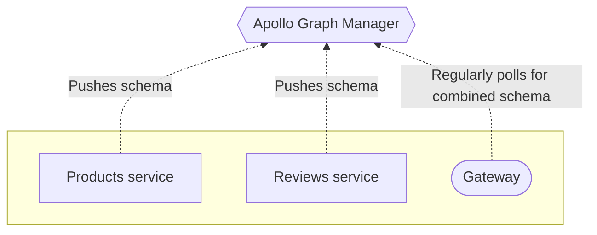

Apollo Graph Manager provides free **managed federation** features for data graphs that use [Apollo Federation](https://www.apollographql.com/docs/apollo-server/federation/introduction/).

With managed federation, your [gateway](https://www.apollographql.com/docs/apollo-server/federation/gateway/) is no longer responsible for combining your [implementing service](https://www.apollographql.com/docs/apollo-server/federation/implementing-services/) schemas into a single federated schema. Instead, your implementing services push their schemas to Graph Manager, which combines them. Your gateway then fetches the federated schema and associated configuration from Graph Manager:

This architecture helps your organization safely validate, coordinate, deploy, and monitor changes to your graph:

* You can modify service schemas (and even add or remove entire services from your graph) _without_ needing to redeploy your gateway. Your gateway polls Graph Manager regularly for these changes and updates its query plans dynamically.

* If you accidentally push an _invalid_ schema change, Graph Manager continues to provide the most recent valid schema to your gateway. This prevents unintended downtime.

* You can disable schema introspection for all of your implementing services, because the gateway no longer requires introspection to fetch schemas. This improves security.

* Graph Manager maintains the full history of your federated schema, enabling you to view when types and fields were added, deprecated, and removed.

Ready to try out out? Continue to [Setup](./setup/).
