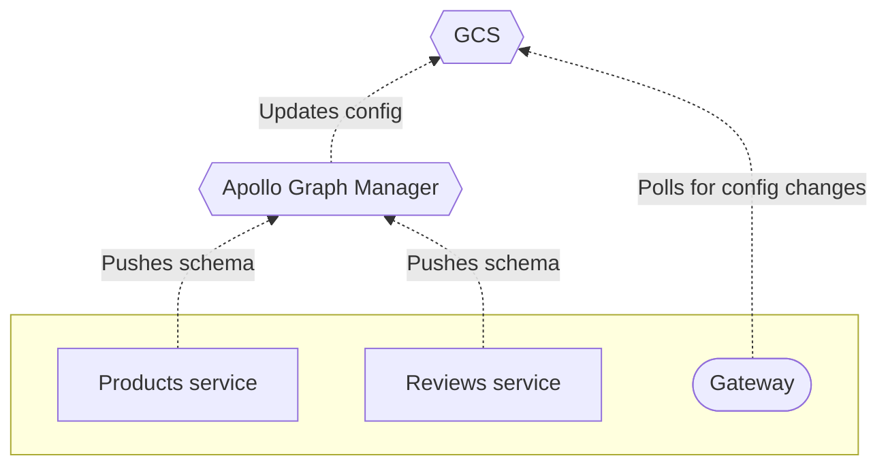

Apollo Graph Manager provides free **managed federation** features for data graphs that use [Apollo Federation](https://www.apollographql.com/docs/apollo-server/federation/introduction/).

With managed federation, your [gateway](https://www.apollographql.com/docs/apollo-server/federation/gateway/) is no longer responsible for fetching schemas from your [implementing services](https://www.apollographql.com/docs/apollo-server/federation/implementing-services/) on startup. Instead, your implementing services push their schemas to Graph Manager, which verifies that they successfully **compose** into a federated schema.

On composition success, Graph Manager updates a dedicated configuration file that's stored in Google Cloud Services, which your gateway regularly polls for updates:

Managed federation helps your organization safely validate, coordinate, deploy, and monitor changes to your graph. It provides:

### Gatway stability

You can modify service schemas (and even add or remove entire services from your graph) _without_ needing to modify or redeploy your gateway. As the point of entry to your entire data graph, your gateway should maximize its uptime.

### Composition stability

When your gateway obtains an updated configuration, it knows that the new set of schemas will compose, because Graph Manager has already successfully composed them. If an implementing service accidentally pushes an invalid schema change, Graph Manager continues to provide the most recent _valid_ configuration to your gateway.

Additionally, when your gateway obtains a configuration, it can be confident that each implementing service is prepared to handle operations against its corresponding schema. This is because the updated service registered its updated schema as part of its deployment.

### Schema flexibility

By using a source external to your data graph as the source of truth for its configuration, you ensure the safety of certain schema changes that are otherwise not guaranteed, such as migrating a schema type or field from one implementing service to another.

Ready to try out out? Continue to [Setup](./setup/).
