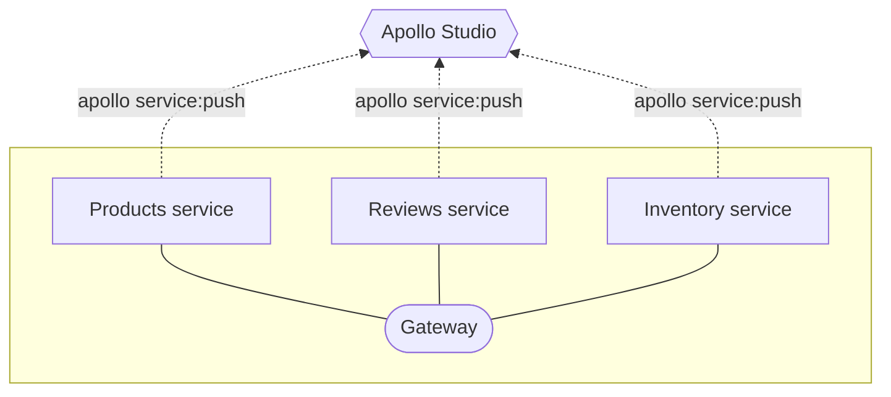

import ProjectConfigPanel from 'gatsby-theme-apollo-docs/shared/project-config-panel.mdx';

This article describes how to set up Apollo Studio for a data graph that uses [Apollo Federation](https://www.apollographql.com/docs/apollo-server/federation/introduction/).

> As with all changes, you should first set up managed federation in a non-production environment, such as staging. To support this, you can use [variants](../schema-registry/#managing-environments-with-variants), which are distinct versions of the same data graph for different environments.

## 1. Register your implementing services

To enable managed federation, each of your data graph's [implementing services](https://www.apollographql.com/docs/apollo-server/federation/implementing-services/) must register its schema with Studio:



To get set up with schema registration, **do the following for each of your implementing services**:

1. Complete the prerequisites in the dropdown below. **However, only create a single graph in Studio**. All of your implementing services register their schema with the same graph.

  <ProjectConfigPanel />

2. In each service's `apollo.config.js` file, add a `name` field to the `service` object. This value must match the name of the graph in Studio that your services belong to.

    ```json{3}:title=apollo.config.js
    module.exports = {
      service: {
        name: "docs-example-graph",
        localSchemaFile: "schema.gql"
      }
    };
    ```

3. Obtain the following values, which are required for the `apollo service:push` command:

    * The URL that your gateway will use to communicate with each service (e.g., `http://products-graphql.svc.cluster.local:4001/`)
    * The name that will uniquely identify each service within your graph (e.g., `Products`)

3. Now you can run the `apollo service:push` command with the necessary options from each service's root directory.

    Assuming the example values in the previous step, that command looks like this:

    ```
    apollo service:push --serviceURL=http://products-graphql.svc.cluster.local:4001/ --serviceName=Products
    ```

    The CLI obtains additional configuration from your project's `.env` and `apollo.config.js` files, and then pushes your schema to Studio.

## 2. Configure continuous delivery

With managed federation, Apollo Studio **composes** your individual service schemas into a single federated schema, just like your gateway does. Consequently, **each service in your data graph must re-register its schema every time the schema changes.** Otherwise, your gateway can't obtain the latest configuration from Studio.

The best way to accomplish this is to add the `apollo service:push` call to your continuous delivery pipeline. Every time you deploy a schema change to production, this call should automatically accompany that deploy.

For best practices for updating your services, see [Pushing configuration updates safely](./advanced-topics/#pushing-configuration-updates-safely).

## 3. Modify the gateway

Because your gateway isn't responsible for fetching your implementing service schemas anymore, you need to modify its initialization.

> This section assumes you are using Apollo Server with the `@apollo/gateway` library as your gateway.

### Remove the `serviceList` argument

A bare-bones initialization of an `ApolloGateway` object (_without_ managed federation) looks like this:

```js
const gateway = new ApolloGateway({
  serviceList: [
    { name: 'Products', url: 'http://products-graphql.svc.cluster.local:4001/' },
    // Additional services defined here
  ],
});
```

The `serviceList` argument specifies the name and URL for each of your implementing services. With managed federation, your gateway obtains this information from Studio instead.

Remove the `serviceList` argument from your `ApolloGateway` constructor entirely:

```js
const gateway = new ApolloGateway();
```

### Connect the gateway to Studio

Like your implementing services, your gateway uses an API key to identify itself to Studio. Obtain a **graph API key** from your graph's Settings page in [Studio](https://studio.apollographql.com/).

Provide your API key to your gateway by setting it as the value of the `APOLLO_KEY` environment variable (`ENGINE_API_KEY` in `apollo-server` pre-2.13.0) in your gateway's environment. Apollo Server will automatically read this environment variable on startup.

Note that if you specify the API key in a `.env` file, the gateway does _not_ automatically read this file. Use a library such as [`dotenv`](https://www.npmjs.com/package/dotenv).

> When running your gateway in an environment where outbound traffic to the internet is restricted, consult the [directions for configuring a proxy](https://www.apollographql.com/docs/apollo-server/proxy-configuration/) within Apollo Server.

## 4. Deploy the modified gateway

You can now deploy your modified gateway to begin fetching your federated schema from Studio instead of directly from your services.

On startup, your gateway will use its API key to access its federation config from Google Cloud Storage. After it completes schema composition based on the config, the gateway can begin executing operations across your implementing services.
