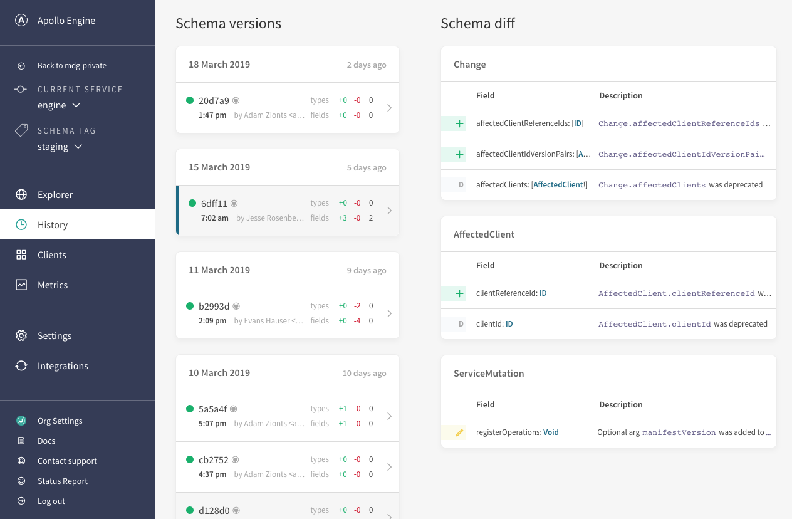

import ProjectConfigPanel from 'gatsby-theme-apollo-docs/shared/project-config-panel.mdx';

Apollo Graph Manager provides a **schema registry** that serves as a central hub for managing your data graph (as recommended by [Principled GraphQL](https://principledgraphql.com/integrity#3-track-the-schema-in-a-registry)). The schema registry enables you to explore your schema's types and fields, track its change history, and improve your production server's security by removing the need for introspection. You can also [register **variants** of your schema](#managing-environments-with-variants) to support environments besides production, such as test or staging.

## Prerequisites

To get started with the schema registry, first complete the following setup for the project that includes your GraphQL server:

<ProjectConfigPanel />

## Registering a schema manually

Register your schema with Apollo Graph Manager by running the `apollo service:push` command from your application's root directory, like so:

```
$ apollo service:push
  ✔ Loading Apollo Project
  ✔ Uploading service to Engine

id      schema        tag
──────  ────────────  ───────
190330  example-4218  current
```

The CLI fetches your schema via a configuration option you set up in [Prerequisites](#prerequisites) and pushes it to Graph Manager.

Every time you push a new version of your schema, it's appended to your graph's schema history.

## Registering a schema via continuous delivery

To get the most out of Graph Manager, you should **register each update to your production schema as soon as it occurs**. To achieve this, include a call to `apollo service:push` in your continuous delivery pipeline.

Here is a sample continuous delivery configuration for pushing a schema to Apollo using CircleCI:

```yaml{13,29-31}
version: 2

jobs:
  build:
    docker:
      - image: circleci/node:8

    steps:
      - checkout

      - run: npm install
      # CircleCI needs global installs to be sudo
      - run: sudo npm install --global apollo

      # Start the GraphQL server.  If a different command is used to
      # start the server, use it in place of `npm start` here.
      - run:
          name: Starting server
          command: npm start
          background: true

      # make sure the server has enough time to start up before running
      # commands against it
      - run: sleep 5

      # When running on the 'master' branch, push the latest version
      # of the schema to Apollo Graph Manager.
      - run: |
          if [ "${CIRCLE_BRANCH}" == "master" ]; then
            apollo service:push --tag=master
          fi
```

## Viewing schema change history

The History view in Graph Manager lets you view the timeline of changes made to your schema:



**Only schema changes that you push to Graph Manager are included in this timeline**, which is one of the most important reasons to [include schema registration in your continuous delivery pipeline](#registering-a-schema-via-continuous-delivery).

## Managing environments with variants

Commonly, your application's staging and test environments use schemas that differ slightly from your production schema (especially if you're testing out updates to your schema).

Because these schemas represent different environments of the same application, it makes sense to associate them with each other. To achieve this, you can define **variants** of your graph.

Each variant of a graph functions as a standalone graph. It has its own change history, metrics, and operation registry.

### Registering a schema to a variant

To register a schema to a variant, include the `--tag=<VARIANT>` flag in your `apollo service:push` command, like so:

```bash
apollo service:push --tag=beta
```

If you omit the `--tag` flag, the `apollo service:push` command always pushes to the default graph variant, named `current`.

### Associating metrics with a variant

You can configure Apollo Server to associate the metrics it sends to Graph Manager with a particular variant. To do so, set the `ENGINE_SCHEMA_TAG` environment variable to the appropriate variant before initializing Apollo Server.

Alternatively, you can include the `schemaTag` option in your call to the `ApolloServer` constructor, like so:

```js
const server = new ApolloServer({
  ...
  engine: {
    apiKey: "<ENGINE_API_KEY>",
    schemaTag: "beta" // highlight-line
  }
});
```

> Make sure you associate Apollo Server's metrics with the correct variant! Otherwise, metrics from your staging and test environments will be included in reports for your production graph.

## Tools that use the schema registry

Keeping your registered schema up to date ensures that you get the best possible experience from Apollo tools that connect to the registry:

- The [Apollo VS Code extension](https://marketplace.visualstudio.com/items?itemName=apollographql.vscode-apollo) provides built-in linting on queries by validating against your registered schema. It also annotates fields with their descriptions and with performance indicators collected in Apollo's trace warehouse.
- The [schema validation](/schema-validation/) workflow protects your team from accidentally making breaking schema changes. It creates a diff between your local schema and the last schema pushed to the registry, and validates this diff against live traffic seen on your endpoint to warn you about problematic changes.
- Your schema's full history and current usage can be seen in [Apollo Graph Manager](https://engine.apollographql.com). The History page tracks changes made over time, and the Explorer page shows which clients and which queries are using each field in your schema.
