import ObtainGraphApiKey from '../shared/obtain-graph-api-key.mdx';

This document specifies the protocol that any GraphQL server can implement to enable automatic [schema registration](./schema-registry/) with Apollo Graph Manager.

A reference implementation of this protocol is included in [Apollo Server](https://github.com/apollographql/apollo-server/pull/4084/files).

## Schema reporting endpoint

Servers that implement the schema reporting protocol communicate with the following GraphQL endpoint:

```
https://edge-server-reporting.api.apollographql.com/api/graphql
```

All requests to this endpoint require a **graph API key** as authentication.

<ObtainGraphApiKey />

## Protocol sequence

The following sections illustrate the communication sequence between a GraphQL server (hereafter referred to as the **edge server**) and the schema reporting endpoint (**Apollo**):

### Diagram

```mermaid
sequenceDiagram
    participant Edge Server
    participant Apollo
    Edge Server->>Apollo: reportServerInfo(EdgeServerInfo(…) executableSchema = false)
    alt The specified schema ID is already registered
        Apollo->>Edge Server: Response(withExecutableSchema = false, inSeconds = 57s)
        Note over Edge Server: Wait 57 seconds
        Note over Edge Server: Go to top
    else The specified schema ID is NOT already registered
        Apollo->>Edge Server: Response(withExecutableSchema = true, inSeconds = 0s)
        Note over Edge Server: Wait 0 seconds
        Edge Server->>Apollo: reportServerInfo(EdgeServerInfo(…) executableSchema = '…')
        Note over Apollo: Persist schema
        Apollo->>Edge Server: Response(withExecutableSchema = false, inSeconds = 62s)
        Note over Edge Server: Wait 62 seconds
        Note over Edge Server: Go to top
    else The reportServerInfo request failed
        Note over Edge Server: Wait 20 seconds
        Note over Edge Server: Go to top
    end
```



### Step-by-step description

1. On startup, the edge server executes the `service.reportServerInfo` mutation, providing an `EdgeServerInfo` object with the server's details as input.
    * This initial call **does not** include an `executableSchema` string.
    * This initial call **does** include an `executableSchemaId` in the `EdgeServerInfo` input. This is the SHA-256 hash of the edge server's schema, represented as a hexadecimal string. 
    * If this or any other `reportServerInfo` request fails with a non-2xx response from Apollo, the edge server should retry after 20 seconds.
2. Apollo responds with a `ReportServerInfoResponse` object. This response tells the edge server: 
    * How many seconds to wait before sending the next `reportServerInfo` request
    * Whether the next `reportServerInfo` request should include the `executableSchema` that corresponds to the `executableSchemaId` provided in the previous request.
3. After waiting the specified number of seconds, the edge server executes `reportServerInfo` again. This request includes a [normalized `executableSchema` string](#schema-normalization) if and only if `withExecutableSchema` was `true` in Apollo's most recent `ReportServerInfoResponse`.
4. Go to step 2.

### Pseudocode example

```
val info = EdgeServerInfo(..)
val schema = normalize("type Query { .. }")
var withSchema = false

function sendReport() {
  val executableSchema = if (withSchema) null else schema
  val response = reportServerInfo(info, executableSchema)

  if (response.withExecutableSchema) {
    withSchema = true
  }

  setTimeout(sendReport, response.inSeconds)
}

sendReport()
```

## Type definitions

The schema reporting protocol uses the following GraphQL types, referred to in [Protocol sequence](#protocol-sequence) above:

```graphql
# This type's fields are documented below.
input EdgeServerInfo {
  bootId: String!
  executableSchemaId: String!
  graphVariant: String! = "current"
  libraryVersion: String
  platform: String
  runtimeVersion: String
  serverId: String
  userVersion: String
}

type ReportServerInfoResponse {
  inSeconds: Int!
  withExecutableSchema: Boolean!
}

type Mutation {
  service(id: ID!): ServiceMutation!
}

type ServiceMutation {
  reportServerInfo(
    "Only sent if previously requested i.e. received ReportServerInfoResponse with withExecutableSchema = true"
    executableSchema: String,
    info: EdgeServerInfo!
  ): ReportServerInfoResponse
}
```

## `EdgeServerInfo` fields

### Required fields

| Name  | Type | Description  |
|---|---|---|
| `bootId` | `String!` | A randomly generated UUID that's unique for each instance of your edge server. Set this value on server startup (a given value should not persist across restarts). |
| `executableSchemaId` | `String!` | A unique identifier for the edge server's schema. Should be the hex representation of the schema document's SHA-256 hash. |

### Recommended fields

| Name  | Type | Description  |
|---|---|---|
| `graphVariant` | `String!` | The name of the graph variant to register the schema to. The default value is `current`. |
| `serverId` | `String` | A randomly generated ID that's unique for each instance of your edge server. Unlike `bootId`, this value _should_ persist across an instance's restarts. In a Kubernetes cluster, this might be the **pod name**, whereas the **container** can restart. |
| `userVersion` | `String` | An arbitrary string you can set to distinguish data sent by different versions of your edge server. For example, this can be the SHA of the Git commit for your deployed server code. We plan to make this value visible in Graph Manager. |

### Appreciated fields 🙂

By providing these values in your requests, you'll help Apollo improve its service. For example, they'll help us identify whether a certain environment, platform, or version is causing a particular issue.

| Name  | Type | Description  |
|---|---|---|
| `runtimeVersion` | `String` | The runtime that your edge server is running, such as `node 12.03`.
| `libraryVersion` | `String` | The name and version of the server and/or reporting agent your edge server is using, such as `apollo-server-2.8` or `graphql-java-3.1`. | 
| `platform` | `String` | The infrastructure environment that your edge server is running in (`localhost`, `kubernetes/deployment`, `aws lambda`, `google cloud run`, `google cloud function`, `AWS ECS`, etc.) |

## Schema normalization

Two semantically identical schemas can appear different to Graph Manager, for example if those schemas list the same set of object fields in a different order. To avoid this, every edge server should **normalize** its schema before sending it to Graph Manager.

To normalize your schema, do all of the following:

* Apply stable sorting (such as alphabetical) to the order of all type, field, and argument definitions.
* Remove all redundant whitespace.
* Remove all comments (but not docstrings).

Note that runtime dependencies on your schema document might result in poor user experience in tracking your schema changes, or even throttling of service availability.
