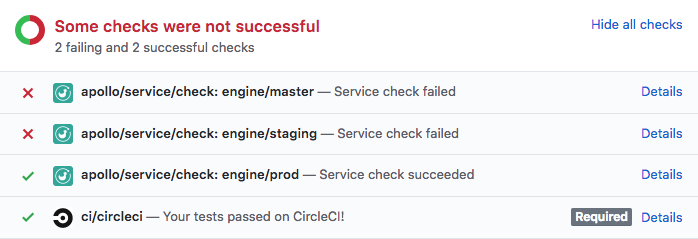

Certain changes to your GraphQL schema (such as removing a field or type) can potentially break one of your application's clients. Apollo Graph Manager provides **schema validation** to help you identify breaking changes before you make them, and to help you identify when a change _won't_ break anything.

> Schema validation is available as part of Graph Manager [Team and Enterprise plans](https://www.apollographql.com/plans/).

## Prerequisites

To enable schema validation for your data graph, first do the following:

1. [Set up trace reporting](./setup-analytics/) to Apollo Graph Manager from your GraphQL server.
2. [Set up schema registration](/schema-registry) in your continuous delivery pipeline.
3. [Install the Apollo CLI](https://www.apollographql.com/docs/devtools/cli/) in your development environment if you haven't yet. (You install it in your continuous delivery pipeline as part of the previous step.)

Once you've got these set up, you can run the following:

```bash
$ npx apollo service:check
```

## Configuration

### Continuous integration

The command can be placed in any continuous integration pipeline. To surface results, `apollo` emits an exit code and [integrates with GitHub statuses](#github-integration). The time window of live traffic that the check command validates against can be [configured](#adjusting-validation-parameters) to any range within your data retention window.

> **Note:** The Apollo CLI will be looking in your Apollo config for a location from which to fetch your local schema and using your ENGINE_API_KEY to authenticate its requests with the Graph Manager service.


We highly recommended that you add validation to your continuous integration workflow (e.g. Jenkins, CircleCI, etc.). In doing so, you can detect potential problems automatically and display the results of checks directly on pull requests.

Here's a example of how to add a schema validation check to CircleCI:

```yaml{26}
version: 2

jobs:
  build:
    docker:
      - image: circleci/node:8

    steps:
      - checkout

      - run: npm install

      # Start the GraphQL server.  If a different command is used to
      # start the server, use it in place of `npm start` here.
      - run:
          name: Starting server
          command: npm start
          background: true

      # make sure the server has enough time to start up before running
      # commands against it
      - run: sleep 5

      # This will authenticate using the `ENGINE_API_KEY` environment
      # variable. Configure your endpoint's location in your Apollo config.
      - run: npx apollo service:check
```

> **Note:** If you're using GitHub status checks, we recommend ignoring the exit code of the `apollo service:check` command so your continuous integration can complete without failing early. This can be done by appending `|| echo 'validation failed'` to the command call.

### Integrating with GitHub

If you're using GitHub, you can install the [Apollo Engine GitHub app](https://github.com/apps/apollo-engine). This app enables Graph Manager to send a webhook back to your project on each call to `apollo service:check`, providing built-in pass/fail status checks on your pull requests:


### Posting a comment to your PRs

For teams using GitHub Enterprise, Bitbucket, and other source control tools, we recommend setting up your CI to post a comment on your PRs with the results of schema validation. Surfacing schema diffs and breaking changes directly in your PR will speed up your review workflow by saving you the time of searching your CI logs to check why validation didn't pass.

The CLI supports passing a `--markdown` flag to `apollo service:check`, which outputs the results of schema validation in a markdown format specifically. This markdown can be piped directly into a comment to your source control tool, like in [this example of posting a comment with the results of schema validation to GitHub](https://gist.github.com/daniman/e53d0589d18b778878bd8ef32d2e793c).

The output of `apollo service:check --markdown` looks like this:

```md
### Apollo Service Check

🔄 Validated your local schema against schema tag `staging` on service `engine`.
🔢 Compared **18 schema changes** against **100 operations** seen over the **last 24 hours**.
❌ Found **7 breaking changes** that would affect **3 operations** across **2 clients**

🔗 [View your service check details](https://engine.apollographql.com/service/engine/checks?...).
```

### Multiple environments

Product cycles move fast and it's common for schemas to be slightly different across environments as changes make their way through your system. To support this, schemas pushed to the registry can be associated with specific _variants_ of your graph (also referred to tags).

Variants mostly commonly represent environments and can also indicate branches or future schemas. Passing the `--tag=<VARIANT>` flag to `apollo service:check` specifies which schema variant to compara against, such as `prod` or `staging`. It's common to run checks against multple different graph variants in the same continuous integration pipeline to ensure that all important deployments are accounted for. Running `service:check` against multiple variants will result in status checks similar to:

<div style="text-align:center">



</div>

## How it works

When you validate your schema with the `apollo service:check` command:

1. Graph Manager generates a diff between your local schema and the schema that you most recently registered for the specified variant.
2. It uses this diff to determine whether the changes affect any operations that have been executed against your graph recently (you can [configure this time window](#adjusting-validation-parameters)).
3. Graph Manager returns the diff and a list of any breaking changes found.
4. The Apollo CLI prints the result of the validation and returns a non-zero exit code if at least one breaking change is found.

### The validation response

Running `apollo service:check` outputs the diff of all detected schema changes  and highlights breaking changes:

```console
$ npx apollo service:check --tag=prod
  ✔ Loading Apollo Project
  ✔ Validated local schema against tag prod on service engine
  ✔ Compared 8 schema changes against 110 operations over the last 24 hours
  ✖ Found 3 breaking changes and 5 compatible changes
    → breaking changes found

FAIL    ARG_REMOVED                `ServiceMutation.checkSchema` arg `gitContext` was removed
FAIL    FIELD_REMOVED              `Schema.fieldCount` was removed
FAIL    FIELD_REMOVED              `Schema.typeCount` was removed

PASS    FIELD_ADDED                `SchemaTag.schemaRepoID` was added
PASS    FIELD_CHANGED_TYPE         `ServiceMutation.uploadPartialSchema` changed type from `UploadPartialSchemaResponse!` to `CompositionResult!`
PASS    FIELD_DEPRECATION_REMOVED  `IntrospectionSchema.fieldCount` is no longer deprecated
PASS    FIELD_DEPRECATION_REMOVED  `IntrospectionSchema.typeCount` is no longer deprecated
PASS    TYPE_REMOVED               `UploadPartialSchemaResponse` removed

View full details at: https://engine.apollographql.com/service/example-1234/check/<DETAILS>
```

Each change to the schema is labeled with either `PASS` or `FAIL`.

> **Note:** Because breaking changes are detected by analyzing recent operations, your GraphQL server _must_ be [pushing analytics to Graph Manager](/setup-analytics/) for schema validation to work. **If there are no operation metrics to compare against, all schema changes are labeled with `PASS`.**

The CLI output also includes a Graph Manager URL that provides full details on the changes and their impact on existing clients and operations:


> **Note:** If you've [installed schema validation checks on your GitHub PRs](#integrating-with-github), the "Details" link in your GitHub checks will take you to the same details link in this output.

## Customizing validation

You can customize the logic that schema validation uses when classifying a schema change as either breaking or non-breaking.

For example, you can provide the `--validationPeriod` option to the `apollo service:check` command to specify how far back in time Graph Manager should look when determining the compatibility of past operations with the changes to your schema.

This command checks your schema changes against the past two weeks of operations:

```bash
apollo service:check --validationPeriod=P2W
```

> **Note:** Valid durations are represented in [ISO 8601 format](https://en.wikipedia.org/wiki/ISO_8601#Durations). You can also provide a number in seconds (e.g., `86400` for a single day).

### Operation thresholds

Two other parameters for customizing the results of `service:check` are threshold values. For example, you may wish to drop support for an old version of an app in order to remove some deprecated fields. Using these parameters, you can decide what amount of breakage is acceptable before shipping any breaking changes.

- `queryCountThreshold` - This flag will only validate the schema against operations that have been executed at least the specified number of times within the provided duration.
- `queryCountThresholdPercentage` - Similar to `queryCountThreshold`, but expressed as a percentage of all operation volume.

> **Note:** these flags are compatible with each other. In the case that both are provided, an operation must meet or exceed both thresholds.

Here's an example of how to run a `service:check` with custom thresholds set:

```bash
npx apollo service:check \
# Validate the schema against operations that have run in the last 5 days
--validationPeriod=P5D \
# Only validate against operations that have run at least 5 times during the 5 day duration
--queryCountThreshold=5 \
# Only validate against operations that account for at least 3% of total operation volume
--queryCountThresholdPercentage=3
```

If you have any requests for other filtering or threshold mechanisms, please get in touch with us on the [apollo-tooling](https://github.com/apollographql/apollo-tooling/) repository.

## Types of schema changes

Not every change to a schema is a potentially breaking change. Additive changes (such as adding a field to a type) are typically safe and do not affect active clients. Deletions and modifications (such as removing a field or changing a return type), however, can break clients that use affected types and fields. 

### Potentially breaking changes

#### Removals

These change types each remove a schema element. If a removed element is actively being used by an operation, your data graph will return an error to affected clients.

<ul>
  <li id="FIELD_REMOVED">
    <code>FIELD_REMOVED</code>: Field used by at least one operation was removed
  </li>
  <li id="TYPE_REMOVED">
    <code>TYPE_REMOVED</code>: Type(scalar, object) used by at least one
    operation was removed
  </li>
  <li id="ARG_REMOVED">
    <code>ARG_REMOVED</code>: Argument was removed from a field used by at least
    one operation
  </li>
  <li id="TYPE_REMOVED_FROM_UNION">
    <code>TYPE_REMOVED_FROM_UNION</code>: Type was removed from a union used by
    at least one operation
  </li>
  <li id="INPUT_FIELD_REMOVED">
    <code>INPUT_FIELD_REMOVED</code>: Field removed from an input type
    referenced by an argument on a field used by at least one operation
  </li>
  <li id="VALUE_REMOVED_FROM_ENUM">
    <code>VALUE_REMOVED_FROM_ENUM</code>: A value removed from an enum used by
    at least one operation
  </li>
  <li id="TYPE_REMOVED_FROM_INTERFACE">
    <code>TYPE_REMOVED_FROM_INTERFACE</code>: An object removed from an
    interface used by at least one operation
  </li>
</ul>

#### Addition of required arguments

These change types each add a required input to a schema element. If an operation is actively using an element of your graph and doesn't add the new required input argument, the data graph will return an error to affected clients.

<ul>
  <li id="REQUIRED_ARG_ADDED">
    <code>REQUIRED_ARG_ADDED</code>: Non-nullable argument added to field used
    by at least one operation
  </li>
  <li id="NON_NULL_INPUT_FIELD_ADDED">
    <code>NON_NULL_INPUT_FIELD_ADDED</code>: Non-null field added to an input
    object used by at least one operation
  </li>
</ul>

#### In-place updates

These change types each update an existing schema element. If an operation is actively using an element that is updated, the operation might start receiving an error from your data graph. It also might receive an unexpected result.

> **Note:** In some cases, in-place updates _are_ compatible with affected clients at runtime (such as a type rename or a conversion from an object to an interface that uses the same fields). However, schema validation still marks these as breaking changes, because validation does not have enough information to ensure that they are safe.

<ul>
  <li id="FIELD_CHANGED_TYPE">
    <code>FIELD_CHANGED_TYPE</code>: Field used by at least one operation
    changed return type
  </li>
  <li id="INPUT_FIELD_CHANGED_TYPE">
    <code>INPUT_FIELD_CHANGED_TYPE</code>: Field in input object changed type
    and is referenced by argument on field used by at least one operation
  </li>
  <li id="TYPE_CHANGED_KIND">
    <code>TYPE_CHANGED_KIND</code>: Type used by at least one operation changed,
    ex: scalar to object or enum to union
  </li>
  <li id="ARG_CHANGED_TYPE">
    <code>ARG_CHANGED_TYPE</code>: Argument changed type on field used by at
    least one operation
  </li>
</ul>

#### Default arguments

These change types each update the default value for an argument. If an operation is using an element of your graph and does not specify a value for this argument, the operation might get an unexpected result when the schema is updated if it was relying on the original default value.

<ul>
  <li id="ARG_DEFAULT_VALUE_CHANGE">
    <code>ARG_DEFAULT_VALUE_CHANGE</code>: Default value added or changed for
    argument on a field used by at least one operation
  </li>
</ul>

### Non-breaking changes

These change types are detected by the `apollo service:check` command, but they are "safe." They will never affect the behavior of any existing clients if deployed.

<ul>
  <li>
    Optional arguments
    <ul>
      <li id="OPTIONAL_ARG_ADDED">
        <code>OPTIONAL_ARG_ADDED</code> Nullable argument added to a field
      </li>
      <li id="NULLABLE_FIELD_ADDED_TO_INPUT_OBJECT">
        <code>NULLABLE_FIELD_ADDED_TO_INPUT_OBJECT</code> Nullable field added
        to an input object
      </li>
    </ul>
  </li>
  <li>
    Additions
    <ul>
      <li id="FIELD_ADDED">
        <code>FIELD_ADDED</code> Field added to a type
      </li>
      <li id="TYPE_ADDED">
        <code>TYPE_ADDED</code> Type added to the schema
      </li>
      <li id="VALUE_ADDED_TO_ENUM">
        <code>VALUE_ADDED_TO_ENUM</code> Value added to an enum. If clients
        contain a switch case on the enum and do not include the `default`, this
        change could cause unexpected behavior
      </li>
      <li id="TYPE_ADDED_TO_UNION">
        <code>TYPE_ADDED_TO_UNION</code> Type added to a union used by at least
        one operation
      </li>
      <li id="TYPE_ADDED_TO_INTERFACE">
        <code>TYPE_ADDED_TO_INTERFACE</code> Interface added to an object used
        by at least one operation
      </li>
    </ul>
  </li>
  <li>
    Deprecations
    <ul>
      <li id="FIELD_DEPRECATED">
        <code>FIELD_DEPRECATED</code> Field deprecated
      </li>
      <li id="FIELD_DEPRECATION_REMOVED">
        <code>FIELD_DEPRECATION_REMOVED</code> Field no longer deprecated
      </li>
      <li id="FIELD_DEPRECATED_REASON_CHANGE">
        <code>FIELD_DEPRECATED_REASON_CHANGE</code> Reason for deprecation
        changed
      </li>
      <li id="ENUM_DEPRECATED">
        <code>ENUM_DEPRECATED</code> Enum deprecated
      </li>
      <li id="ENUM_DEPRECATION_REMOVED">
        <code>ENUM_DEPRECATION_REMOVED</code> Enum no longer deprecated
      </li>
      <li id="ENUM_DEPRECATED_REASON_CHANGE">
        <code>ENUM_DEPRECATED_REASON_CHANGE</code> Reason for enum deprecation
        changed
      </li>
    </ul>
  </li>
</ul>
