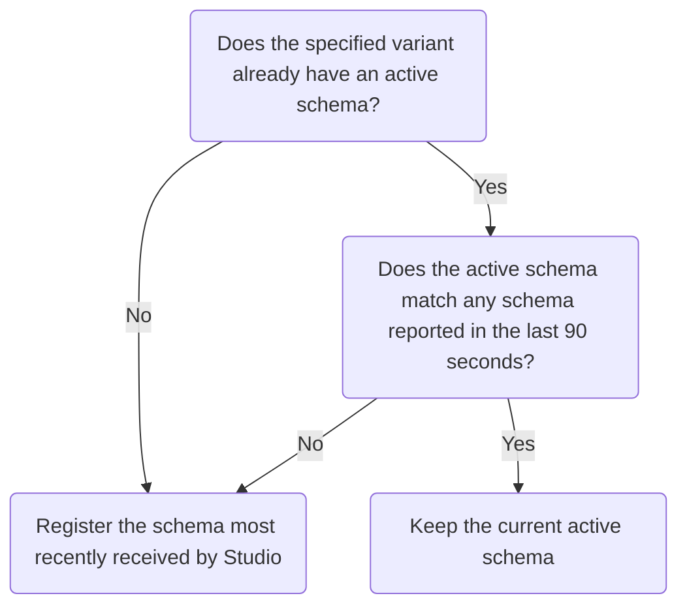

Apollo Studio's **schema reporting** feature enables your GraphQL server to register its latest schema with Studio every time it starts up. To use this feature, your server needs to support the [schema reporting protocol](./schema-reporting-protocol/). [Apollo Server](#apollo-server-setup) supports this protocol, and [other GraphQL servers](#other-graphql-servers) can implement support.

> **Schema reporting does not currently support graphs that use Apollo Federation.** If you have a federated graph, instead see [Setting up managed federation](./managed-federation/setup/).

### Apollo Server setup

Schema reporting is available in Apollo Server version 2.15 and later. To enable it:

1. Obtain an API key for your data graph:

    <ObtainGraphApiKey />

2. Set this API key as the value of the `APOLLO_KEY` environment variable in your server's environment.

    If you're using the [`dotenv`](https://www.npmjs.com/package/dotenv) library, you can add the API key to the `.env` file in your project's root directory, like so:

    ```none:title=.env
    APOLLO_KEY=YOUR_KEY_HERE
    ```

3. Set the `engine.reportSchema` option to `true` in your `ApolloServer` constructor, like so:

    ```js
    const server = new ApolloServer({
      // ...other options...
      engine {
        reportSchema: true
      }
    });
    ```

Now every time your server finishes starting up, it waits a random amount of time between zero and ten seconds before automatically registering its schema with Studio ([you can customize this time range](#customizing-behavior-in-apollo-server)).

#### Registering automatically to a variant

Your server can register its schema to a particular [variant of your graph](#managing-environments-with-variants). Each of your server's environments (development, staging, production, etc.) should register to a different variant.

To do so with Apollo Server, set the `APOLLO_GRAPH_VARIANT` environment variable in each server environment:

```none:title=.env
APOLLO_KEY=YOUR_KEY_HERE
APOLLO_GRAPH_VARIANT=staging
```

If you don't specify a variant, Apollo Server reports its schema to the default variant (named `current`).

#### Providing runtime metadata (recommended)

The schema reporting protocol accepts optional values that help both you and Apollo associate each request with a particular server instance and platform. This in turn helps with diagnosing issues and improving performance.

To provide these values to Apollo Server, set the following environment variables in your server's environment:

| Name | Description  |
|---|---|
| `APOLLO_SERVER_USER_VERSION` | An identifier for the current running version of your server, such as the SHA of its associated Git commit. We plan to display this value in the Graph Manager UI to help you segment metrics. |
| `APOLLO_SERVER_ID` | An ID that's unique for each running instance of your server. **This value should persist across an instance's restarts.** For example, in a Kubernetes cluster, you can use the server's pod name. |
| `APOLLO_SERVER_PLATFORM` | The infrastructure environment that your server is running in (`localhost`, `kubernetes/deployment`, `aws lambda`, `google cloud run`, `google cloud function`, `AWS ECS`, etc.) |

#### Customizing behavior in Apollo Server

In addition to `engine.reportSchema`, you can provide the following options to Apollo Server to modify schema reporting defaults:

| Name  | Type | Description  |
|---|---|---|
| `engine.overrideReportedSchema` | String | <p>If provided, Apollo Server sends this string value as the schema to register.</p><p>By default, Apollo Server sends its interpreted `GraphQLSchema` object (the same value it returns from an introspection request) as an SDL string. This default behavior is appropriate for the majority of use cases.</p> |
| `engine.schemaReportingInitialDelayMaxMs` | Integer | <p>On startup, Apollo Server waits a random number of milliseconds between `0` and this value before attempting to register its schema. This helps stagger registration requests when you deploy multiple instances of your server simultaneously.</p><p>The default value is `10000` (10 seconds).</p>|

For example, the following value for `engine.overrideReportedSchema` provides a schema definition directly from Apollo Server's `typeDefs` object, instead of the interpreted `GraphQLSchema` created from that object:

```js{5}
const server = new ApolloServer({
  typeDefs,
  resolvers,
  engine {
    reportSchema: true
    overrideReportedSchema: typeDefs.loc && typeDefs.loc.source.body
  }
});
```

### Other GraphQL servers

Any GraphQL server can (and is encouraged to!) support automatic schema registration by implementing the [Schema reporting protocol](./schema-reporting-protocol/).

> Currently, we are not aware of GraphQL server libraries besides Apollo Server that implement the schema reporting protocol. If you add support to an open-source library, please let us know at **support@apollographql.com**!

### Rolling deploys with schema reporting

Whenever you perform a rolling deployment of an update to your schema, different active instances of your server might temporarily report different schemas to Studio. If this occurs, Studio uses the following algorithm to choose which schema to register:



Using this algorithm, your updated schema is registered within a few minutes after your rolling deployment completes.
